# GBSA 优化项目总汇报（生物工程团队版）

_覆盖 2026 年 9 月工作及截至 2026 年 10 月 5 日的工程复核；供生物工程团队理解当前阶段 B 的算法接口工作、已有证据及未来可选验证。_

_本次进一步实现迭代局部搜索、模拟退火和无交叉AdaLead改编版，与原四法重新完成七法同起点30开发/100确认比较。新增证据、参数、接受规则与实践说明见§4.15及配套七算法汇报。此前四法表保留其原种子与64代条件；最新七法采用256代护栏，不拼接旧结果。_

**阅读导航**：[对接支线及数据](#docking-branch) · [总体架构](#search-framework) · [原四算法原理](#four-algorithms-explained) · [新增三算法及七法结果](#search-evidence) · [评分器与模型替换](#scorer-explained) · [无交叉遗传算法](#ga-plan) · [最新比较结果](#search-evidence) · [怎样选择算法](#algorithm-decision) · [还可以尝试什么](#algorithm-extensions) · [分阶段步骤与进度](#phased-roadmap) · [未来计算接口](#future-interface)。第一次阅读建议按“算法是什么 → 评分器是什么 → 当前结果 → 如何选择 → 阶段进度”顺序进行。

---

## 一、先读这一页：我们现在在哪里

**FAD 在这里是仓库/项目名称，不能由目录名认定研究配体。**FAD 在生物化学中通常是黄素腺嘌呤二核苷酸（flavin adenine dinucleotide）的简称，但仓库 [README](../../../README.md) 当前将研究对象标为 **PreQ1 / RF00522 核糖开关**；Rfam（RNA 家族数据库）也将 RF00522 编号对应为 PreQ1 适配体域。[Rfam 官方家族条目](https://rfam.org/family/RF00522)。本报告按仓库记录描述固定序列搜索，不把 FAD 目录名当作已确认的结合配体，也不声称重新完成了这条 141 位序列的家族鉴定。

我们希望从一条固定骨架的核糖核酸（RNA，ribonucleic acid）序列出发，在允许改变的 13 个碱基位置寻找计算结合评分更低的序列。这里的目标是独立的 **GBSA 计算值**，数值越低按项目约定越有利。GBSA 是广义玻恩与溶剂可及表面积方法（generalized Born/surface area）的简称，是一种计算能量指标；它**不是**已经由湿实验测得的结合亲和力。未来真实计算协议应明确记录配体名称、结构及模板来源，避免名称歧义进入实验安排。

**当前工作节点是阶段 B：在 GBSA 代理模型尚未选定、排序能力仍有限的情况下，先固定它与下游算法的接口，完成多代突变搜索、候选分组和可审计的算法比较。**这是本阶段应向生工团队汇报和讨论的主线，不要求现在选择主动学习，也不要求现在开展新的 GBSA 计算。

目前已完成三类工作。第一，整理了 2000 条既有序列及其 GBSA 标签，复核了现有代理基线，但**尚未选定成熟的最终代理**。第二，搭好了可替换代理的预测接口及“生成—打分—留种—再生成”的多代搜索层。第三，保留了批次导出、暂停、回填、重训的工程接口，以便未来有计算预算时连接外循环；其中部分流程只做了模拟和测试，不能说已经启动真实回填。

**当前不安排新序列 GBSA 计算或回填。**未来若要验证发现效果，才需要另行确定协议、预算和独立对照设计。9 月 30 日生成的 96 条序列是此前静态候选池流程留下的探索性导出产物，不是阶段 B 搜索算法的结果，也不是当前要求生工团队执行的计算清单。**首轮四法30开发/100确认、固定消融、100种子对接支线保留；本次又完成七法30开发/100确认及模型敏感性，共2660个正式子运行，139项本地测试通过。代理优化在当前瓶颈暂停，阶段B的工程与计算任务可以收尾。**现阶段可以说“算法接口能运行”“某些算法更容易找到代理模型给出的低分”，不能说“已经找到真实 GBSA 最低的序列”，更不能说“已证明湿实验结合更强”。

| 需要生工团队知道的结论 | 当前状态 | 可以怎样使用 |
| --- | --- | --- |
| 独立 GBSA 是唯一主优化目标 | 已确定 | 后续模型训练、搜索排序、评价均按这一列进行 |
| 分子对接（docking）是否能修正 GBSA | 30 种子初筛及 100 种子独立确认已完成；预测对接没有稳定增益 | 暂不把对接分数放入主线模型；保留有条件的探索 |
| 历史 96 条候选文件 | 9 月 30 日探索性静态池运行的存档，未取得真实 GBSA | 仅作为旧接口导出与暂停状态的验收记录；**当前不执行、不回填** |
| 遗传算法（GA，genetic algorithm） | **仅变异、无交叉版本已实现并运行** | 与其他策略共享评分器、预算和起点；真实效果仍需未来 GBSA 标签 |
| 爬山、束搜索、随机游走 | 接口、30 种子开发与 100 种子计算确认已完成 | 可继续做工程与计算验证；真实效果尚未定案 |

阅读本报告时，请把三种“分数”分开：**代理预测 GBSA**是模型猜测；**真实 GBSA**是按约定计算流程得到的标签；**湿实验亲和力或功能**需要另行实验评价。这三者不能互相替代。

| 时间 | 到当时已经完成的工作 | 留下的边界 |
| --- | --- | --- |
| 9 月上旬 | 整理 2000 条标准数据、回收代理模型的重复划分结果 | 历史单次高分不作为正式能力声明 |
| 9 月 24–26 日 | 审查旧脚本、标签泄漏与模型比较；复核 GBSA 和对接支线 | 部分旧结论因脚本缺陷或口径问题撤回 |
| 9 月 30 日 | 冻结代理与候选闭环，做固定池选样确认，并生成 96 条静态池候选文件 | 96 是探索性运行的工程配置数量，不是已批准的真实计算预算 |
| 10 月 1 日 | 修订统计尾部的错误命名及协议钉定、回填和终态检查 | 100 个随机种子的主比较数字无需重跑 |
| 10 月 2–5 日 | 增加多代突变搜索接口、无交叉GA，修正父子谱系和分组，完成30开发/100确认及100种子对接支线 | 比较仍是代理预测诊断，不是新的 GBSA 实测结论 |

## 二、研究对象、数据和评价口径

### 2.1 序列空间

研究对象是一条长度 141 个核苷酸的 RNA 骨架。只允许第 30–33、89–92、127–131 位改变，共 13 个位置；位置从序列首位按 1 开始计数。每个位点有 4 种 RNA 碱基选择，因此理论上有 4^13 = 67,108,864 种组合。当前标准数据仅有 2000 条，是这个空间的一小部分。[标准数据](../../../data/proxy2000_v2/fad_proxy2000_v2_full.csv)与[数据登记表](../../../data/registry.csv)已按文件摘要核对；正式实验须继续先核对数据摘要。

“野生型”（WT，wild type）在本项目中指固定的参考序列。“突变数”是候选与该参考序列在 13 个可变位置上不同的碱基个数。已标注数据主要覆盖 4–13 个突变；1–3 个突变完全超出当前已测突变数范围，4–5 个突变也很稀疏。因此，候选离已知数据有多远必须记录，但“在已测范围内”并不等于预测必定可靠。[搜索实施方案 §2](../../项目记录/突变序列迭代搜索算法与代理接口实施方案_20261002.md)。

### 2.2 为什么不用历史复合分数

历史文件中存在 `label = 0.961 × Gap2 + 0.039 × gbsa`。`Gap2` 是按核酸二级结构计算软件 NUPACK（Nucleic Acid Package，核酸软件包）得出的历史结构相关指标；它与 GBSA 是不同量。公式在形式上给 `Gap2` 更大系数，但两项对最终数值的实际贡献还取决于各自量纲与分布，不能仅凭系数判断。更关键的是，这些系数目前没有在本任务上得到有效验证。因此，这个复合分数暂不用于模型训练目标、候选排序、批次选择或成功判据。用于给新序列打分的主线代理，也只能使用候选生成时实际可得到的序列相关信息，不能把真实 GBSA、历史对接分数或这个复合分数作为输入。[主线约束](../../../AGENTS.md)、[GBSA 总体实施方案](../../项目记录/GBSA代理接口与候选闭环实施方案_20260930.md)、[NUPACK 官方说明](https://www.nupack.org/faq)。

本项目说“真实 GBSA”时，指**按固定计算流程产生、可作为监督标签的 GBSA 值**，不是代理模型预测值。它仍是计算结果，不应直接解释为实验解离常数、亲和力或生物学功能。若将来要做这种推断，需另有湿实验验证及相应分析。

### 2.3 九月代理优化做过什么，为什么现在可以先暂停

代理研究已经检查过多条路径，不是只训练了一个模型后就跳过。下面总结的是此前保存的证据；本轮新增两个固定代理只是服务于搜索算法稳健性诊断，没有重新开展代理超参数竞赛。

| 九月工作 | 已保存的结果或处理 | 对当前阶段的影响 |
| --- | --- | --- |
| 数据整理与版本登记 | 2000 条规范序列、13 个可变位置；摘要与登记表核对 | 固定算法比较的数据版本，避免混入父目录旧代码或旧表 |
| 标签与泄漏审查 | 加权 `label` 不作为目标；GBSA/对接及目标派生列不进入主线；特征筛选放进训练区 | 排除靠已知答案或测试信息形成的虚高预测 |
| 经典模型与集成 | 五模型排序融合约 0.375，突变特征随机森林约 0.365；配对改进约 0.010 | 增益有限；融合是稳定配置，未证明优于每种子的最佳单模型 |
| NUPACK 结构增强 | 保存了 2000 条、1192 个结构相关特征；目标与派生标签列移除；特征选择只在训练内完成 | 各模型内部筛选可改善自身表现，但筛选后约 0.35，未超过纯序列发布参考 |
| 结构子块与神经网络 | 有些单块偶有收益，累计没有稳定提升；神经网络融合收益约 0.002，路线已关闭 | 继续叠加复杂模型没有可靠证据可以解决瓶颈 |
| 相邻序列标签平滑 | 100 个种子配对排序增量约 +0.0191，区间 [+0.0146,+0.0237]，82/100 胜 | 是既有表上的去噪研究，不能给未测子代生成“真实标签”；正式使用时仍须折内构建 |
| 对接修正与不确定度 | 预测对接残差初筛无收益；成员分歧难以可靠排序误差；下置信界系数 2 的低 GBSA 召回反而下降 | 对接保留独立支线；主线搜索用点预测，不启用未经校准的复杂采集函数 |
| 全项目复核 | 旧单次高分、旧主动学习比较与统计尾部口径已更正 | 报告以可复算证据为准；不沿用已撤回的优胜声明 |

NUPACK 的全称与计算含义见 §2.2。这里的神经网络（neural network）和集成模型（ensemble model）分别指可学习多层非线性映射的模型与多个模型的组合；没有证据表明换成这类名称就能突破当前标签与信息条件的限制。相邻序列平滑属于已有标签的统计处理，与给新序列实际进行 GBSA 计算不同。[项目状态及证据入口](../../../PROJECT_STATUS.md)、[九月完整技术记录](九月工作完整汇报_20261005.md)、[全项目审计](../../项目记录/全项目审计_20260924.md)。

**本轮先暂停继续优化代理是合理的实施选择。**已保存的无泄漏发布参考仍约 0.375，历史“0.412”缺少可复算估计方法，不能当严格上限。暂停也不等于证明代理永远无法改善；更高质量标签、统一计算协议、明确结构信息或新的无泄漏特征，未来仍可以另立问题研究。当前先把模型无关的算法接口、搜索比较和候选交接做完整。

## 三、GBSA 与分子对接：为什么目标暂不改

### 3.1 两类计算各回答什么问题

分子对接是一组估计分子可能结合姿势并给出粗略打分的方法。本项目数据中的 `dock` 是历史对接相关分数。分子力学与广义玻恩/溶剂可及表面积方法（MM/GBSA，molecular mechanics/generalized Born surface area）在给定构象与计算协议下结合分子力学项和隐式溶剂项，产生另一种能量估计。若取得这些构象需要分子动力学（MD，molecular dynamics）模拟，则从对接走到新序列的 GBSA 计算会增加明显成本；这个成本是目前无法大规模承担的瓶颈。

对接分数和 GBSA 是**不同计算目标**。在已有表上更容易预测对接分数，不代表对接可代替 GBSA，也不代表它能稳定预测 GBSA。GBSA 本身是否对应真实结合能力，还依赖构象采样、力场、溶剂、质子化、重复计算等协议条件；当前项目尚不能做超出已保存证据的准确度承诺。[GBSA 总体实施方案 §9](../../项目记录/GBSA代理接口与候选闭环实施方案_20260930.md)。

### 3.2 已做过哪些模型比较

“代理模型”是用已有序列与真实计算标签训练的快速预测器，用于给尚未运行昂贵计算的新序列估分。这里的排序能力用斯皮尔曼等级相关系数（Spearman rank correlation）评价：它比较两列数的排序是否一致，1 表示完全同序，0 表示总体上没有单调排序关联，负值表示反序。下表的区间是跨多次数据划分得到的 95% 置信区间（CI，confidence interval），不是单条预测的误差范围。

| 对象与比较 | 已有数据上的结果 | 应如何解读 |
| --- | --- | --- |
| GBSA 主线代理，五个模型的排序结果融合 | 100 个随机种子，每个种子评估一次对应的数据划分；平均相关系数 **0.3748**；95% CI 为 **0.3669–0.3823** | 有一定排序信息，但不足以把新序列的极低预测值直接当作真实优胜 |
| 仅用突变特征的随机森林（RF，random forest）基准 | 100 个随机种子，平均相关系数 **0.3644**；主线配对提高约 **0.0104** | 主线改进幅度有限；与每个种子中最好的单模型相比，融合还低约 0.0057 |
| 历史 **docking 分数预测**：四模型排序融合，以数据表的 `dock` 列为目标 | 100 个随机种子；**预测 docking 分数与表中 `dock` 真实值的平均斯皮尔曼排序相关系数**为 **0.5523**；95% CI 为 **0.5456–0.5590** | **0.5523 是无量纲的排序相关系数，不是 docking 分数值**；说明 `dock` 列在此数据上比 GBSA 列更容易预测，优化目标仍是 GBSA |
| 用**预测的对接分数**修正 GBSA | 30 个随机种子，相对只预测 GBSA 的平均相关系数变化 **−0.00015**；95% CI 为 **−0.00061 至 +0.00030** | 这次残差修正筛查未显示收益；不能宣称所有可能的对接辅助方法都无效 |
| 假设候选已有**实际对接分数**再修正 GBSA | 30 个随机种子，相对平均增量约 **+0.05847** | 是额外对接信息可得时的条件参照，常简称可用性上界，**不是数学性能上限**；不能当作无额外成本的主线收益 |

这些结果来自[九月技术汇报](九月工作完整汇报_20261005.md)、[模型卡](../../项目记录/模型卡_XGB自举集成_20260930.md)与[对接修正方案](../../项目记录/GBSA代理接口与候选闭环实施方案_20260930.md)。表中 GBSA 的 0.3748 与 docking 的 0.5523 **都是“预测排序和相应目标真实排序的一致程度”**，不能当成两种计算方法产生的原始分数，也不能直接比较两种分数的数值大小。这里的“100”和“30”分别指 **100 个和 30 个随机种子**；每个种子确定一次可复现的数据划分并运行相应的模型训练与评估，最后跨种子汇总结果。它们不是新做的 100 次或 30 次 GBSA、对接或湿实验测量。历史上曾引用的“0.412 上界”缺少可复算的估计过程，只能称为经验观察。

### 3.3 独立支线 D：对接信息能否帮助优化 GBSA

**支线的科学问题是：在仍以独立 GBSA 为终点的条件下，额外的对接信息是否值得它所消耗的计算成本。**这里的 D 是本报告为 docking（分子对接）支线设置的编号，不是新的项目阶段。支线不能改变主线的训练目标，不能把对接排序直接当成 GBSA 排序，也不能重新启用尚未验证权重的复合 `label`。

#### 3.3.1 首先区分三种信息条件

| 条件 | 对新候选实际可用的信息 | 可以怎样评价 | 当前结论与限制 |
| --- | --- | --- | --- |
| D0：序列主线 | RNA 序列；在候选阶段可计算的合法序列特征 | 只用序列预测 GBSA，作为各支线共同对照 | 当前主线；不需要为每条候选计算对接 |
| D1：预测对接 | 序列，以及另一个模型从序列预测的对接分数 | 将预测对接用于辅助表示、残差修正或多任务训练，再评价 GBSA | 已有一次 30 个随机种子的残差筛查，未见排序收益 |
| D2：实际对接 | 序列，以及按明确对接流程为这条候选实际算出的分数 | 对接辅助的 GBSA 预测，或先对接预筛再按 GBSA 决策 | 表内条件比较有信号；新候选能否稳定取得这种信息、付出多少成本，尚未确认 |

**“实际对接分数”也是计算结果，不是实验亲和力。**表内 `dock` 是历史对接标签；不能在没有协议核对的情况下，把任何新软件的输出当成与它完全相同的量。主线预测器只有序列输入；D2 的输入额外包含实际对接信息，应另列模型名、输入清单和计算账单。如果候选阶段确实会计算对接，使用候选的对接值可以是合法的额外输入；如果候选阶段不计算对接，却在测试时使用现成的测试对接列并把结果称作“只用序列”，就是不成立的评价条件。

历史对接目标的 **0.5523** 是“预测 `dock` 与历史 `dock` 的斯皮尔曼等级相关系数”，来自四模型排序融合和 100 个随机种子；它不表示对接能量为 0.5523，不表示 GBSA 相关达到 0.5523，也不表示预测对接能为 GBSA 带来同样增益。[历史结果与支线约束](../../../AGENTS.md)、[已有筛查](../../项目记录/GBSA代理接口与候选闭环实施方案_20260930.md)。

#### 3.3.2 已经做过的残差修正，具体是怎样做的

**残差（residual）是标签与基础预测之间的差。**先训练一个序列到 GBSA 的基础预测器，再尝试用对接信息解释它还没有解释的误差；最终输出仍是 GBSA 的预测。这个路线比把两个不同量直接加权更容易核对，因为输出目标与评价终点没有变化。

现有实现使用[残差筛查脚本](../../../scripts/reproduction/dock_residual_screen.py)和[实验配置](../../../configs/experiments/dock_residual_screen_30seed.json)，不是对发布版融合模型直接加一项修正。其实际步骤如下。

1. 核对规范数据的 SHA256 指纹，使用同一张 2000 条表；外层采用 **30 个随机种子，编号 1–30**，每个种子划分 1600 条训练、400 条测试。SHA256 是安全散列算法产生的文件内容指纹，用于确认读取的版本。
2. 从序列构建 303 维特征；基础 GBSA 模型和对接模型均为直方图梯度提升回归树，即用多棵逐步纠正误差的决策树做回归。当前筛查的固定参数为 200 次提升迭代、树深 3、学习率 0.05、L2 正则化系数 1。L2 正则化以参数平方的惩罚抑制过拟合。
3. 仅在外层训练集内部做三折交叉验证。每条训练样本都得到一个**没有用这条样本训练过的模型**所给出的 GBSA 预测和对接预测。这叫折外预测，英文为 out-of-fold prediction，简称 OOF。残差模型应学习这种误差，而不是基础模型已经拟合过本样本后产生的过小误差。
4. GBSA 训练标签按训练折的 2.5%–97.5% 分位点截尾；内层模型用各自内层训练折计算截尾边界，最终基础模型用外层训练集边界。测试指标仍对照测试集原始 GBSA。这个处理是本次筛查的设置，不能自动推广为所有代理的必需步骤。
5. 用“截尾后的训练 GBSA − GBSA 折外预测”作为残差目标。分别训练两条修正臂：一条以**折外预测对接值**为输入；另一条以**历史实际对接值**为输入。修正器是标准化后的岭回归，惩罚系数为 100；标准化和岭回归都只拟合外层训练数据。
6. 在整个外层训练集上重训基础 GBSA 模型及对接模型，对 400 条测试序列预测。预测对接臂在测试时只读取序列产生的预测对接；实际对接臂额外读取测试候选的历史对接值，明确模拟“候选阶段能够取得实际对接”的条件。
7. 两条修正臂与基础模型在**相同测试集**上比较 GBSA 排序相关、最佳 10% 召回和预测前 20 条中的最低真实 GBSA。排序增量的置信区间来自按随机种子配对的 10,000 次自助重采样，而不是新做 10,000 次 GBSA。

用符号写出评分关系，便于工程端复现：

\[
\widehat g_{\rm 修正}(s)=\widehat g_0(s)+\widehat r(z(s)).
\]

其中，\(s\) 是候选 RNA 序列；\(\widehat g_0\) 是只用序列的基础 GBSA 预测；\(\widehat r\) 是从训练残差拟合的修正器；\(z\) 在 D1 中是预测对接，在 D2 中是实际对接。帽号表示预测值。这里没有把 docking 当成 GBSA 标签，也没有重新使用 `Gap2` 权重。

**图 1：现有残差实验的训练与测试边界。**实线是计算依赖；测试 GBSA 只进入最后的评价节点。实际对接臂的额外输入在图中单独标出。

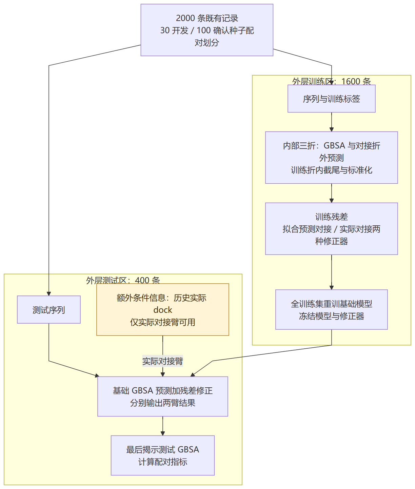

[打开矢量图](figures/GBSA总汇报_20261005/01_对接残差训练边界.svg)

展开可编辑的 Mermaid 图源

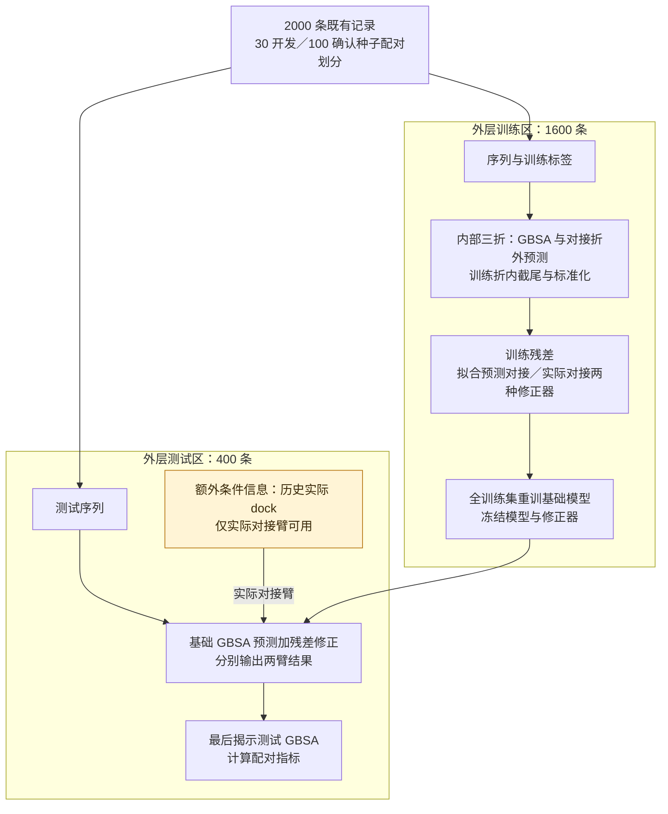
```mermaid
flowchart TB
    accTitle: 对接辅助残差筛查的数据边界
    accDescr: 外层训练集内部产生折外预测并拟合残差修正器。外层测试标签只用于评价。实际对接臂额外读取测试对接信息，预测对接臂只读取序列预测。
    split["2000 条既有记录<br/>30 开发／100 确认种子配对划分"]
    subgraph train_area["外层训练区：1600 条"]
        train["序列与训练标签"]
        oof["内部三折：GBSA 与对接折外预测<br/>训练折内截尾与标准化"]
        residual["训练残差<br/>拟合预测对接／实际对接两种修正器"]
        refit["全训练集重训基础模型<br/>冻结模型与修正器"]
        train --> oof --> residual --> refit
    end
    subgraph test_area["外层测试区：400 条"]
        seq["测试序列"]
        observed["额外条件信息：历史实际 dock<br/>仅实际对接臂可用"]
        inference["基础 GBSA 预测加残差修正<br/>分别输出两臂结果"]
        evaluate["最后揭示测试 GBSA<br/>计算配对指标"]
        seq --> inference
        observed -->|"实际对接臂"| inference
        inference --> evaluate
    end
    split --> train
    split --> seq
    refit --> inference
    classDef conditional fill:#fff4d6,stroke:#b77713,color:#3b2b0b
    class observed conditional
```

#### 3.3.3 证据表：预测对接未见收益，实际对接有条件增益

下表由现有运行的[逐随机种子指标](../../../runs/dock_residual_screen_30seed_20260930/metrics.csv)和[配对汇总](../../../runs/dock_residual_screen_30seed_20260930/summary.json)核对。所有均值均来自同一组 30 个随机种子；没有新增 GBSA 计算。

| 指标 | 序列基础模型 D0 | 预测对接残差 D1 | 实际对接残差 D2 |
| --- | ---: | ---: | ---: |
| GBSA 斯皮尔曼等级相关的均值，越高越好 | 0.383778 | 0.383630 | 0.442247 |
| 相对 D0 的配对相关增量 | — | −0.000148 | +0.058469 |
| 配对增量的 95% 置信区间 | — | [−0.000614, +0.000304] | [+0.048635, +0.068263] |
| 相关优于 D0 的随机种子数 | — | 11/30 | 29/30 |
| 最佳 10% 召回的均值，越高越好 | 0.247500 | 0.248333 | 0.319167 |
| 按预测挑出的前 20 条中，最低真实 GBSA 的跨种子均值，越低越好 | 1.297890 | 1.297890 | 0.671663 |

“最佳 10% 召回”在每个测试集内比较预测前 10% 与真实 GBSA 最低 10% 的重合比例；它不是未来真实候选的成功概率。“前 20 条最低值”只表示历史标签回顾结果，不能解释成 30 个独立实验批次的结果。最后两行这里报告均值，**没有据此另行宣布统计显著性**；当前保存的配对置信区间针对排序相关增量。

这张表支持继续核查 D2 的条件可行性，但没有证明 D2 在真实新序列搜索中有效。它还有三项限制：**只是开发用 30 个随机种子；基础模型与 v8 发布融合不同；数据仍来自同一张历史表。**因此不能把 +0.058469 加到 v8 的 0.375 上，也不能用本筛查的 0.442247 替换序列主线发布指标。此前全局融合及排名替换未成功的记录仍保留；新路线需要说明它与失败路线究竟差在哪里。[总体方案 §9](../../项目记录/GBSA代理接口与候选闭环实施方案_20260930.md)。

#### 3.3.4 为什么两种对接条件会不同

如果预测对接是序列的确定性函数，它没有创造新的观测信息。它可能通过辅助任务、表示或模型偏置改善 GBSA 学习，但也可能只是把相同序列信息绕一遍，并把对接预测误差带入修正器。现有 D1 结果表示：**这个特征、这个基础模型和这个线性残差设置下，未观察到可复现增益**；不能推成“任何预测对接方法永远无用”。

实际对接可能携带序列简单特征没有表达出的三维姿态与相互作用信息，但也会受结构建模、对接姿态、软件版本和随机搜索影响。D2 表内增量可能依赖历史流程的一致性。候选若采用不同构象或不同打分函数，输入分布改变后，旧修正器可能失效。这也是先核对信息来源、再决定模型的理由。

多保真建模（multi-fidelity modelling）研究如何联合成本不同的计算结果并学习它们之间的差异，可为“便宜信息＋目标残差”提供建模依据。Kennedy 与 O’Hagan 的原始工作针对计算模拟，并以油藏模拟为例；**它没有证明 docking 天然是 GBSA 的低保真版本**。这里引用的是方法思想，能否建立稳定映射必须由本数据与部署流程验证。[Kennedy 与 O’Hagan，2000，原论文](https://doi.org/10.1093/biomet/87.1.1)。

#### 3.3.5 独立支线的路线、已完成部分与停止边界

下列编号用于区分信息条件和机制；截至本轮，固定线性残差的100种子确认及三档固定预筛已经完成，结果见 §3.3.8。模型扩展和新增物理计算没有自动进入任务。

| 编号 | 路线及本轮状态 | 需要什么信息 | 对照与后续门槛 |
| --- | --- | --- | --- |
| D1a | 固定旧预测对接残差的独立100种子确认**已完成**，不继续扩大岭惩罚/截尾网格 | 测试阶段仅序列；训练内折外对接预测 | 同基础模型、同划分；现有设置无收益且轻微下降 |
| D1b | GBSA/对接多任务表示，**未开展，暂缓** | 对接仅作训练辅助标签，推断仅序列 | 匹配容量的单任务模型、辅助标签打乱负对照；须有新的机制假设再立项 |
| D2a | 固定线性实际对接残差确认**已完成**；非线性修正**未开展** | 候选阶段能取得同协议实际对接分数 | 表内增量已复现；部署须先补全可用性、结构/对接流程与全尝试成本 |
| D2b | 固定保留25%/50%/75%的历史表预筛诊断**已完成** | 全部进入预筛的候选都有实际对接 | 同20条标签揭示预算，报告真实优胜保留率和最小GBSA；不据三档结果宣布最优门槛 |
| D2c | 按距离/模型分歧仅给部分候选对接，**未开展** | 允许额外对接及完整成本/失败记录 | 同总成本对照；缺失值回退规则预先固定，失败不能被删除后只报成功者 |

**当前建议：保留 D2a 和 D2b 为有条件支线，暂停 D1a 与无边界代理调参。**实际对接并非免费输入，本轮不能评估新序列对接的可靠性或是否省资源。后续若团队确认这类信息可低成本、按统一流程取得，可先对比固定线性残差与温和预筛，再考虑非线性或按条件分配；不用立刻扩到全部复杂路线。

对接预筛不应先成为主线硬门槛。已固定测试三档比例并同时报告；尚未从中选出可部署比例。未来如要调整门槛，应仅在训练/开发区决定，在新的独立评价区确认，并统计过滤掉的真实低GBSA候选。若只获得保留部分的新标签，将看不到被淘汰候选的真实值，必须留独立审计抽样。保留提示或辅助排序可能比未经成本验证的硬淘汰更合适。

#### 3.3.6 执行和验收：不增加 MD，也能先完成什么

| 步骤 | 具体工作 | 产物 | 通过条件 |
| --- | --- | --- | --- |
| D-审计 | 核对 `dock` 来源、分数方向、结构生成、对接软件与版本、构象与姿态选择、随机种子、失败定义；检查逐序列对应关系 | 对接数据字典与可用性表；未知项逐项标明 | 能解释历史列是什么；不能把缺失协议补写成已知事实 |
| D-回顾 | 已完成旧30种子开发及本轮固定方法100种子复核；若研究新的参数，仅在训练区选择 | 配对逐种子指标、失败记录、数据指纹、配置与汇总 | 至少 30 个开发随机种子；不读取测试 GBSA 调参 |
| D-成本 | 若团队决定试算对接，另行确定一小批代表序列，覆盖近训练/远训练、不同突变数；统计全部尝试 | 每条序列的结构准备时间、对接时间、硬件、失败与重试记录 | 成本含失败和重试；没有该记录时只能汇报“额外信息条件结果” |
| D-确认 | 固定历史信息条件的100种子计算确认已完成；部署可行性尚未核实 | 100 种子配对结果与预定判据 | 排序和低 GBSA 候选发现指标同时报告；仍明确只是表内确认 |
| D-前瞻 | 只有以后启动真实 GBSA 验证时，才把有/无对接辅助纳入候选方案比较 | 独立候选、统一协议、预算与预注册 | 新序列真实 GBSA 的效果与总成本可比较；当前尚未安排 |

成本比较至少同时列出三类账目：模型对多少条唯一序列做了预测；多少条候选尝试了实际对接；多少条候选获得真实 GBSA。**每条成功对接的成本不能替代每条尝试的成本。**例如，结构准备失败、对接超时和重复运行都消耗资源。可写成：

\[
C_{\rm 总}=C_{\rm 模型预测}+C_{\rm 结构准备与对接全部尝试}+C_{\rm GBSA全部尝试}。
\]

其中 \(C\) 是同一计量口径的计算成本，可以用硬件小时或金额；如硬件不同，应分别列出，不强行合并成一个数字。既可以比较“相同 GBSA 条数时有无收益”，也要比较“相同总成本时有无收益”。当前缺少新候选对接的成本证据，不能给出对接支线的实际节约比例。

对接支线必须检查：测试 GBSA 只用于最终评价；特征筛选、标准化、残差拟合和预筛门槛全部在训练区完成；同一序列的重复记录不得跨训练/测试混放；缺失对接者有预定回退规则；对接协议变更有版本；只用序列的主线接口不被 D2 的额外输入覆盖。发布结论还应报告突变数、离训练集距离和 GBSA 极值区域的分层表现，不能只报总体相关。

#### 3.3.7 文献究竟支持哪一部分

Genheden 与 Ryde 的综述指出，MM/GBSA 的表现依赖具体体系和计算设置，涉及构象采样、溶剂与熵等近似。因此“真实 GBSA”在本报告中指**按统一协议得到的计算标签**，不等于实验结合自由能，也不能由另一体系的结果证明其绝对准确。[Genheden 与 Ryde，2015，全文](https://pmc.ncbi.nlm.nih.gov/articles/PMC4487606/)。

Sindt、Bret 与 Rognan 2025 年回顾了 **10 个**经过体外结合检测的超大规模小分子筛选命中列表，比较 **8 种**重新打分方法。作者未发现一种方法能在全部检测中稳健区分结合者与非结合者；构象能量精修也未普遍改善结果。它支持“对接与追加打分需要独立验证”的风险提醒，**不直接证明本 RNA 数据的 GBSA 残差修正有效或无效**。[Sindt 等，2025，原论文](https://doi.org/10.1021/acs.jcim.5c00730)。

本支线目前最直接的依据仍是项目自己的 D0/D1/D2 配对表。文献提供建模思路与误差警示，是否值得接入由本项目增量、可用性和成本共同决定；期刊类别及 JCR 分区见 §10。

#### 3.3.8 本轮完成的 100 种子残差确认与固定预筛诊断

本轮按旧方法冻结参数，在 **3001–3100 共 100 个新随机种子**上独立确认。每种子 1600 训练、400 测试；基础模型、训练内三折折外残差、截尾与岭惩罚均保持旧设计。没有新做任何 docking、MD 或 GBSA。实际对接组仅使用既有测试行的对接信息作为额外输入，明确假设部署候选也能取得它；预测对接组在测试时只输入序列。

| 条件 | GBSA排序相关 | 相对序列增量 | 95%配对区间 | 最好10%召回 | 预测前20条中最低已知GBSA均值 | 排序增量胜数 |
| --- | --- | --- | --- | --- | --- | --- |
| 仅序列GBSA | 0.36303 | 对照 | — | 0.25175 | 2.47458 | — |
| 预测对接残差 | 0.36266 | -0.00036 | [-0.0007, -0.0001] | 0.25075 | 2.41852 | 41/100 |
| 实际对接残差 | 0.42272 | +0.05970 | [+0.0551, +0.0642] | 0.33325 | 1.09505 | 98/100 |

预筛的补充诊断事先固定保留最低对接分数的 25%/50%/75%，在各自保留集合内仍按基础 GBSA 代理选 20 条；与不预筛的序列模型同样揭示 20 个已有标签。不是用测试 GBSA 选择门槛，也不把任何一个比例作为部署决定。漏掉率为 1 减“真实 GBSA 最好 10% 的预筛保留率”。

| 对接预筛保留比例 | 真实GBSA最好10%的保留率 | 漏掉率 | 前20条最低已知GBSA相对差 | 95%配对区间 | 胜/平/负 |
| --- | --- | --- | --- | --- | --- |
| 25% | 51.52% | 48.48% | -0.44358 | [-1.3453, +0.4995] | 53/10/37 |
| 50% | 78.85% | 21.15% | -0.95322 | [-1.4446, -0.5243] | 27/70/3 |
| 75% | 91.92% | 8.07% | -0.37874 | [-0.6992, -0.1322] | 13/87/0 |

这三项预筛需要先给全部 400 条测试候选实际对接，随后才减少进入候选列表的数量；标签揭示预算仍为 20，不能把留下 100 条误写成 GBSA 已从 400 次降到 100 次。全池 GBSA 真实值来自历史表，若只在新保留序列上取得标签，将无法直接统计被过滤的真实优胜序列。因此真正验证预筛需另有独立审计样本或有完整标签的小型评价池。

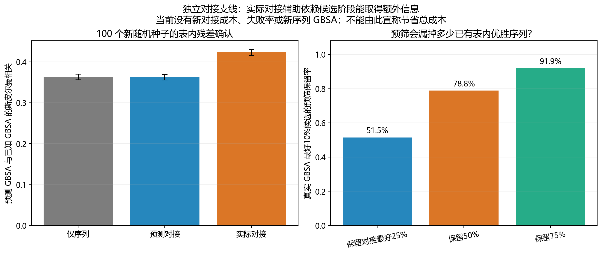

[矢量图](figures/GBSA总汇报_20261005/12_对接支线与预筛损失.svg)

**本轮怎么判断**：D1排序平均差 −0.000361，95%配对区间 [−0.000657,−0.000083]，幅度很小但没有正收益，不能把它写成提升。D2平均差 +0.059696，[+0.055135,+0.064208]，98/100种子提高，支持“额外实际对接有条件信号”；不能把它加到历史v8相关上。两种修正的低GBSA召回与前20最低值在这里仅列均值，没有由均值另行宣称显著性。

预筛50%组的最低GBSA配对均值改善 −0.95322、区间低于零，但**27胜/70平/3负，中位差为0**；75%组为13胜/87平/0负，中位差也为0。平均收益来自少数改变了最佳序列的划分；不是大多数种子都更好。25%组53胜/10平/37负，区间跨零，且平均漏掉48.48%的真实最好10%候选。50%/75%仍分别漏掉约21.15%/8.08%，因此需要同时考虑目标是找一个最低值，还是保留一批优胜序列；二者不等价。三档中50%的均值改善较大不证明它是最优阈值，未来部署仍需独立确认与总成本对照。

图12左侧误差棒为各条件排序相关**均值**的跨种子自举区间；配对增量以表格为准，不能用均值区间的重叠判断配对差。

完整逐种子记录和冻结配置见[对接支线证据](../../../evidence/search_suite_20261005/dock_confirmation/summary.json)及[运行配置](../../../configs/experiments/dock_residual_confirmation_100seed_20261005.json)。新增非线性修正、多任务模型或按条件分配对接仍是将来可能研究的假设；本轮没有借这些扩展重新进行代理调参。

## 四、当前搜索算法与预留的未来测量接口

### 4.1 当前要解决的任务：先完成可替换代理的突变搜索层

**现阶段交付应是：同一套序列约束和档案规则下，能够把不同代理接入不同搜索算法，生成可追溯的一组或两组候选。**代理可以是经典回归、预训练表示后的预测器或集成模型；它是否采用主动学习，不是搜索层的前置条件。当前不新增真实 GBSA，不启动历史 96 条文件回填，也不以“找到最低预测值”宣布真实最优。

建议把工程工作分成三层，避免名称相似造成任务混淆。

| 层 | 输入与输出 | 本阶段做什么 | 哪个问题仍未解决 |
| --- | --- | --- | --- |
| 代理层 | 序列 → 独立 GBSA 预测，可选附带不确定度 | 在已有数据上研究不同模型；提供固定版本评分器 | 新序列上的 GBSA 排序可靠性仍有限 |
| 搜索层 | 已有父本、合法突变算子、固定评分器 → 多代候选和谱系 | 当前主任务；随机游走、爬山、束搜索及无交叉遗传算法已接通 | 哪个搜索算法能找到更低的真实 GBSA，尚无新标签证据 |
| 未来验证层 | 候选提案 → 团队决定是否计算 → 真实 GBSA 与质量控制 → 可选重训 | 只预留文件、状态与接口；不形成当前计算安排 | 协议、预算、独立重复及是否主动学习均待以后决策 |

**图 2：总体架构及当前/未来边界。**蓝色区为当前阶段 B，黄色区为未来条件步骤；虚线表示需要新的团队决策才能启用。一次内循环中的模型固定，模型研究不会在半轮搜索中悄悄替换评分标准。

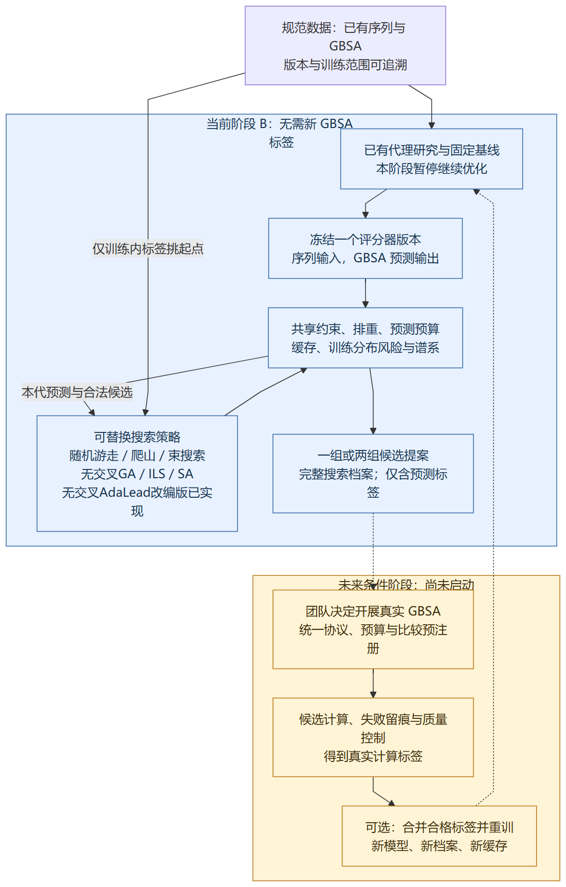

[打开矢量图](figures/GBSA总汇报_20261005/02_当前与未来总体架构.svg)

展开可编辑的 Mermaid 图源

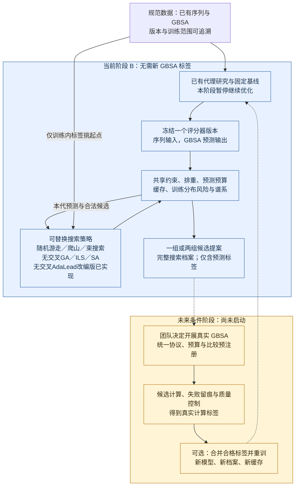
```mermaid
flowchart TB
    accTitle: GBSA 代理研究与模型无关突变搜索的总体架构
    accDescr: 当前用两种固定诊断代理完成突变搜索与接口验收，暂停继续代理优化。候选档案输出后，只有未来另行决定投入真实 GBSA，才启动协议、预算、计算、质控和可选模型更新。
    data["规范数据：已有序列与 GBSA<br/>版本与训练范围可追溯"]
    subgraph stage_b["当前阶段 B：无需新 GBSA 标签"]
        research["已有代理研究与固定基线<br/>本阶段暂停继续优化"]
        frozen["冻结一个评分器版本<br/>序列输入，GBSA 预测输出"]
        policy["可替换搜索策略<br/>随机游走／爬山／束搜索<br/>无交叉GA／ILS／SA<br/>无交叉AdaLead改编版已实现"]
        guard["共享约束、排重、预测预算<br/>缓存、训练分布风险与谱系"]
        archive["一组或两组候选提案<br/>完整搜索档案；仅含预测标签"]
        research --> frozen
        frozen --> guard
        policy --> guard
        guard -->|"本代预测与合法候选"| policy
        guard --> archive
    end
    subgraph stage_future["未来条件阶段：尚未启动"]
        decision["团队决定开展真实 GBSA<br/>统一协议、预算与比较预注册"]
        measured["候选计算、失败留痕与质量控制<br/>得到真实计算标签"]
        update["可选：合并合格标签并重训<br/>新模型、新档案、新缓存"]
        decision --> measured --> update
    end
    data --> research
    data -->|"仅训练内标签挑起点"| policy
    archive -.-> decision
    update -.-> research
    classDef current fill:#e8f1ff,stroke:#3168a8,color:#183451
    classDef future fill:#fff4d6,stroke:#b77713,color:#3b2b0b
    class research,frozen,policy,guard,archive current
    class decision,measured,update future
    class stage_b current
    class stage_future future
```

适配体研究已有“固定模型 → 突变 → 预测 → 保留父本 → 再突变 → 实验检验”的实例。Bashir 等的 DNA 适配体工作可支持这种模块分工；它的目标是实验亲和力，本项目目标是 RNA 的 GBSA，不能照搬其收益。[Bashir 等，2021，全文](https://pmc.ncbi.nlm.nih.gov/articles/PMC8062585/)。

### 4.2 搜索的数学含义与生物学约束

当前每条完整 RNA 长 **141 个核苷酸**；只允许修改以 1 为起点编号的 **30–33、89–92、127–131**，合计 13 个位置。碱基字母 A、C、G、U 分别代表腺嘌呤、胞嘧啶、鸟嘌呤、尿嘧啶。其余骨架位置必须与参考野生型一致；不允许插入、删除或改变长度。输入的小写转为大写，T（胸腺嘧啶）按现有规范转为 U；原始输入与规范化策略应可追溯。[序列合同](../../../scripts/loop/interface.py)。

如果 13 个位点各有四种碱基，不施加其他限制时共有 \(4^{13}=67,108,864\) 种组合。当前配置又限制相对野生型突变数为 **4–13**；因此仅按这一壳限制、尚未扣除历史序列或生物学约束时，理论组合数为：

\[
\sum_{k=4}^{13}\binom{13}{k}3^k=67,100,400。
\]

\(k\) 是相对野生型不同的位点数；组合数选择哪些位置改变，\(3^k\) 表示每个被改变位置有三种替代碱基。4–13 是当前工程壳限制，**不是经过实验证明的可行边界**。全表在 4、5 个突变处分别只有 2、9 条，低突变区即使满足硬约束，也不代表代理获得了充分支持。[候选范围与数据分布记录](../../项目记录/GBSA代理接口与候选闭环实施方案_20260930.md)。

一位点替换的邻居上限为 \(13\times3=39\)；两位点同时替换的上限为 \(\binom{13}{2}\times9=702\)。越过突变壳、历史排重、已评分缓存及生物学限制后，实际可用邻居更少。相对父本发生一次替换，可能增加、减少或不改变相对野生型的突变数；不能把“走了十代”写成“相对野生型有十个突变”。

搜索时实际最小化的是 \(\widehat g_m(s)\)：模型版本 \(m\) 对序列 \(s\) 的 **GBSA 预测值**。真正希望降低的是统一协议得到的 \(g(s)\)。有限预测预算只能给出“搜索访问过的候选中预测最好的序列”，不能证明它是 6700 万组合中的全局最优，也不能保证预测最小对应真实最小。

生工团队若提供配对碱基、保守基序或不可变位点，可将它们转为所有算法共用的硬约束。二级结构与能量过滤如果启用，必须写明阈值来自哪里、是否在训练数据内确定；规定的 MFE、Pre、Aft、Gap2 仍必须使用 NUPACK，不能换用 RNAfold。MFE 是 minimum free energy，最低自由能；Pre/Aft 是项目历史流程前/后结构量的字段；Gap2 是历史结构差指标。当前搜索不能自行推断这些约束，更不能把它们混回复合优化目标。

### 4.3 两个版本接口的职责与逐字段合同

已有**代理/标签接口版本 0.2.0**，新增**突变搜索接口版本 0.1.1**；两者覆盖不同层，版本号不同不等于矛盾。代理接口负责训练、预测和标签来源；搜索接口负责调用固定评分器、产生候选、记录谱系和恢复运行。[代理接口](../../../scripts/loop/interface.py)、[搜索接口](../../../scripts/loop/search.py)。

#### 4.3.1 代理层：算法只需要可排序的独立 GBSA 输出

| 合同项 | 代码名称与含义 | 必须满足的条件 |
| --- | --- | --- |
| 拟合 | `fit(sequences, y)`，用已有序列与 GBSA 标签拟合 | `y` 为独立 GBSA；特征筛选只用训练集；搜索开始后不在本轮内重训 |
| 批量预测 | `predict(sequences)`，按序列列表预测 | 输出行数和顺序与输入一致；支持合法的新序列；不得依赖已知目标或测试标签 |
| 均值/点预测 | `Prediction.mu`；μ 是预测均值的习惯符号 | 有限数值；**越低越优**；预测列始终与真实 GBSA 列分开 |
| 可选不确定度 | `Prediction.sigma`；σ 是离散程度的习惯符号 | 可为空；若有则非负、有限、与均值同长，并声明 `uncertainty_kind`，即不确定度的计算来源 |
| 版本 | `model_id` 为已拟合模型标识，`feature_version` 为特征规范版本 | 同一搜索内保持不变；标识应区分训练样本、模型权重及特征处理版本 |
| 保存 | `save(path)`，保存已拟合模型 | 能追溯实际使用的模型；新模型必须用新标识及新搜索档案 |

当前 `TargetSpec`（目标规格）的 `describe()`（规格描述）已经保存目标 gbsa、方向 minimize（最小化）、单独 GBSA 标签政策与单位字段。单位预设为 kcal/mol（千卡每摩尔），这是代码合同，历史与未来真实计算协议仍需对来源和数值单位作明确核实。本轮两个代理输出的是 GBSA 回归数值，常规算法按 mu 排序。平均名次、类别概率或语言模型困惑度不能直接冒充 pred_gbsa（预测 GBSA）；预训练或排序模型接入时须有按既有 GBSA 标签训练的合法预测适配器，若想改用纯相对评分，应另行明确评分语义并升级合同。历史排序融合的名次也不能标成能量。[目标规格与预测合同](../../../scripts/loop/interface.py)。

本次还补齐了拟合标识：模型编号包含训练序列、标签、已拟合模型权重及筛选索引的摘要；保存模型时保留此标识。搜索指纹另加入训练标签、参考骨架和可变位置，替换模型后拒绝旧缓存。可替换不等于随意混用不同训练快照。

#### 4.3.2 搜索层：从上下文到结果的责任边界

| 对象 | 负责什么 | 关键字段或方法 | 算法不应越过的边界 |
| --- | --- | --- | --- |
| `SearchContext`，搜索上下文 | 描述本次搜索的固定条件 | 搜索编号、已测训练序列及标签、禁止再导出集合、野生型、13 位点、突变壳、随机种子、预测预算、配置代数上限、约束与数据版本 | 不读取留出标签选起点；不在中途改变约束或训练支持范围 |
| `SurrogateScorer`，评分适配器 | 包装任意合格代理 | `score(sequences)`、`n_used` 已使用唯一预测数、`remaining` 剩余数 | 不将搜索产生的预测值加入已测训练集；不混合模型缓存 |
| `SearchPolicy`，搜索策略 | 决定父本、子代和停止 | `search(context, scorer)` → 搜索结果 | 不调用代理私有训练代码；不绕过计数器直接预测 |
| `ScoredCandidate`，已评分候选记录 | 保存每条已评分序列的证据与谱系 | 候选编号、序列、直接父本、算子、改动位置、代数、预测、模型版本与风险标记 | 不把祖先是已测序列误当成直接父本已测；不只记录最后赢家 |
| `CandidateGroup`，候选组 | 输出一组或两组可追溯提案 | 组编号、代表候选、成员、分组规则和距离摘要 | 不把序列分组称为已证实的结构机制或真实能量盆地 |
| `SearchResult`，搜索结果 | 归还排序候选、分组和执行信息 | 全部可导出候选、组、唯一预测数、停止原因、状态文件位置 | 搜索完成不代表真实计算完成 |

算法可按同一接口替换；不同模型也可按同一接口替换。这里的“可替换”是**输入、输出和责任边界相同**，并不保证所有模型有相同延迟、可解释性或外推能力，也不意味着任意预训练模型无需编写适配器就能直接预测 GBSA。

#### 4.3.3 评分适配器实际执行的保护

**图 3：一批子代从提出到计入预测预算。**重复缓存只返回原快照预测；约束与预算拒绝不能被写成一个新的有效评分。算法层会先筛去已访问/禁止序列，适配器仍独立检查预测合同。

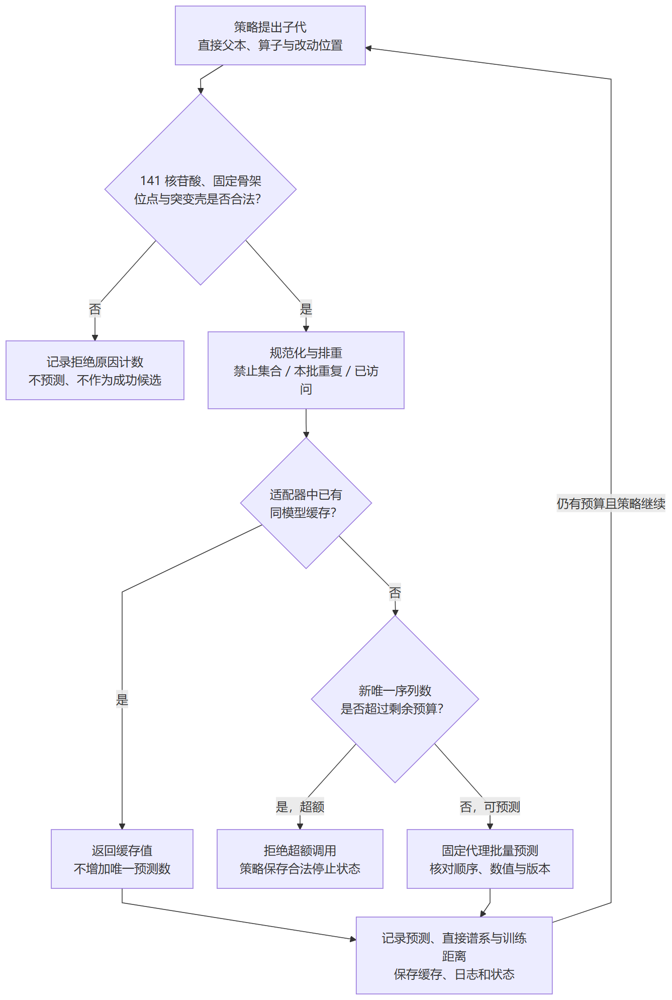

[打开矢量图](figures/GBSA总汇报_20261005/03_评分验证与预算.svg)

展开可编辑的 Mermaid 图源

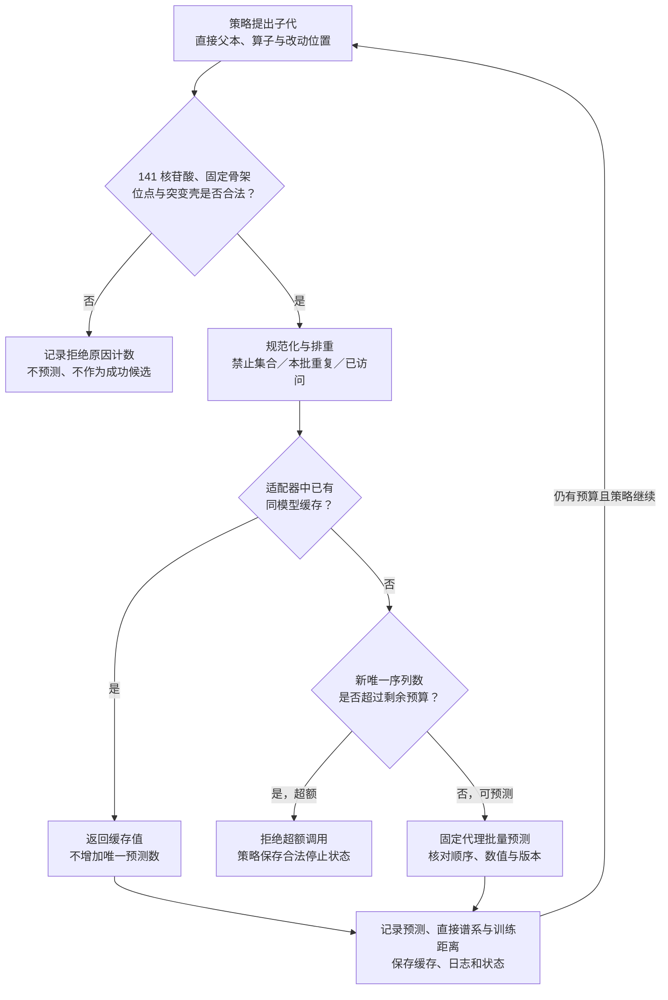
```mermaid
flowchart TB
    accTitle: 共享评分接口的验证与预算流程
    accDescr: 子代经过序列约束和历史排重后，只对没有缓存的新序列计数与预测。缓存必须属于同一固定模型。新评分和谱系写入档案，再反馈算法或停止。
    propose["策略提出子代<br/>直接父本、算子与改动位置"]
    legal{"141 核苷酸、固定骨架<br/>位点与突变壳是否合法？"}
    reject["记录拒绝原因计数<br/>不预测、不作为成功候选"]
    dedup["规范化与排重<br/>禁止集合／本批重复／已访问"]
    cache{"适配器中已有<br/>同模型缓存？"}
    reuse["返回缓存值<br/>不增加唯一预测数"]
    budget{"新唯一序列数<br/>是否超过剩余预算？"}
    stop["拒绝超额调用<br/>策略保存合法停止状态"]
    score["固定代理批量预测<br/>核对顺序、数值与版本"]
    persist["记录预测、直接谱系与训练距离<br/>保存缓存、日志和状态"]
    propose --> legal
    legal -->|"否"| reject
    legal -->|"是"| dedup --> cache
    cache -->|"是"| reuse --> persist
    cache -->|"否"| budget
    budget -->|"是，超额"| stop
    budget -->|"否，可预测"| score --> persist
    persist -->|"仍有预算且策略继续"| propose
```

**唯一预测次数**按固定模型第一次预测的规范化序列数计算。一个含 100 条新序列的批量调用是 100 次唯一序列预测，不是“只算一次”；同一序列再次读取缓存不增加计数；16 个初始序列的预测也计入预算。五成员集成给一条序列评分，在这一口径下是一条唯一预测，但内部可能执行五个成员推断。因此公平比较还需记录总用时、硬件和成员数，不能把“1024 条唯一序列”理解为所有代理相同的硬件成本。

当前逐候选 `score_time` 存的是该批评分的用时，并复制到批内各条记录；不能把这一列相加当总预测成本。本轮评分器另累计实际预测调用时间及次数，驱动记录整次搜索墙钟时间，二者分别汇报；候选生成、排重、风险距离与档案写入尚未逐项拆时。本报告不据逐行时间字段宣称某方法更省硬件时间。

缓存绑定 `model_id + feature_version`。更换权重或重训后，即使序列相同也要建立新档案；不能让新模型读取旧模型的预测并继承旧的计数。固定输入顺序由适配器恢复；输出含无穷、非数字、错长度或负的不确定度应直接失败，不悄悄删行。这些机制已有[搜索契约测试](../../../tests/test_search_contract.py)。

### 4.4 初始父本与共有突变算子

当前七种同起点策略默认共用 **8 条已测低 GBSA 序列＋8 条分层随机序列**。前一类从本次训练集内选择，候选间尽量满足至少两个可变位点的差异；后一类按相对野生型突变数分层抽取。若某层或起点不足，实际数量可以减少，不能伪造到固定数。

训练 GBSA 用来决定已有序列是否可作为起点；进入搜索以后，**包括已有起点在内都重新用同一固定代理评分**，本轮父本排序不能混合真实值和预测值。已测序列可以做父本，但禁止再次作为“新候选”导出。本轮独立比较把整个规范数据表排除；不是扫描全项目每一份历史提案文件的全局排重。接入外循环时，才进一步把该标签提供器所登记的过去导出、待处理和失败序列加入禁止集合。若未来跨多个独立运行签发计算清单，还须合并它们的历史登记后排重，不能由本轮审计推断全项目所有提案已无重复。留出表中已有标签的序列不会被重新包装成新发现。[共用起点与算子](../../../scripts/loop/search_policies.py)。

共有算子是：一位点替换、两位点替换、全局分层随机重启。全局重启不来自某个局部父本，父本为空，算子明确标为重启；不能统一写成“野生型产生的直接子代”。本轮明确采用无交叉遗传算法，每条局部子代只来自一个直接父本；现有单亲谱系完整记录该关系，见 §4.7。

### 4.5 原四种搜索策略的真实机制（新增三法见§4.15）

#### 4.5.1 同起点随机游走：检验预测反馈是否增加了价值

代码名 `matched_seed_random_walk`，意为“匹配初始序列的随机游走”。它与爬山、束搜索共用起点；随后从**已经评分的历史序列集合中均匀随机选父本**，再随机选一个合法的一位点邻居，避开已访问和禁止序列。它会记录预测值并在最后输出低预测候选，但**下一步的父本选择不因该值低而更有机会**。[实现](../../../scripts/loop/search_policies.py)。

这不是“把一个单独个体沿一条路径一直走”的经典单轨随机游走，而是共享档案上的随机扩展。其作用是回答：有相同起点和本地突变机会时，用分数选择方向是否比不使用分数反馈更容易找到低预测值。它不等价于全局均匀抽样，也不等价于“随机挑一批去测 GBSA”。

每代评分块至少按 128 条的工程块大小组织，并受剩余预算限制；如果找不到新邻居或达到代数上限/预算，就保存停止原因。128 是批量处理参数，没有生物学含义。

#### 4.5.2 多起点爬山：依次沿单步低预测方向前进

代码名 `multi_start_hill_climb`。这里目标越低越好，“爬山”实际上是在预测能量地形上向下走。

1. 依次取一个初始父本。
2. 枚举它的一位点替换邻居；上限 39 条，扣除壳限制、禁止序列和已访问序列，并受剩余预算截断。
3. 用固定代理给新邻居评分，取其中最低预测值的候选。
4. 如果比当前父本严格更低，令它成为下一步直接父本；相同预测值不当作改善。
5. 如果没有新可评分邻居，或新邻居均未改善，终止这条路径，换到下一个初始父本。
6. 所有初始路径结束、预测预算耗尽，或累计严格改善步数达到64时停止；所有评分候选仍保存在档案中，不只保存成功前进一步的序列。

**图 4：多起点爬山的控制流程。**“换起点”使用预先保存的共享初始列表，当前实现不是每次遇到局部最优就额外生成一个新的全局随机起点。

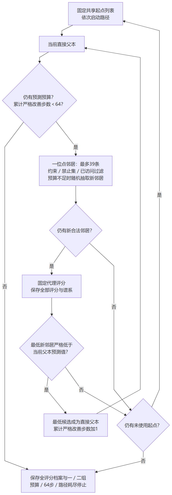

[打开矢量图](figures/GBSA总汇报_20261005/04_多起点爬山.svg)

展开可编辑的 Mermaid 图源

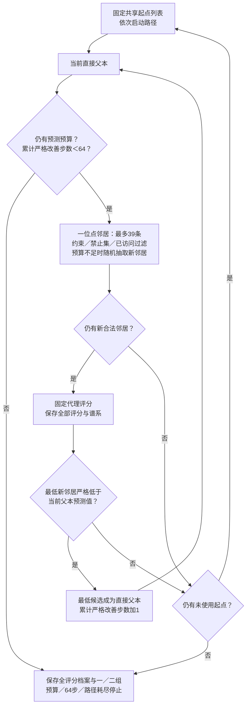
```mermaid
flowchart TB
    accTitle: 多起点爬山的逐路径流程与全局代数门槛
    accDescr: 共享起点依次启动，首先检查剩余预算与所有路径累计严格改善步数上限64。只给未访问合法一位点邻居评分，预算不足随机抽取。严格下降才前进，否则切换下一起点，所有评分保存在档案。
    starts["固定共享起点列表<br/>依次启动路径"]
    parent["当前直接父本"]
    limit{"仍有预测预算？<br/>累计严格改善步数＜64？"}
    neighbors["一位点邻居：最多39条<br/>约束／禁止集／已访问过滤<br/>预算不足时随机抽取新邻居"]
    available{"仍有新合法邻居？"}
    score["固定代理评分<br/>保存全部评分与谱系"]
    improve{"最低新邻居严格低于<br/>当前父本预测值？"}
    advance["最低候选成为直接父本<br/>累计严格改善步数加1"]
    next_start{"仍有未使用起点？"}
    end_search["保存全评分档案与一／二组<br/>预算／64步／路径耗尽停止"]
    starts --> parent --> limit
    limit -->|"否"| end_search
    limit -->|"是"| neighbors --> available
    available -->|"是"| score --> improve
    available -->|"否"| next_start
    improve -->|"是"| advance --> parent
    improve -->|"否"| next_start
    next_start -->|"是"| starts
    next_start -->|"否"| end_search
```

适合它的情况是：代理局部排序较稳定、单步修改具有可解释性，且想用少量参数先建立基线。局限是不能穿过需要暂时变差的路径，也不容易处理两个位点必须共同改变才改善的组合效应。不同突变之间相互影响称为**上位性（epistasis）**；存在上位性不意味着一定需要遗传算法，本轮通过两位点变异与一位点消融检查简单组合变化；未采用重组。

本次补齐了爬山的正常代数上限，并在剩余预算不足时用已保存的随机数状态抽取邻居，避免总是优先低编号位点。这里的代数为**所有路径累计接受的严格改善步数**；未改善邻居的评分也计入预测预算，但不增加改善步数。当前路径只考虑未访问的新邻居，没有完整回看全部已缓存邻居；因此 `local_optima`（局部最优停止）仍只是实现停止标记，不是数学上证明所有合法邻居均不能改善。[实际控制流程](../../../scripts/loop/search_policies.py)。

#### 4.5.3 多起点束搜索：同时保留多条候选路径

代码名 `multi_start_beam`。束搜索（beam search）在每轮保留有限数量的路径/候选供下一轮扩展；“束宽”是保留数量。其经典文献常见于序列解码；本实现每个个体是**完整的 141 核苷酸 RNA**，做完整序列的局部突变，不是逐字生成文本，也不是逐个核苷酸拼接 RNA。[束搜索方法参考：Freitag 与 Al-Onaizan，2017](https://aclanthology.org/W17-3207/)。

| 参数 | 当前默认/比较值 | 实际含义与限制 |
| --- | ---: | --- |
| 束宽 `beam_width` | 32 | 每代最多保留 32 条父本；初始只有 16 条时不会补成 32 条 |
| 每父本子代槽 `offspring_per_parent` | 32 | 本代总提出槽数按父本数 × 32 计算，再受剩余预算限制；不保证过滤后有相同有效数量 |
| 一位点比例 `one_hop_fraction` | 0.8 | 非重启配额主要给一位点替换；余量由两位点替换填补；四舍五入和可行邻居数会改变实际比例 |
| 重启比例 `restart_fraction` | 0.1 | 约 10% 的本代总槽给全局分层随机序列；无局部父本 |
| 多样性候选倍数 `diversity_pool_factor` | 4 | 在预测排名前 4 × 32 = 128 条的父本候选里做保留 |
| 最小父本差异 `diversity_distance` | 2 | 优先选择与已保留父本至少差两个可变位点的序列；不足时按排名补齐，**不是始终满足的硬保证** |
| 无改善代数 `max_stagnant_generations` | 2 | 连续两代没有新的更低预测候选则提前停止 |
| 配置代数上限 `max_generations` | 64（首轮四法） | 首轮四法统一护栏；最新七法为256，见§4.15。束/GA为代数，随机为评分块数，爬山为累计严格改善步数；不代表同工作量 |

一位点邻居配额从可行邻居中随机抽取，而不是每次只取编号最小的位点；两位点算子探索可绕过单步不能改善的组合。父本保留从“上一代父本＋新子代”共同选择，因此包含精英保留，即较优旧个体有机会继续存活。

**图 5：束搜索的突变、全局重启和多样性选择。**比例是工程配额，过滤后的实际数量必须由日志报告。

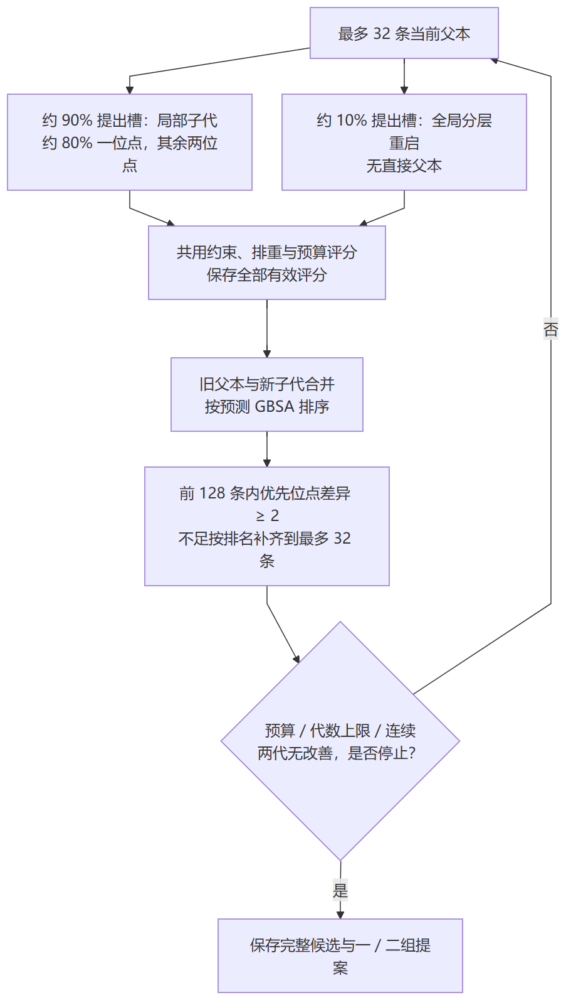

[打开矢量图](figures/GBSA总汇报_20261005/05_多路径束搜索.svg)

展开可编辑的 Mermaid 图源

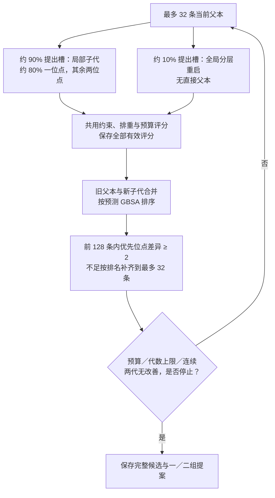
```mermaid
flowchart TB
    accTitle: 多路径束搜索的每代流程
    accDescr: 父本扩展的一位点与两位点子代，加全局随机重启，经共享验证评分后与旧父本合并。按预测排名和软多样性规则保留下一代，直到预算、代数或停滞条件满足。
    parents["最多 32 条当前父本"]
    local["约 90% 提出槽：局部子代<br/>约 80% 一位点，其余两位点"]
    restart["约 10% 提出槽：全局分层重启<br/>无直接父本"]
    score["共用约束、排重与预算评分<br/>保存全部有效评分"]
    merge["旧父本与新子代合并<br/>按预测 GBSA 排序"]
    diverse["前 128 条内优先位点差异 ≥ 2<br/>不足按排名补齐到最多 32 条"]
    stop{"预算／代数上限／连续<br/>两代无改善，是否停止？"}
    output["保存完整候选与一／二组提案"]
    parents --> local --> score
    parents --> restart --> score
    score --> merge --> diverse --> stop
    stop -->|"否"| parents
    stop -->|"是"| output
```

束搜索能保留多条路径，但束宽更大、双位点更多并不自动更好：固定预测预算下，每条路径获得的探索机会会减少；软多样性还可能牺牲最低预测值。当前保留它的理由是作为可审计的多路径策略，与爬山比较预测值和候选多样性的权衡；**没有证据把它设为最终胜出的唯一默认算法**。

#### 4.5.4 全局分层随机搜索：历史覆盖基线

代码名 `stratified_random`。它按允许突变数层直接抽取新序列，没有“哪条父本的子代继续走”的分数反馈，适合检查覆盖和初始空间敏感性。突变数分层分配并不是在 6700 万组合上完全均匀抽样；它刻意让不同突变数层有抽样机会。

旧 8192 次上限比较使用的是这个随机策略，起点未与其他两法匹配。它继续保留作覆盖对照；需要识别“局部起点帮助”与“分数反馈帮助”时，至少应同时有全局随机和同起点随机游走两个基线。二者不同的问题不能混为一项 random（随机方法）结果。

### 4.6 原来讨论遗传算法，为什么先做了爬山和束搜索

前期先做这些基线，是为了验证“产生子代—代理打分—更新父本—多代留痕”的共有接口，不能解释成遗传算法已被否定。按照本次明确要求，已加入**只有变异、没有交叉的遗传算法**，代码名 `mutation_only_ga`；意为“仅变异遗传算法”。注册表现含七种同起点策略，加上历史全局分层随机覆盖基线，共八项；本节详述GA，新增三法见§4.15。[策略实现](../../../scripts/loop/search_policies.py)。

遗传算法（genetic algorithm，GA）以种群、按适应度选择父本、遗传变异和生存替换为主要机制。交叉重组是常见组成部分，本项目明确关闭它；本实现更准确地属于**仅变异、精英保留的种群进化搜索**。把它称为无交叉遗传算法，不表示它复现了文献中含重组的完整算法。束搜索给每个父本近似均等的提出配额，本 GA 用预测分数参与锦标赛决定父本，因此两者不是改一个名字。

| 当前需求 | 本次如何实现 | 能解决和不能解决的事 |
| --- | --- | --- |
| 代理尚未成熟 | 固定通用评分器，算法不读取模型私有属性 | 接口可替换；搜索算法不能使错误预测自动变成正确标签 |
| 不做交叉 | 每次选一个父本；一/两位点替换；重启父本为空 | 直接父子关系可审计；没有双亲、位点拼接或隐含重组 |
| 保留好序列和多样性 | 2 个精英必保留，其他位置共用软距离筛选 | 预测最优不因淘汰丢失；仍可能种群集中，需实际指标检查 |
| 判断选择压力是否有用 | 固定 2 人锦标赛，开发时另外比较人数 1 和 4 | 单独改变父本选择压力；并非重新优化代理 |
| 得到一/两组候选 | 全部已评分可导出序列按共同代表分组 | 分组是交接组织，不能称为两个真实最优能量盆地 |

论文提供的是机制依据。DNA（脱氧核糖核酸，deoxyribonucleic acid）适配体的预测指导迭代变异见 [Bashir 等，2021](https://doi.org/10.1038/s41467-021-22555-9)；RNA 核糖开关的遗传算法流程见 [Espah Borujeni 等，2016](https://doi.org/10.1093/nar/gkv1289)。这两项终点都不是本 RNA 的 GBSA，论文不能替当前参数背书，更不能替新序列真实标签。文献类别与 JCR 分区见 §十。

### 4.7 已实现的无交叉遗传算法：逐步机制、参数与验收

#### 4.7.1 每一代究竟做什么

1. **初始化。**与其他方法相同，取 8 条训练区已标注起点和 8 条随机起点。16 条都按固定代理预测，包含在预算内；种群上限 32，初始化不额外免费补到 32。真实训练 GBSA 用于共同的已标注起点选取；之后父本选择只比较固定代理预测。
2. **选择单父本。**对每个局部子代槽，均匀随机、有放回地抽取 2 个种群索引，取预测 GBSA 更低者；预测并列时按稳定候选编号排序。有放回表示可能抽到同一个个体，不强行保证比赛双方不同。
3. **施加变异。**局部子代以 0.8 概率选择一位点替换，否则选择两位点替换。替换后必须满足骨架与 4–13 突变壳；非法、已知、已访问或批内重复候选在评分前排除。子代不与第二个父本交换任何位点。
4. **少量全局重启。**每代提出槽约 10% 预留给按突变壳分层的全局随机序列；它不是某个父本的子代，父本留空、证据写“无父本”。比例是提出槽比例，过滤之后实际评分比例可能改变。
5. **共用评分器。**每代最多提出 128 条，最后一代若预算不足则减少提出槽。调用固定代理；预测结果和直接父本、变更位点、代数写入档案。重复缓存不另计首次预测数。
6. **生存选择。**父子合并、按候选编号排重，预测最优的 2 条精英原样保留；其余位置从预测排名前部采用共同的软距离规则，最后最多留 32 条。软距离不是绝对的合法性门槛；精英优先，必要时允许近邻填满。
7. **停止和输出。**预算用尽、最多 64 代、连续 4 代没有新的严格更低**可导出候选**，或生成不出新候选时停止。最后按全量已评分且可导出档案排序，再按共同规则分成一组或两组。测过的初始父本不重新导出。

适应度（fitness）就是用于选择的预测 GBSA，越低越好。算法不使用未校准不确定度，不调用真实计算，也不自动形成主动学习安排。每个未标注子代的直接父本若也未被真实计算，证据必须写“仅预测”；不能因为更远祖先有标签就称直接父本已测。

#### 4.7.2 冻结参数及有限消融

| 项目 | 本轮默认 | 比较与边界 |
| --- | --- | --- |
| 种群上限 / 初始化 | 32 / 共同 16 条起点 | 不免费筛选额外起点 |
| 每代提出槽 | 128，末代受剩余预算限制 | 是提出量，不保证过滤后实际评分 128 条 |
| 锦标赛人数 | 2，有放回 | 另做 1 人、4 人两个预定义消融 |
| 精英数 | 2 | 对原父本保留不重新预测 |
| 一位点 / 两位点变异 | 局部槽 80% / 20% | 另做全一位点变异消融；不涉及交叉 |
| 全局重启 | 提出槽约 10% | 新全局序列没有局部父本 |
| 软多样性 | 候选池扩展因子 4；位点距离 2 | 与束搜索共用；不作为硬合法性保证 |
| 连续无改善停止 | 4 代 | 束搜索为 2 代；策略参数与停止原因完整记录 |
| 最大代数 | 64（首轮四法）；256（最新七法） | 各比较包明确给定；同代数不代表同预测量 |
| 主预算 / 敏感性 | 1024 / 4096、8192 | 主确认只用 1024；开发比较其余两档 |

这些是固定的工程选择，不是论文声称最优的参数。消融（ablation）指只改变一个组成部分进行比较。本轮三个消融均在 30 个开发种子、两代理、1024 预算下完成；确认阶段不根据结果继续试参数。[启动前冻结方案](../../项目记录/无交叉遗传算法与搜索比较冻结方案_20261005.md)。

#### 4.7.3 为什么现有谱系接口足够

每个局部子代只需一个 `parent_candidate_id`（直接父本编号），配套父序列、父本证据、一/两位点变异类型、距父本的变更数及具体位置。没有交叉，就没有第二父本或每个位点的双亲来源；文件不得制造不存在的双亲字段。全局重启明确写空父本。已测起点本身也无直接父本，但起点证据说明该序列已有标签。它们与子代的“直接父本证据”语义分别解释。

**图 6：已实现的单亲进化搜索闭环。**所有子代通过同一个评分、预算和约束入口，人工测试与真实代理均走此路径。

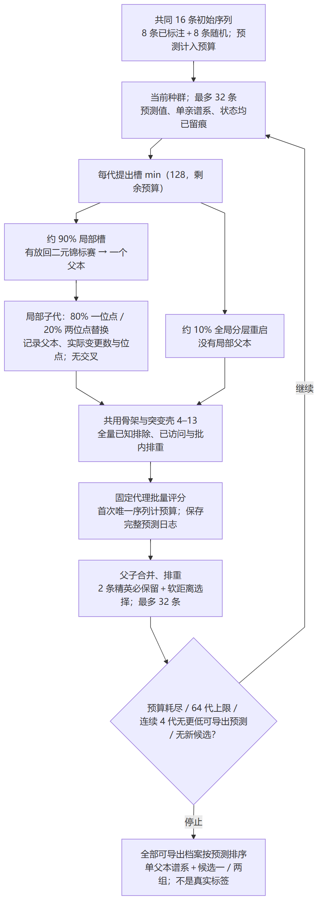

[打开矢量图](figures/GBSA总汇报_20261005/06_无交叉遗传算法.svg)

展开可编辑的 Mermaid 图源

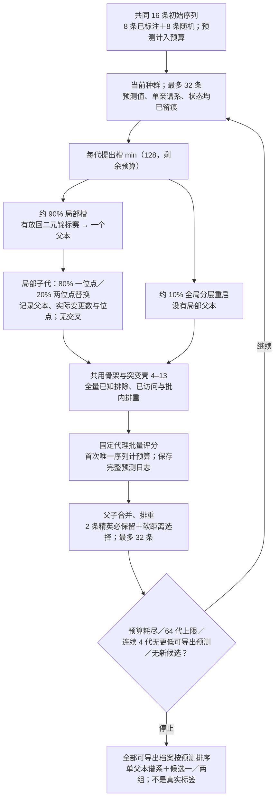
```mermaid
flowchart TB
    accTitle: 已实现的单亲变异遗传算法
    accDescr: 共同十六条起点评分后形成种群。每代局部子代由二人锦标赛选择一个父本，以一或两位点变异产生；少量全局重启没有父本。过滤后调用固定评分器，父子合并保留两个精英并兼顾多样性。预算、代数或停滞停止后输出完整谱系和一或两组候选。
    init["共同 16 条初始序列<br/>8 条已标注＋8 条随机；预测计入预算"]
    population["当前种群；最多 32 条<br/>预测值、单亲谱系、状态均已留痕"]
    slots["每代提出槽 min（128，剩余预算）"]
    select["约 90% 局部槽<br/>有放回二元锦标赛 → 一个父本"]
    mutate["局部子代：80% 一位点／20% 两位点替换<br/>记录父本、实际变更数与位点；无交叉"]
    restart["约 10% 全局分层重启<br/>没有局部父本"]
    valid["共用骨架与突变壳 4–13<br/>全量已知排除、已访问与批内排重"]
    scorer["固定代理批量评分<br/>首次唯一序列计预算；保存完整预测日志"]
    survive["父子合并、排重<br/>2 条精英必保留＋软距离选择；最多 32 条"]
    stop{"预算耗尽／64 代上限／<br/>连续 4 代无更低可导出预测／无新候选？"}
    output["全部可导出档案按预测排序<br/>单父本谱系＋候选一／两组；不是真实标签"]
    init --> population --> slots
    slots --> select --> mutate --> valid
    slots --> restart --> valid
    valid --> scorer --> survive --> stop
    stop -->|"继续"| population
    stop -->|"停止"| output
```

机制测试已覆盖单亲归属、实际突变位置、预算、精英不退化、停滞停止及中断恢复。另用明确人工标签验收 GA 候选的未来文件流程，包含全部成功、成功失败混合、钉定测试协议后返回并完成重训。人工分数只是接口测试；没有计算任何新序列真实 GBSA，也没有修改旧 96 条批次。[GA 契约测试](../../../tests/test_mutation_ga_contract.py)、[GA 未来接口模拟验收](../../../tests/test_ga_future_integration.py)。

### 4.8 计算证据：历史三策略与本轮四策略分开看

#### 4.8.1 先识别两种“随机种子”与两种“次数”

**计算随机种子**是让训练抽样、模型训练和搜索随机过程可复现的编号；**初始序列/父本**是被突变的 RNA。30 个随机种子不是 30 条起始 RNA，不是 30 次新 GBSA 测量。每个随机种子下当前有 16 条共同初始序列，三种策略各执行一次，形成 90 个子运行。

**预测上限**是最多允许评分多少条唯一序列；**实际预测数**是这次真的完成多少条。两种方法都有 8192 的上限，不代表都实际用了 8192，更不代表其候选生成工作量相等。比较应以实际数为横轴，还应保存每条评分的先后顺序，才能核查截断结果。

#### 4.8.2 先前的三策略开发比较（历史版本）

最新开发比较使用 **30 个随机种子，301–330**；每个种子取 300 条已有训练记录，训练五成员的代理，训练内筛选 100 个特征；同一随机种子下的三法使用同一训练数据、模型快照、起点序列及顺序、13 位点约束和禁止集合。当前运行记录的模型后端是**本地 scikit-learn 梯度提升实现**，模型标识含 `xgb_boot5_sklearn_gbm`；不能只因配置请求 `xgb` 就称实际运行采用了服务器的 XGBoost。XGBoost 是 extreme gradient boosting，极端梯度提升的软件实现；scikit-learn 是 Python 的机器学习工具库。[比较配置](../../../configs/experiments/search_compare_matched_30seed.json)、[证据与后端说明](../../../evidence/search_compare_matched_30seed/README.md)。

每法预测上限为 1024。对每个随机种子，把三法的评分档案按记录顺序截断到共同实际值：

\[
N_j=\min(N_{j,\rm 随机},N_{j,\rm 爬山},N_{j,\rm 束搜索})。
\]

\(j\) 是随机种子编号；\(N\) 是唯一预测条数。当前共同值范围为 **1021–1024，中位数 1024**。只在各法前 \(N_j\) 条有效评分中找最低可导出预测值。初始已测父本也消耗预测预算，但不进入“新候选最佳值”的导出比较。[对齐逐种子数据](../../../evidence/search_compare_matched_30seed/aligned_runs.csv)。

| 对齐后的指标 | 同起点随机游走 | 多起点爬山 | 多起点束搜索 |
| --- | ---: | ---: | ---: |
| 平均最低**代理预测** GBSA，越低越好 | 8.4764 | 4.7696 | 7.1431 |
| 相对随机游走的平均配对差 | — | −3.7068 | −1.3334 |
| 差值的 95% 配对置信区间 | — | [−4.3917, −3.0110] | [−1.7765, −0.9080] |
| 相对随机游走：胜／平／负种子数 | — | 29／1／0 | 26／1／3 |

束搜索相对爬山的平均差为 **+2.3734**，95% 区间 **[+1.8404, +2.8776]**；此处正值表示束搜索的最低预测值更高。结果支持“这个本地代理、这个预测预算、这个参数组合下，爬山把代理预测值压得更低”。**没有新序列真实 GBSA，不能宣布爬山真实优于束搜索，不能用这份旧包判断本次新增 GA。**置信区间对随机种子配对差重采样，种子间训练集重叠，因此它描述本计算设置的重复性，不是生物学成功概率。[完整汇总](../../../evidence/search_compare_matched_30seed/summary.json)、[90 子运行完整性](../../../evidence/search_compare_matched_30seed/completeness.json)。

#### 4.8.3 多样性与训练距离：不同指标不能混用

下面是同一证据包的**各法完整运行**中预测前 50 条的描述性统计，不是重新按共同预测前缀截断后的主判据。它们用来解释权衡；如果将来把多样性定为正式判据，应在共同前缀上重算。

| 完整运行的前 50 条指标 | 随机游走 | 爬山 | 束搜索 |
| --- | ---: | ---: | ---: |
| 候选两两可变位点汉明距离的均值 | 7.1657 | 4.2949 | 6.0038 |
| 候选到最近训练序列距离的均值 | 2.0333 | 4.1993 | 2.1187 |
| 被当前规则标为分布外的比例 | 0.008667 | 0 | 0.001333 |

**汉明距离（Hamming distance）**是两个等长序列在可变位置上不同的位点数；不是结构距离，也不是进化谱系距离。第一行较高说明候选彼此差异较大；第二行较高说明离现有训练序列更远。爬山在这一设置下候选更集中、离训练序列更远，尽管二值分布外比例为 0；**零分布外标记不等于零风险，也不等于离训练数据最近。**

当前分布外规则由搜索开始前的已测训练集确定：相对野生型突变数超出训练最小/最大范围，或者到最近训练序列的距离大于训练样本“各自到其他训练样本最近距离”的第 95 百分位，就标记。这个规则不能用本轮未测候选更新，否则搜索越远，边界反而被自身扩大。它没有覆盖三维结构、模型系统误差和罕见组合效应。[风险标记实现](../../../scripts/loop/search.py)。

#### 4.8.4 历史比较与不确定度证据的正确位置

| 历史证据 | 实际数值或事实 | 可以怎样使用 |
| --- | --- | --- |
| 旧 8192 上限搜索，30 个随机种子 201–230 | 随机、爬山、束搜索平均实际预测数约 8192、4143、4769；最低预测均值约 10.8467、6.0232、6.0698 | 保留作诊断；起点、实际预测数未匹配，不能判定公平优胜 |
| 旧设置下换训练随机种子的前 50 条稳定性，10 个种子 | Jaccard 均值约：随机 0.242、爬山 0.029、束搜索 0.037 | 说明名单对模型变化敏感；是交集/并集的比，不是“只有 3% 相同”，不能证明误差原因 |
| 最新同起点比较 | `skip_cross_model=true`，重新训练一致性种子数为 0 | 最新包未完成跨模型/重训稳定性；不能宣称旧稳定性数值已在新条件复现 |
| 五成员不确定度筛查，30 个随机种子 301–330 | 1600 条训练时 σ 与绝对误差的排序相关 0.0281，95% 区间 [0.0100, 0.0450]；400 条训练时约 0.014，区间跨 0 | σ 只有弱或未确认的误差排序能力，不宜当作可靠置信区间 |
| 下置信界筛查 | 1600 条训练、系数 2 时，最佳 10% 召回相对只用均值低约 0.0458，区间 [−0.0642, −0.0275] | 不能因为模型能输出 σ，就自动启用复杂不确定度选样 |

Jaccard 是两个候选集合交集大小除以并集大小。σ 在该运行中只是五成员预测的离散程度，标识为 `ensemble_spread_uncalibrated`，即**未经误差校准的集成分歧**。下置信界（lower confidence bound，LCB）在最小化中用“均值 − 系数 × σ”偏向预测低或分歧大的候选；系数不是误差校准的替代品。期望改进（expected improvement，EI）和汤普森采样（Thompson sampling）也需要可信的预测分布/概率解释；它们目前没有被选为本项目正式策略。[旧比较勘误](../../../evidence/search_compare_30seed/README.md)、[不确定度筛查](../../../evidence/sigma_calibration_30seed/README.md)、[原始汇总](../../../evidence/sigma_calibration_30seed/summary.json)。

#### 4.8.5 本轮四策略：30 个开发种子与 100 个确认种子

本轮已完成冻结套件：**401–430 开发种子，2001–2100 确认种子**。每种子随机取 300 条训练，余下 1700 条仅评价代理；全部 2000 条从可导出新序列中排除。四法共同使用 8 条已标注与 8 条随机起点，同一代理只拟合一次，再独立运行各策略的预算缓存。算法不访问留出 GBSA 标签。两个固定评分器为五成员自举梯度提升与 300 树随机森林，都是仅序列特征的诊断回归模型；本机梯度提升实际为 scikit-learn 回退后端，随机森林也不是历史 0.365 的突变特征发布基准。

主确认预算为 **1024 次唯一序列预测上限**，最大 64 代；GA 连续 4 代无改善停止，束搜索 2 代。早停会使实际次数少于上限。每种子每代理取四法实际次数的最小值，分别截取有序评分日志，然后计算**所有**下列最优值、多样性和距离指标；没有补齐早停预算，也没有给 GA 免费新增初始个体。不同代理各自有不同预测地形，不能比较两个代理的原始极小值来推断能量准确度。

完整开发包为 **1140 子运行**：720 个主搜索、240 个改变模型种子的重训搜索、180 个有限 GA 消融；确认包为 **800 子运行**。额外的留出预测和候选重评分用于诊断，未给任何算法增加搜索反馈或搜索预算。初始化、模型指纹、子运行完整性与实际档案均已审计。这里的 30/100 是计算机随机种子数，训练集合共享原始 2000 条数据，不能视为独立生物学实验重复。

**表 A：100 种子确认的共同实际次数截面。最小预测仍不是新序列真实 GBSA。**

| 代理 | 算法 | 最低预测均值 | 前50条两两位点距离 | 前50条距最近训练序列 | 前50条分布外比例 |
| --- | --- | --- | --- | --- | --- |
| 随机森林 | 同起点随机游走 | 17.7238 | 6.819 | 1.993 | 0.22% |
| 随机森林 | 多路径束搜索 | 17.3689 | 5.343 | 2.048 | 0.08% |
| 随机森林 | 多起点爬山 | 16.9828 | 3.971 | 3.897 | 0.16% |
| 随机森林 | 无交叉遗传算法 | 17.0196 | 4.325 | 3.544 | 0.12% |
| 五成员梯度提升 | 同起点随机游走 | 9.0265 | 7.374 | 2.006 | 0.42% |
| 五成员梯度提升 | 多路径束搜索 | 7.5387 | 6.172 | 2.107 | 0.66% |
| 五成员梯度提升 | 多起点爬山 | 5.2212 | 4.484 | 4.218 | 0.86% |
| 五成员梯度提升 | 无交叉遗传算法 | 5.5674 | 4.816 | 3.920 | 0.96% |

- 随机森林的共同实际预测次数：最小 581、中位 1023、最大 1024。
- 五成员梯度提升的共同实际预测次数：最小 590、中位 1024、最大 1024。

**表 B：逐种子配对差。差值为左侧算法减对照，负值代表预测更低。**

| 代理 | 比较 | 平均差 | 95%配对区间 | 中位差 | 胜/平/负 |
| --- | --- | --- | --- | --- | --- |
| 随机森林 | 多起点爬山 − 同起点随机游走 | -0.7410 | [-0.8533, -0.6299] | -0.6509 | 92/2/6 |
| 随机森林 | 多路径束搜索 − 同起点随机游走 | -0.3549 | [-0.4404, -0.2712] | -0.2857 | 84/9/7 |
| 随机森林 | 无交叉遗传算法 − 同起点随机游走 | -0.7041 | [-0.7954, -0.6149] | -0.5931 | 95/2/3 |
| 随机森林 | 无交叉遗传算法 − 多起点爬山 | +0.0369 | [-0.0272, +0.0945] | +0.0351 | 26/17/57 |
| 随机森林 | 无交叉遗传算法 − 多路径束搜索 | -0.3492 | [-0.4217, -0.2815] | -0.2922 | 82/12/6 |
| 五成员梯度提升 | 多起点爬山 − 同起点随机游走 | -3.8054 | [-4.2358, -3.3705] | -3.8010 | 98/0/2 |
| 五成员梯度提升 | 多路径束搜索 − 同起点随机游走 | -1.4878 | [-1.7229, -1.2586] | -1.3116 | 91/4/5 |
| 五成员梯度提升 | 无交叉遗传算法 − 同起点随机游走 | -3.4592 | [-3.8097, -3.1194] | -3.3770 | 98/2/0 |
| 五成员梯度提升 | 无交叉遗传算法 − 多起点爬山 | +0.3462 | [+0.0468, +0.6345] | +0.2556 | 22/15/63 |
| 五成员梯度提升 | 无交叉遗传算法 − 多路径束搜索 | -1.9713 | [-2.2478, -1.6995] | -1.7258 | 94/6/0 |

**怎样读这张表**：无交叉 GA 相对随机游走的优势在两代理上复现：随机森林平均差 −0.7041，95% 区间 [−0.7954,−0.6149]，95 胜/2 平/3 负；梯度提升平均差 −3.4592，[−3.8097,−3.1194]，98 胜/2 平/0 负。但 GA 相对爬山，随机森林为 +0.0369，[−0.0272,+0.0945]，不能判断稳定差异；梯度提升为 +0.3462，[+0.0468,+0.6345]，此配置下爬山找到更低预测。GA 相对束搜索的预测值在两代理均更低，前50条多样性也更小。由此可保留爬山为简洁基线，GA 为种群备选，而非按名称直接升级 GA 为唯一方案。

胜/平/负按差值小于 −10⁻¹⁰、绝对值不超过10⁻¹⁰、大于10⁻¹⁰划分，避免机器舍入形成假胜负；搜索接受改善仍按严格下降。区间为对配对种子差值进行 10000 次自举（bootstrap，重复有放回抽样）的逐项区间，没有进行多重比较校正。GA 对随机游走是主要比较，其余为补充。统计确认只确认此冻结代理与算法组合的计算行为，不能升级为真实能量改善。

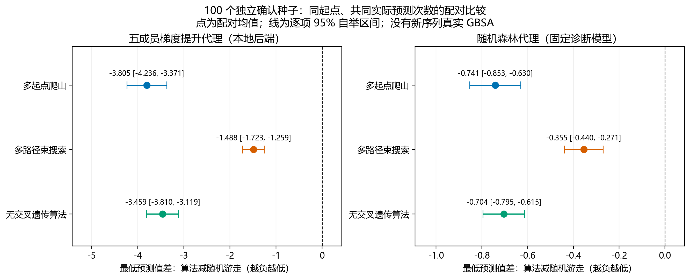

[矢量图](figures/GBSA总汇报_20261005/09_四算法确认配对结果.svg)

#### 4.8.6 增加预测预算是否值得：开发阶段敏感性

下表来自同一组 30 个开发种子，不是 100 种子的高预算确认。梯度提升代理在较高预算共同截面下GA的均值可略低于爬山，而随机森林仍是爬山更低；这说明取舍依赖代理与停止条件，不能把1024确认结果推成任何预算的统一优胜。各预算重新运行；批量提出规则和随机数消耗受预算影响，因此曲线不是同一条轨迹简单延长。共同实际次数由包括 GA 在内的四法最短日志确定；上限提高后不保证四法共同次数同步提高，更不保证均值单调下降。

| 代理 | 次数上限 | 共同实际次数：最小/中位/最大 | 同起点随机游走 | 多起点爬山 | 多路径束搜索 | 无交叉遗传算法 |
| --- | --- | --- | --- | --- | --- | --- |
| 随机森林 | 1024 | 591/1023/1024 | 17.7483 | 17.0118 | 17.3708 | 17.0829 |
| 随机森林 | 4096 | 591/1217.5/2277 | 17.7483 | 16.9912 | 17.2688 | 17.0225 |
| 随机森林 | 8192 | 591/1217.5/2277 | 17.7483 | 16.9912 | 17.2688 | 17.0225 |
| 五成员梯度提升 | 1024 | 603/1024/1024 | 8.7731 | 5.2902 | 7.4337 | 5.5823 |
| 五成员梯度提升 | 4096 | 603/1309/2684 | 8.7073 | 5.0282 | 6.6250 | 4.9254 |
| 五成员梯度提升 | 8192 | 603/1309/2684 | 8.7073 | 5.0282 | 6.6250 | 4.9254 |

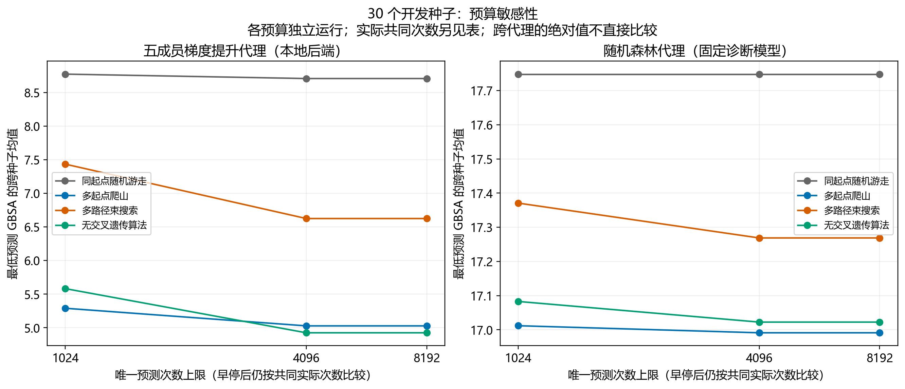

[矢量图](figures/GBSA总汇报_20261005/10_搜索预算敏感性.svg)

**实际用量与耗时另列。**下表是主搜索完整运行的实际次数均值及搜索墙钟时间均值，不是表 A/B 的共同截面；搜索耗时包括提出、评分、风险标记、检查点和分组，排除训练。两进程并行，结果反映本机与本实现，不能代替真实对接/GBSA 成本。逐候选时间是批次时间副本，不相加；评分器另累计预测调用时间。恢复运行的局部耗时不应与首次完整执行混合；本轮正式统计均为完整首次执行。

| 代理 | 上限 | 算法 | 实际预测次数均值 | 搜索时间/秒 | 其中模型预测/秒 |
| --- | --- | --- | --- | --- | --- |
| 随机森林 | 1024 | 同起点随机游走 | 1024.0 | 1.45 | 0.76 |
| 随机森林 | 1024 | 多路径束搜索 | 1023.4 | 1.13 | 0.60 |
| 随机森林 | 1024 | 多起点爬山 | 1024.0 | 1.82 | 1.28 |
| 随机森林 | 1024 | 无交叉遗传算法 | 968.0 | 2.17 | 0.74 |
| 随机森林 | 4096 | 同起点随机游走 | 4096.0 | 7.11 | 2.83 |
| 随机森林 | 4096 | 多路径束搜索 | 3940.8 | 3.76 | 1.97 |
| 随机森林 | 4096 | 多起点爬山 | 2589.7 | 5.03 | 3.19 |
| 随机森林 | 4096 | 无交叉遗传算法 | 1298.2 | 2.86 | 0.93 |
| 随机森林 | 8192 | 同起点随机游走 | 8192.0 | 18.98 | 5.61 |
| 随机森林 | 8192 | 多路径束搜索 | 5398.3 | 5.09 | 2.65 |
| 随机森林 | 8192 | 多起点爬山 | 2589.7 | 4.95 | 3.16 |
| 随机森林 | 8192 | 无交叉遗传算法 | 1298.2 | 2.88 | 0.94 |
| 五成员梯度提升 | 1024 | 同起点随机游走 | 1024.0 | 1.10 | 0.47 |
| 五成员梯度提升 | 1024 | 多路径束搜索 | 1023.6 | 0.99 | 0.47 |
| 五成员梯度提升 | 1024 | 多起点爬山 | 1024.0 | 1.01 | 0.49 |
| 五成员梯度提升 | 1024 | 无交叉遗传算法 | 977.5 | 1.90 | 0.46 |
| 五成员梯度提升 | 4096 | 同起点随机游走 | 4096.0 | 5.94 | 1.89 |
| 五成员梯度提升 | 4096 | 多路径束搜索 | 3936.7 | 3.67 | 1.82 |
| 五成员梯度提升 | 4096 | 多起点爬山 | 2663.9 | 3.14 | 1.27 |
| 五成员梯度提升 | 4096 | 无交叉遗传算法 | 1453.5 | 2.87 | 0.68 |
| 五成员梯度提升 | 8192 | 同起点随机游走 | 8192.0 | 16.57 | 3.81 |
| 五成员梯度提升 | 8192 | 多路径束搜索 | 5445.1 | 4.95 | 2.45 |
| 五成员梯度提升 | 8192 | 多起点爬山 | 2663.9 | 3.22 | 1.29 |
| 五成员梯度提升 | 8192 | 无交叉遗传算法 | 1453.5 | 2.88 | 0.68 |

#### 4.8.7 换模型是否还会选同一批：排序与名单分开看

稳定性只在开发种子、1024 上限下评估。名单诊断使用各次搜索停止后的完整前50条，不按重训两次的共同次数再截断，因此反映模型变化及其引起的搜索/早停变化的合成敏感性；不宣称已单独隔离所有影响。训练集合固定，把同类模型的随机种子加 1000 重新拟合，并用同一搜索随机种子重新运行。前 50 条集合的 Jaccard 是交集除以并集；另外将原方法选出的 50 条在重训模型和另一类代理上重新评分，计算斯皮尔曼排序相关。后者是在已被原代理筛选的窄分数范围内比较，不等于整个序列空间上的模型一致度或准确率。未定义相关（如全相同预测）不赋成 0，另列有效种子数。

| 代理 | 算法 | 同类重训排序相关 | 另一代理排序相关 | 重训名单交集/并集 |
| --- | --- | --- | --- | --- |
| 随机森林 | 同起点随机游走 | 0.6769（30/30） | 0.3008（30/30） | 0.6309（30/30） |
| 随机森林 | 多路径束搜索 | 0.5390（30/30） | 0.2441（30/30） | 0.1845（30/30） |
| 随机森林 | 多起点爬山 | 0.4174（30/30） | 0.1626（30/30） | 0.0514（30/30） |
| 随机森林 | 无交叉遗传算法 | 0.4352（30/30） | 0.2015（30/30） | 0.0545（30/30） |
| 五成员梯度提升 | 同起点随机游走 | 0.2668（30/30） | 0.2501（30/30） | 0.2586（30/30） |
| 五成员梯度提升 | 多路径束搜索 | 0.2547（30/30） | 0.2581（30/30） | 0.0471（30/30） |
| 五成员梯度提升 | 多起点爬山 | 0.1732（30/30） | 0.0674（30/30） | 0.0166（30/30） |
| 五成员梯度提升 | 无交叉遗传算法 | 0.1903（30/30） | 0.1252（30/30） | 0.0033（30/30） |

GA 的重训名单 Jaccard 均值约为随机森林 0.0545、梯度提升 0.0033；这是**交集/并集的比值**，不能把 0.0033 写成每次共有 0.33% 的 50 条。梯度提升 GA 的窄范围重训排序相关约 0.1903、换另一代理约 0.1252，说明低预测名单并不稳定。随机游走名单重叠较高部分来自其路径不依赖评分反馈，不表示它的真实候选质量更好。种群搜索没有消除当前代理瓶颈。

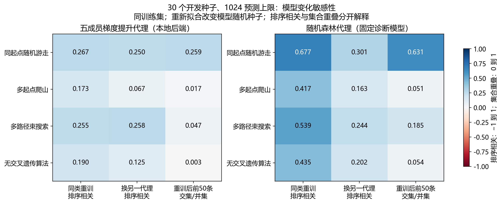

[矢量图](figures/GBSA总汇报_20261005/11_跨代理与重训稳定性.svg)

#### 4.8.8 GA 三项预定义消融：不据结果继续调参

三个消融只改变一项：父本锦标赛人数为 1、为 4，或局部子代全部用一位点变异。**1 人锦标赛只把父本选择改成随机，生存选择仍保留精英与预测优选，不能当成完全无反馈随机游走。**各消融与默认 GA 按共同实际次数截面比较，负差表示消融预测更低。全部结果同时报告，默认参数仍维持启动前冻结版本；不根据确认结果再找更好的参数。

| 代理 | 只改变的组件 | 相对默认GA平均差 | 95%配对区间 | 胜/平/负 |
| --- | --- | --- | --- | --- |
| 随机森林 | 1 人锦标赛（随机选父本） | +0.1055 | [+0.0386, +0.1769] | 8/1/21 |
| 随机森林 | 4 人锦标赛 | -0.0516 | [-0.1178, +0.0214] | 17/10/3 |
| 随机森林 | 只做一位点局部变异 | -0.0213 | [-0.0687, +0.0246] | 14/5/11 |
| 五成员梯度提升 | 1 人锦标赛（随机选父本） | +0.8783 | [+0.4817, +1.3170] | 2/4/24 |
| 五成员梯度提升 | 4 人锦标赛 | -0.4879 | [-1.0519, +0.0529] | 16/7/7 |
| 五成员梯度提升 | 只做一位点局部变异 | +0.0186 | [-0.3863, +0.4343] | 14/4/12 |

#### 4.8.9 本轮评分器的能力与工程复核

算法比较使用 300 条训练的固定诊断代理；这与历史发布模型的训练规模及实现不同。下表是 100 确认种子上、各自剩余 1700 条的排序诊断，标签仅在诊断时读取，未用于搜索或参数选择。

| 固定诊断评分器 | 留出排序相关均值 | 95%跨种子区间 | 训练耗时均值/秒 |
| --- | --- | --- | --- |
| 随机森林 | 0.2442 | [0.2378, 0.2504] | 0.54 |
| 五成员梯度提升 | 0.2329 | [0.2256, 0.2401] | 1.68 |

本轮用单亲人工地形和实际拟合代理验证输入顺序、最小化方向、合法骨架、排重、预算、恢复及分组。独立产物审计进一步逐条核对每个子代的直接父本、变异位点、预测缓存和文件摘要。开发与确认原始记录分开保存，完整性均要求计划子运行全部完成。

开发运行之后、独立确认之前，补全了恢复元信息的实际落盘与严格比对，以及旧静态池指纹对新增非生效搜索参数的兼容。这些补强未改变评分模型、算法选择/变异决策或冻结参数；开发包保存修补前源码快照，确认包保存修补后源码与环境。旧档案未改写，不能拿新代码强行覆盖旧快照续跑。[冻结记录](../../项目记录/无交叉遗传算法与搜索比较冻结方案_20261005.md)、[开发汇总](../../../evidence/search_suite_20261005/development/summary.json)、[确认汇总](../../../evidence/search_suite_20261005/confirmation/summary.json)、[原始与审计文件索引](../../../evidence/search_suite_20261005/README.md)。

### 4.9 谱系、档案与“一组或两组”的严格含义

#### 4.9.1 每条候选的最小交接信息

| 信息类 | 必须保留的内容 | 能回答的问题 |
| --- | --- | --- |
| 身份 | 候选编号与完整规范化序列；数据与约束版本 | 是否同一条序列？是否改动了固定骨架？ |
| 直接谱系 | 直接父本编号、父本证据状态、算子、相对父本改动位置与数目 | 这一步到底从哪条序列来？父本有没有真实 GBSA？ |
| 累计变化 | 相对野生型突变数；搜索编号、轮次与代数 | 走了几步？离参考序列有多远？ |
| 预测来源 | 预测GBSA、可选σ及其含义、模型与特征版本；纯排序分数须另声明合同 | 这个数是谁预测的？是否能解释成能量？ |
| 风险与分组 | 到最近训练序列距离、分布外标记、组编号、代表候选与规则 | 是否在稀疏区？为什么归入这一组？ |
| 执行记录 | 随机种子、评分顺序、唯一预测计数、停止原因、文件指纹 | 比较是否公平？能否恢复与复核？ |

父本证据字段的主要状态有“已有真实计算标签”“仅有预测”“无父本”三种。子代由已测父本产生，**子代自身仍只有预测**；第二代以后的直接父本若未获得真实 GBSA，应标为仅预测，而不是沿用祖先标签。2026-10-05 本次扩写核查发现爬山/束搜索曾沿用祖先标记，已修为按直接父本判断，并增加多代回归测试。该字段不参与选择、打分或计数，保存的历史数值比较不因此重算；**旧运行档案保留原始证据，涉及这一字段时应按直接父本记录核对，不能把旧包称为已重新生成的无误谱系**。[修正代码](../../../scripts/loop/search_policies.py)、[多代谱系测试](../../../tests/test_search_contract.py)。

还有一个现有格式约定：算子为 `seed`（初始序列）时，直接父本为空，`parent_evidence` 被复用来标记**起点本身**是否已测，以排除已测起点再次导出；它不是在声称存在一个已测父本。突变子代才按直接父本解释此字段；全局重启则为空父本、`none`（无父本）。下一版宜为起点新增独立的来源字段，减少这种语义复用。

当前档案保存所有**已评分**候选，包括未保留为下一代的子代；对评分前被拒绝的提案，当前主要保存分类计数，不保证每个被拒绝序列都有逐行记录。因此“每个提案都逐条留痕”仍是可增加的审计功能，不能写成已经实现。

| 文件 | 作用 | 恢复时的意义 |
| --- | --- | --- |
| `search_snapshot.json` | 固定数据、模型、策略参数、源码与约束快照 | 不匹配时拒绝把两个不同实验接成一次 |
| `predictions.jsonl` | 同模型的序列预测缓存；JSONL 指每行一个结构化记录 | 恢复计数和预测，避免重复收费 |
| `search_evaluated.jsonl` | 全部有效评分及候选谱系 | 复查评分顺序、前缀比较与被淘汰子代 |
| `search_state.json` | 当前父本、最优候选、随机发生器和提交行数 | 从已提交边界恢复，而不是从头随机走 |
| `search_candidates.csv` | 最终可导出候选排序；CSV 是逗号分隔表格 | 不包含被误当新候选的已测起点 |
| `search_generations.csv` | 逐代提出、拒绝、评分和改善摘要 | 看早停与实际预算，不只看最终最低值 |
| `search_groups.json` | 所有可导出候选的一/二组成员与规则 | 组身份能够传到未来交接清单 |
| `search_summary.json`、`files.sha256` | 执行摘要及文件内容指纹 | 验证包是否完整、内容是否变动 |

写入顺序为缓存、评分日志、状态；状态保存已提交的行数，中断恢复时回到该边界。源码也进入搜索快照指纹；本次修正之后不能靠修改历史快照来继续旧搜索，应该建立新运行。时间字段随执行变化，不能要求真实时间戳逐位相同；候选、随机状态与评分路径的一致性才是恢复检查对象。[档案实现](../../../scripts/loop/search_archive.py)。

#### 4.9.2 两组怎样划，为什么不能称为两个真实最优盆地

当前方法是按预测排名选代表，而不是正式的结构聚类：

1. 第一代表取可导出候选中预测最优者。
2. 在预测排名前 50 条内，取第一条与第一代表至少差 **3 个可变位点**的候选，作为第二代表。
3. 如果不存在第二代表，只输出一组；不得为了得到“两组”而随意补一个很差候选。
4. 对**所有**可导出候选，按距哪个代表更近归组；相同距离归第一组。前 50 只限制寻找第二代表的范围，不限制其他候选的组归属。
5. 保存每组代表、成员和距离摘要，未来若生成交接清单，继续保留组身份；当前分组本身不会提出计算申请。

3 位点差异是工程阈值，没有证明它意味着结构不同、不同结合方式或真实 GBSA 的两个极小盆地。两组内部也不保证任意成员彼此都近；束搜索的软差异规则与最终代表分组是两个不同步骤。若生工团队希望按二级结构或相互作用模式分组，需另行定义距离、数据可用性和验收，不应该把现在的位点距离换个名字解释成结构。[分组实现](../../../scripts/loop/search_policies.py)。

#### 4.9.3 本轮真实运行出的两组示例（均只有预测）

单次无交叉GA示例种子5001，300条训练，916次唯一预测，908条可导出候选，8代后连续4代没有更低档案预测而停止。两组完整归属已验收；这个示例不计入100种子比较，也不提交计算申请。

| 组角色 | 代表编号 | 组内候选数 | 代表预测GBSA | 相对参考序列突变数 | 距最近训练序列 |
| --- | --- | --- | --- | --- | --- |
| 预测最优组 | `de9c8bdd48be655b` | 597 | 6.150741 | 10 | 4 |
| 多样备选组 | `9e000d666fd2132c` | 311 | 7.056277 | 10 | 5 |

[两组代表及完整序列CSV](../../../evidence/search_suite_20261005/demo/group_prototypes.csv)、[前20条预测示例](../../../evidence/search_suite_20261005/demo/search_candidates_top20.csv)、[全908条候选的本地文件](../../../runs/local_mutation_only_ga_demo_20261005/checkpoints/search_candidates.csv)。组角色只是算法标签，代表没有真实GBSA。

### 4.10 算法依据：文献与本项目证据怎样对应

| 研究与原论文 | 论文实际研究对象/方法 | 支持的设计点 | 不可外推的结论 |
| --- | --- | --- | --- |
| [Bashir 等，2021](https://doi.org/10.1038/s41467-021-22555-9) | DNA 适配体的模型引导突变与实验亲和力评价；方法部分描述每轮评分 10,000 个随机突变、保留前 200 作下一轮父本、重复五轮 | 将评分器与突变搜索分开；多起点及随机游走对照；生成候选后独立验证 | 不是当前 RNA、不是 GBSA；其预算及实验收益不能当本项目参数最优依据 |
| [Espah Borujeni 等，2016](https://doi.org/10.1093/nar/gkv1289) | RNA 核糖开关设计，遗传算法包含随机突变、物理模型预测、选择与重组 | GA 可用于 RNA 离散组合设计；需要明确种群和变异流程 | 优化调控与开关相关量；未证明 13 位点 GBSA 重组收益 |
| [Rotrattanadumrong 与 Yokobayashi，2022](https://doi.org/10.1038/s41467-022-32538-z) | RNA 核酶中性网络，进化过程包含选择、突变及重组，并用实验活性与模型研究组合地形 | 上位性和组合变异应实际检验；本项目使用单亲突变，不引入论文中的重组 | 核酶活性不同于适配体 GBSA；中性路径是否存在不能直接移植 |
| [Freitag 与 Al-Onaizan，2017](https://aclanthology.org/W17-3207/) | 神经机器翻译的束搜索策略 | 束宽与多路径保留的算法概念；运行效率与搜索质量的权衡 | 文本解码与完整 RNA 突变不同；没有 RNA/GBSA 收益证明 |
| [Iwano 等，2022](https://doi.org/10.1038/s43588-022-00249-6) | RaptGen 生成式适配体方法 | 更复杂生成模型可以作为未来候选提出器 | 需要专门训练及数据，现阶段无需先实现它才能接通搜索接口 |

论文的价值是帮助选取可检验机制，当前参数和方法是否适合本项目仍需本数据证据。期刊与指定 JCR 类别见 §10；会议论文不适用期刊分区。现在没有论文或本项目结果能够替代“新候选真实 GBSA 的对照”。

### 4.11 未来测量接口：先预留边界，启动要有新的明确决策

九月的“贪心选样与随机选样”比较是另一项任务：在给定静态池里挑下一批，回顾已有标签。100 个预注册随机种子下，贪心平均配对遗憾值改善约 1.878，胜/平/负为 50/37/13；这里的遗憾值只在该全标签池中可知。它支持那个固定池设置的选样结论，**不证明多代爬山、束搜索或 GA 胜出，也不表示当前已选择主动学习**。[预注册结果](../../项目记录/发布候选预注册_100seed_20260930.md)。

#### 4.11.1 候选提案、真实计算与主动学习分开

**搜索完成**表示固定模型下算法已停止并输出预测候选；**真实计算完成**表示候选经过另行确定的计算协议与质量控制，获得真实 GBSA；**主动学习**是利用这些标签更新模型并主动决定下一批应获取哪些标签。三者可以衔接，也可以只做前两项，不能因软件支持回填就宣称已确定采用主动学习。

代码中的 Oracle 指**标签提供器**：它可以是回顾式已有表，也可以是未来外部计算流程。前者读取已有标签，后者等待新标签；均不应由搜索策略自身制造“真实值”。主线 Oracle 返回独立 GBSA，不返回未经验证的复合 `label`。[标签接口](../../../scripts/loop/interface.py)、[闭环实现](../../../scripts/loop/loop.py)。

**图 7：未来真实 GBSA 的决策流程。**标签文件和自动闭环路径已有接口；“只评价、不更新”是将来可以选择的独立评价路线，不是当前驱动已有的免重训开关。当前 `loop.py` 的批次闭合回填会执行末次重训，`--no-post-retrain-eval` 仅跳过留出打分。若未来只比较算法效果，应独立评价结果，不调用这个自动回填重训路径。主动学习仍未确定；历史96条不自动进入新对照。

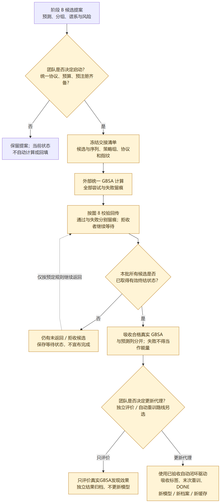

[打开矢量图](figures/GBSA总汇报_20261005/07_未来真实GBSA条件流程.svg)

展开可编辑的 Mermaid 图源

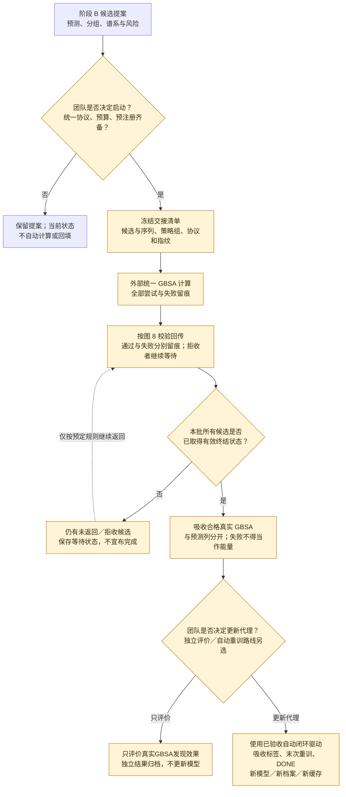
```mermaid
flowchart TB
    accTitle: 未启动的未来真实 GBSA 验证及模型更新边界
    accDescr: 候选提案等待团队决定、协议、预算与预注册。启动后外部计算与质控返回真实标签。独立评价可不更新模型；若选择现有自动闭环驱动，则吸收标签并强制末次重训。两路线均未启动。
    proposal["阶段 B 候选提案<br/>预测、分组、谱系与风险"]
    gate{"团队是否决定启动？<br/>统一协议、预算、预注册齐备？"}
    parked["保留提案；当前状态<br/>不自动计算或回填"]
    export["冻结交接清单<br/>候选与序列、策略组、协议和指纹"]
    compute["外部统一 GBSA 计算<br/>全部尝试与失败留痕"]
    qc["按图 8 校验回传<br/>通过与失败分别留痕；拒收者继续等待"]
    closed{"本批所有候选是否<br/>已取得有效终结状态？"}
    awaiting["仍有未返回／拒收候选<br/>保存等待状态，不宣布完成"]
    absorb["吸收合格真实 GBSA<br/>与预测列分开；失败不得当作能量"]
    update{"团队是否决定更新代理？<br/>独立评价／自动重训路线另选"}
    review["只评价真实GBSA发现效果<br/>独立结果归档，不更新模型"]
    refit["使用已验收自动闭环驱动<br/>吸收标签、末次重训、DONE<br/>新模型／新档案／新缓存"]
    proposal --> gate
    gate -->|"否"| parked
    gate -->|"是"| export --> compute --> qc --> closed
    closed -->|"否"| awaiting
    closed -->|"是"| absorb --> update
    update -->|"只评价"| review
    update -->|"更新代理"| refit
    awaiting -.->|"仅按预定规则继续返回"| qc
    classDef future fill:#fff4d6,stroke:#b77713,color:#3b2b0b
    class gate,export,compute,qc,closed,awaiting,absorb,update,review,refit future
```

#### 4.11.2 未来清单需要哪些字段

| 字段类 | 要求 | 原因 |
| --- | --- | --- |
| 候选身份 | 批次编号、候选编号、完整序列 | 回填必须核对编号与序列对应，避免错位 |
| 搜索来源 | 方法、随机种子、搜索轮次、组编号、直接父本和变异位点 | 保留方法对照和分组，不把不同来源混成无归属一池 |
| 预测证据 | 模型版本、预测值、预测时训练规模、分布外与训练距离 | 未来才能检查误差与模型偏好的候选 |
| 计算协议 | 实际 GBSA 协议标识；软件/版本、构象准备、力场、溶剂及离子、采样与帧选择、单位、重复和质量控制 | 统一终点；计算条件不一致时不能直接并表 |
| 回传信息 | 实际 GBSA、通过/失败状态、失败原因；必要时返回重复计算与波动信息 | 不把失败当作一个极差能量，不默默删除失败 |
| 成本与执行 | 尝试数量、耗时、硬件、重试和文件指纹 | 同总成本比较算法；追溯计算流程 |

“协议标识”不是随便一个非空字符串的科学意义。它应引用完整、固定版本的计算规范，说明历史标签与新标签是否可比。单位尚未由协议明确时，不应替当前数据擅自标注为 kcal/mol；即使文件都用同一数值单位，不同流程也可能有系统偏差。

已有回填实现要求候选编号与序列一致、协议合规，并保存质量控制失败；完整闭合后吸收合格标签、末次重训，再将运行标记为 `DONE`。尚待标签的运行是 `PARKED`。这套状态约束服务于**已经进入标签流程的运行**；独立阶段 B 搜索自己的完成状态由搜索档案表示，不要求它必须重训或等标签才能结束。[闭环框架](../../论文改进/候选闭环框架_20260930.md)。

**字段实现边界：**现有通过/失败回填文件保存批次编号、候选编号、序列、GBSA、通过/失败状态和协议；详细失败原因、硬件成本、重复计算波动和原始计算证据还需要旁表或接口扩展。上表是未来完整交接要求，不能由它推断这些附加字段已经在回填代码中持久化。[当前回填字段与保存逻辑](../../../scripts/loop/oracle.py)。

**图 8：回传标签的三种处理路径。**身份/协议不符是拒收，不计为计算失败终结；质量控制明确失败且身份有效则持久化失败状态；通过者才有可吸收 GBSA。批次闭合需要所有候选都有有效通过或失败状态，不能只看已经收到几行文件。最终 `DONE` 还需运行轮次结束和末次重训，批次闭合本身不是 `DONE`。

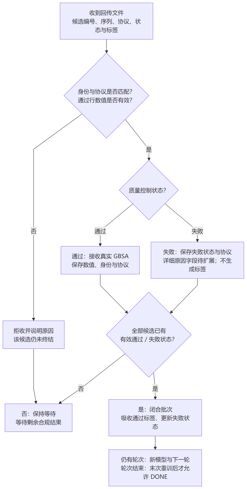

[打开矢量图](figures/GBSA总汇报_20261005/08_回传校验与批次闭合.svg)

展开可编辑的 Mermaid 图源

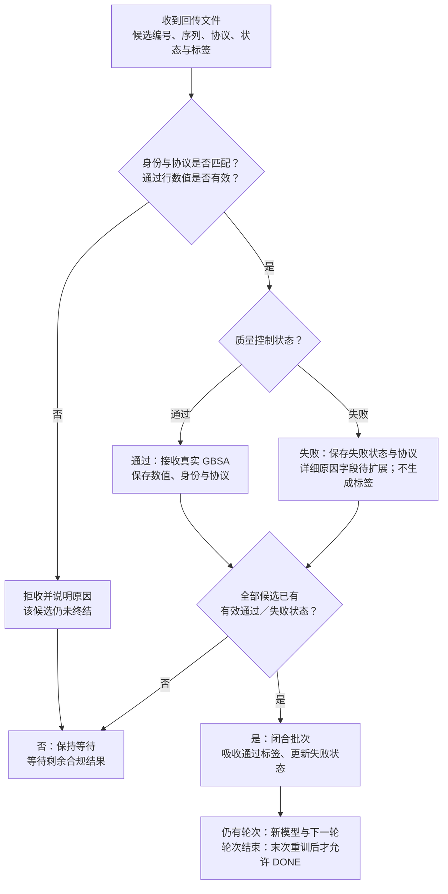
```mermaid
flowchart TB
    accTitle: 未来标签回传的校验与批次状态
    accDescr: 回传先检查候选身份和协议，错误者拒收并继续等待。身份有效的通过行接收 GBSA，质量控制失败行持久化失败。只有全部候选终结才闭合批次，吸收通过标签；运行结束时末次重训才允许 DONE。
    returned["收到回传文件<br/>候选编号、序列、协议、状态与标签"]
    identity{"身份与协议是否匹配？<br/>通过行数值是否有效？"}
    rejected["拒收并说明原因<br/>该候选仍未终结"]
    status{"质量控制状态？"}
    accepted["通过：接收真实 GBSA<br/>保存数值、身份与协议"]
    failed["失败：保存失败状态与协议<br/>详细原因字段待扩展；不生成标签"]
    closure{"全部候选已有<br/>有效通过／失败状态？"}
    pending["否：保持等待<br/>等待剩余合规结果"]
    absorbed["是：闭合批次<br/>吸收通过标签、更新失败状态"]
    terminal["仍有轮次：新模型与下一轮<br/>轮次结束：末次重训后才允许 DONE"]
    returned --> identity
    identity -->|"否"| rejected --> pending
    identity -->|"是"| status
    status -->|"通过"| accepted --> closure
    status -->|"失败"| failed --> closure
    closure -->|"否"| pending
    closure -->|"是"| absorbed --> terminal
```

如果未来明确要复用某个带占位协议的旧 `PARKED` 运行，必须在无任何回填的条件下，通过审计的 `--resume-run … --pin-protocol …` 钉定协议，不能手改旧配置；之后才使用 `--ingest` 接收真实标签。但**本报告不建议现在对历史 96 条执行这些操作**：它不是三种迭代搜索的配对候选，也没有新的计算安排。

#### 4.11.3 有真实 GBSA 以后，比较判据怎样改变

| 判据 | 当前阶段 B 能否算 | 未来真实验证的口径 |
| --- | --- | --- |
| 最低代理预测值及改善曲线 | 能 | 仍可报，但不作为真实优胜唯一依据 |
| 实际唯一预测数、时间、候选多样性 | 能 | 与真实计算数量和成本同时报告 |
| 搜索候选跨代理/重训稳定性 | 能，本轮按冻结条件补做 | 检查名单敏感性，不能代替真实计算 |
| 每方法找到的最低真实 GBSA | 当前不能 | 在同起点、同真实计算预算、统一协议的独立配对单元内比较 |
| 达到预定真实 GBSA 阈值的条数 | 当前不能 | 阈值在看新结果前预注册；同时报告失败与未返回 |
| 真实遗憾值 | 生成空间全标签未知，不能 | 只有全标签候选池或穷举小空间才知道真实最优；新大空间不能伪装可算 |
| 结合亲和力/实验功能 | 当前不能 | 独立生物实验终点；GBSA 改善本身不等于亲和力改善 |

未来的比较重复单位应是预定的训练/起点/计算批次配对单元；同批相关子代不能都当独立重复。跨算法重复序列只计算一次，但保留每种方法的归属并按事先规定给相应方法记入结果。失败要按预注册口径计数或补算；如果为某方法多补几条，实际预算已改变，应明确报告。现阶段不指定未来批次条数与胜出阈值，以免把建议写成已批准预算。[阶段 C 预注册草案](../../项目记录/阶段C预注册模板_真实GBSA决策性比较_20261002.md)。

### 4.12 首轮四法完成清单（历史条件保留；最新七法见§4.15）

| 编号 | 本轮完成的内容 | 验收依据 | 可以宣布的结论 |
| --- | --- | --- | --- |
| B-1 | 固定 GBSA 评分合同；模拟评分器、五成员梯度提升与随机森林接入 | 顺序、有限数值、最小化、模型身份、缓存、预算测试；两代理完整搜索 | 算法与模型内部实现分离；任意新模型仍要通过同一合同 |
| B-2 | 单父本多代谱系、合法骨架、历史表排除、一/二组导出 | 逐子代核对父本、实际变更位置、代数、直接父本证据；独立产物审计 | 可以追溯来源并交接预测候选 |
| B-3 | 爬山代数门槛、预算尾部随机邻居；实际共同次数比较 | 有序预测日志、共同截面、完整性记录 | 四算法在同条件下比较，不用同预算上限冒充同实际用量 |
| B-4 | 跨代理与同类重训稳定性 | 30 开发种子、前50条排序重评与重跑集合重叠 | 能识别名单对代理变化的敏感性；没有解决预测误差 |
| B-5 | **无交叉遗传算法**：单父本锦标赛、局部变异、重启、精英生存 | 人工地形、确定性恢复、真实代理运行；三项固定消融 | 已实现种群迭代；本任务没有交叉或双亲子代 |
| B-6 | 30 开发种子 × 三预算、100 新确认种子 × 1024 上限 | 1140 + 800 子运行；计划完整性与逐产物审计通过 | 计算确认完成；真实新序列能量优胜未验证 |
| B-7 | 未来批次接口的模拟验收 | 无交叉 GA 接入外循环、协议钉定、成功/失败回传、重训与完成状态测试 | 文件、状态与接口可用；不产生真实计算安排 |
| D-确认 | 100 新种子的两种残差条件与三档固定预筛 | 既有标签、训练内折外残差、配对统计；没有新对接 | 支线的条件信号与预筛损失已量化；成本可得性仍未知 |

实践先运行一次独立 GA，再检查完整序列、谱系和分组，最后理解本轮比较表。见[操作指南](../../项目记录/无交叉遗传算法运行与阶段B收尾操作指南_20261005.md)。实际运行示例是 `local_mutation_only_ga_demo_20261005`；模型权重保存为 `checkpoints/fitted_surrogate.pkl`，模型编号含训练/拟合摘要。演示包只是操作示例，不计入确认统计。

**首轮四法的历史验收**为128项本地测试、开发1140/确认800个子运行、共3,250,548条评分记录，单次GA另验收916条，见[首轮证据索引](../../../evidence/search_suite_20261005/README.md)。**最新七法验收**为139项测试、1260开发＋1400确认子运行，共3,554,757条正式评分记录，见§4.15与[七算法证据索引](../../../evidence/search_seven_20261005/README.md)。完整档案在本地 `runs/`，共享小体积证据进入 `evidence/`；本轮没有服务器复验或同步声明。

阶段 B 的收尾条件是：**模型能替换、算法能审计、比较按同条件实际计算量对齐、证据与操作步骤完整**。本轮已达到这个工程与计算验证终点。继续扩大参数网格可能压低某个代理的极值，却不能据此回答真实能量问题；下一步需要新的信息条件，而非无限增加预测次数。

### 4.13 四种算法是什么：从原理到当前实现

#### 4.13.1 先区分三件事：提出序列、评价序列、决定下一步

搜索算法解决“下一步去哪里找”。评分器回答“这些序列在当前模型看来有多好”。真实 GBSA 计算或湿实验分别检验计算目标或实际生物学性能。将其中一个模块换成更复杂的方法，不会自动修复另一个模块的误差。

为便于说明，以下假设三个序列的预测 GBSA 分别为 10、8、6。数字只是教学示例，不是本项目新增测量；按当前最小化目标，6 优于 8，8 优于 10。

| 方法及学术名称 | 核心思想 | 下一轮怎样产生 | 适合回答的问题 |
| --- | --- | --- | --- |
| 遗传算法，GA，genetic algorithm | 维护种群，以适应度进行繁殖与生存选择 | 较优父本更容易被选中，产生突变后代，再保留下一代 | 种群竞争能否在有限预算下探索多个方向？ |
| 爬山，hill climbing；最小化时也称局部下降，local descent | 在当前位置附近选择严格改善的邻居 | 从预测值 10 移到更低的 8，再尝试继续下降 | 单位预测预算下，直接局部改进是否已足够？ |
| 束搜索，beam search | 同时维护有限数量的有希望路径 | 多条路径分别扩展，再截取下一轮路径集合 | 同时保留多个方向能否提高覆盖或找到不同候选组？ |
| 随机游走，random walk | 随机改变状态，不用评分引导前进 | 随机选父本及变更碱基；即便后代评分变差也可进入访问档案 | 评分反馈是否比同起点随机探索更有价值？ |

这些不是四种代理模型。它们是四种调用同一评分器的搜索策略。四法的通用原理可对照 [Poole 与 Mackworth 的作者开放教材“局部搜索”章节](https://artint.info/3e/html/ArtInt3e.Ch4.S6.html)；具体代码行为以[本项目搜索实现](../../../scripts/loop/search_policies.py)为准。

#### 4.13.2 本项目 GA：只有变异，没有交叉

种群是当前参与竞争的一组序列。适应度（fitness）是驱动选择的评价量；当前以预测 GBSA 越低越好比较，不需要重新构造未经验证的加权适应度。

本项目流程为：共同起点形成初始种群 → 每次随机抽两个候选，选择预测较低者作为父本 → 对一个父本做一或两个位点变异 → 给后代评分 → 父本与后代合并 → 保留两条精英，并兼顾差异填入下一代 → 重复。少量全局重启是无父本的新候选；所有局部后代只有一个父本。

**交叉（crossover）或重组（recombination）**指结合两个父本的片段产生后代，本任务明确不使用。按经典进化计算术语，也可以将当前版本称为“仅变异的精英种群进化搜索”；报告沿用“无交叉 GA”以对应项目代码名称。

理论出处是 [Holland 的经典专著（1992 年 MIT Press 再版）](https://mitpress.mit.edu/9780262581110/adaptation-in-natural-and-artificial-systems/)。RNA 核糖开关的相关应用见 [Espah Borujeni 等，2016](https://doi.org/10.1093/nar/gkv1289)，其方法包含重组且终点为核糖开关功能。**该论文支持进化搜索的机制可行性，不证明我们的无交叉版本或默认参数最优。**

当前实际参数、停止规则与谱系见 §4.7；真实运行示例见 §4.9.3。

#### 4.13.3 本项目爬山：多起点、单碱基邻居、严格改善

每条起点分别执行局部搜索。枚举其合法单碱基邻居，排除禁用或已访问序列，给剩余候选评分。若当前为 10、邻居最低为 8，则移动到 8；若检查到的邻居均不低于当前，就结束该路径。预算尾部不能检查所有邻居时，随机抽取可评价邻居。

同一路径只接受严格改善，因此容易解释每一步，也可能无法跨过“先从 8 变成 9、之后才到 5”的障碍。多起点降低对一个起点的依赖，但不保证全局最优。档案使用全运行去重，已经访问的邻居不会在另一条路径重新评分；因此停止不等于数学上证明所有合法邻居均更差。

直接算法概念参考为上述局部搜索教材；核酸领域的“模型打分—突变—保留候选”应用参考是 [Bashir 等，2021 的方法部分](https://doi.org/10.1038/s41467-021-22555-9)。后者是 DNA 适配体的多父本迭代筛选，不是我们这一版单步爬山的完整复现，也不是 GBSA 实验。

#### 4.13.4 本项目束搜索：同时保留多条完整序列路径

“束宽”（beam width）是每轮最多保留的路径数。当前设为 32：每个保留父本按配置生成后代，统一评分后，用预测顺序与软多样性规则保留下一轮父本。还允许两位点变异和少量全局重启。

它与 GA 的差别在父本繁殖规则：束搜索给各保留父本配置提出配额；GA 用锦标赛选择父本，较低评分者更容易多次获得繁殖机会。两法都维护一组序列、都能保留好候选，所以应通过具体机制和配对实验比较。

概念参考是 [Freitag 与 Al-Onaizan，2017](https://aclanthology.org/W17-3207/)。其任务是逐词扩展的机器翻译；我们搜索完整 RNA 序列的突变图，采用的是束搜索思想，未复制翻译任务的概率打分或参数。宽度更大也不保证本项目真实 GBSA 更好。

#### 4.13.5 本项目随机游走：随机分支，最后才按分数整理

四法确认比较使用 `matched_seed_random_walk`，即同起点随机游走。它从相同的 16 条起点开始，随机抽取已访问档案中的父本，再随机选择其合法单碱基突变，不按预测好坏提高父本抽样概率。生成后仍记录预测值，并可按预测排序输出。

这个实现更准确的描述是“从访问档案随机分支的突变探索”，**不是只保留一个当前状态的经典单链随机游走，也不是在全部 4^13 空间均匀随机抽样**。仓库另有分层全局随机策略，但不是本轮四法比较里的随机对照。

随机局部步骤的原理见局部搜索教材；这里选择该对照，是为了让起点和合法突变空间更接近其余三法，检验预测反馈的作用。没有一篇论文能为所有随机游走变体给出统一效益结论。

### 4.14 评分器是什么：当前怎样用，以后怎样换

#### 4.14.1 一个模型，两个接口层

**评分器（scorer）是算法调用的统一评价入口。**在当前工程中，它由“已拟合的 GBSA 代理模型”和“负责校验、缓存、预算与身份记录的封装”组成。它不必是新的神经网络，也不是第五种搜索算法。

| 层次 | 实际职责 | 当前接口或字段 | 不承担什么 |
| --- | --- | --- | --- |
| 代理模型，surrogate model | 根据序列估计独立 GBSA | `fit` 拟合、`predict` 预测、`save` 保存；`Prediction.mu` 为点预测 | 不决定下一代父本；不提供新候选的真实标签 |
| 搜索评分封装，sequence scorer | 调用模型，按顺序返回预测，缓存重复序列并限制用量 | `SequenceScorer.score`；`n_used` 为实际首次预测数，`remaining` 为剩余额度 | 不根据代理预测伪造 GBSA 标签；不自动更新模型 |
| 搜索策略，search policy | 提出序列，按策略决定移动、留种与停止 | 四种策略共用 `search(context, scorer)` | 不访问未揭示 GBSA 或测试候选真实 docking |
| 标签接口，Oracle | 从旧表或未来外部计算取得合规标签 | 返回真实 `gbsa`、协议和质量控制状态 | 不将 `pred_gbsa` 当测量结果 |

对应源码：[代理合同](../../../scripts/loop/interface.py)、[评分封装](../../../scripts/loop/search.py)、[代理实现](../../../scripts/loop/surrogates.py)。接口版本分别为代理合同 0.2.0、搜索合同 0.1.1。

例如算法提出三条序列，评分器返回 `[10, 8, 6]`。爬山可能移到 6，束搜索可能同时保留 6 和 8，GA 可能让 6 更容易成为父本，随机游走记录这些值但不据此改变父本随机抽样。**同一个评分器可以服务四种算法；换模型无需改变突变与谱系规则。**

#### 4.14.2 评分器最低合同

| 项目 | 当前要求 | 检查办法 |
| --- | --- | --- |
| 输入 | 顺序明确的完整 141 位 RNA 序列；固定骨架与可变位点合法 | 输入校验；非法骨架拒绝 |
| 目标与方向 | 独立 `gbsa`，最小化；候选结果写 `pred_gbsa` | 目标声明、配置及导出一致 |
| 输出 | 每条输入对应一个有限点预测，不缺行、不乱序 | 数量、有限性、顺序合同验收 |
| 数值含义 | 预测 GBSA 标度；合同预设单位为 kcal/mol（千卡每摩尔） | 历史标签的实际单位和未来计算协议须另核对，默认字符串不能代替核实 |
| 可选分歧 | `sigma`，标准差符号；不提供可留空 | 当前集成/树间分歧未经校准，不解释为置信区间 |
| 可追溯性 | 模型身份、特征版本、训练数据及标签摘要、拟合权重 | 换训练集、标签、后端或模型应得到新身份和新档案 |
| 计算用量 | 同一模型下每条序列首次预测计一次；重复读取缓存不重复计数 | `n_used` 与有序评分档案一致 |
| 搜索期状态 | 一次比较内冻结，不边搜索边重训 | 各法同一个拟合快照；若决定重训，另建下一轮比较 |

如果未来模型只输出排序分数或成对胜率，应明确其输出类型，另行制定适配接口与必要校准。**不能把排序序号、概率或潜空间距离直接装入 `pred_gbsa`，再称其为能量改善。**搜索机制可以使用排序信息，但数值比较、阈值和导出合同需要与输出定义一致。

#### 4.14.3 当前评分器已完成什么、尚未完成什么

本轮使用两个诊断评分器：随机森林（RF，random forest）和五成员自举梯度提升。后者配置名是 `xgb`，本机实际后端为 scikit-learn 梯度提升回归。每个种子训练 300 条、留出 1700 条，仅序列特征，训练内筛选；它们服务于搜索机制比较，不是最终代理定案。

100 种子留出排序相关均值分别为 0.2442 和 0.2329，具体区间见 §4.8.9。历史发布参考的 0.375 来自不同训练与融合设置，不能套给这两个评分器。当前名单重训敏感，说明“合同成熟”和“模型预测成熟”是两项进度。

现在可以先冻结一个诊断模型练习算法，也可以像本轮同时保留两种评分器检验依赖性；**不要求先挑出唯一最终模型才能使用接口**。但当前有限表内能力不能为生成序列的真实正确率背书。

#### 4.14.4 替换评分器的实际顺序

1. **定义输入可得性。**只用新候选时可取得的主线序列信息；不将真实 GBSA、历史复合标签或真实 docking 塞入输入。预训练表示也须说明取得方法及计算成本。
2. **拟合过程无泄漏。**先划分训练与评价数据；特征筛选、变换、参数选择均只在训练内部进行。保持标准数据摘要检查。
3. **实现统一适配器。**提供 `fit/predict/save`，返回规范的 `Prediction`；保留实际后端、训练标签摘要、特征和拟合身份。搜索评分封装继续负责缓存与预算。
4. **验证合同。**核查输入顺序、重复输入、缺行、非法值、保存与再加载、换模型不复用旧缓存。此关只证明接口正确。
5. **冻结快照做一次演示。**生成合法多代序列，检查父子关系、实际预测数、风险、排名及一/二组交接；不使用新真实标签。
6. **发展阶段评价。**至少 30 个配对种子，与现有评分器用相同数据划分评价表内能力，并重评/重跑候选名单。规定哪些指标能支持继续，避免只选择最高一次结果。
7. **如需发布结论，再独立确认。**固定方法和参数，至少 100 个新种子；评价排序、误差、低 GBSA 候选识别以及算法名单稳定性。达到合同不等于达到科学发布门槛。
8. **将来对生成候选评价。**有真实预算时，统一协议取得新候选 GBSA，才能检验代理引导是否产生真实改善。预算未到位，进度停留在计算诊断层。

步骤 1–5 的公共工程能力已经存在；最终模型的 6–8 仍依赖新模型或新证据。本阶段暂停代理优化，不把上述路径写成当前必须重训的任务。

### 4.15 最新实施：三个新增方法与七算法统一比较

**状态更新：此前§6.6提出的三项优先建议已经实现并完成比较。**迭代局部搜索（ILS，iterated local search）、模拟退火（SA，simulated annealing）与无交叉AdaLead改编版现与随机游走、爬山、束搜索、无交叉遗传算法共用评分合同。完整原理、三张流程图、全部比较表、固定参数及操作命令见[七算法同起点比较与实施结果](七算法同起点比较与实施结果_20261005.md)。

| 新策略 | 本轮冻结机制 | 原始依据及期刊类别 |
| --- | --- | --- |
| ILS | 16起始路径；一步严格下降失败后随机两位点扰动并无条件接受；历史最好独立保留 | [Lourenço等作者全文](https://arxiv.org/html/math/0102188)，[2003书章](https://doi.org/10.1007/0-306-48056-5_11)；书章/预印本，无JCR |
| SA | 16链，每链每轮随机一个合法未评分单点子代；改善接受，变差按exp（−Δ/T）接受；初温0.25×训练GBSA四分位距，按实际预测预算几何降至0.02比例 | [Kirkpatrick等，1983，Science](https://doi.org/10.1126/science.220.4598.671)；2024 JCR综合性科学Q1 |
| 无交叉AdaLead改编版 | 领先根阈值为最低预测＋0.05×训练GBSA四分位距，最多32根、16延伸；子代优于延伸的根就继续；无重组、固定代理 | [Sinai等，2020，作者全文](https://arxiv.org/html/2010.02141)；arXiv预印本，无JCR；不声称完整复现 |

Δ是新预测减当前预测；T是控制接受概率的算法温度，**不是MD物理温度**；四分位距为第三四分位数减第一四分位数。SA的全局排重改变了经典转移核，是优化变体，不作平衡采样或经典渐近收敛保证。AdaLead比较的是根，直接父本仍正确记录：根10→子代8→孙代9时，9仍优于根10可以继续，谱系是8→9。三个新法都只有变异，没有交叉。

#### 4.15.1 新比较为什么重跑原四法

30开发种子6001–6030：两诊断代理、1024/4096预算，840主搜索＋420同类重训搜索＝1260子运行。100确认种子8001–8100：两代理、1024上限、1400主搜索。七法和参数在正式结果前固定；确认编号在启动前修订以避免与开发重训种子7001–7030重叠，审计说明见[冻结方案](../../项目记录/七算法同起点比较冻结方案_20261005.md)。没有按开发结果筛方法或调参数。

统一16个有序起点、同一拟合评分器、独立缓存；每法首次预测计费，包括起点。代数安全上限统一256，因此原四法也重跑；§4.8旧表是此前四法、64代条件的历史证据，不能拼入新表。

七法主表取每个种子七者共同实际预测次数。确认分布为：

| 代理 | 共同次数最少 / 中位 / 最多 |
| --- | --- |
| 随机森林 | 584 / 1024.0 / 1024 |
| 五成员梯度提升（本机后端） | 118 / 332.5 / 1024 |

#### 4.15.2 三个新增方法有没有改善爬山

负差代表前者找到更低预测；逐项95%自举区间未进行多重比较校正。以下是七者共同次数主表，完整六法对随机、GA对爬山/束以及两两共同次数补充表见配套汇报。

| 代理 | 比较 | 配对均值差 | 逐项95%区间 | 胜 / 平 / 负 |
| --- | --- | --- | --- | --- |
| 随机森林 | 迭代局部搜索 − 爬山 | +0.5339 | [+0.4434, +0.6284] | 7/4/89 |
| 随机森林 | 模拟退火 − 爬山 | +0.3623 | [+0.3030, +0.4209] | 7/4/89 |
| 随机森林 | 无交叉AdaLead改编版 − 爬山 | +0.0078 | [-0.0473, +0.0775] | 41/28/31 |
| 五成员梯度提升（本机后端） | 迭代局部搜索 − 爬山 | +1.8971 | [+1.3642, +2.4286] | 19/3/78 |
| 五成员梯度提升（本机后端） | 模拟退火 − 爬山 | +1.8191 | [+1.3496, +2.2963] | 23/1/76 |
| 五成员梯度提升（本机后端） | 无交叉AdaLead改编版 − 爬山 | -1.5962 | [-2.1575, -1.0582] | 60/16/24 |

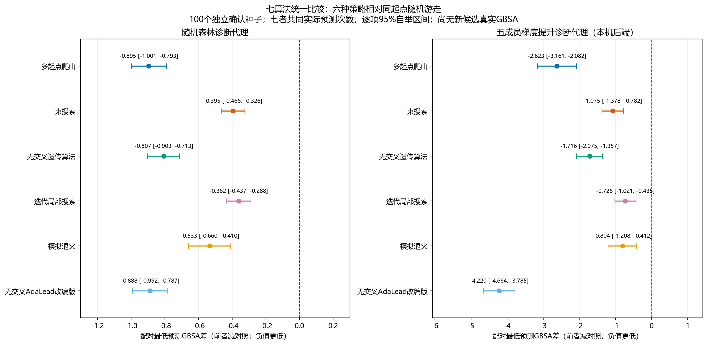

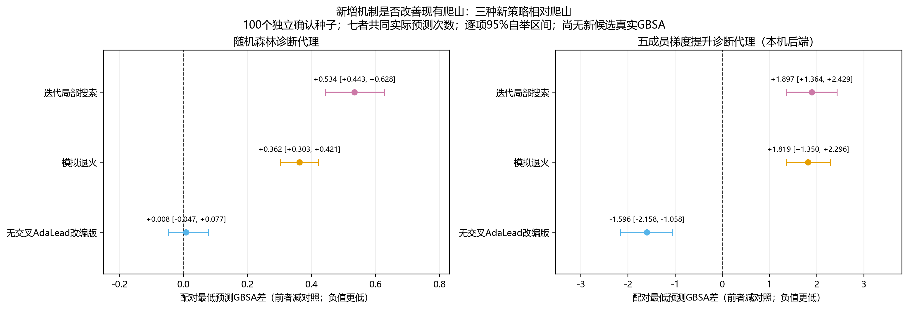

若某法提前耗尽邻域，七者共同截面会截短全部策略；因此同时保留预设的“两两共同次数”补充表。两套表的资源范围不同，不能挑有利口径混写。各法自己的完整停止次数及耗时另报，不能把1024上限当成每法都已经评分1024。

#### 4.15.3 模型敏感性、工程完成与选择边界

开发包另外保持同一训练集、模型种子加1000重训，检查原前50条重评分相关和重新搜索的集合交并比；换另一代理的重评分也单独检查。预算与模型诊断见下图，具体数字见配套汇报§6。

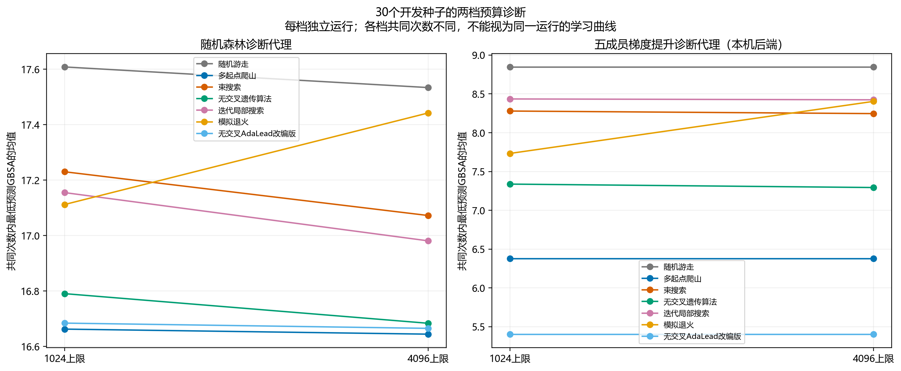

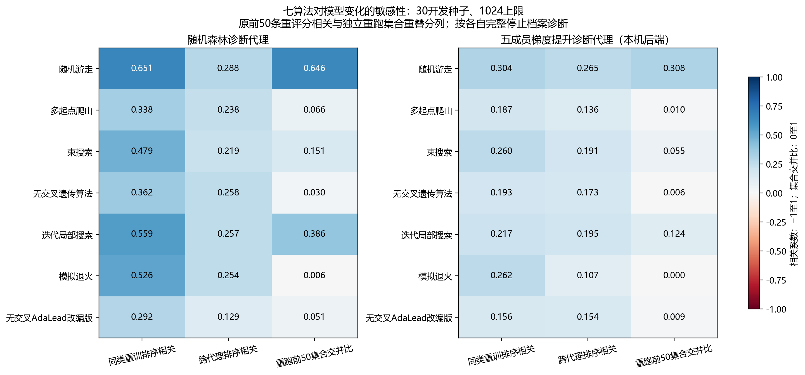

本地139项测试通过。开发1260、确认1400及小试56个子运行通过逐次档案审计，包括父子关系、固定骨架、已测排除、分组、计费、同起点/模型及共同截面最低预测重算。[紧凑证据](../../../evidence/search_seven_20261005/README.md)保留新源码、配置和审计；旧证据包不改写。本轮没有新GBSA、MD、真实对接或服务器同步声明。

当前可以按具体评分器与资源条件选择研究用搜索器；先看相对简单爬山的新机制是否有一致收益，再看耗时、多样性和模型变化。不能宣布真实GBSA算法赢家。是否主动学习以及未来真实标签预算仍未决定，旧96条继续作为历史存档。代理成熟后，用新模型身份在这些接口上重新比较即可。

## 五、历史 96 条文件与当前阶段 B 的关系

### 5.1 96 条到底是什么，为什么会生成

9 月 30 日的探索性配置把候选来源设为**一次性突变生成的静态候选池**，使用当时的代理和贪心选样方法，从 600 条池中导出 96 条候选。运行编号为 `srv_handoff_20260930_182400`，批次编号为 `46844fc08eb8`；配置里把 96 作为**导出数量**，并设置只运行一轮。这个运行实际验证了旧版“代理预测—静态池选样—清单导出—暂停等待”的工程链路；**不能由导出文件推断团队已决定做 96 条 GBSA 计算或采用主动学习**。文件保留了候选编号、完整 RNA 序列、预测 GBSA、突变数、分布外提示、占位协议和状态。[探索性运行配置](../../../configs/experiments/loop_handoff_96.json)、[存档证据](../../../evidence/loop_20260930/handoff_96/)。

状态 `PARKED` 的技术含义是“软件停在等待标签的位置”，不是团队已承诺产生标签的工作安排。配置中的协议串 `gbsa_pending_protocol` 只是占位符；文件没有真实 GBSA，也没有确定的真实计算协议或预算。原配置的备注曾称其为“真实待测批次”，但同一配置的状态是 `exploratory`（探索性），且当前团队明确尚无回填计划。**以当前决策为准，它是历史工程产物，暂存且不自动续跑、不钉协议、不回填**。以后是否使用这批文件，需要团队先重新确认用途、候选适用性、协议和预算，而不能因文件已存在便默认进入计算。[阶段 B 汇报 §2、§6](迭代突变搜索层与阶段B比较_20261002.md)。

### 5.2 十月完成的谱系与分组交接

阶段 B 的新搜索接口把每条序列的“父本—突变位点—生成代数”逐条写入档案，避免把所有新序列误记为直接来自野生型。搜索结果可划分为一组或两组：先确定预测最优的代表序列，再在较高排名候选中寻找与它有足够可变位点差异的第二代表；如无合适第二代表，只保留一组。分组旨在让**将来的候选提案**有多样性，**不表示已发现两个生物学机制或两个真实 GBSA 最优盆地**。[搜索策略代码](../../../scripts/loop/search_policies.py)、[候选交接代码](../../../scripts/loop/loop.py)。

一个 25 条候选的本地工程运行验证了文件格式：两组候选池各 100 条，导出的演练清单分别含 13 条和 12 条，谱系、分组、协议字段都能传递。它仍使用占位协议，属于**工程演练**，不是新一轮正式 GBSA 计算请求。历史 96 条文件也未被这次演练覆盖或回填。[九月技术汇报的十月补验证](九月工作完整汇报_20261005.md)。

## 六、阶段 B 收尾后的实际选择与下一步

### 6.1 实践时用哪一种算法

**七法最新数据及三新策略选择见§4.15和配套汇报；以下保留原四法的实践角色。默认保留多起点爬山作为简洁基线，无交叉 GA 作为种群搜索备选，束搜索作为多路径/多样性对照，同起点随机游走始终作为无预测反馈对照。**这不是宣布爬山在真实 GBSA 上胜出。选择依据应同时看 §4.8 的配对预测差、候选距离、多样性与重训名单变化；GA 即使比随机游走预测低，也不能由此取代所有其他方法。

| 实际需要 | 当前建议 | 使用时要检查 |
| --- | --- | --- |
| 最少参数、可解释的局部改进路径 | 多起点爬山 | 只走严格下降的一位点邻居；可能错过组合变异或需要先变差的路径 |
| 多个父本竞争、允许两位点变异 | 无交叉 GA | 不引入重组；默认参数固定；与爬山同预算比，不只展示最好一个种子 |
| 保留多条路径、观察候选分散程度 | 束搜索 | 软距离不保证硬分散；宽度提高会增加提出和评分成本 |
| 检查预测反馈是否有价值 | 同起点随机游走 | 共享起点；父本抽样不看预测分数；输出仍可按预测排名 |
| 最终要一组或两组序列 | 共用候选分组器 | 最多两组、没有合格第二代表就一组；代表与组内名单都只是预测候选 |

不要因为有遗传算法就直接设置大种群、很多代。先用已冻结的 1024 上限，逐代核查预测计数、合法率、停滞与候选名单；4096/8192 的开发敏感性已完成。早停时实际预测次数低于上限，不能说已在每法 8192 次等成本下验证。

### 6.2 代理优化本阶段暂停，替换接口保留

本轮没有把两种诊断代理升格为最终发布代理。历史五模型融合约 0.375 的可复核结果保留；本轮 300 条训练的能力另报。若以后出现新的数据、标签质量或明确特征假设，再以相同 GBSA 目标和无泄漏划分立项；先验证表内能力，再检验候选稳定性。未经校准的标准差仍仅作记录，不启用复杂采集函数。预训练模型、集成或主动学习都可以以后接入，但不是本轮继续扩大计算的义务。

**接口替换的具体步骤**：实现 `fit/predict/save`；声明预测目标、方向和特征版本；`predict` 按输入顺序返回有限的 GBSA 点预测；保存拟合身份；先跑模拟/合同测试，再运行一次合法搜索并核查产物，最后另建实验配置做配对比较。只有排名而没有 GBSA 标度的输出，需先另行定义排序接口或校准，不能把排名分数冒称 GBSA 数值。

### 6.3 现在不必再跑什么，缺什么才继续

| 工作 | 本轮状态与停止理由 | 再启动的具体条件 |
| --- | --- | --- |
| 七算法接入、谱系与分组 | 已完成并验收 | 生物学硬约束有修改或需要新的策略机制 |
| 30/100 种子搜索比较、预算与固定消融 | 已完成；结论限冻结代理的预测地形 | 明确新的算法假设；独立编号与预先固定判据 |
| 代理模型继续优化 | 暂停；复杂度与重复调参未给出可靠突破 | 新标签质量证据、无泄漏可得特征或有理由的模型假设 |
| 预测对接修正 | 有限复核结束 | 有新的可检验辅助机制；不能把真实测试对接偷用作仅序列模型 |
| 实际对接修正/预筛部署 | 尚未投入新计算 | 对接可用性、全尝试成本/失败率和统一结构协议得到确认 |
| 新序列真实 GBSA 的算法对照 | 尚未启动 | 团队确定协议、预算、独立配对单元及失败处理 |
| 主动学习 | 未选择 | 团队确定需要通过新标签更新代理，并另行评估选样规则 |

“做到不能再做”在这里落实为：**现有数据与已授权计算能回答的有限问题已经跑完，必要工程链已验收；真实算法优胜仍缺新序列真实 GBSA，不能用更多代理预测补出这个证据。**这不表示证明所有可能算法已经穷尽，也不表示整个科研问题已解决。

### 6.4 未来如果决定投入真实 GBSA

先填[阶段 C 预注册模板](../../项目记录/阶段C预注册模板_真实GBSA决策性比较_20261002.md)：明确对象与配体、结构准备、能量协议、质量控制、同真实预算、独立重复、失败处理及盲法。再从已选定搜索策略的提案中按预定规则签发新清单；共有候选只计算一次并保留算法归属。获得真实标签后可只评价算法，不必立即重训；只有团队决定更新代理时才进入重训或主动学习外循环。

**旧 96 条文件不会自动成为试验第一批。**它是历史静态池产物，不具备当前七算法对照的设计。未来若复用，需重新评估适用性、协议和签发规则。本轮没有安排真实回填。

### 6.5 最后怎样选择算法：分清工程选择、预测选择和真实选择

#### 6.5.1 不先宣布一个永久赢家

当前任务可以表达为：在合法序列集合内，使用给定计算预算，寻找真实 GBSA 尽可能低的一条或一组序列。我们暂时只能调用预测函数，因此先求“在固定代理上表现较好的搜索方案”，以后再验证它是否改善真实目标。

**评分器、搜索策略、预测预算和最终候选数量，共同构成一个待比较的方案。**只说“GA 比爬山好”没有明确模型、起点、预算与输出数量，结论就不完整。使用同一个不成熟代理比较，可以识别算法行为；使用多个代理比较，可以识别依赖性；二者都不能替代新候选真实 GBSA。

算法适合性随任务变化的研究依据见 [Angermueller 等，2020，P3BO 原论文](https://proceedings.mlr.press/v119/angermueller20a.html)。这里据此保留多个对照，不将论文中的模拟优势移植为本项目赢家。

#### 6.5.2 四道选择关口

| 关口 | 要回答的问题 | 主要指标和公平条件 | 通过后可作的决定 |
| --- | --- | --- | --- |
| 第一关：工程合格 | 能否按同一个任务正确运行？ | 合法率、预算不超限、谱系、确定性恢复、身份与文件一致 | 不合格先修实现；合格策略进入计算比较 |
| 第二关：预测层效率 | 在固定评分器上，用相同实际预测数能否更有效？ | 共同起点、同训练快照、同首次预测次数截面；最低预测、配对差、胜平负、耗时、失败与早停 | 选择计算演练默认方案；结论限定评分器与预算 |
| 第三关：候选可用性 | 输出的一/二组是否适合以后交接？ | 重训名单稳定性、与训练数据距离、序列差异、可变位点及生物约束；同输出数量 | 保留具有不同价值的方案或组；风险可标注、不能当已验证收益 |
| 第四关：真实目标 | 有限真实计算预算下，谁产生更好的 GBSA？ | 统一协议与质量控制、预先固定签发规则、同计算资源口径、独立配对重复与失败处理 | 决定针对该协议/预算的算法部署；若差异不明确可保留并行方案 |

湿实验另回答“实际结合或功能是否更好”。第四关的计算赢家仍不是湿实验赢家。

**当前进度：第一、二关已完成；第三关的序列/模型敏感性部分已完成，生物学合理性仍需要团队判断；第四关未启动。**

#### 6.5.3 首轮四法数字的选择依据（最新七法见§4.15）

下表直接来自 §4.8 的 100 个确认种子；差值为“左方法最低预测 − 右方法最低预测”，负数对左方法有利。单位是该评分器输出标度，不能比较两个代理的差值大小来评定谁科学上更好。

| 待决定事项 | 随机森林评分器 | 五成员梯度提升评分器 | 当前决策 |
| --- | --- | --- | --- |
| GA 是否值得保留？GA − 随机游走 | −0.7041；95% 区间 [−0.7954, −0.6149]；95/2/3 | −3.4592；[−3.8097, −3.1194]；98/2/0 | 值得保留为种群搜索；优势仅为预测层证据 |
| GA 能否取代爬山？GA − 爬山 | +0.0369；[−0.0272, +0.0945]；26/17/57 | +0.3462；[+0.0468, +0.6345]；22/15/63 | 不支持统一取代；梯度提升此配置下爬山较低，随机森林差异不明确 |
| 能否删除束搜索？ | 主预测极值不占优；需同时看多样性 | 主预测极值不占优；需同时看多样性 | 保留多路径对照；尚无真实标签支持删除或宣布优势 |
| 可以删除随机对照吗？ | 三种引导方法的价值须相对它衡量 | 同左 | 不删除；以后新策略也应保留同条件随机对照 |

因此目前采用“**爬山基线 + GA 种群备选 + 束搜索覆盖对照 + 随机游走无反馈对照**”。不是投票选择一个名称，也不是按期刊等级排序算法。若最终需要两个有差异的候选组，最低分只是一个指标，不能为了极值而忽略名单变化与多样性。

#### 6.5.4 真实 GBSA 到位后的定案方法

1. **先固定研究问题。**是每组找一个较低能量代表，还是得到若干合格序列？最终每法交接数量、主指标与参照应在看新 GBSA 前确定。
2. **固定完整方案。**写明模型权重与训练截止、算法参数、起点、突变域、首次预测预算、分组器和签发规则。以后新标签反馈重训，应作为另一轮方案，不与原快照混算。
3. **决定真实预算口径。**等合格标签数适合比较筛选质量；等总尝试计算资源适合比较部署效益。两者不一定一致，尤其有失败和补算时。主口径选一个，另一个作为补充报告；真实预算未批准前不填虚构条数。
4. **保留方法归属并联合去重。**同一序列出现于多个算法，真实计算只执行一次，各方法保留其原定归属。节省的预算按事先规则处理，不事后只奖励某一方法。
5. **采用统一协议和独立重复。**结构准备、对接/采样、GBSA 计算和 QC（质量控制）一致；按预定重复或批次配对分析。同父本相关子代不能全部当成独立生物重复。
6. **评估主指标与尾部。**可选“每个独立配对单元的最好合格 GBSA”为主指标，但极值易受单条噪声影响，应另报前若干条均值/中位数、达到预定阈值的比例、失败率及独立计算重复。选用哪些补充指标应预先固定。
7. **作带边界的结论。**主指标达到预定实用改善幅度且不确定区间支持改善，才决定部署；若差异不清楚，则结合资源、稳定性和可解释性保留简洁方案或组合。实用幅度应参考统一协议的重复误差，不能事后按看到的差值设定。

目前大搜索空间没有完整真实标签，因此**无法计算全空间真实最优或精确的真实遗憾值**。阶段 C 只能比较已按规则提案并评价的候选表现；“找到的最好”须说明范围。

### 6.6 读取文献之后，还可以尝试哪些算法

下面区分已完成的本轮扩展和后期条件性方法。**前三项ILS、SA、无交叉AdaLead改编版已实现，七法统一30开发/100确认完成，见§4.15及配套汇报；BO、CbAS、RL和动态组合尚未实现。**原四法1940个子运行保留；本次新增2660个正式子运行。

| 候选方法、全称与原理 | 希望解决的现有问题 | 与当前接口的关系 | 建议次序及证据边界 |
| --- | --- | --- | --- |
| **迭代局部搜索，ILS，iterated local search**：局部下降停住后做较大扰动，再下降 | 爬山难跨越需先变差的区域 | 已接入两位点扰动、评分缓存与单父本谱系；三位点未实现 | **已实现并完成七法比较**；实现改动较小。组合优化依据见 [Lourenço 等](https://arxiv.org/html/math/0102188)，没有新序列真实GBSA收益证据 |
| **模拟退火，SA，simulated annealing**：以随搜索推进降低的概率接受变差步骤 | 严格改善路径可能被局部障碍挡住 | 可作为仅变异单父本策略，复用点预测，无需模型梯度 | **已实现并完成七法比较**；依据 [Kirkpatrick 等，1983](https://doi.org/10.1126/science.220.4598.671)。控制温度为算法参数，不是分子模拟温度 |
| **无交叉 AdaLead 改写版**：对接近当前领先者的父本进行突变展开 | 固定种群或固定宽度可能限制探索 | 能复用突变、点预测和谱系；需独立登记阈值及展开规则 | **已实现并完成七法比较**；[Sinai 等，2020](https://arxiv.org/abs/2010.02141) 原版含重组；改写版不直接声称完整复现 |
| **算法组合，algorithm portfolio**；相关方法 P3BO（population-based black-box optimization，基于种群的黑箱优化） | 不同模型与预算下算法排序变化 | 先固定各法份额、统一去重与总预算；以后再研究动态资源分配 | **条件候选**；[Angermueller 等，2020](https://proceedings.mlr.press/v119/angermueller20a.html)。固定组合不是完整 P3BO，也不能免费相加四法预算 |
| **贝叶斯优化，BO，Bayesian optimization**；可参考 LaMBO（latent multi-objective BayesOpt，潜空间多目标贝叶斯优化） | 真实标签昂贵，需要选择下一批计算并利用不确定性 | 外层需概率代理与采集规则；内层仍可用现有搜索器优化采集函数 | **真实标签迭代与不确定性条件具备后**；[Stanton 等，2022](https://proceedings.mlr.press/v162/stanton22a.html)。当前只优化 GBSA，不因引用多目标论文而增加目标 |
| **条件自适应采样，CbAS，conditioning by adaptive sampling**；相关生成器如 RaptGen | 直接追求预测极值可能离训练分布很远 | 新增生成模型及先验分布；仍接相同合法性校验和评分边界 | **后期候选**；[Brookes 等，2019](https://proceedings.mlr.press/v97/brookes19a.html)、[Iwano 等，2022](https://doi.org/10.1038/s43588-022-00249-6)。不能保证避免所有模型错误 |
| **强化学习，RL，reinforcement learning**：训练提出突变或序列的策略 | 学习一套可复用的提出规则 | 需增加策略训练、交互预算与奖励记录；仍需固定目标和评价边界 | **后期研究**；[Angermueller 等，ICLR 2020](https://openreview.net/pdf?id=HklxbgBKvr)。代理弱时多训练策略可能更有效地利用预测偏差 |

为什么不优先列粒子群、蚁群等所有通用优化器？它们也可以设计离散适配，但当前更明确的缺口是局部跨障碍、选择压力及不同策略的覆盖差异。优先选择与现有缺口、合法突变和可审计接口相匹配的方法。上述优先级是本项目的工程判断，不是论文给出的普适算法排名。

#### 6.6.1 第一优先：迭代局部搜索怎样做

本轮已执行：共同起点 → 未评分单位点邻居的局部下降 → 无严格改善 → 随机两位点扰动并无条件接受 → 再下降；历史最好候选另存。三位点扰动不在当前实现内。

新增时必须明确：扰动强度、何时触发、扰动后保留哪个状态、如何分配多个起点、何时停止。人工评分器测试确认一步停滞后触发两位点扰动，再完成GBSA代理上的公平比较；没有把机制测试写成真实能量障碍已被跨越。扰动太小可能返回原区域，太大则接近随机重启；这就是要检验的机制，而不是预先宣称改进。

当前冻结版采用两位点扰动，已与爬山比较；若研究三位点，仍需新增实现和独立配置，不能直接改数值冒充当前支持。

#### 6.6.2 第二优先：模拟退火怎样做

令当前与新候选的点预测差为 Δ = 新预测 − 当前预测。若 Δ ≤ 0 就接受；若 Δ > 0，以 `exp(−Δ/T)` 的概率接受。T 是控制接受变差步骤的正数，逐步降低。保留历史最好候选，因此最终交接不必等于最后一步状态。

举例：当前预测 8，新候选 9，Δ = 1；T = 2 时接受概率约 0.607，T = 0.2 时约 0.0067。这是算法数学示例，**不是 RNA 在 2 度或 0.2 度下模拟，也不需要启动 MD**。

已冻结并执行初温0.25×训练标签四分位距、按实际预测预算冷却、终温比例0.02；无额外重启。训练标签尺度只从训练集取得；初始16次评分照常计预算。排重使该实现成为优化变体，不用于平衡采样。

#### 6.6.3 第三优先：无交叉 AdaLead 怎样改

AdaLead 的全称是 Adapt-with-the-Leader，意为“随领先者调整”。原文采用接近领先者的父本、预测指导展开及重组，报告了关闭重组的对照。我们只借鉴领先者阈值与展开机制，并把重组关闭，名称明确为“无交叉 AdaLead 改写版”。[原文算法与附录](https://arxiv.org/html/2010.02141)。

本轮采用并执行加法容差：δ＝0.05×训练标签四分位距；最多32个领先根，16条并行单点延伸，子代优于根则继续。允许δ为0；没有采用排名比例规则。

**不能把原文最大化适应度的乘法阈值直接套给可能为负的最小化 GBSA。**这会改变比较方向或产生不合理阈值。若采用加法容差，须明确其值、尺度来源、平坦地形行为与展开停止规则；没有这些定义就不是可复核的算法。

#### 6.6.4 为什么 BO、生成器和 RL 放在后面

这些方法增加了新的统计或训练假设。BO 需要有意义的概率预测以分配真实标签；当前树间或集成成员标准差不等于已经校准的误差分布。CbAS/生成器需要可用的序列先验和生成表示。RL 需要训练提出策略，预算不仅包含最终搜索，也包括奖励模型调用与策略训练。

当前不确定度门槛还有已有数据依据，而非仅凭保守判断：30 种子的历史筛查中，400 条训练时 σ 与绝对误差的排序相关约 0.014，区间跨零；1600 条训练时，下置信界系数为 2 的最佳10%召回相对均值排序下降约 0.0458，区间 [−0.0642, −0.0275]。因此当前分歧字段只记录，不直接放行 LCB/EI/汤普森策略。该结果针对当时的五成员代理，不证明所有概率模型永久无效。[证据与门槛记录](../../../evidence/sigma_calibration_30seed/README.md)。

它们可以做固定代理上的模拟研究，但不能因此跳过上述条件，也不能宣称有真实计算节省。若以后选择它们，应先制定独立问题、资源与评价方案。主线仍为 GBSA；主动学习与否需团队另行决定。

### 6.7 新算法立项时怎么试，什么情况下停止

现有四法的确认包继续保留；若实现新方法，**新开实验编号与输出目录**，不把新结果插入原 100 种子冻结确认并沿用其“预注册确认”名称。

| 步骤 | 要做的事 | 验收或停止条件 |
| --- | --- | --- |
| 1. 写一条机制假设 | 例如“允许跨障碍能改善爬山被局部邻居限制的情况” | 说不清具体缺口或比较对象，就先不扩大计算 |
| 2. 实现公共接口 | 使用同一评分器、单父本突变、缓存、预算、谱系、恢复与分组 | 无交叉；任何额外评分都计入预算；工程检查不过先修复 |
| 3. 人工地形验收 | 小规模加性地形、组合障碍、平坦地形及有噪声例子；知道真实函数以核对行为 | 能证明机制被正确实现；不要求所有算法在所有人工地形胜出 |
| 4. 小规模演练 | 检查真实代理可调用、产物合法、计数一致 | 不用少量种子的最高分作算法优胜结论 |
| 5. ≥30 开发种子 | 同划分、同代理快照、同起点与域；与爬山及随机对照比较 | 预先固定新方法的主要比较；看实际用量、低分、名单与耗时 |
| 6. 冻结或终止 | 若有一致且有实用价值的信号，固定参数；若只压低预测且风险明显，暂不推广 | 不在确认种子上继续搜参；没有信号可以保留负结果后停止 |
| 7. ≥100 新确认种子 | 新种子确认固定计算结果，报告区间、胜平负与早停 | 只确认冻结评分地形；不能写成真实 GBSA 胜出 |
| 8. 条件性真实验证 | 将有价值的候选方案进入阶段 C 预注册 | 协议和预算未确定，停在预测层，不自行签发测量安排 |

默认以“新方法 − 爬山”为机制主比较、随机游走为必要参照；若科学问题是探索范围，需另外预定多样性或候选覆盖指标。多个设置都试验时，应说明开发选择过程，必要时进行多重比较处理。当前表内 GBSA 结果或生成候选预测都不能据此计算未知空间的真实召回率。

### 6.8 全部工作分阶段：任务、依赖、产物与当前进度

以下把现有阶段 B 拆成 B1–B4 便于执行，**不改变历史阶段代号的含义**。A 是数据/目标准备；C 是未来真实 GBSA 验证；D 是可选的后续湿实验；E 是可选的更新与再迭代。D/E 为本汇报安排工作顺序的代号，未代表已经批准新实验。

| 阶段 | 任务与具体步骤 | 需要先具备什么 | 交付与通过标准 | 当前进度 |
| --- | --- | --- | --- | --- |
| **A：数据与目标** | 登记 2000 条数据摘要；独立 GBSA 目标；固定 141 位骨架和 13 可变位点；明确输入可得性与泄漏禁令 | 数据与研究对象记录 | 数据登记、目标声明、序列约束；每次正式实验先核对摘要 | **数据与目标工程完成**；配体/结构/未来协议仍需团队在启动真实验证前确认 |
| **B1：评分与接口** | 统一 `fit/predict/save` 和 `score`；合法性、身份、预算、缓存；接入两诊断代理 | A 的合同 | 代理 0.2.0 / 搜索 0.1.1；可换模型；预测输出可审计 | **完成**；最终代理模型尚未成熟、优化暂停 |
| **B2：搜索与交接** | 七法多代生成；全部无交叉；谱系、恢复、去重；一/二组输出 | B1 的固定评分器 | 人工与实际代理运行通过；每条候选可追溯 | **完成**；GA 演示实际916次预测、908条新候选、两组，均无新真实标签 |
| **B3：算法计算比较** | 首轮四法开发/消融保留；新增七法30开发、两预算、重训/跨代理；100新种子确认 | B2 通过，冻结同起点和实际用量规则 | 首轮四法1140＋800；最新七法1260＋1400，统计、完整性与独立审计 | **完成**；结论限两固定代理，未决定真实赢家 |
| **B4：未来文件接口** | 模拟候选批次、协议钉定、QC成功/失败、回传校验、闭合与末次重训 | B1/B2 与文件合同 | 合同与端到端测试；`PARKED`/`DONE` 符合状态约束 | **工程验收完成**；139项是当前本地全测试数，包含现有模块，不能都称新测量测试 |
| **B 扩展：本轮新增三法** | ILS、SA、无交叉AdaLead改编版与原四法共同编号比较 | 固定评分器、同起点与实际预测预算 | 30开发、100新种子确认、稳定性与档案核验 | **已完成**；2660正式子运行；结果见§4.15 |
| **C：真实 GBSA 决策比较** | 先定协议与预算；固定算法/评分快照及签发；联合去重；统一计算与QC；独立配对分析 | 研究对象、结构流程、计算协议、资源和比较设计均确定 | 新候选真实GBSA、失败与成本表、按预定主指标给出的决策 | **未启动**；无新候选GBSA预算或回填安排，旧96条不自动纳入 |
| **D：湿实验性能验证** | 根据科学目标评价候选的亲和力、特异性或核糖开关功能；含参照与独立重复 | 团队决定实验终点、材料与资源；可参考C，也可另有独立实验设计 | 真实生物性能与重复误差；与计算GBSA分开报告 | **未启动**；不是本轮计算结果 |
| **E：可选更新与下一轮** | 决定只评价还是更新代理；若更新，用QC合格新标签重训、登记新快照，再搜索 | C或D产生与所预测目标匹配的新数据，并有明确更新决策 | 新模型、新轮编号、下一轮候选及留出评价；独立测试集不作训练回填 | **未选择**；主动学习不是默认要求 |

**进度不写一个总体百分比。**B1–B4 完成不等于模型成熟或科研目标完成；真实标签与湿实验的缺口不能用多跑几个算法填成“100%”。已有完成量和条件缺口如上逐项列出。

### 6.9 接下来按什么顺序实践

#### 6.9.1 现在可直接做：理解和使用现有交付

1. **先看 §4.13 和 §4.14。**确认四算法是提出/选择规则，评分器是统一评价入口；GBSA预测、真实计算和湿实验终点分清。
2. **复核约束。**读固定序列与可变位点表，确认允许碱基、突变数范围和希望保留几组候选。修改生物约束后必须另建运行，不直接延续旧档案。
3. **看确认比较。**按 §6.5 选择爬山基线、GA备选和对照；先练习已冻结的1024预测上限，不将上限当实际次数。
4. **运行/查看一次 GA 演示。**按[操作指南](../../项目记录/无交叉遗传算法运行与阶段B收尾操作指南_20261005.md)使用正式实验入口；已有目录先查看或审计，若重跑，用新配置和新输出目录，防止混入旧证据。
5. **查文件而不是只查最佳分数。**检查序列、父本、实际变更位点、排序、模型身份、实际用量、停止原因、组代表及训练距离。示例组不是已验证最优盆地。
6. **确定当前收尾。**交付总汇报、指南与证据索引；代理优化暂停。若没有新增科学问题，可在这里结束阶段B。

#### 6.9.2 如以后有新模型或进一步算法问题

新模型走 §4.14.4；新算法走 §6.7。尽量一次只改变一个关键因素：先固定模型比较算法，或固定算法比较模型。若两者都变，需要预先设计“模型 × 算法”的配对表，避免把模型变化误归因为算法变化。

这是可以启动的后续路线，不是本轮已批准的长期无上限计算。新方法的原始文献、接口状态和参数方案必须先登记；原确认种子不充当继续调参的开发集。

#### 6.9.3 如以后有真实 GBSA 协议与预算

先补完[阶段C预注册模板](../../项目记录/阶段C预注册模板_真实GBSA决策性比较_20261002.md)，按 §6.5.4 决定签发和真实成本口径；取得标签后先做算法评价，再决定是否更新代理。

**路径需选清楚：**现有正式回填驱动在批次闭合后要求末次重训才能 `DONE`；“只评价算法”应走独立评价路径，不应误以为 `--no-post-retrain-eval` 能关闭重训，该参数只关闭末次留出打分。历史96条清单仍不自动钉定或回填。

### 6.10 阶段决策框架图

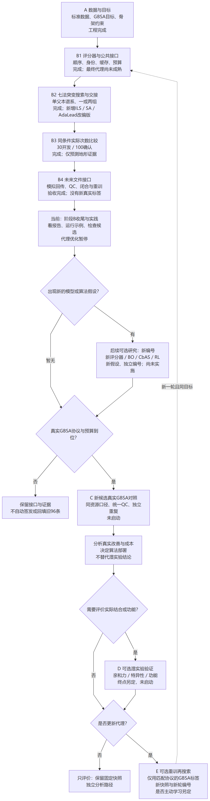

[矢量图](figures/GBSA总汇报_20261005/13_阶段步骤与当前进度.svg)

展开可编辑图源：阶段推进与条件分支

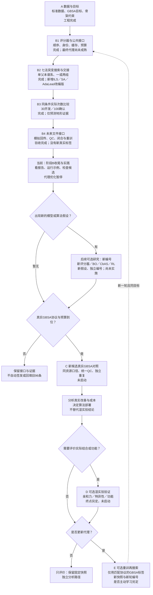
```mermaid
flowchart TD
    accTitle: 项目分阶段步骤与当前进度
    accDescr: 数据目标与阶段B四项工程和计算交付已完成，代理成熟仍未完成。当前可复核使用已有交付；新模型或算法有新问题才另行研究。真实GBSA阶段必须先有协议预算，湿实验评价另设终点，新标签是否更新模型另作决策。
    data["A 数据与目标<br/>标准数据、GBSA目标、骨架约束<br/>工程完成"]
    interface["B1 评分器与公共接口<br/>顺序、身份、缓存、预算<br/>完成；最终代理尚未成熟"]
    search["B2 七法突变搜索与交接<br/>单父本谱系、一或两组<br/>完成；新增ILS／SA／AdaLead改编版"]
    compare["B3 同条件实际次数比较<br/>30开发／100确认<br/>完成；仅预测地形证据"]
    future["B4 未来文件接口<br/>模拟回传、QC、闭合与重训<br/>验收完成；没有新真实标签"]
    current["当前：阶段B收尾与实践<br/>看报告、运行示例、检查候选<br/>代理优化暂停"]
    hypothesis{"出现新的模型或算法假设？"}
    extension["后续可选研究：新编号<br/>新评分器／BO／CbAS／RL<br/>新假设、独立编号；尚未实施"]
    ready{"真实GBSA协议与预算到位？"}
    wait["保留接口与证据<br/>不自动签发或回填旧96条"]
    gbsa["C 新候选真实GBSA对照<br/>同资源口径、统一QC、独立重复<br/>未启动"]
    decision["分析真实改善与成本<br/>决定算法部署<br/>不替代湿实验结论"]
    biological{"需要评价实际结合或功能？"}
    wet["D 可选湿实验验证<br/>亲和力／特异性／功能<br/>终点另定，未启动"]
    update{"是否更新代理？"}
    evaluation["只评价：保留固定快照<br/>独立分析路径"]
    retrain["E 可选重训再搜索<br/>仅用匹配协议的GBSA标签<br/>新快照与新轮编号<br/>是否主动学习另定"]
    data --> interface --> search --> compare --> future --> current
    current --> hypothesis
    hypothesis -- 有 --> extension
    hypothesis -- 暂无 --> ready
    extension --> ready
    ready -- 否 --> wait
    ready -- 是 --> gbsa --> decision
    decision --> biological
    biological -- 是 --> wet
    biological -- 否 --> update
    wet --> update
    update -- 否 --> evaluation
    update -- 是 --> retrain
    retrain -. 新一轮且同目标 .-> interface
```

---

图中进度以本地证据为准。真实GBSA、湿实验和主动学习仍为条件分支，没有指定未来执行日期或虚构预算；ILS、SA及无交叉AdaLead已完成，其他文献扩展仍待新假设立项。

若未来只有湿实验亲和力或功能标签，不能直接把它写入 GBSA 标签列重训。那将是另一个预测目标，需要单独立项和定义接口；当前 GBSA 主线的更新只能使用与 GBSA 目标和协议匹配的合格计算标签。

## 七、现阶段希望生工团队确认什么

当前讨论重点是**搜索空间和候选的生物学合理性**。以下信息可帮助工程端把算法限制写准确，不意味着现在要提交 96 条或安排 GBSA 计算。

| 需要确认的事项 | 建议交付物 | 对当前阶段的作用 |
| --- | --- | --- |
| 13 个位置及其允许的碱基变化 | 位点表、是否有不可替换位点、应避免的序列模式 | 形成所有搜索算法共用的硬约束 |
| 候选分组的意义 | 是否希望保留结构或序列差异较大的备选组；差异如何解释 | 让一组或两组输出服务于实际研究问题 |
| 当前目标的口径 | 独立 GBSA 是否仍是唯一计算排序目标 | 避免把历史加权标签或对接分数悄悄混回主线 |
| 后续验证意向 | 未来如需要真实 GBSA 或亲和力评价，说明希望回答的科学问题 | 供以后设计试验；**不在本阶段形成计算任务** |

工程端本阶段的交付是：可替换代理的搜索接口、合法序列和父子谱系档案、按实际预测次数对齐的算法比较、候选一/二组的文件格式，以及明确标注“预测值、非真实 GBSA”的示例清单。真实计算协议、预算与回填报告只有在团队另行决定启动阶段 C 后才进入交付清单。

## 八、读数规则：哪些结论可以说，哪些要等

| 已有证据 | 目前可以说 | 还不能说 |
| --- | --- | --- |
| 已测表多次划分，GBSA 排序相关约 0.375 | 代理含有有限排序信息，是当前可复核基线 | 对所有未测序列都能精确排序 |
| 已测固定池中，贪心选样平均遗憾值优于随机 | 仅作该回顾条件的选样参考，不决定采用主动学习 | 它就是遗传算法，或它能保证真实新序列最优 |
| 预测对接修正的 30 种子初筛及 100 新种子确认未见稳定增益 | 目前无证据把预测对接加入主线 | 对接在任何成本条件下都不可能帮助 GBSA |
| 同起点 30 开发 / 100 确认种子的四算法计算比较 | 无交叉 GA 已实现；四法的预测差与模型敏感性已量化 | 已找到真实 GBSA 最低，或某法在所有模型与预算都更优 |
| 历史 96 条 `PARKED` 文件和 25 条工程演练 | 旧静态池导出与新搜索文件格式分别经过工程检查 | 已批准新计算、准备回填，或新候选已获得 GBSA |

报告中的“95% 置信区间”只描述已有划分或配对比较的不确定性，不是对未来任一序列的成功概率。模型反复挑最小预测值时，尤其要警惕“被模型偏好的错误极值”。因此后续决定算法的依据必须从代理预测分数转向**按同一协议得到的新序列真实 GBSA**。

## 九、术语表：本文出现的英文与缩写

| 写法 | 学术全称与中文解释 | 在本项目中的具体含义 |
| --- | --- | --- |
| FAD | 生物化学通用全称为 flavin adenine dinucleotide，黄素腺嘌呤二核苷酸 | 本仓库名称；目录名不证明它就是当前配体，README 标注对象为 PreQ1/RF00522 |
| PreQ1、RF00522、Rfam | Pre-queuosine 1，Q 核苷（queuosine）合成通路的前体名称；RF00522 为 RNA 家族数据库 Rfam 的条目编号 | 仓库记载的核糖开关对象；家族域与完整 141 位构建体不应混同 |
| RNA | Ribonucleic acid，核糖核酸 | 被设计和突变的核酸序列 |
| DNA | Deoxyribonucleic acid，脱氧核糖核酸 | 所引适配体论文中的另一类核酸，论文结果不能直接照搬到本 RNA 任务 |
| GBSA | Generalized Born/surface area，广义玻恩/溶剂可及表面积 | 当前唯一主优化目标；指既定流程产生的计算能量指标 |
| MM/GBSA | Molecular mechanics/generalized Born surface area，分子力学结合广义玻恩/溶剂可及表面积方法 | 历史或拟定的 GBSA 计算路线，具体参数仍需协议确认 |
| docking、`dock` | Molecular docking，分子对接；`dock` 为数据表中历史对接分数的字段名 | 四模型历史实验预测的是这列分数；其 0.5523 结果是排序相关系数，不是该列分数值，也不是 GBSA 标签 |
| MD | Molecular dynamics，分子动力学 | 为计算构象采样可能使用的昂贵模拟步骤 |
| WT | Wild type，野生型 | 突变位点和突变数所依据的固定参考序列 |
| NUPACK | Nucleic Acid Package，核酸热力学与二级结构计算软件 | 历史结构指标的规定计算来源，不能用其他软件悄悄代替 |
| `Gap2` | 历史结构计算指标的字段名 | 曾用于复合标签；当前不作为 GBSA 模型输入或优化目标 |
| RF | Random forest，随机森林 | 由多棵决策树组成的经典机器学习基准 |
| ET、GBR、SVR | Extra Trees，极端随机树；gradient boosting regression，梯度提升回归；support vector regression，支持向量回归 | 分别为训练内特征筛选或历史/本轮回归模型；不表示优化目标改变 |
| GA | Genetic algorithm，遗传算法 | 本轮为仅变异、无交叉的精英种群进化策略；种群、父本选择与生存替换均已实现 |
| QC | Quality control，质量控制 | 判定真实 GBSA 计算是否可接收及如何记录失败 |
| OOD | Out of distribution，分布外 | 候选远离当前已标注序列分布时的风险提示 |
| CI | Confidence interval，置信区间 | 对跨数据划分或跨独立批次统计量的不确定范围 |
| Spearman | Spearman rank correlation，斯皮尔曼等级相关 | 比较预测排序与真实排序的一致程度 |
| JCR、Q1 | Journal Citation Reports，期刊引证报告；Q1 为相应学科类别的第一四分位 | 下文给出的期刊层面分区；不是论文质量或本项目证据强度的评分 |
| `PARKED`、`DONE` | 英文分别为“暂存等待”“完成”的运行状态标记 | 在进入未来标签闭环的运行中，前者表示等待标签，后者须满足批次闭合和重训；独立搜索有自己的完成状态 |
| `seed` | 随机数种子 | 固定计算机随机过程以便重复同一数据划分或搜索 |
| “代理” | Surrogate model，替代昂贵计算的预测模型 | 输入序列、输出预测 GBSA；与真实计算标签严格区分 |
| 主动学习 | Active learning，主动选择待标注样本并更新模型的方法；是获取标签与更新模型的流程，不是与随机森林并列的模型类别 | 可用于外循环决定哪些候选值得取得真实 GBSA；不等同于遗传算法或束搜索 |
| 阶段 B、阶段 C | 项目内部阶段代号 | B 是当前的代理接口与突变搜索算法计算验证；C 是以后若决定投入真实 GBSA 才开展的验证阶段 |
| OOF | Out-of-fold prediction，折外预测 | 训练区内部交叉验证，对一条样本用未训练过它的模型预测；供残差学习使用 |
| SHA256 | Secure Hash Algorithm, 256-bit，256 位安全散列算法 | 以文件内容指纹核对数据、配置、源码和输出版本 |
| Hamming、Jaccard | Hamming distance，汉明距离；Jaccard index，杰卡德集合相似系数 | 前者数可变位点差异；后者是两个候选集合交集与并集的比 |
| μ、σ | 希腊字母 mu、sigma；常用作均值和标准差符号 | μ 为代理点预测；当前 σ 为未经校准的成员分歧，不是实际误差或置信区间 |
| LCB、EI | Lower confidence bound，下置信界；expected improvement，期望改进 | 利用预测分布选候选的规则；当前未确定作为正式方法 |
| Thompson sampling | 汤普森采样，按预测/后验分布采样再决策 | 需要有可信的概率模型；当前不是已实现搜索策略 |
| L2、ridge regression | 参数平方惩罚；岭回归 | 现有残差修正使用的正则化机制；惩罚系数应仅在训练内选择 |
| XGBoost、GBM、boot5 | Extreme gradient boosting，极端梯度提升；gradient boosting machine，梯度提升机；五成员自助抽样代码标识 | 后端必须按运行记录识别；配置名不能证明实际调用了哪套实现 |
| MFE、Pre、Aft | Minimum free energy，最低自由能；Pre/Aft 为历史流程前/后结构量字段 | 不参与当前独立 GBSA 目标；若计算必须遵守项目 NUPACK 规范 |
| CPU、RNG、GB | Central processing unit，中央处理器；random number generator，随机数生成器；gigabyte，十亿字节容量单位 | 资源、随机状态与存储记录；不是生物学评价指标 |
| CSV、JSON、JSONL | Comma-separated values，逗号分隔值；JavaScript Object Notation，JavaScript 对象表示法；JSON Lines，每行一个 JSON 记录 | 表格与结构化档案格式；不是不同实验指标 |
| Oracle | 标签提供器，代码中的接口名称 | 从历史表或未来外部计算取得真实标签，不能用代理预测冒充 |
| 单任务/多任务、多保真 | Single-task/multi-task learning；multi-fidelity modelling | 分别学习一个/多个目标，或联合成本与近似程度不同的计算信息；支线目标仍为 GBSA |
| 适应度、精英保留、消融、上位性 | Fitness；elitism；ablation；epistasis | 算法选择标量；保留较优个体；单独改变组件的对照；突变之间的相互作用 |
| scorer、sequence scorer | 评分器、序列评分入口 | 本项目是拟合代理的统一调用封装，负责预测顺序、缓存、预算与身份记录；不是另一个搜索算法 |
| hill climbing、local descent、beam search、random walk | 爬山、局部下降、束搜索、随机游走 | 分别按邻居改善、有限多路径和随机步骤探索；当前实现细节见 §4.13 |
| crossover、recombination、tournament selection | 交叉、重组、锦标赛选择 | 前两者结合双亲片段，当前禁用；后者抽取若干父本比较适应度后择优繁殖 |
| ILS、SA | Iterated local search，迭代局部搜索；simulated annealing，模拟退火 | 本轮已实现并完成七法比较；SA温度控制接受概率，不是MD温度 |
| AdaLead、FLEXS | Adapt-with-the-Leader，随领先者调整；Fitness Landscape EXploration Sandbox，适应度地形探索沙盒 | 前者为论文算法名称，后者为其测试环境；本轮无交叉版本明确标为改编版 |
| BO、LaMBO、GP | Bayesian optimization，贝叶斯优化；latent multi-objective BayesOpt，潜空间多目标贝叶斯优化；Gaussian process，高斯过程 | 概率预测与采集决策或潜空间优化；尚未部署到当前GBSA主线 |
| CbAS、VAE | Conditioning by adaptive sampling，条件自适应采样；variational autoencoder，变分自编码器 | 生成分布调整及表示学习方法；需要另行定义数据和训练过程 |
| RL、PPO | Reinforcement learning，强化学习；proximal policy optimization，近端策略优化 | 学习提出动作或序列的策略；不是当前七法的实现 |
| P3BO、algorithm portfolio | Population-based black-box optimization，基于种群的黑箱优化；算法组合 | 组合不同提出方法并分配资源；固定组合不等于已经复现P3BO |
| IQR、Δ、T、δ | Interquartile range，四分位距；差值符号；退火控制温度；阈值容差 | IQR为第三与第一四分位之差；后三者在 §4.15/§6.6 的已实现机制中定义，不是新增标签字段 |
| ICML、ICLR、PMLR | International Conference on Machine Learning，国际机器学习大会；International Conference on Learning Representations，国际学习表征大会；Proceedings of Machine Learning Research，机器学习研究会议论文集 | 会议和论文集名称，不适用JCR期刊分区；PMLR页面关联JMLR不使每篇会议论文变成JMLR期刊论文 |

## 十、论文、分区与项目内参考资料

以下论文用于说明“某类方法在相关问题上做过什么”，**不作为本项目已得到同样收益的证据**。期刊分区按 **2024 年 JCR 的期刊影响因子四分位**与表中列出的**一个对应学科类别**记录；同一期刊可能在多个学科类别出现不同列表。分区来自[欧洲高校提供的 2024 JCR 导出表](https://cdn.umfcluj.ro/uploads/2024/08/JCR_2024_iunie2025.pdf)，正式对外提交前仍建议用单位的 JCR 账号核对指定年份。Q1 不是中国科学院分区。

| 原始论文与链接 | 期刊；2024 JCR 类别 / 分区 | 对本项目的启示与不能外推之处 |
| --- | --- | --- |
| Bashir 等（2021），[机器学习引导的适配体改良与发现](https://doi.org/10.1038/s41467-021-22555-9) | *Nature Communications*；Multidisciplinary Sciences（综合性科学）/ Q1 | 以模型预测指导多轮突变、保留父本并实验检验；研究为 DNA 适配体亲和力，非本项目 RNA 的 GBSA |
| Espah Borujeni 等（2016），[RNA 适配体来源核糖开关的自动化物理设计](https://doi.org/10.1093/nar/gkv1289) | *Nucleic Acids Research*；Biochemistry & Molecular Biology（生物化学与分子生物学）/ Q1 | 文中明确使用遗传算法的突变、预测、选择和重组；优化的是核糖开关功能，不能证明本项目交叉算子有益 |
| Rotrattanadumrong 与 Yokobayashi（2022），[进化算法与深度学习探索核酶中性网络](https://doi.org/10.1038/s41467-022-32538-z) | *Nature Communications*；Multidisciplinary Sciences（综合性科学）/ Q1 | 展示 RNA 序列搜索和实验评估；研究量是核酶活性，提示可检验多样路径但不提供 GBSA 胜率 |
| Iwano 等（2022），[RaptGen 生成式适配体发现](https://doi.org/10.1038/s43588-022-00249-6) | *Nature Computational Science*；Computer Science, Interdisciplinary Applications（计算机科学跨学科应用）/ Q1 | RaptGen 是论文提出的生成式适配体方法名称；展示生成表示与潜空间搜索，需要额外模型与数据，属于后续扩展选项 |
| Sindt 等（2025），[超大规模分子对接命中物重新打分的困难](https://doi.org/10.1021/acs.jcim.5c00730) | *Journal of Chemical Information and Modeling*；Computer Science, Interdisciplinary Applications（计算机科学跨学科应用）/ Q1 | 小分子对接重打分的风险参照；不直接验证本 RNA 体系 |
| Genheden 与 Ryde（2015），[MM/PBSA 与 MM/GBSA 估计配体结合亲和力的方法综述](https://doi.org/10.1517/17460441.2015.1032936) | *Expert Opinion on Drug Discovery*；Pharmacology & Pharmacy（药理学与药学）/ Q1 | 说明计算标签受协议和近似影响；PBSA 是 Poisson–Boltzmann/surface area，泊松–玻尔兹曼/表面积方法；不证明本项目 GBSA 等于实验亲和力 |
| Kennedy 与 O’Hagan（2000），[有快速近似时预测复杂计算程序的输出](https://doi.org/10.1093/biomet/87.1.1) | *Biometrika*；Statistics & Probability（统计学与概率论）/ Q1；在 Biology（生物学）类别为 Q2 | 多保真与差异建模的方法依据；原例是计算模拟，不直接证明 docking 与 GBSA 的映射 |
| Freitag 与 Al-Onaizan（2017），[神经机器翻译的束搜索策略](https://aclanthology.org/W17-3207/) | *Proceedings of the First Workshop on Neural Machine Translation*，首届神经机器翻译研讨会论文集；会议论文，**不适用 JCR 期刊分区** | 束搜索概念及宽度权衡的算法参考；非 RNA 直接证据 |

本次新增分区核对对应导出表的第 588 页（药理学与药学）和第 741 页（统计学与概率论），均读取 **JIF Quartile** 列，即 journal impact factor quartile（期刊影响因子四分位），没有把旁边的 AIS（article influence score，文章影响力分数）分区误当 JIF 分区。分区年份为 2024，导出日期为 2025 年 6 月，不等于论文发表当年的期刊分区。

### 10.1 本次算法决策新增的原始参考资料

这些资料按“算法原理 → 生物序列应用 → 是否符合当前条件”使用。经典教材不是 RNA 实验论文，会议论文和预印本没有期刊四分位，不能为了填满等级列而写成 Q1。

| 编号与完整资料 | 发表载体、类别与等级口径 | 阅读内容与本项目用途 |
| --- | --- | --- |
| A1：Holland, J. H.（1992年再版），[*Adaptation in Natural and Artificial Systems: An Introductory Analysis with Applications to Biology, Control, and Artificial Intelligence*](https://mitpress.mit.edu/9780262581110/adaptation-in-natural-and-artificial-systems/) | MIT Press 专著；**不适用JCR**；经典著作原版1975年 | 核对出版社版本与遗传算法理论出处；本次未声称通读整本付费专著 |
| A2：Poole, D. L. 与 Mackworth, A. K.，[*Artificial Intelligence: Foundations of Computational Agents*，第3版，§4.6 Local Search](https://artint.info/3e/html/ArtInt3e.Ch4.S6.html) | 作者开放教材，Cambridge University Press；**不适用JCR** | 阅读局部改进、随机步骤与重启、组合策略；解释爬山/随机原理。教材接受规则并不全部等同于本项目严格改善实现 |
| A3：Kirkpatrick, S., Gelatt, C. D. Jr. 与 Vecchi, M. P.（1983），[*Optimization by Simulated Annealing*](https://doi.org/10.1126/science.220.4598.671)，220(4598):671–680 | *Science*；2024 JCR **Multidisciplinary Sciences（综合性科学）/ Q1** | 阅读原文接受变差步骤与降温方法；提供SA机制依据，没有本RNA验证；[原论文公开存档副本](https://hedibert.org/wp-content/uploads/2013/12/1983KirkpatrickGelattVecchi.pdf) |
| A4：Lourenço, H. R., Martin, O. C. 与 Stützle, T.，[*Iterated Local Search*](https://arxiv.org/abs/math/0102188)；相关2003年章节[DOI](https://doi.org/10.1007/0-306-48056-5_11) | 作者预印本2001年；后续 *Handbook of Metaheuristics* 图书章节；**不适用JCR** | 阅读局部搜索、扰动、接受规则和扰动强度；指导ILS的最小扩展设计；原应用是组合优化 |
| A5：Sinai, S., Wang, R., Whatley, A., Slocum, S., Locane, E. 与 Kelsic, E. D.（2020），[*AdaLead: A simple and robust adaptive greedy search algorithm for sequence design*](https://arxiv.org/abs/2010.02141) | arXiv:2010.02141 作者预印本；**不适用JCR**，按该检索版本引用 | 阅读算法1、方法、RNA地形与附录重组消融；原版有重组，本轮改编版关闭它并修改GBSA最小化阈值 |
| A6：Angermueller, C. 等（2020），[*Population-Based Black-Box Optimization for Biological Sequence Design*](https://proceedings.mlr.press/v119/angermueller20a.html)，PMLR119:324–334 | ICML2020会议论文；**不适用JCR** | 阅读算法接口、跨任务变化与P3BO资源分配；支持保留不同策略及研究组合，不支持免费增加预算 |
| A7：Stanton, S. 等（2022），[*Accelerating Bayesian Optimization for Biological Sequence Design with Denoising Autoencoders*](https://proceedings.mlr.press/v162/stanton22a.html)，PMLR162:20459–20478 | ICML2022会议论文；**不适用JCR** | 阅读§2概率代理/采集与LaMBO方法；需要表示模型和概率决策，不是仅把现有μ与未经校准σ套进公式 |
| A8：Brookes, D., Park, H. 与 Listgarten, J.（2019），[*Conditioning by adaptive sampling for robust design*](https://proceedings.mlr.press/v97/brookes19a.html)，PMLR97:773–782 | ICML2019会议论文；**不适用JCR** | 阅读预测模型失真、序列先验与条件采样方法；为生成器的后续研究提供依据，不宣称本项目已获得稳健设计 |
| A9：Angermueller, C., Dohan, D., Belanger, D., Deshpande, R., Murphy, K. 与 Colwell, L.（2020），[*Model-Based Reinforcement Learning for Biological Sequence Design*](https://openreview.net/pdf?id=HklxbgBKvr)；[作者机构页面](https://research.google/pubs/model-based-reinforcement-learning-for-biological-sequence-design/) | ICLR2020会议论文；**不适用JCR** | 核对会议、摘要和模型驱动思路；正文再次访问受到浏览器验证限制。只据此列后期路线，不声称本次完整读通RL训练细节 |

Science 的分区读取同一导出表纸面第522页（零基页号521），确认为 **JIF Quartile=Q1**；类别为综合性科学。没有将ICML/ICLR会议论文写成期刊Q1，也没有把AdaLead预印本默认当作已核实的期刊发表版本。

### 10.2 本次阅读范围与可复核检索记录

检索与访问日期为 **2026-10-05**。这是为本项目算法决策做的定向文献核查，不是覆盖所有算法的系统综述。检索词包括“sequence design AdaLead”“biological sequence black-box optimization”“beam search”“iterated local search”“simulated annealing”“LaMBO”和“conditioning by adaptive sampling”；以作者预印本、出版社/期刊原文、会议官方论文集与作者教材为依据。

| 资料组 | 本次取得与读取的内容 | 使用范围与限制 |
| --- | --- | --- |
| Bashir2021、Espah Borujeni2016 | 期刊原文方法中的迭代突变、父本保留及GA设计段落 | 核对相关核酸应用，区分DNA亲和力、RNA功能与本任务GBSA |
| AdaLead、ILS | 作者完整HTML文本中的算法、方法和相关附录 | 依据原文提出适配，不把改写方法当完整复现 |
| P3BO、LaMBO、CbAS | 官方论文集原文，读取接口、概率代理、序列先验与方法等相关部分 | 评估额外模型、数据与预算条件，不引用论文成绩作为本项目成绩 |
| 模型驱动RL | 作者机构官方摘要与可检索首段；OpenReview正文重访受浏览器验证限制 | 只列条件性后期方向；如要立项，还需取得完整正文并逐项复核训练方法 |
| SA | 出版社DOI已确认；出版社正文入口未成功返回，改读1983原论文公开副本 | 阅读的是原研究文本，参考链接同时保留DOI和副本；不引用第三方二手总结作为原始证据 |
| Holland、局部搜索教材、束搜索 | Holland出版社目录/介绍；作者开放教材相关节；ACL官方束搜索论文 | 明确元数据核对与正文阅读的差别，不声称通读Holland全书 |
| DOI注册API补核 | Crossref对SA与ILS的两次精确DOI查询未通过本次网页工具取得结果 | 元数据以原论文、作者稿和出版来源交叉核对；不把API失败写成论文不存在 |
| JCR | 指定2024年份、指定类别及JIF四分位列；Science另核对对应页 | 是期刊层面的资料，不能代替方法匹配程度或本项目实验 |

文献机制与本项目结果分列。ILS、SA、无交叉AdaLead改编版已保存改写点、冻结参数、30开发/100确认及源码档案，见§4.15；其他条件性方法仍无本项目运行结果。

便于复核的项目内部资料：[历史阶段 B 技术记录](迭代突变搜索层与阶段B比较_20261002.md)、[九月技术汇报](九月工作完整汇报_20261005.md)、[突变搜索算法与接口实施方案](../../项目记录/突变序列迭代搜索算法与代理接口实施方案_20261002.md)、[GBSA 代理与候选闭环总体方案](../../项目记录/GBSA代理接口与候选闭环实施方案_20260930.md)、[历史三策略同起点证据](../../../evidence/search_compare_matched_30seed/)、[本轮四策略与对接支线证据](../../../evidence/search_suite_20261005/README.md)。[历史 96 条文件](../../../evidence/loop_20260930/handoff_96/)仅供追溯旧探索运行；[阶段 C 预注册模板](../../项目记录/阶段C预注册模板_真实GBSA决策性比较_20261002.md)是未来可能使用的草案，不是已批准的执行计划。

**建议会议上的讨论顺序**：先说明阶段B已完成的接口、四算法比较与候选分组，再讨论生物学约束和代理重训后的名单敏感性；代理优化本阶段暂停。若以后准备启动阶段C，再核对配体、统一GBSA协议、预算和独立对照；历史96条是否复用需另行判断，不自动安排。
