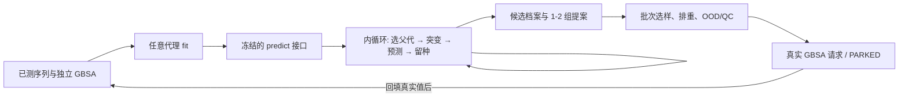

# 迭代突变搜索层与阶段 B 比较汇报（2026-10-02）

> **2026-10-05 范围澄清**：本页描述的**当前节点是阶段 B：代理模型尚未最终确定时，先实现与模型解耦的突变搜索接口并做计算诊断**。旧文提到的 96 条 `PARKED` 文件来自 9 月 30 日的探索性静态候选池配置，仅保留作接口验收和历史追溯；`PARKED` 是软件等待标签的状态，不代表团队已批准 96 条真实 GBSA 计算、选定主动学习或安排回填。阶段 C 及本页出现的协议、预算、真实回填均是未来条件方案，当前没有启动。给生工团队的统一口径见[总汇报](GBSA优化项目总汇报_生工团队版_20261005.md)。

> **2026-10-05 口径修订**：本页阶段 B 的 8192 是预测次数上限，实际平均用量分别为随机 8192、爬山 4143、束搜索 4769；随机策略也未使用爬山/束搜索的共同初始种子。因此下文“相对随机更优 30/30”“阶段 C 默认爬山”只能保留为原始代理诊断记录，**不能作为公平算法比较或真实 GBSA 优胜结论**。新比较采用共享起点及逐种子实际预测次数截断，见 [九月完整汇报](九月工作完整汇报_20261005.md) 的十月补验证章节。旧运行包与原数值未改写。

> 日期：2026-10-02（当日完成并验证；全部长作业在服务器 `100.81.254.35` 以 `nice -n 19`、2 线程投递）
> 执行依据：[突变序列迭代搜索算法与代理接口实施方案_20261002.md](../../项目记录/突变序列迭代搜索算法与代理接口实施方案_20261002.md)（本阶段新方案）、[GBSA 代理接口与候选闭环实施方案_20260930.md](../../项目记录/GBSA代理接口与候选闭环实施方案_20260930.md)（上一阶段方案，保留生效）
> 阶段 C 预注册模板：[阶段C预注册模板_真实GBSA决策性比较_20261002.md](../../项目记录/阶段C预注册模板_真实GBSA决策性比较_20261002.md)
> 对上一期汇报（`GBSA候选闭环与选样确认_20261001.md`）：**无勘误**；96 条 `PARKED` 批次、v0.2.0 接口、greedy 选样定案均未改动，本阶段在其上**新增一层独立的迭代搜索能力**。

---

## 1. 一句话总览

上一阶段的 `greedy/random` 解决的是「**给定候选池后的批次选样**」；本阶段补上「**突变序列逐代迭代搜索**」：在 141 nt 骨架的 13 个可变位点上由代理预测独立 `gbsa`，多代生成、打分、留种，产生候选档案并交给既有选样/`PARKED`/回填链。第一版实现分层随机、多起点爬山和束搜索，完成工程接入及 30-seed **同预测上限**诊断。原诊断无法区分起点与实际预测用量；10 月 5 日已补公平口径比较，真实算法优胜仍待 GBSA。XGB σ 的校准研究未支持启用不确定性采集。全程零新增 MD/MM-GBSA，96 条待测批次未改动。

---

## 2. 本阶段的目标与边界（先划清能说什么）

| 项 | 决定 |
|---|---|
| 优化目标 | 独立 `gbsa`（MM-GBSA，越小越强）；加权 `label` 不使用；dock 不进主线 |
| 搜索层接口 | `SEARCH_INTERFACE_VERSION=0.1.0`：`SearchContext / ScoredCandidate / CandidateGroup / SearchResult` + `SearchPolicy.search(context, scorer)`；唯一模型能力 = 有序批量预测 |
| 内/外循环分工 | **内循环只花计算预算**（选父代→突变→`predict`→留种，多代连续，不调用 Oracle、不写真实标签）；**外循环**仍走现有选样/PARKED/回填/重训 |
| 候选空间 | 141 nt、仅 13 位点可变、`n_from_wt` 4–13（可配置）；全表/已测/待测/失败/历史批次全量排重 |
| 第一版算法 | 分层随机（基线）、多起点局部爬山、多起点束搜索（默认推荐）；**GA 与批量 BO 延后** |
| 结论等级 | 全部为**代理表计算诊断**：`best_pred_gbsa` 是代理输出，不构成发现效果证据；真实发现结论需要阶段 C（真实 GBSA） |
| 96 条既有批次 | `srv_handoff_20260930_182400` 仍 `PARKED`，本阶段零改动、不覆盖 |

---

## 3. 为什么要加搜索层（与固定池选样的区别）

- 现有 `scripts/loop/selection.py` 的 `greedy/random/greedy_diverse/…` 回答「**池里选哪些去测**」；100-seed 的 greedy 结论（Δregret −1.878、top-10% 召回 +0.215）也是**固定池的表内回顾证据**，不等于多代生成搜索有效。
- 理论空间 `4^13 = 67,108,864`（含 WT），2000 条已测表的最优不能当全空间最优；`mutate_from_parent` 已有局部突变能力，但主循环此前只在 setup 时生成一次静态池。
- 本阶段新增独立搜索层（`scripts/loop/search*.py`），与代理彻底解耦：代理可以是预训练、经典或集成模型，`SearchPolicy` 不变；未来换代理/接 MD 都不动搜索层。



---

## 4. 搜索层接口与档案（v0.1.0）

**接口**（`scripts/loop/search.py`）：

```python
SearchContext   # 已测序列+GBSA、排除集(全表/历史批次/失败)、WT、可变位点、
                # allowed_n_from_wt、seed、max_unique_predictions、max_generations、data_sha256
SearchResult    # ranked_candidates(已排序, 不含已测种子) + groups(1-2 组) + stop_reason + 状态路径
ScoredCandidate # candidate_id/sequence/代数/父代溯源/parent_evidence(measured|predicted_only|none)/
                # operator(seed|one_hop|two_hop|global_restart)/pred_gbsa/sigma/model_id/feature_version/
                # ood_flag/最近训练 Hamming/约束版本/耗时
SearchPolicy    # search(context, scorer) -> SearchResult
SequenceScorer  # 有序批量预测 + 硬唯一预测预算；缓存按模型快照隔离
```

**档案**（`search_archive.py`，每个搜索一个目录 `round_NNN_search/`）：`search_snapshot.json`（数据/模型/约束/策略指纹，恢复时**强制匹配**）、`search_state.json`（每代检查点：父代、RNG 状态、预算计数；崩溃窗口按已提交行对账）、`predictions.jsonl` + `search_evaluated.jsonl`（**全部评分含被淘汰子代**，可审计预测极值漂移）、`search_candidates.csv / search_generations.csv / search_groups.json / search_summary.json / files.sha256`。同上下文重跑即续跑；完成后重跑幂等返回同一结果；**边界恢复与不中断运行逐位一致**（除墙钟字段）。

---

## 5. 三种同预算算法与工程验收

| 方法 | 机制 | 地位 |
|---|---|---|
| `stratified_random` | 允许层内分层随机生成，预测后保留最低分；无代际反馈 | 必备基线 |
| `multi_start_hill_climb` | 共享种子集的一跳爬山；比较全部可行一跳邻居，局部最优重启；预算内截断提案 | 必备基线 |
| `multi_start_beam` | 束宽 32 × 每父 32 子代 × ≤8 代；80/20 一跳/两跳混合（一跳配额按 RNG 采样避免位点偏置）、10% 全局重启、显式可关闭的多样性规则（前 4×束宽按 μ 排序后要求与已留父代 ≥2 位点不同）、停滞/预算/耗尽停机 | 推荐默认 |

公平性：同上下文/同种子集（共享 `pick_initial_seeds`）/同代理快照/同硬预算；实测 gbsa 只决定种子资格、不与预测值混合排序；种子计入预测预算，已测种子可作父代但**不可再导出**。

**契约测试 26 项**（`tests/test_search_contract.py`）：最小化方向、批量顺序、13 位点约束、去重、39 邻居上限、硬预算、同 seed 可复现、模型缓存隔离、束/爬山中断恢复逐位一致、快照不匹配拒续、完成后幂等、NaN/错长/耗尽/无种子清晰失败、1–2 组输出规则；OOD 辅助与 `loop.py` 实现**逐值等价**（测试锁定）。

---

## 6. 闭环接入（方案步骤 5）

`loop.py` 新增 `--candidate-source search`（**仅前瞻式**；回溯式在参数校验处直接报错——搜索候选在标准表之外，TableOracle 无标签可揭示）。每轮流程：

```
当前已标注集 → 拟合代理 → 搜索层重建候选池(round_NNN_search/, 恢复时按已标注集摘要复用或确定性重跑)
→ 既有 select_batch/Oracle → 批次导出 → PARKED(rc 3) → --ingest 回填 → 重训 → 下一轮新搜索
```

- 搜索排除集 = 完整 2000 条标准表 ∪ 已标注/已选/待回填/失败 ∪ 历史批次全部序列；搜索 seed = loop seed + round；**全部搜索超参落盘并进入恢复指纹**（配置变更续跑被拒）。
- 台账 `source=search_pool`；metrics 新增 `search_stop_reason/search_n_unique_predicted/search_best_pred_gbsa/search_pool_size` 列；`tools/verify_loop_run.py` 对新运行包复核 `[ok]`。
- 集成测试 5 项（`tests/test_search_loop_integration.py`）：前瞻式限定、停车流与档案（批次 ∩ 标准表 = ∅）、续跑幂等（同一 batch_id、无重复行）、配置变更拒续、**两轮回填重训与新池**（round-2 搜索在 40+10 已标注集上重建，snapshot `measured_count=50`）。
- 本地冒烟 `loop_search_park_review`：PARKED(rc 3)，25 条待测批次，`ood_fraction=0.035`、批次 `n_from_wt` 11–12——**工程冒烟，协议串为占位符，不是新的真实交接批次**。

---

## 7. 服务器 8192 开发吞吐

`runs/srv_search_dev_beam_8192_20261002_014350`（DONE，约 108 s，`xgb_boot5_xgboost`）：5598 个唯一预测（stagnation 停机，未耗尽预算）、best_pred 5.838、2 组 → 吞吐 ≈52 预测/秒，满预算 8192 预计 2.5–3 分钟。证据：`evidence/loop_20261002_search/`。仅为计算可行性/档案完整性证据。

---

## 8. 阶段 B：30-seed 同上限比较（历史结果与判读限制）

协议：seeds 201–230，同划分（300 init）/同代理（xgb 5 成员 + 折内 screen-100）/同 8192 唯一预测预算；配对诊断 vs `stratified_random`（bootstrap 95% CI + 胜平负）；附加两臂——**跨模型排序稳定性**（top-50 由两个重训代理重打分 → Spearman）与**重训一致性**（10 seeds 换代理种子重跑 → top-50 Jaccard）。运行 `srv_search_compare_30seed_20261002_024621`：120/120 子运行、`completeness.json` ok。证据：`evidence/search_compare_30seed/`。

| 指标（均值） | stratified_random | multi_start_hill_climb | multi_start_beam |
|---|---|---|---|
| best_pred_gbsa | 10.85 ± 1.93 | **6.02 ± 2.02** | **6.07 ± 1.99** |
| 相对 random 配对 Δbest_pred（CI） | — | **−4.82 [−5.37, −4.26]，30/30 胜** | **−4.78 [−5.34, −4.19]，30/30 胜** |
| 预测用量 / 停机 | 8192（满预算） | 4143（30/30 local_optima） | 4769（27/30 stagnation） |
| top-50 多样性（两两 Hamming） | 8.34 | 4.19 | 3.93 |
| top-50 OOD 比例 | 0.055 | 0.0007 | 0.0007 |
| top-50 最近训练 Hamming | 4.74 | 4.04 | 3.83 |

**爬山 vs 束（原始配对，30 seeds）**：Δbest_pred（束−爬山）= +0.047，CI [−0.038, +0.156]，中位数 0.000，**20/30 完全平局**（6 胜 4 负）；爬山预测用量更少、多样性略高。该表未按实际预测次数对齐，故不能据此定案爬山、束搜索或随机策略。GA/BO 是否加入也需等待同口径诊断及真实 GBSA 决策。

**不稳定风险（本阶段最重要的发现，方案 R7 类风险的直接量化）**：

| | top-50 跨模型 Spearman（A vs 重训 1/2） | top-50 换代理重跑 Jaccard（10 seeds） |
|---|---|---|
| stratified_random | 0.295 / 0.267 | 0.242 [0.188, 0.286] |
| multi_start_hill_climb | 0.179 / 0.180 | **0.029 [0.005, 0.057]** |
| multi_start_beam | 0.228 / 0.180 | **0.037 [0.006, 0.073]** |

随机基线也只有 0.27–0.30，说明这是代理细粒度排序的固有噪声；但引导式搜索会**放大**它——换代理种子重跑后 top-50 名单重叠仅 2.9–3.7%。即：搜索找到的"最低预测候选"及其具体名单对代理重训高度敏感，**最优点附近主要由噪声驱动**。因此搜索产出的正确定位是「**一组预测优选候选**」而非可靠排序。

---

## 9. XGB σ 校准研究（uncertainty 采集的放行门槛）

`scripts/reproduction/eval_sigma_calibration.py`：30 seeds（301–330）× 两档 n_train（1600 / 400=闭环尺度），折内 screen-100、5 成员；检验 σ 是否分层 |误差|、LCB（μ−βσ，β=0.5/1/2）是否优于纯 greedy 的 top-5%/10% 召回、打乱标签负对照。运行 `srv_sigma_calibration_30seed_20261002_172402`（DONE，60 行）。证据：`evidence/sigma_calibration_30seed/`。

| 指标 | n_train=1600 | n_train=400（闭环尺度） |
|---|---|---|
| spearman_mu（参考技能） | 0.353 [0.341, 0.365] | 0.250 [0.234, 0.266] |
| σ vs \|误差\|（Spearman） | 0.028 [0.010, 0.045]（弱正相关，十分位 7.23→7.75） | 0.014 [−0.014, 0.040]（**不显著**） |
| 打乱标签对照 | −0.007 ≈0 ✓ | 0.016（与真标签同量级） |
| Δrecall LCB−greedy（全部 β、top-5%/10%） | 无增益；**β=2 top-10% 显著有害 −0.046 [−0.064, −0.028]** | 全部 CI 跨 0 |

**放行决定（summary.json 已固化）**：`gate_lcb_beats_greedy` 全 False、400 档 `gate_sigma_tracks_error` False → **uncertainty 采集保持关闭**；`sigma=ensemble_spread_uncalibrated` 继续只作记录字段；`mixed_control` 的 uncertainty 桶禁用、`uncertainty_mixed` 拒绝、批量 BO/EI/Thompson 门槛未过。结合 §8 的排序不稳定，当前瓶颈是**代理细粒度排序噪声**，不是采集函数——下一步优先代理/标注改善（去噪、特征、更多标签）。

---

## 10. 阶段 C 预注册模板

`docs/项目记录/阶段C预注册模板_真实GBSA决策性比较_20261002.md`（模板，`<待定>` 字段须在测量前填写冻结）：冻结项（协议串经 `--pin-protocol` 审计钉定、预算 B、随机对照份额、盲法、QC 规则）；**主终点 = 同实测预算下各策略所选新序列的最低实测 `gbsa`**；主判据 = 爬山 vs 随机对照份额的配对差 bootstrap 95% CI 上界 <0；必报中位数/胜平负/尾部/失败率/分层/预测—实测 Spearman；停止门槛（未达标退回最简策略、预测—实测相关低则先修代理）；签发前检查单。**真实 GBSA 预算与协议到位前不得签新批次。**

---

## 11. 工程验证体系

| 层 | 内容 | 状态 |
|---|---|---|
| 契约测试 | 原有 70 项 + 搜索层 26 项 + 搜索闭环集成 5 项 + 比较驱动 6 项 + σ 校准 3 项 = **110 项全过** | ✅ |
| 运行包 | `run_experiment.py` 统一入口（config/数据哈希/环境/源码清单/标记）；`verify_loop_run.py` 对搜索接入的 PARKED 运行复核 `[ok]`；比较与校准运行均 DONE + `completeness.json` 验收 | ✅ |
| 双环境 | 本地无 xgboost 回退 `xgb_boot5_sklearn_gbm`、服务器 `xgb_boot5_xgboost`，后端均记入 `model_id`；正式数字一律来自服务器 xgboost 后端 | ✅ |
| 恢复 | 搜索档案指纹强制匹配、崩溃边界对账、边界恢复逐位一致（测试锁定）；`loop.py` 指纹含全部搜索超参 | ✅ |
| 文档 | 43 个 Markdown 本地链接 0 断链；CHANGELOG/PROJECT_STATUS/scripts README 随步更新并同步服务器 | ✅ |

---

## 12. 关键结论汇总

| 结论 | 依据 |
|---|---|
| 迭代搜索层 v0.1.0 可跑通、可恢复、可审计 | 接口/档案/三策略 + 110 项测试 + 本地与服务器冒烟/吞吐全 DONE |
| 搜索层已接入闭环（仅前瞻式） | 每轮搜索重建候选池 → 既有选样/PARKED/回填/重训；两轮回填与新池端到端测试 |
| 引导式搜索在代理上稳定优于分层随机 | Δbest_pred ≈ −4.8，30/30 seeds——但这是**代理最小化**，不构成发现效果证据 |
| **爬山 ≈ 束搜索** | 配对 CI 跨 0、中位数 0、20/30 平局 → 阶段 C 候选默认取爬山（更简、预测用量更少） |
| **排序不稳定被量化** | top-50 跨模型 Spearman 0.18–0.30；换代理重跑重叠仅 2.9–3.7% → 候选定位为「一组预测优选」，非可靠排序 |
| **σ 不是可用的误差/命中信号** | LCB 无 β 增益、β=2 显著有害；uncertainty 采集保持关闭 |
| 96 条待测批次未改动 | 仍 PARKED，等协议钉定 + 真实 GBSA；本阶段零新增 MD |

---

## 13. 未完成与下一步

1. **阶段 C（唯一需要外部输入的闭环项）**：等生工团队真实 GBSA 预算与统一 QC 协议 → 按预注册模板填写冻结 → 签新批次（候选默认多起点爬山 + 随机对照份额）；96 条既有批次仍按上一期流程先钉协议再回填。
2. **代理/标注改善（按 §8–§9 结论优先）**：细粒度排序噪声是当前上限——候选方向：标签去噪/复测（已有 k-NN Hamming 平滑 +0.019 的正式结果）、特征/训练规模、σ 的替代构造（若换代理需重新跑校准门槛）。
3. **GA / 批量 BO**：GA 仅在束搜索已可复现且交叉/种群多样性有明确增益时再实现；BO 必须先有校准通过的 σ——当前证据均不支持，暂缓。
4. **发布口径**：对外引用本阶段结论一律带「代理表计算诊断」边界与「爬山≈束、排序不稳定、σ 未校准」三点。

---

## 附：证据与代码清单

**运行包（服务器 `runs/`，证据副本在本地 `evidence/`）**：

| run | 内容 |
|---|---|
| `srv_search_dev_beam_8192_20261002_014350` | 8192 开发吞吐，DONE（`evidence/loop_20261002_search/`） |
| `srv_search_compare_30seed_20261002_024621` | 阶段 B 30-seed 比较，DONE，120/120（`evidence/search_compare_30seed/`） |
| `srv_sigma_calibration_30seed_20261002_172402` | σ 校准 30-seed，DONE，60 行（`evidence/sigma_calibration_30seed/`） |
| 本地 `search_smoke_{random,hillclimb,beam}_review` | 256 级三策略冒烟，DONE |
| 本地 `search_compare_3seed_review*` / `loop_search_park_review` | 驱动冒烟 / 搜索接入 PARKED 冒烟 |

**代码（新增/修改）**：`scripts/loop/search.py`（接口 v0.1.0 + SurrogateScorer）、`search_archive.py`（档案/缓存/指纹/对账）、`search_policies.py`（三策略）、`search_run.py`（独立入口，`--model-seed` 与划分分离）、`search_compare.py`（阶段 B 驱动）、`scripts/loop/loop.py`（`--candidate-source search` 接入）、`scripts/reproduction/eval_sigma_calibration.py`（σ 校准）；配置 `configs/experiments/search_*.json`、`loop_search_prospective_park.json`、`eval_sigma_calibration_*.json`；测试 `tests/test_search_contract.py`（26）、`test_search_loop_integration.py`（5）、`test_search_compare_contract.py`（6）、`test_sigma_calibration_contract.py`（3）。

**工具**：`tools/launch_loop_jobs.sh` 新增 `search_8192 / search_compare_30 / sigma_calib_30` 投递模式；`tools/sync_remote.py` 全程用于服务器同步。
