# GBSA 优化项目阶段总汇报：论文方法迁移、代理模型评价与七算法突变搜索

_面向生工团队的研究汇报与演示素材：说明研究目标、实验设计、实际结果、方法选择及后续实施条件。_

本项目的目标是在规定的 RNA 突变空间内寻找**独立 GBSA 更低的序列**。研究围绕两个相互衔接的问题展开：第一，现有数据能否支持可靠的 GBSA 排序预测；第二，在评分模型尚未最终确定时，能否先完成通用评分接口、合法序列变异、搜索算法迭代和候选分组。本文依次介绍论文方法迁移、主动学习适用条件、GBSA 代理评价、docking 独立支线，以及七种搜索算法的实现与比较。

本阶段已完成主要论文组件的迁移、已有数据上的受控模型比较、七算法搜索接口和计算评估。代理模型尚未达到新候选可靠精排的要求，可以暂缓无明确假设的模型扩展。搜索层已能在固定评分器下运行，后续可接入预训练模型、经典模型或集成模型。**新增候选的真实 GBSA 计算与湿实验验证尚未开展**，因此当前算法结果用于判断工程能力和固定代理下的搜索表现。

全文实验表来自保存的 CSV（逗号分隔值表格）或 JSON（结构化记录）；数据图依据这些实际结果生成。流程图用于解释已实现机制与未来依赖，未来步骤明确标注为未启动。图提供 PNG（位图）和 SVG（矢量图），便于制作演示文稿；表格按统一小数位显示，证据源文件保留原精度。

---

## 0. 汇报主线与阅读导航

PPT 是 PowerPoint 演示文稿。本文可作为演示文稿的详细讲稿，也可独立阅读。建议按“论文方法迁移 → 主动学习条件 → GBSA 代理评价 → docking 支线 → 模型无关接口 → 七算法比较 → 实施计划”组织。每项结果同时说明目标、训练量、划分协议与证据等级，便于判断哪些结论可直接比较。

| 建议页序 | 主题 | 素材 | 讲述重点 |
| --- | --- | --- | --- |
| 1–3 | 论文复现/迁移和实际运行 | §1、A02 | 实现范围、单次/5种子证据与受控预训练比较 |
| 4–6 | 主动学习为何暂不启用 | §2、A06 | 旧结论作废；固定池方法、指标和发现/模型终点分开 |
| 7 | 数据与独立GBSA目标 | §3、A01 | 2000条、13位点、标签来源；种子不是新增测量 |
| 8–11 | 代理改进与0.506历史路径 | §4–§5、A03–A04 | 保留真实优化路径；三类模型参照；详细方法与负结果 |
| 12–15 | docking历史预测与GBSA修正 | §6、A05、A12 | 0.5523是对接排序相关；旧配方与新残差区别、成本边界 |
| 16 | 为什么先做下游 | §7、A13 | 代理暂缓、通用接口先完成 |
| 17–19 | 评分器、接口与七算法 | §8–§9、A09 | 模型不限定、无交叉GA、ILS/SA/AdaLead的适配 |
| 20–23 | 公平比较和最新成绩 | §10–§12 | 同起点、实际次数、两代理条件、确认数据和稳定性 |
| 24–25 | 谱系/分组与完成清单 | §13–§15、A10 | 真实父本、一/两组定义、工程验收及统计复算边界 |
| 26–28 | 算法选择与分阶段计划 | §16–§17、A11 | 当前计算默认、新评分器复评、未来真实判定 |
| 备用 | 方法核验总表/术语/文献 | §18–§21 | 研究对象、证据关系、学术解释、JCR分区与验证边界 |

### 0.1 阶段工作概述

我们先将核糖开关设计论文的重要计算组件迁移到GBSA任务，历史单次与小规模融合尚未给出更强正式代理。随后发现旧主动学习实验有实现和评价问题；修复固定池比较后，低分选样更能找回好条目，但没有确认代理本身的提升。继续探索docking，在保持GBSA目标下，只有真实对接可得的支线出现条件增益。

当前代理仍未成熟，可以阶段性暂停优化，先把“合法变异—统一评分—保留—继续迭代—谱系及分组输出”搭好。七算法已完成计算比较；新候选真实GBSA与湿实验优胜仍待未来验证。历史固定划分从约0.4到0.506的特征优化成果应保留，它与多划分稳定能力是两个问题。

## 1. 论文方法迁移：研究依据、实现范围与受控评价

本项目以2000条既有RNA（ribonucleic acid，核糖核酸）序列的独立GBSA为预测/优化目标。GBSA是generalized Born/surface area，广义玻恩/溶剂可及表面积；MM-GBSA加上molecular mechanics，分子力学。它是计算结合评分，按项目方向越低越好，不是实验亲和力或论文原功能标签。以下先汇报论文迁移结果，再解释当前路线调整。数据详情见§3，缩写索引见§19。

### 1.1 迁移运行的数据与证据级别

| 运行/方法 | GBSA Spearman | 实际条件 | 证据等级 |
| --- | --- | --- | --- |
| 异域语料编码器历史单次 | 0.1228 | 1 次 80/20 划分；1600 训练；30 成员 | 探索单次，非 30/100 确认 |
| 同域突变语料+物理融合 | 0.2610 | 5 种子；SD 0.0479；192 物理维 | 探索结果，转导/筛选口径受审计限制 |
| 历史深度集成 active 曲线 | 起点 0.2958；末点 0.3564 | 初始 400，每轮 100，10 成员 | 仅留历史，不用于 AL 优劣 |
| 同包 random 曲线 | 起点 0.2958；末点 0.3728 | 同包历史对照 | 旧有效性结论撤回 |

[源结果](../../evidence/audit_20260924/server_results/reproduce.json)；[源结果](../../evidence/audit_20260924/server_results/paper_fusion.json)；[源结果](../../evidence/audit_20260924/server_results/active_deep.json)

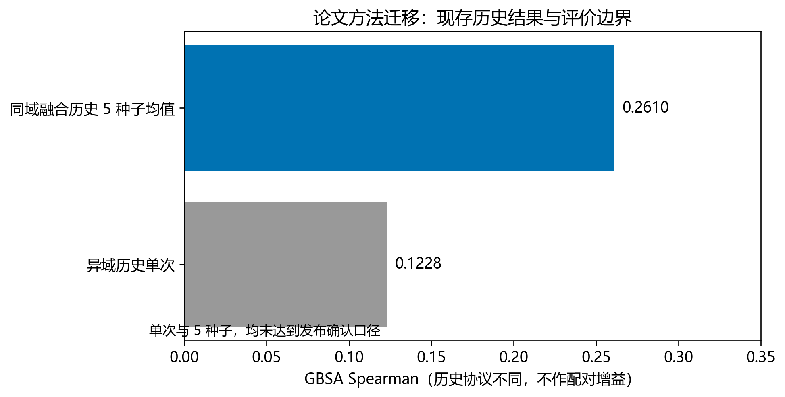

**图 A02（历史运行，非统一确认比较）：**0.1228 是单次划分；0.2610 是 5 种子融合的均值。这两者训练/特征/语料条件不同，不画成“仅换语料就提升”的配对收益，不据此证明预训练普遍无效。[矢量版](figures/阶段总汇报_20261006/A02_论文迁移历史结果.svg)。

原阶段汇报把整个工作称为“严格复现全部组件”，需要收窄为：**核对并迁移主要计算组件，保留明确的任务和成员数适配；尚无原功能任务完整复现实验。**同域语料 3 万条是修正后的默认配置口径，不凭现在的默认值反推每个旧运行都用了相同数量。5 种子融合曾存在全数据物理标准化、转导式预训练及全数据 useful 子块来源问题，故只保留为探索结果。

### 1.2 为什么选择这两篇论文

[gkag145 原论文](https://doi.org/10.1093/nar/gkag145)研究 NAND 杂交核糖开关的深度批量贝叶斯优化；NAND 是逻辑“与非”，指原研究功能任务，不是本项目标签。[RaptGen 原论文](https://doi.org/10.1038/s43588-022-00249-6)研究生成式适配体发现。我们借鉴的是序列表示、集成预测、提出候选和迭代优化的方法，不把原任务成功率直接套到 GBSA。

| 文献路线 | 原方法主要组件 | 本项目完成范围 | 尚未完成/不应宣称 |
| --- | --- | --- | --- |
| gkag145 | 序列预训练、Transformer 编码器、深度集成、批量贝叶斯采集、设计—构建—测试—学习 | 在 `scripts/reproduction/` 实现主要组件，核对论文源码关键细节，并适配为 GBSA 单输出 | 不等于完整复现原论文的四输出功能任务、100 成员配置及真实生物实验 |
| RaptGen | 变分自编码器、profile HMM 解码、潜空间、Gaussian process/UCB 搜索 | 阅读并分析它与固定 13 位点空间的匹配程度 | 未复现 RaptGen，也没有它的 GBSA 运行成绩 |

Transformer 是基于注意力的序列表示模型；VAE 是 variational autoencoder，变分自编码器；HMM 是 hidden Markov model，隐马尔可夫模型；GP 是 Gaussian process，高斯过程。SELEX 是 systematic evolution of ligands by exponential enrichment，通过指数富集进行配体系统进化，属于原适配体发现数据场景。当前固定 13 位点任务不等同于从 SELEX 数据生成可变长新适配体。

### 1.3 gkag145 组件如何迁移

| 组件 | 实际实现/文档化适配 | 对本项目的意义 |
| --- | --- | --- |
| 3-mer 分词 | 将相邻 3 个碱基作为 token（序列符号单元），69 词表 | 适配原序列编码方法 |
| 编码器 | 6 层、128 维、4 个注意力头，每头内部维度 64；前馈层 384；自定义余弦位置编码 | 以原代码细节为参照，不把模型名当效果保证 |
| 预训练 | MLM（masked language modelling，掩码语言建模）与 triplet loss（三元组损失）；MLM 掩码率 15%，80/10/10 替换规则 | 学习序列表示，不提供新的 GBSA 标签 |
| 预测头与集成 | 9×256 多层感知机；成员数由原研究 100 适配为 20–30，实际历史单次包 30；输出由四维适配为一维 | 学习独立 GBSA 的回归，不是原论文四功能输出的完全复制 |
| 采集组件 | UCB 分位数与 Kriging Believer | 组件已有实现；原主动学习曲线因后续审计问题不能作正式有效性证据 |

UCB 是 upper confidence bound，上置信界；GBSA 最小化若使用置信界，应核对方向，不能直接用最大化公式。Kriging Believer 是以当前预测填充临时候选标签以构建批次的方法。深度集成指分别训练多个网络再汇总，成员分歧需要单独校准。

### 1.4 论文迁移与模型评价的结论边界

论文中的原任务、已有数据上的预测结果和新序列的真实收益属于不同证据层级。下表概括报告中采用的解释原则，详细方法与数据在对应章节展开。

| 评价对象 | 实际依据 | 可支持的结论 |
| --- | --- | --- |
| Transformer与预训练 | 单次/5种子迁移结果存在探索口径限制；受控三种语料比较见§1.6 | 当前配置未超越经典参照；不能据此否定所有预训练架构 |
| 主动学习 | 旧实现存在方向、缩放与全数据筛选问题；修正后的树集成结果分别评价模型与发现终点 | 旧普遍判断不成立；有限池发现收益不等于代理排序提升，见§2 |
| 经验相关水平0.412 | 缺少可追溯的上界估计方法；0.399探索配置与正式评估不同 | 0.412仅作历史经验观察，不能计算“已达到天花板97%” |
| 正GBSA与异常值 | 没有用于本报告的逐帧分析与独立重复轨迹证据 | 可提出协议与异常值核查问题；不能直接判定物理错误或MD未收敛 |
| docking目标与GBSA辅助信息 | 对接目标较易预测；折内残差比较中预测dock无益，真实dock有条件收益 | 保持独立GBSA目标；真实对接仅作为有条件的独立支线，见§6 |
| 代理优化范围 | 已覆盖若干经典模型、特征、平滑、预训练与集成配置 | 当前配置可阶段性收尾；不能据此宣称所有机器学习方法已穷尽 |
| 31000条三分量候选示例 | 有预测排序，没有新增真实标签；曾有1条训练重叠 | 仅为预测导出示例，不作为当前排序公式或真实发现成果 |

依据：[全项目审计](../项目记录/全项目审计_20260924.md)、[代理方法实验记录](../论文改进/A组实验汇总_20260926.md)、[当前主线约束](../../AGENTS.md)。

### 1.5 研究问题、实验设计与证据完整性

评价一个方法时，首先明确它回答的问题，再判断现有实验是否具备相应对照。源码核查可以确认实现范围、数据泄漏和公式错误；方法的增量收益则需要同划分、同训练条件和独立确认。本文分别保留探索性运行、受控开发实验、确认实验和未来真实验证四类证据。

| 研究问题 | 已完成的设计与核验 | 实际结论及适用范围 |
| --- | --- | --- |
| 原论文的主要计算组件是否已迁移 | 核对序列表示、编码器、预测头、集成与采集组件；明确目标和成员数适配 | 主要组件已迁移到 GBSA 单输出任务；原功能任务及生物实验没有完整复现 |
| 预训练语料是否带来稳定排序收益 | 三种语料条件与经典模型使用相同外层划分；120份测试预测及30份训练父本语料重建核验 | 域内预训练未满足晋级条件；结论限于当前预算和冻结编码器，见§1.6 |
| 主动学习是否同时改善代理与发现能力 | 树集成、四种采集策略、相同初始标签与固定池；30种子开发和100种子确认；3120份预测核验 | 模型排序提升未确认，低预测选样支持有限池发现；不能替代原论文深度整链评价，见§2.7 |
| 固定划分的0.506能否重现并推广 | 原1800/200划分准确重放；五组冻结配方完成30种子开发和100种子确认；655份预测复算 | 原划分优化成立，复杂配方的跨划分优势未复现，见§4.3 |
| 正确结构缺陷特征是否有增量价值 | 2000条结构重算、44个官方对照、训练内筛选及强制保留诊断；两组各120份测试预测 | 已验证公式与计算实现；当前 WT 目标与模型下未确认稳定排序收益，见§5.5–§5.6 |
| 对接信息能否辅助GBSA | 已有数据上的折内残差修正与预筛；分别评价预测对接与真实对接可得条件 | 真实对接有条件收益；新候选时的协议、成本和失败率仍需实测，见§6 |
| 搜索算法能否找到更低的真实GBSA | 七法已完成固定评分器下的公平计算比较；新候选没有真实标签 | 当前只能选择计算默认策略；真实优胜需统一 GBSA 协议与同成本对照，见§10–§17 |

下表列出已有数据上的模型训练与逐预测核验规模。每个预测文件对应一个模型条件、种子或采集轮次下的测试预测，不能将文件数解释为新的生物测量数。

| 实验包 | 指标行数 | 独立核对预测文件数 | 证据状态 |
| --- | --- | --- | --- |
| [树集成主动学习：100种子确认](../../evidence/supplement_20261006/local_supplement_active_confirm_20261006/) | 2400 | 2400 | DONE；逐预测重算通过 |
| [树集成主动学习：30种子开发](../../evidence/supplement_20261006/local_supplement_active_dev_20261006/) | 720 | 720 | DONE；逐预测重算通过 |
| [历史特征配方：100种子确认](../../evidence/supplement_20261006/local_supplement_history_confirm_20261006/) | 500 | 500 | DONE；逐预测重算通过 |
| [历史特征配方：固定划分与30种子开发](../../evidence/supplement_20261006/local_supplement_history_dev_20261006/) | 155 | 155 | DONE；逐预测重算通过 |
| [结构缺陷：训练内筛选比较](../../evidence/supplement_20261006/srv_supplement_defect_dev_20261006/) | 120 | 120 | DONE；逐预测重算通过 |
| [结构缺陷：强制保留诊断](../../evidence/supplement_20261006/srv_supplement_defect_force_20261006/) | 120 | 120 | DONE；逐预测重算通过 |
| [预训练语料：受控比较](../../evidence/supplement_20261006/srv_supplement_paper_aggregate_20261006/) | 120 | 120 | DONE；逐预测重算通过 |

[冻结实验协议](../项目记录/补实验冻结协议_20261006.md)、[完整汇总与文件哈希](../../evidence/supplement_20261006/index.json)、[服务器输入与终态审计](../../evidence/supplement_20261006/supplement_remote_validation_20261006.json)。七个模型比较包合计4135份预测文件、2600个发现轮次核验；2000条结构重算与44个官方对照另计，不能算作2000份回归预测。

以上实验均使用已有 GBSA 标签。新候选 docking、MD（molecular dynamics，分子动力学）与 GBSA 的真实计算数均为0。真实验证需独立确定协议、QC（quality control，质量控制）和预算。模型评价与搜索接口分别验收，搜索层建设可以在代理模型尚未成熟时开展。

### 1.6 预训练语料受控比较：相同划分与回归头

30个外层种子11001–11030，1600/400。相同初始编码器、相同冻结编码器和10个9层×256回归头；监督GBSA均方误差训练50轮。三臂为不预训练、历史服务器保留的外域语料、仅由训练父本产生的域内变体；预训练各2000条、5轮。域内语料与全部2000条已知序列均不重叠；外域编码器独立于FAD划分预训练后复用，域内每个划分单独训练。经典303维GBR作为额外同划分对照。这个实验控制语料效应，计算预算低于原论文和历史运行，不能宣称完整原任务复现。外域使用data/ngs_sequences.txt并保存来源文件及实际使用子集哈希；本实验没有从原文测序库重新下载并核对全部原始条目，所以不把文件名及历史NGS标注当作原论文完整语料来源已经重新认证的证据。

| 阶段 | 配方 | 平均Spearman | 种子均值95%区间 | 平均MAE | 平均RMSE |
| --- | --- | --- | --- | --- | --- |
| 30种子开发 | 外域语料预训练 | 0.1395 | [0.1218, 0.1574] | 7.9323 | 10.4671 |
| 30种子开发 | 训练父本生成的域内语料预训练 | 0.1193 | [0.1029, 0.1351] | 8.9241 | 11.5833 |
| 30种子开发 | 无预训练 | 0.1162 | [0.0980, 0.1347] | 8.0166 | 10.4296 |
| 30种子开发 | 303维经典GBR对照 | 0.3597 | [0.3469, 0.3727] | 7.4385 | 9.8076 |

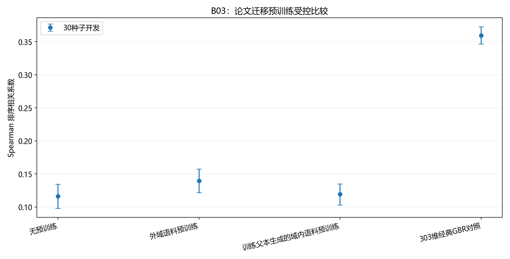

[矢量版](figures/阶段总汇报_20261006/B03_论文迁移补实验.svg)。区间为固定已测数据上随机划分种子均值的自助法区间，不是新独立生物样本总体区间。

| 实际执行与预算 | 记录 |
| --- | --- |
| 成员/监督训练轮数/预训练轮数 | 10 / 50 / 5 |
| 外域有效序列数及长度统计 | 2000 / {'min': 145, 'mean': 168.0115, 'max': 207} |
| 域内每种子预训练及全表嵌入平均秒数 | 33.6747 |
| 外域四组预训练及嵌入总秒数 | 161.3688 |
| 每种子各臂头训练/预测平均秒数 | {'外域语料预训练': 36.55, '训练父本生成的域内语料预训练': 36.87, '无预训练': 37.69, '303维经典GBR对照': 18.65} |
| 数值环境 | cuda / PyTorch 2.9.1+cu130 |

时间是程序记录的服务器分项墙钟时间，四组同时运行的分项秒数不能相加当总墙钟耗时；GPU异步执行可能把部分嵌入时间计入后续调用，不当作单候选推理成本基准。外域按文件顺序取前2000条有效、唯一且不属于已知FAD的序列；域内序列都是141核苷酸，二者长度和总词元预算没有强行匹配。外域来源和使用内容的SHA256（安全散列算法256位）保存在paper_manifest.json，域内每种子生成序列及哈希均回收并从训练父本独立重建核对。

| 臂 | 相对无预训练ΔSpearman | 95%区间 | 胜/平/负 |
| --- | --- | --- | --- |
| 外域语料预训练 | +0.0234 | [-0.0006, 0.0472] | 21/0/9 |
| 训练父本生成的域内语料预训练 | +0.0031 | [-0.0128, 0.0182] | 16/0/14 |
| 303维经典GBR对照 | +0.2435 | [0.2273, 0.2600] | 30/0/0 |

| 误差指标（差值负更好） | 臂 / 无预训练 | 均值差 | 95%区间 | 胜/平/负 |
| --- | --- | --- | --- | --- |
| mae | 外域语料预训练 | -0.0843 | [-0.1525, -0.0141] | 22/0/8 |
| mae | 训练父本生成的域内语料预训练 | +0.9076 | [0.8182, 0.9946] | 0/0/30 |
| mae | 303维经典GBR对照 | -0.5781 | [-0.6275, -0.5293] | 30/0/0 |
| rmse | 外域语料预训练 | +0.0376 | [-0.0356, 0.1174] | 13/0/17 |
| rmse | 训练父本生成的域内语料预训练 | +1.1537 | [1.0373, 1.2700] | 0/0/30 |
| rmse | 303维经典GBR对照 | -0.6219 | [-0.6851, -0.5578] | 30/0/0 |

晋级100种子的条件是域内臂对另外两预训练臂以及经典对照的Spearman配对差区间均为正；未达条件则保存开发结果，不追加以挑选好结果为目的的参数或种子。

| 域内臂 / 对照 | 排序均值差 | 95%区间 | 胜/平/负 | 预设条件 |
| --- | --- | --- | --- | --- |
| 无预训练 | +0.0031 | [-0.0128, 0.0182] | 16/0/14 | 未达到 |
| 外域语料预训练 | -0.0203 | [-0.0441, 0.0034] | 13/0/17 | 未达到 |
| 303维经典GBR对照 | -0.2404 | [-0.2569, -0.2241] | 0/0/30 | 未达到 |

**预训练配置的晋级判断：**未达到全部晋级条件，不追加本配方的100种子确认；保留三臂/经典对照的完整开发证据。

执行调度分四个互不重叠的种子组，四组分别DONE后再核对并聚合；外域编码器在组内复用，四组使用同一初始权重、预训练随机种子及语料哈希。额外的四次外域预训练是调度开销，不是某一臂额外训练了四倍。没有改变每个模型的预算或挑选种子；首个串行终止包保留为FAILED并不纳入这些数值。

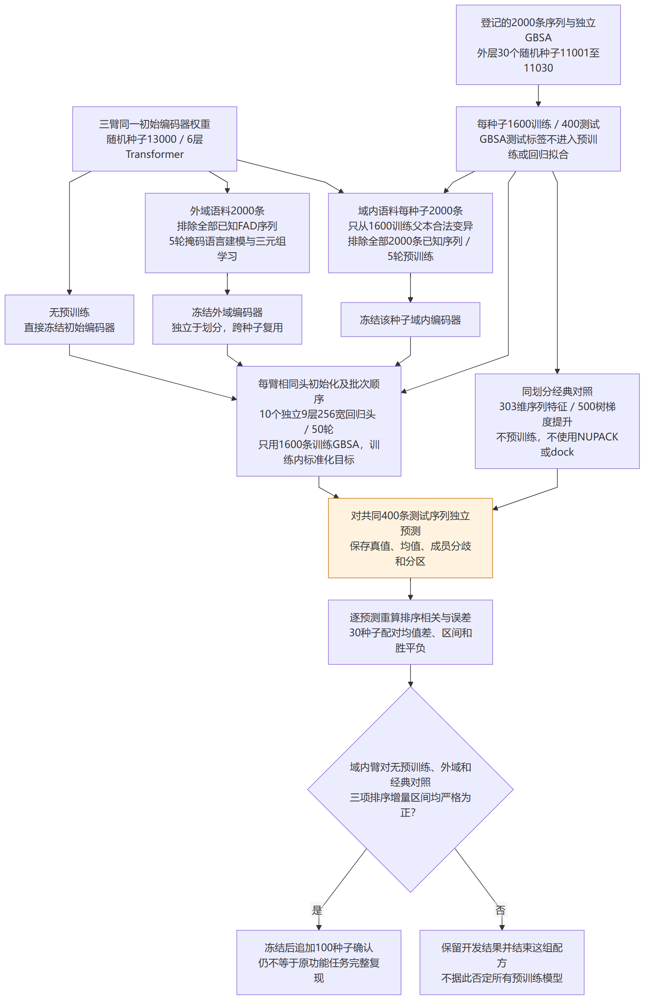

[矢量版](figures/阶段总汇报_20261006/A14_预训练受控比较.svg) · [可编辑流程源](figures/阶段总汇报_20261006/A14_预训练受控比较.mmd)

流程图可编辑源代码

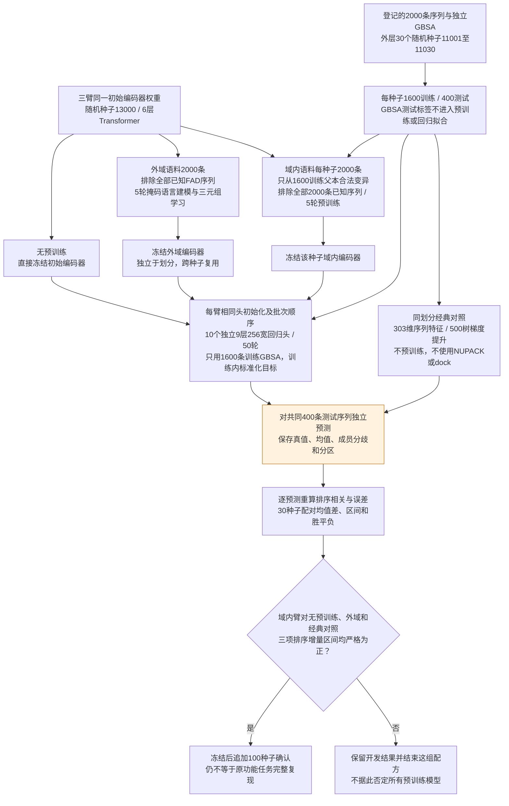
```mermaid
flowchart TB
    D["登记的2000条序列与独立GBSA<br/>外层30个随机种子11001至11030"] --> T["每种子1600训练 / 400测试<br/>GBSA测试标签不进入预训练或回归拟合"]
    I["三臂同一初始编码器权重<br/>随机种子13000 / 6层Transformer"] --> N["无预训练<br/>直接冻结初始编码器"]
    I --> F["外域语料2000条<br/>排除全部已知FAD序列<br/>5轮掩码语言建模与三元组学习"]
    I --> M["域内语料每种子2000条<br/>只从1600训练父本合法变异<br/>排除全部2000条已知序列 / 5轮预训练"]
    T --> M
    F --> FF["冻结外域编码器<br/>独立于划分，跨种子复用"]
    M --> MM["冻结该种子域内编码器"]
    N --> H["每臂相同头初始化及批次顺序<br/>10个独立9层256宽回归头 / 50轮<br/>只用1600条训练GBSA，训练内标准化目标"]
    FF --> H
    MM --> H
    T --> H
    T --> C["同划分经典对照<br/>303维序列特征 / 500树梯度提升<br/>不预训练，不使用NUPACK或dock"]
    H --> E["对共同400条测试序列独立预测<br/>保存真值、均值、成员分歧和分区"]
    C --> E
    E --> A["逐预测重算排序相关与误差<br/>30种子配对均值差、区间和胜平负"]
    A --> G{"域内臂对无预训练、外域和经典对照<br/>三项排序增量区间均严格为正？"}
    G -- 是 --> Y["冻结后追加100种子确认<br/>仍不等于原功能任务完整复现"]
    G -- 否 --> Z["保留开发结果并结束这组配方<br/>不据此否定所有预训练模型"]
    classDef held fill:#fff3df,stroke:#c77919;
    class E held;
```

图A14对应本实验冻结的语料控制实验；晋级分支是事先规定的条件，不代表100种子预训练确认已经执行。预训练采用相同序列数和轮数，外域长度不同，所以计算的总词元数及耗时不完全相等；编码器都只作为冻结表示使用。

## 2. 主动学习：为什么本阶段暂不启用，以及固定池重评到底说明什么

### 2.1 先定义主动学习，避免把它与搜索算法混淆

AL是active learning，主动学习：模型在尚无标签的候选中选一批，请标签来源给真实结果，再用新增标签更新模型，反复“选点—测量—重训”。主动学习不是一种固定代理模型；随机森林、预训练网络、深度集成都可被放在这条外循环。遗传算法、爬山等则可在一次外循环之内用**固定评分器**产生/筛选新序列，也可完全不启动真实测量。

| 层面 | 一次迭代改变什么 | 本项目当前状态 |
| --- | --- | --- |
| 代理模型训练 | 从已有真实标签学习序列→GBSA函数 | 基准/多种探索已做，成熟模型未定 |
| 搜索内循环 | 保持模型参数不变，父本→变异→模型评分→保留→下一代 | 七算法与接口已完成，当前主工作 |
| 主动学习外循环 | 从选出的候选取得新增真实标签，更新训练集/模型，决定下一批 | 暂不正式启用，不能默认已获GBSA预算 |
| 历史固定池模拟 | 先隐藏已有标签，按策略揭示并重训，不产生新测量 | 已完成，用于方法/工程回顾评价 |

### 2.2 从论文迁移到旧主动学习曲线：哪些结论必须撤回

原深度集成主动学习曲线存在以下实现与评价问题，无法据此判定主动学习与随机选样等效，也无法把模型瓶颈归因于GBSA噪声：

1. **方向错误：**GBSA要最小化，但历史promising（低分候选）桶用反号，实际优先了高预测分。当前已修正低分优先，修代码不能倒改旧结果为有效结果。
2. **坐标不一致：**训练与候选/测试分别标准化，距离和模型输入不再同一坐标。正确比较须保存一套允许数据来源下的缩放再一致应用；当前代码的修正版本与旧曲线要区别。
3. **全数据选结构子块：**useful子块曾看过全部标签，不能视为每个训练折内重新选择；即使采集时没看holdout标签，也不能忽略此前的选择信息。
4. **其他协议差异：**旧物理特征全数据缩放、包含留出序列的转导预训练、模型成员数/输出任务适配，均影响与原论文或新实验的比较。

代码与审计记录确认了这些缺陷，因此旧曲线的AL优劣解释无效。树集成受控评价见§2.7，它采用不同评分器，不能替代原论文深度集成整链的有效性验证。论文单次与5种子结果仅描述对应迁移配置。[论文迁移记录](9月/论文复现与改进_dock_gbsa进展.md)、[代码方向记录](../../scripts/reproduction/active.py)。

### 2.3 现在为什么可以决定暂不正式启用

| 当前依据 | 真实数据/状态 | 能推出的阶段决策 |
| --- | --- | --- |
| 代理排名能力有限 | 100种子v8ρ约0.3748；新候选重训/跨代理名单敏感 | 不能默认代理能可靠指导新序列的真实最优搜索 |
| 不确定性未校准 | 400训练时σ与绝对误差ρ约0.0137，CI跨零；1600时也仅约0.0281 | 暂不把成员分歧当可靠错误概率或用于复杂采集的保证 |
| 置信界采集未获收益 | 1600训练、β=2时LCB相对μ排序的top-10%召回差约−0.0458，CI[−0.0642,−0.0275] | 当前不确定性采集配置不建议启用；不是所有贝叶斯优化无效 |
| 修复固定池的模型终点 | greedy−random holdoutρ差−0.00434，CI[−0.0150,+0.0066] | 没有确认“更会选点就让代理更好” |
| 真实标签供给 | 未批准正式新GBSA协议/预算；新增真实标签为0 | 没有当前真实AL外循环的输入条件 |
| 当前研究任务 | 模型类型未定，先完成后续迭代算法和通用评分接口 | 可以冻结评分器做计算比较，不要求此时定AL方法 |

σ是ensemble成员预测的标准差，μ是均值，β是采集时分歧权重；LCB是lower confidence bound，下置信界，在最小化时常以μ−βσ排序。这里σ未校准，不能把“上下置信界”名称等同于已验证覆盖率。详细校准表和接口边界见§8.5。

**因此汇报可说“本阶段暂不采用正式主动学习”：当前缺少可信的不确定性、确认的代理提升和真实新标签资源。不能说“主动学习在科学上不可用”。**后面固定池确认反而支持greedy的发现终点：它更容易找回历史池里好条目，和代理相关系数不提高并不矛盾。

### 2.4 以后若重启，必须分别回答两种问题

第一问是“同新增标签预算下，代理holdout排序是否比随机更好”，第二问是“同预算是否找到真实GBSA更低/更多好候选”。两者分别预注册主指标，不能只挑其中有利的一项来宣布整个AL成功。先用修复的有限池30种子开发，在训练折内完成预处理/筛选，固定初始样本、留出、候选和查询预算；如晋级再冻结100种子。真正新序列的外循环还需要统一标签协议、可追溯成本和独立验证，属于未来工作。

以下详细解释已经做过的静态池实验。它帮助重评选点能力，**不自动成为当前实际实验安排**。

### 2.5 这个实验与当前多代搜索有什么不同

这是**在已测表上模拟“先不知道标签、按策略逐批揭示”的回顾式选样实验**。不是生工团队做的新测量，也不是当前七算法的父本→变异→子代搜索。它用既有GBSA检验“有限池内如何选择值得查询的序列”，与“模型怎样得到更好”是两个相关但不同的终点。

每个种子用同一随机排列，从2000条取300初始已标注、200独立holdout（留出评估集）、600固定候选池；剩余900本实验不用。四策略共享这个分区。候选池GBSA对策略隐藏，只有选中后由TableOracle（历史表标签提供器）揭示；holdout永不被查询或加入训练，真实池最优只由评价程序计算，不能传给选择器。

一轮这样做：当前标签训练5成员`xgb`代理（303序列特征、训练内筛100）→给剩余候选打分→按策略选50条未选序列→读取其历史GBSA→并入训练并重训→在同200留出条目评价→保存台账与当轮数据，进入下一轮。共5轮，**新增揭示250条，训练从300到550**，不是总预算550个新计算。

| 轮次 | 采集前训练数 | 可选择池数 | 当轮新增揭示 | 累计揭示 | 采集后训练数 |
| --- | --- | --- | --- | --- | --- |
| 1 | 300 | 600 | 50 | 50 | 350 |
| 2 | 350 | 550 | 50 | 100 | 400 |
| 3 | 400 | 500 | 50 | 150 | 450 |
| 4 | 450 | 450 | 50 | 200 | 500 |
| 5 | 500 | 400 | 50 | 250 | 550 |

这里等预算指“每轮同样揭示50个真实历史标签”；当前七算法另按“实际唯一序列预测次数”对齐，两种预算不要混称。每轮模型会更新，静态的是600条候选集合。**该实验形式属于有限池主动学习/主动搜索模拟，但并不决定当前正式使用主动学习，也不要求现在产生新标签。**

| 策略 | 实際决策用途 | 与搜索算法关系 |
| --- | --- | --- |
| random，均匀随机 | 在剩余池无放回随机选50条，作为不使用预测指导的对照 | 不是序列邻域随机游走 |
| greedy，贪心低分 | 代理GBSA均值升序取50，优先当前认为最好的候选，平分按池索引 | 不是爬山或GA；只是固定池排序 |
| greedy_diverse，低分与距离 | 先取预测最好的min(剩余数,5×50)=至多250条；先选最低分，再每次最大化到“已标注+本批已选”的最近汉明距离；平距用预测和索引破平 | 牺牲部分最低预测换覆盖，不是束搜索 |
| maxmin_coverage，最小距离最大化 | 在全部剩余池逐次选距“已标注+本批已选”最近距离最大的条目；平距仍以低预测/索引破平 | 以覆盖为主，非完全不用分数（分数用于平距） |

本100种子确认**没有比较**混合不确定性、LCB、遗传算法或七法搜索；即使注册表中存在策略，也不能称此表已测试它。[选择器](../../scripts/loop/selection.py)、[比较驱动](../../scripts/loop/strategy_compare.py)是具体方法依据。

#### 保存指标怎样读

| 指标 | 代码实际定义 | 用处、方向与限制 |
| --- | --- | --- |
| `n_new_unique` | 当轮新查询且不重复的条数，本协议50 | 验证标签预算公平 |
| `best_selected` | 截至该轮新揭示序列中最小真实GBSA，不含初始300 | 发现最低标签，越低越好；不是模型最低预测 |
| `best_labeled` | 初始300加累计新揭示中的最小GBSA | 全训练集合描述；初始共享最佳会掩盖策略差，不作主发现指标 |
| `pool_best` | 初始600池的真实最小GBSA，固定不随轮次变 | 评价程序的有限池参考，策略不能知道；不是全6700万空间最优 |
| regret | `best_selected−pool_best`，应≥0 | 差越小越接近池最优；0表示找到至少一条池最优，不表示全部好条目找齐 |
| 累计top-5中位数 | 累计新揭示GBSA最低5条的中位数 | 检查一小组候选质量，降低仅靠一个幸运低值的影响，越低越好 |
| 累计top-10%召回 | 已揭示集合与初始600池真实最低60条交集数/60 | 越高找回好序列越多；不是所选序列的准确率；其余池标签仅评价可见 |
| holdout Spearman pre/post | 当轮采集前/吸收重训后的模型在固定200条上的等级相关 | 是否改善代理泛化，越高越好；不能用发现低分替代此终点 |
| `best_pred_in_batch` | 当批被选候选的最低预测GBSA | 预测描述，不可代替其真实值 |
| OOD，out of distribution | 突变数超出采集前训练范围，或最近训练汉明距离>训练留一最近距离的95%分位 | 分布偏离提示，不是新测标签；必须在标签加入训练之前算 |
| 分层MAE | 按突变数分层，仅对选中且揭示标签的候选算绝对误差 | 有选择偏差，不能代表层内全部池条目；层内“最优”记录是预测最优 |

数值解释示例只用定义：若regret=0，表示已找到600池最优；若召回=0.5，表示60条真实前10%中找回30条。**这两句是指标释义，仅解释公式，不对应某个运行的实测值。**

### 2.6 30 种子开发与 100 种子预注册确认

30 种子开发最后一轮 greedy regret 0.451、random 2.130，差 −1.679，CI [−2.637, −0.785]，15/30 严格胜；旧台账预测列错位修复后的 v2 已逐位复核发现指标。100 种子 1001–1100 运行前冻结主判据为平均配对 Δregret 的区间上界 <0。[预注册及最终确认](../项目记录/发布候选预注册_100seed_20260930.md)。

| 策略 | 第1轮平均 regret | 第2轮 | 第3轮 | 第4轮 | 第5轮 |
| --- | --- | --- | --- | --- | --- |
| random | 6.1746 | 4.4838 | 3.3970 | 2.8170 | 2.3025 |
| greedy | 3.3374 | 1.4768 | 1.0345 | 0.5455 | 0.4244 |
| greedy_diverse | 4.6270 | 2.6332 | 2.0077 | 1.5941 | 1.3873 |
| maxmin_coverage | 5.8125 | 3.3398 | 2.1620 | 1.8125 | 1.4114 |

[源结果](../../evidence/loop_20260930/strategy_compare_100seed/summary.json)

| 第5轮 greedy−random 指标 | 配对均值/数值 | 95% CI / 分布 |
| --- | --- | --- |
| regret | -1.8781 | [-2.5189, -1.2614] |
| 胜/平/负 | 50/37/13 | 中位差 -0.0173 |
| 改善最大10个均值 | -8.4125 | 占总体均值差 44.79% |
| 表现最差10个均值 | +1.7627 | 最正的十个配对差 |
| 真实 top-10% 召回 | +0.2153 | [0.1983, 0.2323]；99/100 胜 |
| holdout Spearman | -0.0043 | [-0.0150, 0.0066] |
| 累计新标签 top-5 中位数 | -0.9424 | [-1.2144, -0.6833] |

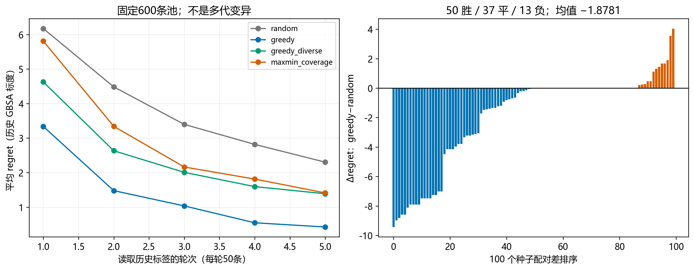

**图 A06（回顾式表内真标签）：**左图为逐轮平均 regret；右图把 100 个 greedy−random 最后轮配对差从负到正排列，颜色区分胜/平/负。不存在新增测量。[矢量版](figures/阶段总汇报_20261006/A06_固定池选样确认.svg)。

greedy 的平均发现优势与 top-10% 召回优势成立于本协议；但 50 胜、37 平、13 负说明严格胜利并非普遍。改善最大的十个种子贡献总体平均差约 44.8%，不能说均值优势全部来自它们。最差十个种子指 **Δ 最正** 的十个，平均 +1.7627；改善最大十个指 **Δ 最负** 的十个，平均 −8.4125。

30 种子观察的 holdout Spearman 增益没有在 100 种子复现；确认差为 −0.00434，区间跨零。因此不能用这组发现结果宣布代理模型通过主动学习已提高；选样发现、模型泛化和真实新候选发现是三个终点。

核验从2000行（100种子×4策略×5轮）原CSV检查键完整，重算均值、CI、胜平负及两尾部，保持一致。**作用是有限池回顾式发现能力和工程验收，不是当前代理瓶颈被解决的证据。**由于最多揭示250/600、不能生成新序列，也未测新GBSA，当前不把它作为实际实验安排；它仍帮助区分“选点发现有效”和“重训代理有效”，并保留简单低分/随机对照的依据。

### 2.7 树集成主动学习评价：模型排序与候选发现两个终点

共享400条holdout（固定留出测试）、400条初始标签、1200条固定候选池。每轮揭示100条，5轮后900条训练；四臂每轮都重训5成员bootstrap直方图梯度提升集成。标准化仅拟合当轮已揭示标签集合，预测方向为GBSA最小化，测试标签不参与采集。不确定性臂使用未校准的成员标准差，不能解释为真实置信区间。混合策略45条高分歧、25条覆盖最远、20条低预测、10条随机，排重后总数固定100。

bootstrap（自助抽样）是从当轮已标注训练条目有放回抽取相同数量的条目，五个成员分别拟合，因此成员训练集不同，不是新增五批测量。HistGradientBoostingRegressor（直方图梯度提升回归器）把数值特征分箱以加速树的阈值搜索，再逐轮拟合残差；本实验固定200轮、最大深度3、叶最少20、学习率0.03、L2=1。L2是权重平方惩罚的正则化系数；这里使用程序对叶值的正则化，不是新生物标签。使用训练集拟合的同一标准化坐标进行覆盖距离计算，避免旧脚本分别标准化候选/训练/测试造成坐标不一致。

**范围：本实验是树集成评分器下的受控主动学习比较，未重跑原论文深度集成和Kriging-Believer（克里金信徒，用临时预测标签逐项更新批量采集）整条路径。**旧深度主动学习曲线的优劣结论仍撤回；它的重评应在受控预训练结果及有效不确定性评分器明确后独立编号进行，不能用本实验树模型结果替代。

| 阶段 | 配方 | 平均Spearman | 种子均值95%区间 | 平均MAE | 平均RMSE |
| --- | --- | --- | --- | --- | --- |
| 100种子确认 | 预测GBSA最低优先 | 0.3337 | [0.3262, 0.3411] | 7.5175 | 9.8254 |
| 100种子确认 | 45/25/20/10混合采集 | 0.3349 | [0.3273, 0.3424] | 7.5224 | 9.8200 |
| 100种子确认 | 随机揭示 | 0.3374 | [0.3295, 0.3453] | 7.4960 | 9.8058 |
| 100种子确认 | 集成分歧最高优先 | 0.3315 | [0.3240, 0.3389] | 7.5215 | 9.8193 |
| 30种子开发 | 预测GBSA最低优先 | 0.3294 | [0.3150, 0.3435] | 7.5212 | 9.9187 |
| 30种子开发 | 45/25/20/10混合采集 | 0.3328 | [0.3161, 0.3493] | 7.4821 | 9.8919 |
| 30种子开发 | 随机揭示 | 0.3321 | [0.3156, 0.3490] | 7.4813 | 9.8942 |
| 30种子开发 | 集成分歧最高优先 | 0.3299 | [0.3143, 0.3448] | 7.5065 | 9.8985 |

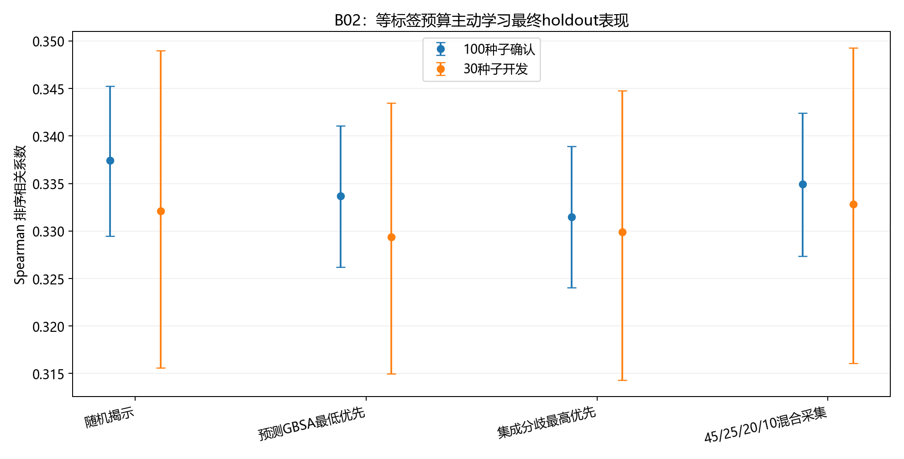

[矢量版](figures/阶段总汇报_20261006/B02_主动学习补实验.svg)。区间为固定已测数据上随机划分种子均值的自助法区间，不是新独立生物样本总体区间。

| 阶段 | 策略 | 最终查询regret | top10%召回 | 相对随机ΔSpearman（95%区间） | 相对随机Δregret（95%区间） |
| --- | --- | --- | --- | --- | --- |
| 100确认 | 预测GBSA最低优先 | 0.1095 | 0.6888 | -0.0037 [-0.0106, 0.0032] | -2.9019 [-3.4561, -2.3528] |
| 100确认 | 45/25/20/10混合采集 | 0.7450 | 0.5162 | -0.0025 [-0.0092, 0.0041] | -2.2664 [-2.9117, -1.6201] |
| 100确认 | 随机揭示 | 3.0114 | 0.4112 | 基线 | 基线 |
| 100确认 | 集成分歧最高优先 | 2.8534 | 0.4326 | -0.0060 [-0.0119, -0.0002] | -0.1580 [-0.8534, 0.5458] |
| 30开发 | 预测GBSA最低优先 | 0.1815 | 0.6936 | -0.0027 [-0.0136, 0.0085] | -2.0359 [-3.1244, -1.0270] |
| 30开发 | 45/25/20/10混合采集 | 0.9117 | 0.5186 | +0.0007 [-0.0127, 0.0136] | -1.3057 [-2.5365, -0.1402] |
| 30开发 | 随机揭示 | 2.2174 | 0.4186 | 基线 | 基线 |
| 30开发 | 集成分歧最高优先 | 3.0504 | 0.4394 | -0.0022 [-0.0154, 0.0109] | +0.8330 [-0.3674, 2.0597] |

这里regret（遗憾值）=五轮查询集合中最低真实GBSA−原1200条池中最低真实GBSA，排除共享初始400条；top10%召回分母是固定池真实最低的120条。ΔSpearman正值更好，Δregret负值更好。以配对区间为判断依据，不用单一均值推断全部策略无效。所有标签仍为已有表内标签，没有新序列真实测量。本实验与§2.5的300条初始标签、600条候选池、200条留出测试及每轮50条查询的条件不同，分别列出结果。

阶段选择仍需结合真标签成本：若某策略只改善发现而没有稳定提高holdout排序，保留它作为有限池发现策略；若改进模型，也仅在当前代理和池条件下成立，不能自动推及深度代理或真实新序列。

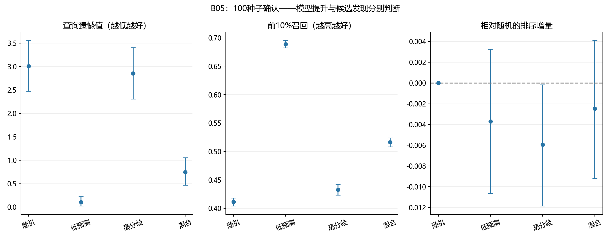

[矢量版](figures/阶段总汇报_20261006/B05_模型与发现终点.svg)。左、中图是策略本身的种子均值，右图是同种子相对随机的差值；不能只凭左、中图的区间重叠判断配对差。

**本实验评分器自身的分歧校准诊断：**最终holdout上计算成员标准差与绝对预测误差的Spearman，再对种子均值给区间。它衡量错误排序关系，不等同覆盖率或概率校准。

| 阶段 | 策略 | sigma与绝对误差相关 | 95%区间 |
| --- | --- | --- | --- |
| 100确认 | 预测GBSA最低优先 | 0.0162 | [0.0073, 0.0249] |
| 100确认 | 45/25/20/10混合采集 | 0.0300 | [0.0195, 0.0405] |
| 100确认 | 随机揭示 | 0.0303 | [0.0207, 0.0397] |
| 100确认 | 集成分歧最高优先 | 0.0205 | [0.0103, 0.0308] |
| 30开发 | 预测GBSA最低优先 | -0.0063 | [-0.0218, 0.0096] |
| 30开发 | 45/25/20/10混合采集 | 0.0210 | [0.0026, 0.0396] |
| 30开发 | 随机揭示 | 0.0070 | [-0.0080, 0.0217] |
| 30开发 | 集成分歧最高优先 | 0.0255 | [0.0070, 0.0444] |

| 最终配对终点 | 策略 / 随机 | 均值差 | 95%区间 | 胜/平/负（按该终点方向） |
| --- | --- | --- | --- | --- |
| spearman | 预测GBSA最低优先 / 随机 | -0.0037 | [-0.0106, 0.0032] | 49/0/51 |
| spearman | 45/25/20/10混合采集 / 随机 | -0.0025 | [-0.0092, 0.0041] | 47/0/53 |
| spearman | 集成分歧最高优先 / 随机 | -0.0060 | [-0.0119, -0.0002] | 46/1/53 |
| regret | 预测GBSA最低优先 / 随机 | -2.9019 | [-3.4561, -2.3528] | 65/33/2 |
| regret | 45/25/20/10混合采集 / 随机 | -2.2664 | [-2.9117, -1.6201] | 54/32/14 |
| regret | 集成分歧最高优先 / 随机 | -0.1580 | [-0.8534, 0.5458] | 34/29/37 |
| top10_recall | 预测GBSA最低优先 / 随机 | +0.2776 | [0.2676, 0.2880] | 100/0/0 |
| top10_recall | 45/25/20/10混合采集 / 随机 | +0.1049 | [0.0937, 0.1163] | 96/2/2 |
| top10_recall | 集成分歧最高优先 / 随机 | +0.0213 | [0.0090, 0.0338] | 58/5/37 |

**本实验100种子确认结论：**没有采集臂的holdout排序增量区间稳定大于零；当前未确认比等标签量随机揭示更能改善这个模型，不能据此否定所有主动学习方法。 预测GBSA最低优先、45/25/20/10混合采集的平均查询遗憾值降低，支持有限池发现用途；不把这一发现终点的收益写成模型变准。 本实验同时报告多个策略和终点，所列95%区间没有作多重比较校正；纯分歧选样的微小负向排序差属于本配置下的诊断，不能升级成普遍伤害结论。 随机揭示500/1200条时，前10%集合的理论期望召回为41.67%；该基线由抽样比例决定，不能把约42%的随机召回称为算法学到了规律。

## 3. 数据、标签及统计读数规则

### 3.1 数据入口与序列空间

正式数据为 [fad_proxy2000_v2_full.csv](../../data/proxy2000_v2/fad_proxy2000_v2_full.csv)，与 [registry.csv](../../data/registry.csv) 核对 SHA256（256 位安全散列算法，文件内容指纹）。数据文件经读取与核验；不是只引用旧汇报里的行数。

| 项目 | 数据核验结果 |
| --- | --- |
| 标准表行/列 | 2000 / 11 |
| `Sequence` 长度/唯一序列 | 141 / 2000 |
| `Full` 与 `Sequence` | `Full` 是较长历史字段；搜索使用 141 nt 的 `Sequence`，不混淆两列 |
| 13 位点之外骨架 | 2000 条全部与代码 WT 一致 |
| 实际数据 SHA256 | `0876C2B25A5571B834EBAC2C0C0F7671E023F6028688E90CCBA884A75FD4322A` |
| 登记表核验 | 匹配 |
| 2000 / 理论全空间比例 | 0.002980%（不是合法壳覆盖率） |

只变异第 30–33、89–92、127–131 位，共 13 个位点，其余位点保持参考序列。编号从 1 开始；每个位点为 A、C、G、U 四种碱基。理论组合数为 4^13=67,108,864，但当前搜索仅允许相对 WT（wild type，参考野生型）4–13 个突变的壳范围。理论全空间、当前合法壳、训练表和实际搜索过的集合是四个不同集合。

| 相对 WT 突变数 | 条数 | 占 2000 条比例 |
| --- | --- | --- |
| 0–3 | 1 | 0.05% |
| 4 | 2 | 0.10% |
| 5 | 9 | 0.45% |
| 6 | 34 | 1.70% |
| 7 | 80 | 4.00% |
| 8 | 247 | 12.35% |
| 9 | 410 | 20.50% |
| 10 | 481 | 24.05% |
| 11 | 444 | 22.20% |
| 12 | 226 | 11.30% |
| 13 | 66 | 3.30% |

平均突变数 **9.8735**；数据 4/5 突变分别只有 2/9 条。0–3组中的1条为0突变WT参考，1–3突变各为0条；不能把参考条目当作这些突变区间已有覆盖。

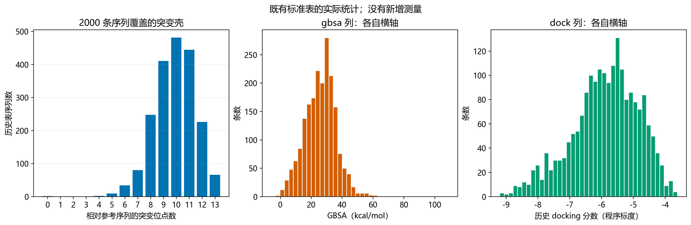

**图 A01（实测表统计）：**左图是 2000 条 `Sequence` 与代码 WT 在 13 位点上的差异计数；右图分别显示既有 GBSA 与 docking 列分布，使用各自横轴。两者单位/量纲和分布不同，不能把直方图宽窄当成谁更接近真实亲和力的证据。[矢量版](figures/阶段总汇报_20261006/A01_实际数据分布.svg)。

### 3.2 历史复合标签为什么不用

历史公式为 `label = 0.961 × Gap2 + 0.039 × gbsa`。Gap2 是历史结构字段，其结构量要求来源于 NUPACK（Nucleic Acid Package，核酸热力学/二级结构计算软件）。权重尚未得到有效验证，故当前不作为训练目标、搜索分数、批次选择量或成功指标。

核验内容为公式残差和相关性，结果如下。相关性表示表内关联，不证明物理因果；正 GBSA 值或大数值是协议复核线索，**不能直接宣称“物理不可能”“25 个都是错误”或“MD 未收敛已被证明”。**确认收敛或重复性需要原始轨迹、逐帧评分与独立重复，这些目前没有用于本报告的验证数据。

| 核查量 | 独立复算数值 | 解释 |
| --- | --- | --- |
| 复合公式最大绝对残差 | 1.421e-14 | 公式成立，不等于权重有效 |
| Spearman(Gap2, GBSA) | 0.0655 | 表内弱关联 |
| Spearman(MFE, GBSA) | -0.0682 | 不作因果判断 |
| Spearman(docking, GBSA) | 0.2890 | 两个评分不能简单互换 |
| GBSA：最小 / 最大 / SD | -5.9463 / 109.0823 / 10.3576 | SD 为样本标准差 |
| docking：最小 / 最大 / SD | -9.1965 / -3.6112 / 1.0483 | 不同量纲下方差不等于噪声大小 |
| GBSA >0 的行数 | 1996 | 仅描述符号；不把正值直接判为错误 |

主线输入禁用真实 GBSA、dock、label、Gap1/2/3、GBSA 派生能量和全数据目标统计。结构特征历史探索与当前可扩展的纯序列搜索评分器分开说明。MFE（minimum free energy，最低自由能）以及 Pre/Aft 等结构量若重新计算，仍必须使用项目规定的 NUPACK，不能换成 RNAfold 后沿用名称。

### 3.3 “30 次 / 100 次”究竟是什么意思

它们是 **30 个或 100 个随机种子**：种子是计算机随机过程的初始化编号。每个种子按协议生成一组数据划分、模型随机过程和/或搜索过程，便于重复运行。具体作用由实验配置决定；例如代理基准用种子重复划分，搜索套件还用种子决定起点与提出序列。

种子之间复用同一张 2000 条历史表，测试集可能重叠。因此不是 30/100 次新的测量，也不是 30/100 个独立生物学批次；跨种子自举置信区间主要描述本协议的随机划分/算法变动，不覆盖标签协议偏差和未测空间外推风险。

| 指标/词语 | 学术含义与本项目读法 | 方向或限制 |
| --- | --- | --- |
| Spearman，记作 ρ | 斯皮尔曼等级相关：预测排序与真值排序的相关系数；代码用 rankdata 排名后求 Pearson 相关 | 越大排序越一致；0.5523 是相关系数，不是 docking 能量 |
| 均值、SD、95% CI | 均值；standard deviation，跨种子标准差；confidence interval，95% 置信区间 | SD 与 CI 半宽不同；本报告分别写明 |
| 配对差 Δ | 同一种子同条件下“试验策略减对照”，再汇总 | 相关系数差越正越好；最低 GBSA/预测值/regret 差越负越好 |
| regret | 后悔值：本策略已查询候选的最佳真实标签，减固定池真实最优标签 | 当前静态池可计算；未测搜索候选没有真实 regret |
| top-10% recall | 对真实评分最佳的前 10% 候选集合的召回比例 | 固定池有历史标签才能算；搜索层没有新候选真标签 |
| MAE、RMSE | mean absolute error，平均绝对误差；root mean squared error，均方根误差 | 回归误差指标，不等于排序能力 |
| Hamming distance | 汉明距离：13 个可变位点中不同位置的个数 | 用于排重、覆盖距离、多样性和分组 |
| Jaccard index | 杰卡德集合相似系数：交集数/并集数 | 本文比较前 50 名候选集合；0.01 是集合重叠，不是 1% 准确率 |

本文配对区间沿用各实验包冻结的自举结果；最新七算法为逐项 95% 区间，**没有多重比较校正**。据此作条件性工程选择，不声称得出一套可推广的算法总排名。

## 4. GBSA 代理主线：正式基准是什么

### 4.1 训练和验证怎样避免虚高

正式基准通过登记实验配置运行，使用标准数据，多随机种子评估；特征筛选在训练折内进行。v8 融合使用 RF、ET、GBR、XGB、SVR 五种模型，303 维序列特征，训练内 screen-100 特征筛选；配置还记录内层 5 折。模型缩写见 §19。equal-weight rank fusion 是把各模型预测变成等级，再等权汇总，不是把不同数值标度简单平均。

303维由52维突变碱基one-hot（独热表示）、43维代码定义结构角色/配对表示、208维序列窗口二聚统计组成；角色是固定编码假设，不是每条候选重新做MD的结构真值。正式外层每种子1600训练/400测试，种子1–100；训练GBSA按2.5%/97.5%分位温莎化，测试GBSA不裁剪。303→100筛选属于训练步骤，不能先用全2000条标签挑特征再划分。

**发布参照的排名融合分数不能未经转换直接充当 GBSA 标度的 `mu`。**当前搜索用另行拟合的 RF/梯度提升诊断代理输出原 GBSA 标度；v8 是代理能力参照，不是七法比较实际调用的评分器。若以后部署秩融合，需要明确标度适配、训练校准与新 model_id 后再验收接口。

#### 历史seed=42的0.506：保留特征优化成果，重新判断证据边界

**固定划分0.506来自特征选择、特征扩展与模型调整，保留其优化事实。**迁移档案记录了相关配方变化。逐步优化过程未保存完整预测表，因此下表说明既有记录，准确重现与跨划分确认另见§4.3：

| 历史步骤/版本 | 记录的GBSA Spearman | 这一步改变什么 |
| --- | --- | --- |
| mutation-only SVR起点 | 0.391 | 突变碱基表示与支持向量回归 |
| 加结构角色 | 0.402 | 固定结构角色表示 |
| 加序列窗口二聚统计 | 0.432 | 突变邻域的两碱基组合统计 |
| 换GBR/XGB | 0.461 | 模型改变，不能全归因于特征筛选 |
| 加能量/其他结构探索 | 0.462–0.463 | 当时能量与结构特征版本 |
| top-100筛选及NUPACK修正 | 0.478 | 筛选与NUPACK处理同时变化 |
| top-3集成，v2.1 | 0.492 | 三个当时优选模型合成 |
| 169维位点表示外积，v2.2 | 0.506 | 完整1087维→top-100，GBR(500) |

来源：[历史优化路径](../../evidence/report_review_20261006/seed42_migration_evidence/历史优化路径_README.md)、[0.506交付说明](../../evidence/report_review_20261006/seed42_migration_evidence/历史0506交付说明.md)；原位置与SHA256见[迁移凭据](../../evidence/report_review_20261006/seed42_migration_evidence/provenance.json)。只恢复文档作为证据，主线未从父目录加载运行代码或数据。

查阅原复现代码的参数说明：历史train/val/test为1600/200/200，最终合并train+val=1800训练、200测试；特征为52突变+43角色+208窗口二聚+14突变类型+169历史外积+601 NUPACK=1087维，ExtraTrees筛100、按组标准化、GBR500棵/深度3/学习率0.03。**它与现在1600训练/400测试、303维、五模型v8不同**，不能把成绩差全部解释为种子运气，也不能当同条件比较。

旧[基线混用审计](../../evidence/report_review_20261006/seed42_migration_evidence/历史基线混用审计.md)还明确写出：0.506用额外特征和筛选，而当时30种子另一高值来自“mutation-only GBR”，且表中缺seed42。因此那份表不能证明0.506配方偶然；旧文档这项因果归因撤回。对应冻结配方已完成准确重现与30种子开发、100种子确认，见§4.3。

在固定测试集上反复优化也可能把开发选择偏好带入最终结果。这里只说明需独立确认的风险，现有记录不足以据此认定完整历史过程存在泄漏。应分别做“同固定划分重放”和“冻结配方的多种子配对”：前者核对成绩，后者检验可推广增益。0.395逐种子择优、测试标签参与rank变换、旧损失未接线是另外的证据问题，应分别处理。

### 4.2 核对后的100种子发布参照：两个可部署对照和一个事后参照

**v8 是仓库指定的100种子发布参照。**核验读取700行v8结果、100行mutation-only RF审计表，以及独立重训的10种子v8对照表：配对均值和胜率一致，10种子重训结果与对应种子一致。本节100种子表来自保存的发布证据；结构特征、平滑、深度模型和300标签搜索评分器采用不同条件，分别评价。

| 固定方法 | 均值 ρ | 跨种子 SD | 条件/区间 |
| --- | --- | --- | --- |
| RF | 0.3520 | 0.0401 | 100 种子，同 v8 表 |
| ET | 0.3567 | 0.0401 | 100 种子，同 v8 表 |
| GBR | 0.3581 | 0.0406 | 100 种子，同 v8 表 |
| XGB | 0.3723 | 0.0396 | 100 种子，同 v8 表 |
| SVR | 0.3299 | 0.0419 | 100 种子，同 v8 表 |
| mutation-only RF | 0.3644 | 0.0424 | 100 种子；正式 CI [0.3557, 0.3725] |
| v8 等权秩融合 | 0.3748 | 0.0393 | 100 种子；正式 CI [0.3669, 0.3823] |

| 配对参照 | 平均 Δρ | 95% CI | 胜种子 |
| --- | --- | --- | --- |
| v8−mutation-only RF | +0.0104 | [0.0061, 0.0147] | 66/100 |
| v8−固定 XGB（可部署参照） | +0.0025 | [−0.00148, +0.00652]（历史审计区间） | 54/100 |
| v8−每种子最佳单模型（事后参照） | -0.0057 | [−0.0082, −0.0033] | 44/100 |

[源结果](../../evidence/server_sync_20260902/v8_fusion_100seed/all_results.csv)；[源结果](../../evidence/audit_20260924/paired_fusion_vs_baseline.json)

独立重算 v8−固定 XGB 的配对均值 **+0.00245161**、胜 **54/100**；用固定自举种子 20260924、20000 次重采样得到 CI **[-0.001523, 0.006439]**。与历史区间端点的小差别是自举抽样实现/种子不同造成的数值差，两个区间均跨零；不改写旧发布区间。[方法数值核验](../../evidence/report_review_20261006/method_verification.json)

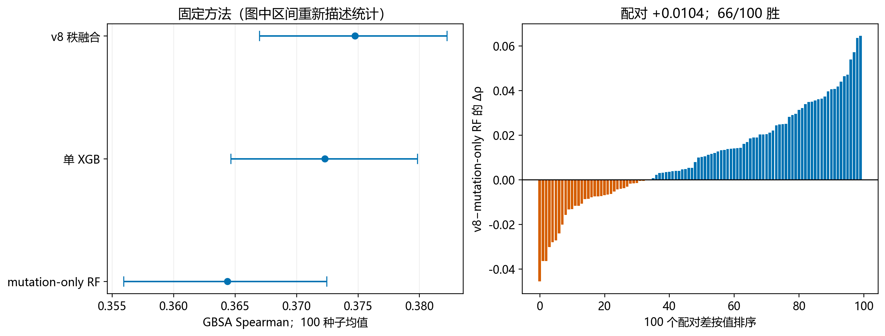

**图 A03（100 种子已测表评估）：**左侧展示固定方法的均值，右侧展示 v8 与 mutation-only RF 的逐种子配对差。左侧误差线是本报告按同一已保存逐种子表重算的均值自举区间；正式发布区间仍以表中源证据口径为准。没有把逐种子最佳单模型作为可部署算法画成“最优模型”。[矢量版](figures/阶段总汇报_20261006/A03_正式GBSA代理基准.svg)。

v8 相对 mutation-only RF 有小幅、可重复的改善，但逐种子挑选最好单模型的比较说明它并非在每次切分中都最佳。后者使用测试表现挑赢家，本身是事后参照；它能反驳“融合总比所有单模型好”，但不能在新候选部署时直接获得这个赢家。

**52维mutation-only RF**回答“复杂表示与融合是否比简单突变方案好”；**同303维的固定XGB**回答“融合是否比一套固定单模型好”。支持前一个小幅增益，尚不支持后一个显著优势。每种子最佳单模型仅是额外事后参照，不能称可部署基线。三类参照分别回答不同问题，报告中分别呈现。

**这里的 0.3748 不是 37.48% 准确率，也不是前几名都可靠。**整体等级相关可能掩盖低分尾部错误，后续候选排序与外推诊断还必须独立做。另一方面，该结果也没有证明 GBSA 完全不可预测：负对照见下一节。

### 4.3 固定划分重现与冻结特征配方的跨划分比较

原1800/200序列分区、601个直接NUPACK特征、训练内筛前100、GBR500已重新训练。实际重放结果如下；没有用历史加权label。

| 固定42配方 | Spearman | MAE | RMSE |
| --- | --- | --- | --- |
| 52维突变 | 0.38970374 | 7.2330 | 9.0685 |
| 303维序列 | 0.44655816 | 6.9294 | 8.8043 |
| 486维序列+突变类型/同碱基指示 | 0.41149179 | 7.0871 | 8.9467 |
| 904维序列+NUPACK | 0.44021601 | 6.8826 | 8.8607 |
| 1087维历史完整配方 | 0.50602865 | 6.6752 | 8.6436 |

| 阶段 | 配方 | 平均Spearman | 种子均值95%区间 | 平均MAE | 平均RMSE |
| --- | --- | --- | --- | --- | --- |
| 100种子确认 | 1087维历史完整配方 | 0.3430 | [0.3322, 0.3537] | 7.5248 | 9.9006 |
| 100种子确认 | 52维突变 | 0.3423 | [0.3306, 0.3536] | 7.5078 | 9.8397 |
| 100种子确认 | 303维序列 | 0.3780 | [0.3663, 0.3893] | 7.4169 | 9.6968 |
| 100种子确认 | 486维序列+突变类型/同碱基指示 | 0.3601 | [0.3477, 0.3719] | 7.4757 | 9.7997 |
| 100种子确认 | 904维序列+NUPACK | 0.3473 | [0.3355, 0.3592] | 7.5009 | 9.8761 |
| 30种子开发 | 1087维历史完整配方 | 0.3433 | [0.3221, 0.3630] | 7.4145 | 9.7842 |
| 30种子开发 | 52维突变 | 0.3311 | [0.3119, 0.3504] | 7.4328 | 9.7891 |
| 30种子开发 | 303维序列 | 0.3715 | [0.3546, 0.3896] | 7.3141 | 9.6391 |
| 30种子开发 | 486维序列+突变类型/同碱基指示 | 0.3558 | [0.3343, 0.3788] | 7.3531 | 9.7019 |
| 30种子开发 | 904维序列+NUPACK | 0.3411 | [0.3220, 0.3620] | 7.4100 | 9.7764 |

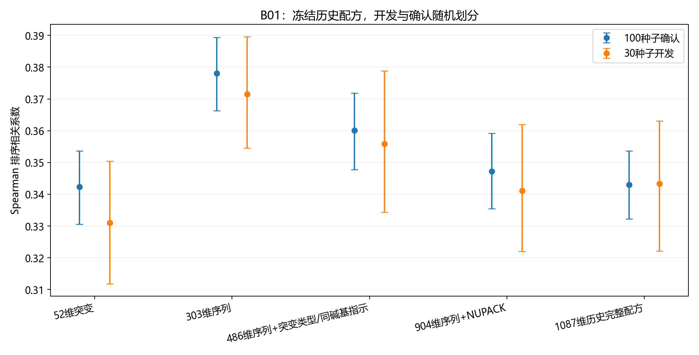

[矢量版](figures/阶段总汇报_20261006/B01_历史配方补实验.svg)。区间为固定已测数据上随机划分种子均值的自助法区间，不是新独立生物样本总体区间。

| 阶段 | 试验 / 对照 | 配对Spearman差 | 95%区间 | 胜/平/负 |
| --- | --- | --- | --- | --- |
| 100确认 | 1087维历史完整配方 / 303维序列 | -0.0350 | [-0.0427, -0.0272] | 20/0/80 |
| 100确认 | 52维突变 / 303维序列 | -0.0357 | [-0.0422, -0.0291] | 17/0/83 |
| 100确认 | 486维序列+突变类型/同碱基指示 / 303维序列 | -0.0179 | [-0.0245, -0.0116] | 35/0/65 |
| 100确认 | 904维序列+NUPACK / 303维序列 | -0.0307 | [-0.0396, -0.0217] | 24/0/76 |
| 100确认 | 1087维历史完整配方 / 904维序列+NUPACK | -0.0043 | [-0.0116, 0.0030] | 48/0/52 |
| 100确认 | 303维序列 / 52维突变 | +0.0357 | [0.0291, 0.0422] | 83/0/17 |
| 30开发 | 1087维历史完整配方 / 303维序列 | -0.0282 | [-0.0408, -0.0163] | 4/0/26 |
| 30开发 | 52维突变 / 303维序列 | -0.0405 | [-0.0531, -0.0284] | 3/0/27 |
| 30开发 | 486维序列+突变类型/同碱基指示 / 303维序列 | -0.0157 | [-0.0260, -0.0051] | 8/0/22 |
| 30开发 | 904维序列+NUPACK / 303维序列 | -0.0304 | [-0.0422, -0.0189] | 7/0/23 |
| 30开发 | 1087维历史完整配方 / 904维序列+NUPACK | +0.0022 | [-0.0114, 0.0149] | 19/0/11 |
| 30开发 | 303维序列 / 52维突变 | +0.0405 | [0.0284, 0.0531] | 27/0/3 |

**固定划分优化与跨划分泛化的关系：**固定42的0.506已经重现，原划分相对303维确实提高约0.0595；不能说这个优化没有发生。新划分比较检验的是冻结配方的稳定性：若复杂配方均值较差，意味着当时固定测试划分的优势不稳定，不能据此把全部特征工程称为无用，也不能把0.506当未来序列的预期相关。52维到303维的整体效应与303维到1087维的增量必须分开。历史固定测试集曾用于多次方法选择，即使现在精确重放也不能恢复独立测试资格。

本实验每次1800/200；旧v8发布参照每次1600/400，模型也不同，不能直接以均值高低宣称替换v8。新种子确认依然来自同一2000条数据，不是100批新GBSA。

## 5. 代理优化到底尝试了哪些路线

### 5.1 折内特征选择：有相对增益，但没有超过发布基准

**特征**是模型读取的数值列，例如“第31位是否A”或“某配对概率”；**特征选择**是挑出其中一部分，目标始终GBSA。筛选可减少噪声/冗余，也可能丢掉有用交互，效果须用未参与筛选的测试数据评价。

| 方法 | 实际在问什么 | 实际计算方法 | 优点和限制 |
| --- | --- | --- | --- |
| mutual information，互信息 | 知道一列后，GBSA的不确定性减少多少 | 训练内逐列调用`mutual_info_regression`近邻估计，负估计裁0，取最大100列 | 捕捉部分非线性依赖，无正负方向；受样本/离散类型处理影响，单列强不等于组合最优 |
| Spearman单变量筛选 | 一列排序与GBSA排序是否相关 | 每列算`abs(corr(rank(X_j),rank(y)))`，取最大100列 | 清楚可解释，正负关系都保留；非单调依赖或必须两列共同作用可能被漏掉 |
| tree importance，树重要度 | 树用这列切分时减少多少训练误差 | 训练内拟合200棵ExtraTrees，以绝对误差准则的`feature_importances_`取最大100列 | 部分交互可被使用；受共线性、取值数和树配置影响，不能当生物因果 |

互信息学术式为`I(X;Y)=∫p(x,y)log[p(x,y)/(p(x)p(y))]dxdy`，理论独立时为0，代码采用有限样本估计。Spearman用排名，不是原值Pearson线性相关；树重要度是训练切分准则累计减少后归一化。实际实现见[筛选管线](../../scripts/tools/feature_selection_pipeline.py)，定义见[互信息接口](https://scikit-learn.org/stable/modules/generated/sklearn.feature_selection.mutual_info_regression.html)、[树重要度说明](https://scikit-learn.org/stable/auto_examples/ensemble/plot_forest_importances.html)。互信息本包密集矩阵默认按连续列估计；离散独热列专用类型配置须另设实验，不能改口称旧包已使用。

按[冻结配置](../../configs/experiments/feature_selection_all_safe_30seed.json)实际这样做：

1. 输入1495安全列=303序列+1192 NUPACK全结构列；排除真实GBSA、对接和派生标签。
2. 外层种子1–30各1600训练/400测试；训练标签按本训练折2.5%/97.5%分位温莎化，测试Spearman对原GBSA。
3. 外层训练内5折各自拟合筛选及目标处理、取top-100；最终保留至少3/5内折选中的列。
4. 强制保留52个突变独热列，与筛选结果并集，最终维度未固定100。
5. 全1495列作为对照；筛选列作为试验，各训练ET/GBR/XGB。ET/GBR500棵、绝对误差；XGB500棵/深度4/学习率0.05/绝对误差目标。
6. 同400测试算ρ，配对差=筛选−全列，共4输入方案×3模型×30=360行，另保存特征清单/指纹。

| 筛选方法 | 最终特征数：最小 / 中位 / 最大 | 为什么不是统一 100 维 |
| --- | --- | --- |
| mutual_info | 95 / 107 / 121 | 内折 top-100 后按 3/5 一致性保留，再强制并入 52 个突变特征 |
| spearman | 126 / 136 / 143 | 内折 top-100 后按 3/5 一致性保留，再强制并入 52 个突变特征 |
| tree_importance | 103 / 112.5 / 121 | 内折 top-100 后按 3/5 一致性保留，再强制并入 52 个突变特征 |

**独立复算**360行、9组均值/差/胜率/20000次自举区间，并核对120份特征清单的指纹、数量及52维强制保留，均一致。该项验证使用保存预测与特征清单复算，没有重新拟合360个模型；统计一致性不构成特征的生物机制验证。以下为实际30种子表。

| 筛选方法 | 模型 | 对照均值 | 筛选均值 | 配对增量 | 95% CI | 胜/30 |
| --- | --- | --- | --- | --- | --- | --- |
| mutual_info | ET | 0.3256 | 0.3578 | +0.0322 | [0.0237, 0.0410] | 27 |
| mutual_info | GBR | 0.2670 | 0.3282 | +0.0612 | [0.0484, 0.0738] | 29 |
| mutual_info | XGB | 0.2787 | 0.3379 | +0.0592 | [0.0491, 0.0698] | 30 |
| spearman | ET | 0.3256 | 0.3512 | +0.0256 | [0.0177, 0.0335] | 25 |
| spearman | GBR | 0.2670 | 0.3313 | +0.0643 | [0.0540, 0.0743] | 29 |
| spearman | XGB | 0.2787 | 0.3324 | +0.0537 | [0.0437, 0.0632] | 29 |
| tree_importance | ET | 0.3256 | 0.3479 | +0.0223 | [0.0135, 0.0311] | 24 |
| tree_importance | GBR | 0.2670 | 0.3520 | +0.0850 | [0.0724, 0.0971] | 30 |
| tree_importance | XGB | 0.2787 | 0.3501 | +0.0714 | [0.0620, 0.0808] | 30 |

[源结果](../../evidence/server_sync_20260903/feature_selection_all_safe_30seed/metrics_paired.csv)

| 聚类划分：筛选/模型 | 筛选均值 | 对照均值 | 平均差 | 最差折差 | 记录中平均判据通过 |
| --- | --- | --- | --- | --- | --- |
| mutual_info/ET | 0.3422 | 0.3040 | +0.0382 | +0.0178 | True |
| mutual_info/GBR | 0.3309 | 0.2916 | +0.0393 | -0.0112 | True |
| mutual_info/XGB | 0.3220 | 0.2807 | +0.0413 | +0.0013 | True |
| spearman/ET | 0.3479 | 0.3040 | +0.0439 | +0.0275 | True |
| spearman/GBR | 0.3434 | 0.2916 | +0.0517 | -0.0008 | True |
| spearman/XGB | 0.3201 | 0.2807 | +0.0394 | -0.0250 | True |
| tree_importance/ET | 0.3327 | 0.3040 | +0.0287 | +0.0073 | True |
| tree_importance/GBR | 0.3345 | 0.2916 | +0.0429 | -0.0166 | True |
| tree_importance/XGB | 0.3312 | 0.2807 | +0.0505 | +0.0183 | True |

[源结果](../../evidence/server_sync_20260903/feature_selection_all_safe_30seed/cluster_split_check_summary.csv)

**解释：**九个平均配对差都为正，但筛选后的绝对成绩约 0.33–0.36；不能因为“相对全结构特征增益 +0.085”就宣称超越纯序列 v8 0.375。cluster split（按序列距离聚类划分）平均判据通过也不能证明所有测试折都稳健，最差折数据如表所示；该数据近邻簇较稀疏，外推强度有限。

历史 useful 7 子块合计 192 维，曾被宽前缀误取为 384/377 维，已修正。但子块最初来源于全数据标签筛选，故其历史 0.399 不能无条件升格为折内正式改进。特征名称如 contact_pca、cluster_pair、energy_land 是代码块标签，分别涉及接触表示降维、远距离配对和能量地形统计；这些名字不直接证明其物理机制已验证。

### 5.2 标签平滑与排序目标：哪些有效，哪些没有

LS 是 label smoothing，标签平滑；这里在训练折内依据 13 位点汉明近邻，以 k=5、α=0.5 混合原标签和邻居标签，不改变测试真值。NLS 是 negative label smoothing，负向平滑。MSE 是 mean squared error，均方误差。pairwise/listwise 分别指成对/整组排序目标。

#### 平滑的操作与作用

本项目是**回归标签的邻域混合**，不是分类独热概率平滑。训练序列i从同训练折找到最近5条其他序列，均值m_i；用`y'_i=(1−α)y_i+αm_i`训练，α=0.5，即自身和邻居均值各一半。先温莎化、平滑后按同界限裁剪；测试序列不参与找训练邻居，测试GBSA不变。[实现](../../scripts/reproduction/label_smoothing.py)。

它检验局部序列相似时降低单个训练标签波动是否帮助泛化。近邻的真实结合也可能不同，平滑会抹去效应，所以只能按未平滑测试真值验证。**有预测增益不证明物理GBSA噪声已消除，不形成新实验标签。**本包XGB500棵/深度3/学习率0.03，输入为下述历史495维。

负平滑用`y'_i=(1+α)y_i−αm_i`，α=0.25/0.5，把标签推离邻域平均；这两种配置退步。保存逐种子数组与摘要复算一致，100种子还与CSV交叉核对；这只确认保存实验的统计。[变体实现](../../scripts/reproduction/eval_smoothing_variants.py)。

#### 排序目标实际试了什么

| 配置 | 训练损失/标签与规模 | 比较限制 |
| --- | --- | --- |
| XGB MSE | GBSA残差平方；1600训练，500棵/深度3/学习率0.03 | 回归对照 |
| XGB quantile50 | 中位数分位损失，对正负残差按50%分位惩罚；1600训练，500棵/深度4/学习率0.05 | 试验抗大残差，树参数也变，差不能全归因于损失 |
| LightGBM LambdaRank | GBSA训练排名量化0–30级，全1600作一组；300棵/31叶/学习率0.05 | 整组顺序目标；不同框架/树配置 |
| XGB pairwise子样本 | 同训练折抽500条，单组作成对排序；300棵/深度4/学习率0.05 | 控制计算量的探索，不能据此否定所有排序学习 |

损失是训练准则，最终仍对原测试GBSA算Spearman。保存数值经过复算；若要研究“损失本身”，需要同样本/特征/容量/调参预算的新受控比较。[实际脚本](../../scripts/reproduction/eval_rank_objectives2.py)。

涉及495维历史配置的支线使用303+192维useful特征；192维子块曾由全数据标签选择，故本报告把这些数值保留为该特征条件下的探索比较，不升格为完全独立的正式代理发布基准。训练内平滑保证测试真值不参与平滑，但不能自动消除既有子块选择来源的限制。

**30 种子平滑配对：**

| 配置 | 均值 | Δ vs raw | 95% CI | 胜/30 |
| --- | --- | --- | --- | --- |
| raw | 0.3547 | +0.0000 | [0.0000, 0.0000] | 0 |
| LS_k5_a0.5 | 0.3775 | +0.0228 | [0.0157, 0.0301] | 26 |
| NLS_a0.25 | 0.3455 | -0.0092 | [-0.0144, -0.0036] | 7 |
| NLS_a0.5 | 0.3320 | -0.0227 | [-0.0308, -0.0149] | 6 |

**30 种子损失比较：**

| 配置 | 均值 | Δ vs MSE | 95% CI | 胜/30 |
| --- | --- | --- | --- | --- |
| xgb_mse | 0.3547 | +0.0000 | [0.0000, 0.0000] | 0 |
| xgb_quantile50 | 0.3228 | -0.0319 | [-0.0412, -0.0225] | 4 |
| lgbm_lambdarank | 0.0833 | -0.2714 | [-0.3015, -0.2430] | 0 |
| xgbranker_subsample | 0.1395 | -0.2152 | [-0.2341, -0.1964] | 0 |

**确认与组合：**

| 实验 | 原始/试验均值 | 配对差 | 95% CI | 胜/种子 |
| --- | --- | --- | --- | --- |
| 100 种子近邻平滑 | 0.3420 / 0.3612 | +0.0191 | [0.0146, 0.0237] | 82/100 |
| 30 种子 v8×平滑 | 0.3904 / 0.3888 | -0.0016 | [-0.0054, 0.0026] | 13/30 |

[源结果](../../evidence/audit_20260924/ml_squeeze/smoothing_variants.json)；[源结果](../../evidence/audit_20260924/ml_squeeze/rank_objectives2.json)；[源结果](../../evidence/audit_20260924/audit_label_smoothing_100seed_results.json)；[源结果](../../evidence/audit_20260924/ml_squeeze/fusion_smoothing.json)

标准近邻平滑相对单 XGB 有正增益；但与发布融合组合之后没有可确认增益，所以不能把 +0.0191 直接加到 0.3748 上。排序损失这几组配置退步，说明当前样本量和实现中它们没有带来收益；不能宣称所有排序学习或所有深度排序方法都失败。

### 5.3 负对照、稀疏交互与外推压力

| 实验 | 要排查的问题 | 实际操作 | 能回答什么、不能回答什么 |
| --- | --- | --- | --- |
| negative control，负对照 | 模型是否仅利用偶然对应或明显错误信息 | 同划分打乱训练标签；另将训练特征每列独立按行打乱；测试特征/标签原样 | 破坏关联后应近零，通过不保证所有泄漏或标签错误被排除 |
| sparse epistasis，稀疏上位性/位点交互 | 少量单点/双点联合项能否解释GBSA | 52单点独热+78位点对×16联合碱基指示=1300维；Lasso加L1惩罚，训练内3折选30候选惩罚强度 | 比较稀疏二阶模型的预测和稳定项；系数不能直接证实双突变生物协同 |
| extrapolation stress，外推压力 | 随机划分成绩能否代表未覆盖突变数域 | ≤9、10–11、12–13三个域，每次留一域测试、另两域训练，另30种子随机80/20对照 | 测域变换性能；不同训练量、三域各指定单次，差不代表纯域偏离因果 |

负对照只有10种子，是诊断，不达30种子开发要求。三臂同历史495维XGB，打乱只发生在训练端；不是改测试真值以“制造零相关”。保存的逐种子均值与SD经复算一致。[置换实现](../../scripts/reproduction/eval_negative_controls.py)。

稀疏模型目标为`训练残差平方和/(2n)+λΣ|β_j|`，β是特征系数，λ在训练内选择；联合列共线，非零项不等于因果。RF对照52维/500棵/min_samples_leaf=5，XGB495维/500棵/深度3。**这里RF均值0.3805是该30种子参数的结果，不能替换正式100种子0.3644基线。**保存数组的均值与SD经复算一致。[稀疏交互实现](../../scripts/reproduction/eval_sparse_epistasis.py)。

外推域由2000条实际突变数分位定义，不是假设1–5突变有大量标签。标准表重算三域人数一致，随机30均值也一致；三个域的ρ只保存汇总，没有逐候选预测，不能以人数核对代替预测重算。[外推实现](../../scripts/reproduction/eval_extrapolation.py)。

**负对照，10 种子：**

| 配置 | Spearman 均值 | SD |
| --- | --- | --- |
| real_labels | 0.3401 | 0.0341 |
| shuffled_labels | 0.0164 | 0.0583 |
| permuted_features | -0.0119 | 0.0593 |

**稀疏交互，30 种子：**

| 模型/特征 | 均值 | SD |
| --- | --- | --- |
| rf_52d | 0.3805 | 0.0416 |
| lasso_epistasis | 0.3632 | 0.0418 |
| xgb_495d | 0.3547 | 0.0477 |

**突变数域留出（前三行是指定域单次协议）：**

| 协议 | 训练/测试数 | 测试突变数 | Spearman |
| --- | --- | --- | --- |
| high_out | 1708/292 | [12, 13] | 0.3182 |
| mid_out | 1075/925 | [10, 11] | 0.2860 |
| low_out | 1217/783 | [0, 9] | 0.2688 |
| 随机对照（30 种子） | 1600/400 | 混合域 | 0.3547 |

[源结果](../../evidence/audit_20260924/ml_squeeze/negative_controls.json)；[源结果](../../evidence/audit_20260924/ml_squeeze/sparse_epistasis.json)；[源结果](../../evidence/audit_20260924/ml_squeeze/extrapolation.json)

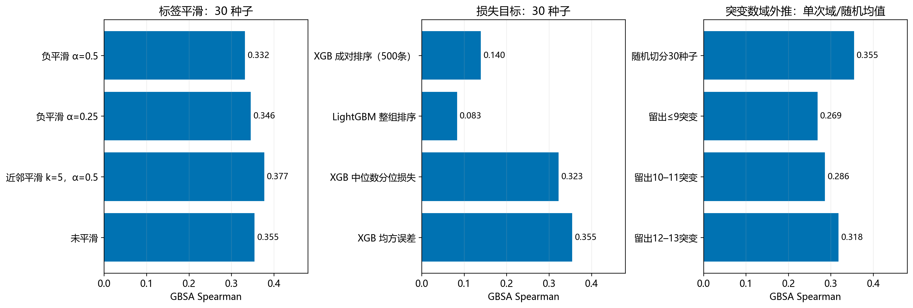

**图 A04（多个独立协议分面展示）：**平滑与排序损失采用其共同 raw 基线；外推三档为指定留出域的单次结果，随机对照是 30 种子均值，未给三档伪造置信区间。各子图不能相互当配对比较。[矢量版](figures/阶段总汇报_20261006/A04_代理改进与外推压力.svg)。

负对照接近零支持“序列中存在可学习信号”，不证明标签无噪声。Lasso（最小绝对收缩与选择算子）成对交互未超越 mutation-only RF，不证明不存在上位性；稳定选中的 p31×p127_AA、p89×p128_GG 是统计线索，需要独立实验才能讨论因果协同。

强外推中，训练不含某一突变数段而测试全部落在该段，排序能力下降。由于训练量和测试域也改变，这些差不能解释成纯粹单一因素的因果效应，但足以提醒不能将随机切分成绩直接套给偏离训练分布的搜索候选。

### 5.4 其余已尝试项目与证据不足的项目

| 尝试 | 实际结果/产物 | 目前能说什么 |
| --- | --- | --- |
| 近似 Turner 堆叠能 52 维 | base 0.3406；加入 0.3319；Δ -0.0088 | 历史特征配置无增益，不是精准热力学重新计算 |
| 历史303维序列基线 | 30种子；均值 0.3841 | 同一feature_weighting探索包；不是100种子发布基准 |
| 历史7子块硬选择的8模型秩融合 | 30种子；均值 0.3983 | 基线+七个“序列/单子块”模型；不是单模型303+192维拼接；子块全数据来源限制 |
| 18 子块+基线加权融合 | 保存 30 个种子；均值 0.3993；权重接近均匀 | 历史预测级混合；不是新发布的有效子块发现 |
| 三维模板距离特征 | 历史 3K1V 模板与本任务序列/长度不匹配 | 没有有效正式成绩，不补零或正收益 |
| ensemble defect（系综缺陷） | 旧30种子 base 0.3547；+defect 0.3548 | 保存数值可复算，但未配对概率公式错误；正确公式的评价见§5.5 |
| 31,000 条候选的三分量排序示例 | 序列 GBSA 预测+dock 预测+MFE 排名；top-200；曾有 1 条训练重叠 | 历史演示，有目标混合，当前不沿用；没有新真标签 |
| 锁定 seed=42 发布包 | 验证 0.316 / 测试 0.451 | 单次锁定产物，不替代多种子发布基准 |

[源结果](../../evidence/audit_20260924/server_results/new_features.json)；[源结果](../../evidence/audit_20260924/server_results/feature_weighting.json)；[源结果](../../evidence/audit_20260924/ml_squeeze/candidate_demo_summary.json)

#### 各项目怎样用、核验到哪一步

**（a）Turner近邻堆叠。**每个可变位点读取左/右邻二聚查表能量及相对WT的两个差，共13×4=52列；拼入原特征训练XGB，也试52列单独预测。这是近似局部描述，不是完整二级结构计算或替换NUPACK MFE。base=0.340632、加堆叠=0.331876、单独=0.261178。保存文件只有均值/差，核验覆盖实现与摘要，不能独立重算逐seed区间；当前不纳入主线。[实现](../../scripts/reproduction/new_features.py)。

**（b）18结构子块预测级加权。**“303序列+一个结构子块”各训练一个模型，加基线共19成员；每成员在训练内5折产生OOF预测，screen-100和缩放在内训练执行。权重非负/和1，用SLSQP（sequential least squares programming，序列最小二乘规划）最小化`−OOF Spearman+0.05Σw²`，同权重合成测试预测等级。保存30种子约0.3993，权重接近均匀是数值观察，不证明结构块同等生物学作用。[实现](../../scripts/reproduction/feature_weighting.py)。

**（c）hard useful7。**在（b）包中只取“基线+七个历史有用子块模型”的8列预测，等权秩融合约0.3983，**不是把192结构列一次拼成495维训练单模型**。原汇报这条名称不准确，采用的准确描述。七块选择来源曾看过全数据标签；需要折内重新选块、独立确认才可晋级。保存的30行三种均值重算一致，未新跑100种子。

**（d）输入级门控。**给18结构子块各乘一个可学习sigmoid（S形激活，映射到0–1）权重，与303维序列拼接输入MLP，由GBSA损失学习。与（b）预测级混合不同。只有3种子、均值0.256359、SD0.021754，不足开发确认。不得概括成深度模型普遍不可用。[实现](../../scripts/reproduction/feature_gating.py)、[保存结果](../../evidence/audit_20260924/server_results/feature_gating.json)。

**（e）三维模板距离。**设想把突变位点映射到RNA结构，加入距离/接触描述；历史3K1V模板与当前序列长度/映射不匹配，未形成有效GBSA对照。前提是匹配的RNA/配体模板与141位点映射，再做同划分有/无特征比较。本报告不把无结果写成0分或方法已失败。

**（f）系综缺陷与WT目标结构概率：有旧结果，但发现公式问题。**取WT在NUPACK RNA/30℃的MFE为目标。ensemble defect意为相对目标预期错误配对的核苷酸数；另取突变序列折成目标完整结构的概率。它们不是GBSA标签，也没有证明WT MFE就是结合态。

| 旧特征配置（公式存在问题） | Spearman均值 | Δ vs base | 95% CI | 胜/30 |
| --- | --- | --- | --- | --- |
| base | 0.354705 | +0.000000 | [0.000000, 0.000000] | 0 |
| base+defect | 0.354767 | +0.000062 | [-0.003331, 0.003298] | 19 |
| base+wt_prob | 0.354574 | -0.000131 | [-0.000812, 0.000469] | 3 |
| base+both | 0.354838 | +0.000133 | [-0.003380, 0.003475] | 19 |

[源结果](../../evidence/audit_20260924/eval_defect_features_results.json)；[旧特征表（需重算）](../../evidence/audit_20260924/ensemble_defect_features.csv)

旧30种子数组的均值/配对差/胜率/CI复算一致，特征表2000唯一行、0缺失。但目标未配对位点的正确概率被写成`1−Σ_j P_ij`；NUPACK完整矩阵`P_ii`本身是未配对概率，故应读`P_ii`，配对目标读`P_ij`，缺陷为`141−Σ正确概率`。官方[定义](https://docs.nupack.org/definitions/)与[矩阵示例](https://docs.nupack.org/utilities/)明确该含义。因此**数值可复算，但物理定义未通过；旧负结果不能否定正确系综缺陷方法**。

现行实现已修正主脚本，抽出无需NUPACK的矩阵公式，3项手工可解矩阵测试通过。完整2000条已经重新计算并另开30种子比较，实际结果与官方核验边界见§5.5；旧特征和旧结果未覆盖。旧脚本把结构概率接口所有异常都置0，因此旧文件本身不能解释1996个零；本实验新计算已逐条确定1996/2000条WT目标不兼容，明确记为`invalid_target_pair`，其概率为0，另4条直接计算成功，没有隐藏失败。[现行脚本](../../scripts/reproduction/ensemble_defect.py)、[矩阵公式](../../scripts/reproduction/structure_metrics.py)。

**（g）31000条三分量排名示例。**GBSA预测+dock预测+MFE合成排名取200，曾有1条训练重叠。其排名无kcal/mol单位，有目标混合，当前不继承；没有新增真实标签。仅核对摘要，不把31000条预测当测量。

**（h）锁定验证/测试包。**每份200条真实GBSA及融合排名；核验从原预测重算，舍入0.316/0.451。它与历史0.506不同，不能当原模型重现或100种子均值。

**（i）604维旧筛选日志。**曾运行过滤、置换重要度、Boruta（影子随机特征重要度对照）、forward（逐步加列）、RFE（recursive feature elimination，递归特征消除）等；仅有stdout，逐seed`full_30seed.csv`缺失。只报告实现/日志，不给缺失数值填表，也不当1495维新筛选的证据。

历史 MD 副本分配的模拟 JSON 仅是给定噪声假设下的预算分析，不是新轨迹实验或真实去噪增益。轨迹重复性、异常值原因和 GBSA 收敛目前仍需原始计算资料。**代理优化可在本阶段已评价的配置范围内暂停；科学上没有证据证明其他模型永远无法改善。**

### 5.5 结构缺陷特征的官方计算核验与配对评价

完整2000条NUPACK重新计算；错误的未配对公式已修为矩阵对角线。首个正式包在官方defect核验不兼容WT目标时失败，未用于模型比较；修订后另编号完整重算。官方核对4个兼容WT目标条目，以及前20条的全未配对/自身MFE两个诊断目标，共44个对照。诊断目标不进入特征，全部特征目标仍为WT。非允许配对的目标结构概率明确标0，其余计算异常终止，不做异常到0的替换。303维无历史useful子块基线，训练内筛100，GBR500，1600/400，30个配对种子。

| 重算验收项 | 实际结果 |
| --- | --- |
| 唯一序列/无失败 | 2000 / 0 |
| 官方对照/最大绝对误差 | 44 / 9.8107657e-06 |
| 不兼容WT目标/直接计算概率 | 1996 / 4 |
| 正确全局缺陷范围 | [26.60448753021231, 89.60718846980646] |
| 与旧缺陷的平均绝对变化 | 44.3856 |
| 重算及核验时间（秒） | 62.7166 |

| 阶段 | 配方 | 平均Spearman | 种子均值95%区间 | 平均MAE | 平均RMSE |
| --- | --- | --- | --- | --- | --- |
| 30种子开发 | 303维基线 | 0.3655 | [0.3531, 0.3780] | 7.4341 | 9.8047 |
| 30种子开发 | 同时加两项 | 0.3661 | [0.3550, 0.3774] | 7.4247 | 9.7960 |
| 30种子开发 | 加修正缺陷 | 0.3651 | [0.3525, 0.3780] | 7.4345 | 9.8010 |
| 30种子开发 | 加WT结构概率 | 0.3670 | [0.3542, 0.3801] | 7.4312 | 9.7988 |

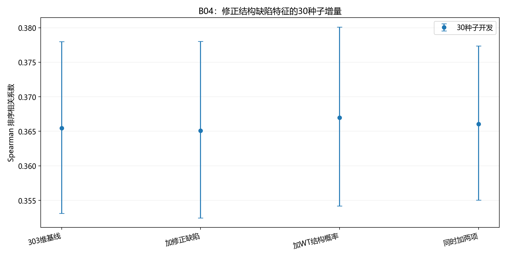

[矢量版](figures/阶段总汇报_20261006/B04_结构缺陷补实验.svg)。区间为固定已测数据上随机划分种子均值的自助法区间，不是新独立生物样本总体区间。

| 特征臂 | 相对基线ΔSpearman | 95%区间 | 胜/平/负 |
| --- | --- | --- | --- |
| 同时加两项 | +0.0006 | [-0.0051, 0.0059] | 17/0/13 |
| 加修正缺陷 | -0.0004 | [-0.0059, 0.0053] | 17/0/13 |
| 加WT结构概率 | +0.0015 | [-0.0037, 0.0066] | 19/0/11 |

| 加特征臂 | 新特征进入训练内前100的种子数 / 30 |
| --- | --- |
| 加修正缺陷 | {'ensemble_defect': 4} |
| 加WT结构概率 | {'wt_struct_prob': 0} |
| 同时加两项 | {'ensemble_defect': 4, 'wt_struct_prob': 0} |

这记录当前筛选器实际使用新特征的频率。新增列也可能改变树筛选中的随机候选列组合及其他列排序；尤其只有4个非零的WT目标概率，微小均值差不能独立解释为生物学信息增益。未被筛入的特征没有被最终GBR直接使用。

这些正确公式结果才可用于评价当前WT目标的辅助价值。它们与旧495维XGBoost比较协议不同，不能称旧数字的原位纠正，也不能证明野生型MFE结构就是结合构象。

**本实验结构特征结论：**三个加特征臂的配对排序增量区间均跨零，未确认稳定的增益；不晋级主线输入。这个结论来自正确重算后的新实验，旧错误公式负结果仍不恢复有效性。

### 5.6 强制保留诊断：让结构特征实际进入每个最终模型

这是看到前轮筛选频率后提出的解释性消融，不是预注册确认。相同30种子、相同GBSA、相同模型预算；每个输入总数仍100，缺陷/概率分别强制保留1列，联合保留2列，训练重要度排名保留剩余99/98列。因此它包含替换原最低入选列的影响，不能当作无代价纯添加特征的效应。30个基线测试预测与首轮逐条一致，强制特征在30/30进入模型；未根据测试标签决定保留。

| 阶段 | 配方 | 平均Spearman | 种子均值95%区间 | 平均MAE | 平均RMSE |
| --- | --- | --- | --- | --- | --- |
| 30种子开发 | 303维基线 | 0.3655 | [0.3531, 0.3780] | 7.4341 | 9.8047 |
| 30种子开发 | 强制保留两项 | 0.3624 | [0.3494, 0.3755] | 7.4268 | 9.7945 |
| 30种子开发 | 强制保留缺陷 | 0.3638 | [0.3502, 0.3774] | 7.4237 | 9.7886 |
| 30种子开发 | 强制保留WT概率 | 0.3659 | [0.3530, 0.3790] | 7.4342 | 9.8029 |

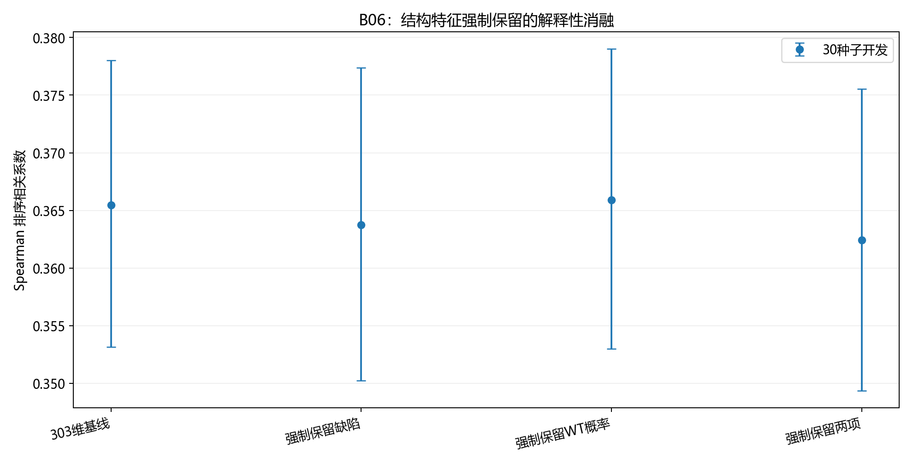

[矢量版](figures/阶段总汇报_20261006/B06_结构强制保留诊断.svg)。区间为固定已测数据上随机划分种子均值的自助法区间，不是新独立生物样本总体区间。

| 强制臂 / 基线 | 配对排序差 | 95%区间 | 胜/平/负 |
| --- | --- | --- | --- |
| 强制保留两项 | -0.0030 | [-0.0100, 0.0036] | 15/0/15 |
| 强制保留缺陷 | -0.0017 | [-0.0098, 0.0068] | 13/0/17 |
| 强制保留WT概率 | +0.0004 | [-0.0048, 0.0056] | 15/0/15 |

**解释性诊断结论：**强制保留仍没有排序增量区间稳定为正，当前这组目标/表示/模型不支持继续投入结构特征扩展；不推广成所有结构目标或模型均无效。

## 6. GBSA 与 docking：保留目标，详细说明独立支线

### 6.1 它们是两个不同计算指标

| 项目 | docking（分子对接） | MM-GBSA |
| --- | --- | --- |
| 数据字段 | 标准表 `dock`；历史来源对应 `r_i_docking_score` | 标准表 `gbsa`；历史来源对应 `r_psp_MMGBSA_dG_Bind` |
| 通常用途 | 在对接程序的构象/姿势与打分函数下筛选候选 | 在分子力学、溶剂模型和结构/采样协议下估计结合相关能量 |
| 必须追溯的协议 | 对接程序、受体和配体准备、约束、姿势、打分项 | 力场、溶剂近似、轨迹/快照、结合态和游离态处理、质量控制 |
| 本项目目标 | 历史探索目标，当前不替代 GBSA | 当前独立主目标，越低越好 |
| 新候选是否默认可用 | 未证明可稳定低成本取得；主线输入禁用 | 昂贵真标签尚无预算，先由代理预测 |

不能把所有 docking 定义为“纯界面且完全不含应变”，也不能说所有 MM-GBSA 协议都准确算入折叠畸变或熵；具体包含项取决于软件与计算协议。相关方法综述支持这种协议依赖性，而不提供本项目的亲和力校准。[Genheden 与 Ryde，2015](https://doi.org/10.1517/17460441.2015.1032936)。

### 6.2 历史 docking 目标确实更容易预测，但仍是 docking

**历史 30 种子特征实验：**

| 特征 | docking Spearman | SD |
| --- | --- | --- |
| 303d | 0.5452 | 0.0307 |
| 303d+useful192 | 0.5292 | 0.0344 |
| 303d+full601 | 0.5138 | 0.0316 |
| 303d+full601+smooth | 0.5295 | 0.0324 |

**100 种子对接目标确认：**

| 固定模型 | docking Spearman 均值 | SD |
| --- | --- | --- |
| RF | 0.5322 | 0.0361 |
| ET | 0.5259 | 0.0362 |
| GBR | 0.5405 | 0.0339 |
| XGB | 0.5487 | 0.0328 |
| rank_fusion | 0.5523 | 0.0344 |
| fusion_smooth | 0.5515 | 0.0343 |

四模型 rank_fusion 正式 95% CI **[0.5456, 0.5590]**。[源结果](../../evidence/audit_20260924/formal_dock_fusion_100seed/metrics.csv)；[源结果](../../evidence/audit_20260924/server_results/dock_optimize.json)

**0.5523 明确是“预测 docking 分数与真实 docking 分数的 Spearman 相关系数”，不是 GBSA 预测成绩，也不是 docking 能量值。**NUPACK 特征加入后该历史对接模型性能下降，是这组数据和模型的结果；“二级结构必然对 docking 有害”或“原因已证明是纯界面”没有因果验证。

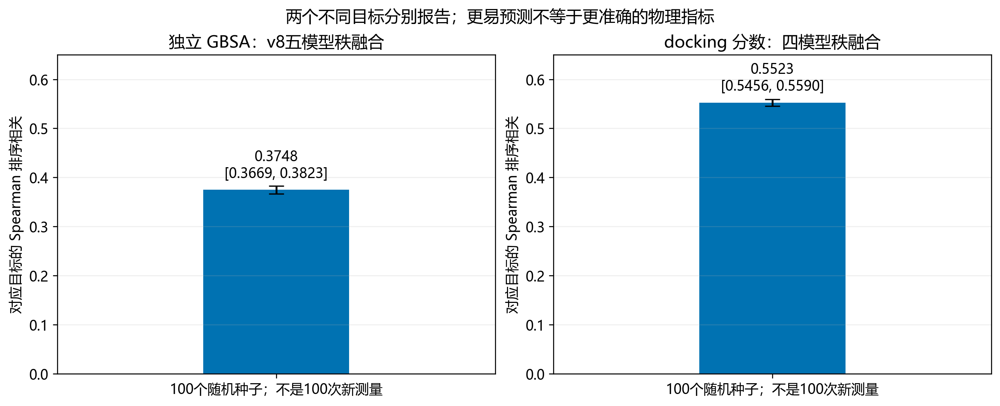

**图 A12（两个不同目标的100种子参照）：**左图是五模型GBSA秩融合，右图是四模型docking秩融合，误差线为各自发布区间。更高的对接排序相关不表示GBSA目标已经提高；这不是同目标两模型的配对胜负。[矢量版](figures/阶段总汇报_20261006/A12_两种目标的正式预测参照.svg)。

### 6.3 先前全局融合和排序替换为何不采用

“全局融合”指**把训练标签混成一个替代目标**，不是今天的OOF残差修正；“排序替换”指依据GBSA与dock的训练排序分歧，改写部分标签。预测输入仍是序列/历史结构，测试仍须对原GBSA评价。

| 方法 | 训练折内实际公式/操作 | 实际含义与风险 |
| --- | --- | --- |
| zscore_avg | 训练GBSA、dock各减均值/除SD，再相加 | 整体等强度混合，不保留GBSA物理单位 |
| rank_avg | 训练GBSA等级+训练dock等级 | 合成替代目标，不证明标签变真 |
| shrink_0.5 / shrink_0.3 | `d_scaled=dock×SD(g)/SD(dock)`；`y'=(1−λ)g+λd_scaled`，λ=0.5/0.3 | 代码未对齐两个均值；按实际列示，不改口称完整校准 |
| 低分歧测试子集 | 测试内归一化GBSA/dock排名差，取最小70%再算ρ | 使用测试GBSA界定的解释性子集，不能部署预筛，也不是全测试集改善 |
| 高分歧训练替换 | 训练内排名差最高15%行，用d_scaled替换温莎化GBSA | 假设这些GBSA错而dock对，缺真值依据；测试判是否有预测增益 |

早期全数据合成再划分版本有跨折统计问题；下面引用后来**训练折内重建目标/排名的修正包**。修正可用于检查配方的平均预测表现，不能确认物理噪声原因。[混合实现](../../scripts/reproduction/dock_denoise.py)、[替换实现](../../scripts/reproduction/dock_rank_correction.py)。

| 修复后的 GBSA 比较 | Spearman 均值 | 协议 |
| --- | --- | --- |
| raw_gbsa | 0.3490 | 30 种子折内变换，独立配置 |
| zscore_avg | 0.2091 | 30 种子折内变换，独立配置 |
| rank_avg | 0.2192 | 30 种子折内变换，独立配置 |
| shrink_0.5 | 0.2093 | 30 种子折内变换，独立配置 |
| shrink_0.3 | 0.2978 | 30 种子折内变换，独立配置 |
| baseline_all | 0.3547 | 30 种子排序修正版 |
| baseline_low_disagreement_test | 0.3407 | 30 种子排序修正版 |
| dock_rank_corrected | 0.0585 | 30 种子排序修正版 |

[源结果](../../evidence/audit_20260924/audit_dock_denoise_fixed_results.json)；[源结果](../../evidence/audit_20260924/audit_dock_rank_corr_fixed_results.json)

这些修复后结果否定了所试验的全局混合/秩替换配方。它们把目标信息合成或替换，不能直接当成 GBSA 真标签提升。后来改为 **训练折内的对接辅助残差模型**，才检验“对接里有没有 GBSA 基础模型尚未学到的信息”，两类实验不能混称。

**核验边界：**旧保存文件只含30种子均值和部分SD，没有逐seed数组或预测。核验覆盖实现和摘要，不能独立重算CI/胜率，也未重训。这些配置未形成可采用的正收益。若要对外发表精确比较或重新研究该配方，应经主运行器执行独立实验并保存逐种子指标与预测。新残差100种子包属于不同方法和证据，不混用。

### 6.4 新支线怎样做：训练边界、两种可用性、100 种子确认

先训练只用序列的 GBSA 基础模型，再在训练数据内部生成 OOF（out-of-fold，折外）预测，以按训练分位裁剪的GBSA减基础折外预测得到训练残差。残差修正器的拟合和缩放均限训练数据，参数在运行前固定。测试候选使用已拟合修正器，不能把测试 GBSA 用于残差训练或参数选择。

具体参数是303维序列输入、内层3折；GBSA/对接基础均为HistGradientBoostingRegressor（直方图梯度提升回归），迭代200次、最大深度3、学习率0.05、L2正则1.0。内折GBSA按该内训练分位裁剪，外层部署按1600条训练分位裁剪；对接标签不沿用GBSA裁剪。两个残差臂各用StandardScaler（标准化）+Ridge（岭回归），固定α=100。预测对接臂用训练内对接OOF预测学习残差，真实对接臂用训练已观测dock学习残差；测试均加到同一GBSA基础预测上。[实际残差实现](../../scripts/reproduction/dock_residual_screen.py)、[冻结确认配置](../../configs/experiments/dock_residual_confirmation_100seed_20261005.json)。

两种臂必须独立解释：**预测对接臂**只能使用由训练数据拟合的对接预测，因此可尝试序列生成场景；**真实对接臂**使用测试候选已观测 docking，只有在未来新候选也能取得真实 docking 时才满足部署条件。它是当前历史表内的信息可用性条件，不是序列代理免费得到的额外能力。

**流程图（按已有残差实现）：**区分训练内 GBSA、对接模型、折外残差，以及测试候选可获得的输入。图不表示已对新候选运行 docking。[矢量版](9月/figures/GBSA总汇报_20261005/01_对接残差训练边界.svg)。

| 臂 | 30 种子开发 Δρ | 100 种子确认 Δρ | 确认 95% CI | 胜/100 | 部署前提 |
| --- | --- | --- | --- | --- | --- |
| 预测 docking 残差 | −0.00015；CI [−0.00061, +0.00030] | -0.000361 | [-0.000657, -0.000083] | 41 | 只靠训练拟合得到 docking 预测 |
| 已观测 docking 残差 | 约 +0.05847 | +0.059696 | [0.055135, 0.064208] | 98 | 测试/新候选真实 docking 可取得 |

[源结果](../../evidence/search_suite_20261005/dock_confirmation/summary.json)；[源结果](../../runs/local_dock_residual_confirmation_100seed_20261005/metrics.csv)

**同一100种子上的绝对指标（跨种子均值）：**

| 臂 | GBSA Spearman | 真实top-10%召回 | 选20条中最低真实GBSA |
| --- | --- | --- | --- |
| 只用序列基础 | 0.3630 | 0.2518 | 2.4746 |
| 加预测dock残差 | 0.3627 | 0.2508 | 2.4185 |
| 加已观测dock残差 | 0.4227 | 0.3333 | 1.0951 |

真实top-10%为400条测试中的40条；召回按预测前40条计算，最低标签另按预测前20条计算。两者不是同一个候选配额。

100 种子使用 3001–3100，1600 训练/400 测试；预筛保留比例在确认前固定为 25%、50%、75%。**预测 dock 残差确认差 −0.000361，量级很小且没有正收益；真实 dock 残差约 +0.05970，98/100 胜。**这支持保留真实对接可得时的独立支线，不支持改动序列主线目标或输入边界。

### 6.5 预筛能减少什么、会漏掉什么

| 保留候选比例 | 保留真 top-10% 比例 | 最佳 20 中最低 GBSA 差 | 95% CI | 胜/平/负 | 需要的 docking |
| --- | --- | --- | --- | --- | --- |
| 25% | 51.52% | -0.4436 | [-1.3453, 0.4995] | 53/10/37 | 全部 400 测试候选 |
| 50% | 78.85% | -0.9532 | [-1.4446, -0.5243] | 27/70/3 | 全部 400 测试候选 |
| 75% | 91.92% | -0.3787 | [-0.6992, -0.1322] | 13/87/0 | 全部 400 测试候选 |

[源结果](../../evidence/search_suite_20261005/dock_confirmation/summary.json)

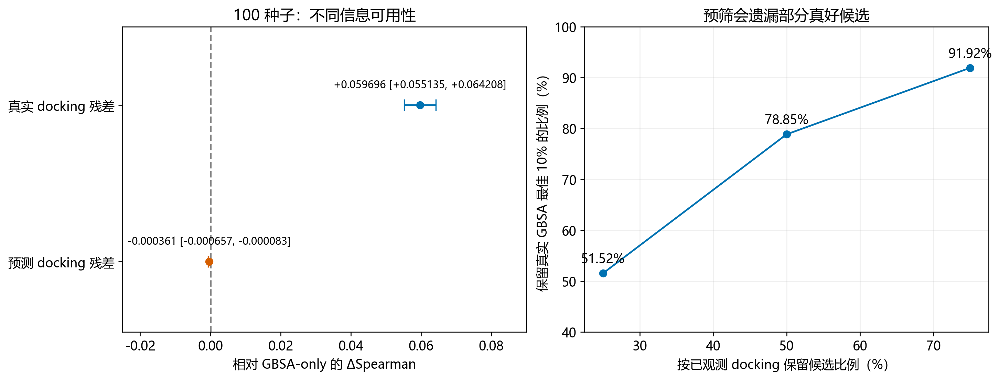

**图 A05（100 种子历史表）：**左图是配对 GBSA 排序相关系数增量，右图是不同保留比例对真实最佳 10% 候选的保留率。该预筛先需要全部 400 个测试候选的已观测 docking；最佳 20 条指标见表，不能只展示正增益而隐去漏掉的好候选。[矢量版](figures/阶段总汇报_20261006/A05_对接修正与预筛.svg)。

保留 50% 时，真 GBSA 最佳 10% 的平均保留率 78.85%，意味着平均遗漏这部分好候选的 21.15%。最低标签差 −0.9532 是预筛后按模型选取 20 条时，其最小历史 GBSA 相对不预筛选 20 条的差；有 70 个种子持平，不是大多数种子严格变好。

目前只有历史表里的 docking 数值，没有为新候选实测每条对接耗时、失败率或重试次数，所以不能声称“节省了一半总成本”。若未来立项，成本应至少计为 `候选总数 × 实际平均 docking 成本 + 请求真实 GBSA 数 × 实际 GBSA 成本`，失败重试另外记录。比较中应同时报告相同预算下的真 GBSA 发现指标和总计算资源。

可选后续路线包括重新验证残差修正、训练内多任务学习以及有协议资料后的多保真建模；它们目前没有本项目成绩，不列为已完成。小分子超大规模对接的追加打分研究只提供风险类比，不能作为本 RNA 数据的直接证明。[Sindt 等，2025](https://doi.org/10.1021/acs.jcim.5c00730)。

## 7. 阶段决策：代理优化可暂缓，先完成通用算法接口与筛选

论文迁移未形成更强正式GBSA基准，旧主动学习曲线不能沿用；修复固定池确认了有限池低分发现优势，却未确认代理排序改善。随后探索docking发现：它的目标更易预测，但预测dock修正GBSA无正收益；真实dock有条件收益，仍需候选时可得及成本证据。因此当前继续独立GBSA优化、暂缓这批代理配置扩展，把主任务推进到模型无关搜索层。

**成熟的代理尚未决定，不妨碍先完成接口。**搜索算法只需要“给合法序列→得到GBSA方向一致的预测分数及模型身份”，以后经典模型、预训练网络、集成或主动学习更新后的模型都通过适配器接入。本阶段算法效果只能在固定模型下评价；同评分器下的低预测优势不等于低真实GBSA。

| 当前能完成并已有证据 | 下一阶段条件到位才能做 |
| --- | --- |
| 统一输入输出、预测预算/缓存、合法突变、模型版本与恢复 | 确定成熟代理的部署快照和新候选校准 |
| 七算法、同父本、无交叉变异、谱系、分组与公平确认 | 冻结真实GBSA协议和资源后判断算法真实优胜 |
| 选择当前评分器下的计算默认及随机/爬山控制 | 决定新增标签是否重训、是否进入主动学习 |

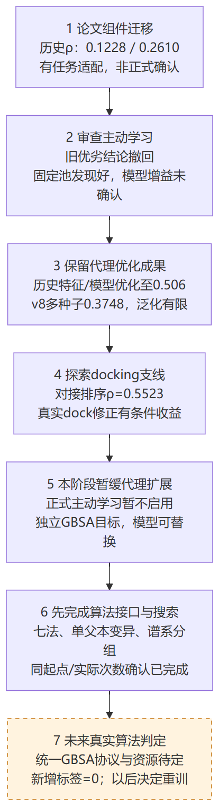

[矢量版](figures/阶段总汇报_20261006/A13_论文到当前搜索的决策链.svg) · [可编辑流程源](figures/阶段总汇报_20261006/A13_论文到当前搜索的决策链.mmd)

流程图可编辑源代码

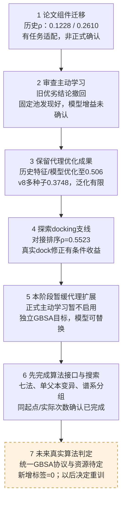
```mermaid
flowchart TB
    P["1 论文组件迁移<br/>历史ρ：0.1228 / 0.2610<br/>有任务适配，非正式确认"] --> L
    L["2 审查主动学习<br/>旧优劣结论撤回<br/>固定池发现好，模型增益未确认"] --> S
    S["3 保留代理优化成果<br/>历史特征/模型优化至0.506<br/>v8多种子0.3748，泛化有限"] --> D
    D["4 探索docking支线<br/>对接排序ρ=0.5523<br/>真实dock修正有条件收益"] --> J
    J["5 本阶段暂缓代理扩展<br/>正式主动学习暂不启用<br/>独立GBSA目标，模型可替换"] --> I
    I["6 先完成算法接口与搜索<br/>七法、单父本变异、谱系分组<br/>同起点/实际次数确认已完成"] --> F
    F["7 未来真实算法判定<br/>统一GBSA协议与资源待定<br/>新增标签=0；以后决定重训"]
    classDef pending fill:#fff3df,stroke:#c77919,stroke-dasharray:5 5;
    class F pending;
```

**图A13（研究决策流程）：**数值来自对应历史/确认包，不是同条件的连续提升曲线；橙色虚线节点尚未启动。PPT叙事应按这个顺序展开。

## 8. 模型无关接口与评分器：当前重点已经搭好了什么

### 8.1 两个接口版本承担不同职责

| 合同 | 当前版本 | 输入 | 输出 | 约束 |
| --- | --- | --- | --- | --- |
| 代理/未来标签接口 | 0.2.0 | 训练序列+GBSA；预测时仅序列 | 按输入顺序 `mu`、可选 `sigma` 和元数据 | 独立 GBSA、kcal/mol、最小化；sigma 可为空 |
| 搜索层接口 | 0.1.1 | SearchContext（搜索上下文）+冻结评分器+策略参数 | 候选档案、代际记录、分组、摘要、停止原因 | 合法序列、预算计数、代码/数据/模型身份、单父本谱系 |

`mu`（希腊字母 μ）是点预测，对应导出列 `pred_gbsa`；`sigma`（σ）是可选不确定信息，目前仅为未经校准的成员分歧，不能把它称为预测误差或 95% 区间。`model_id`、`feature_version`、`fit_id` 分别识别模型、特征与实际拟合。`model_n_train` 表示该次预测模型的训练样本量，不是新标签数。

### 8.2 评分器是什么

评分器不是第八个搜索算法。它是模型的统一调用封装：接收序列、验证输入、按顺序给出 GBSA 标度预测、缓存已算序列、统计新预测次数、附上模型身份。实际模型可以是经典回归、深度网络、预训练模型或集成，只要实现相同合同并通过检验。

主动学习不是一种与 RF 并列的代理结构；它是选择哪些样本取得真标签并更新模型的流程。可以使用 RF 做主动学习，也可以将同一 RF 固定后仅作遗传算法评分器。当前执行的是后一类固定模型的搜索比较。

| 评分器职责 | 实际执行规则 | 为什么需要 |
| --- | --- | --- |
| 保持顺序 | 第 i 个输出对应第 i 个输入 | 防止台账错位和父本选择错误 |
| 合法性 | 长度 141、ACGU、非变异位点不动、4–13 壳 | 算法不通过改骨架偷取低分 |
| 有限输出 | mu 有限，sigma 若有须非负且有限 | 防止 NaN/无穷参与排序 |
| 冻结身份 | 一次内循环固定模型、特征、训练数据和方向 | “下一代更低”具有同一评分基准 |
| 缓存 | 同一搜索内同序列复用结果 | 重复提出不额外消耗唯一预测预算 |
| 独立缓存 | 比较中每个算法独立计数，模型共享 | 一个算法先算出的候选不能给另一个免费预算 |
| 起点预算 | 初始 16 条也由代理打分并计入次数 | 不能把初始化成本藏起来 |
| 预测/真值边界 | 禁止用测试标签或新候选未知真标签选父代 | 保护真实可部署条件 |

### 8.3 当前内循环与未来外循环

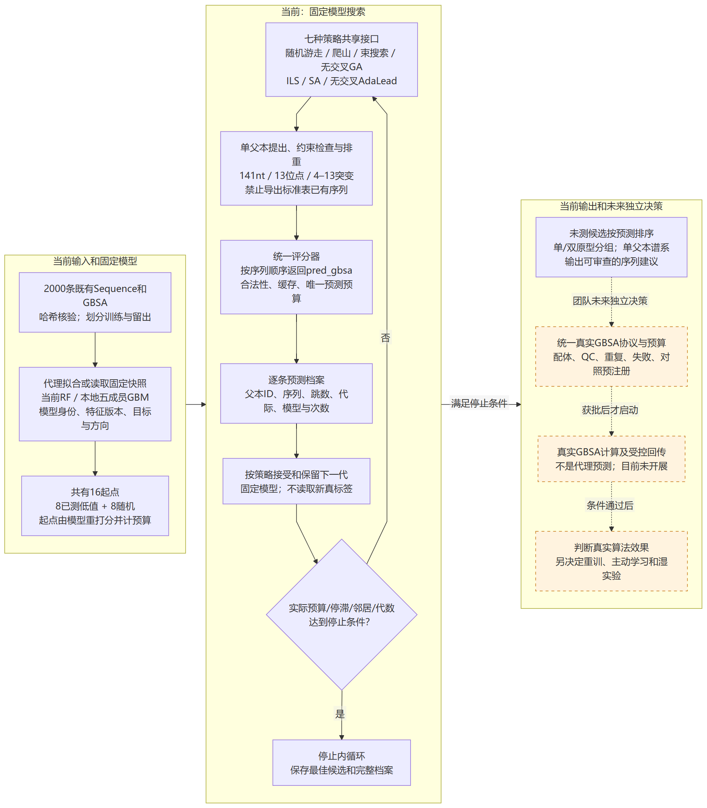

[矢量版](figures/阶段总汇报_20261006/A09_当前搜索与未来验证.svg) · [可编辑流程源](figures/阶段总汇报_20261006/A09_当前搜索与未来验证.mmd)

流程图可编辑源代码

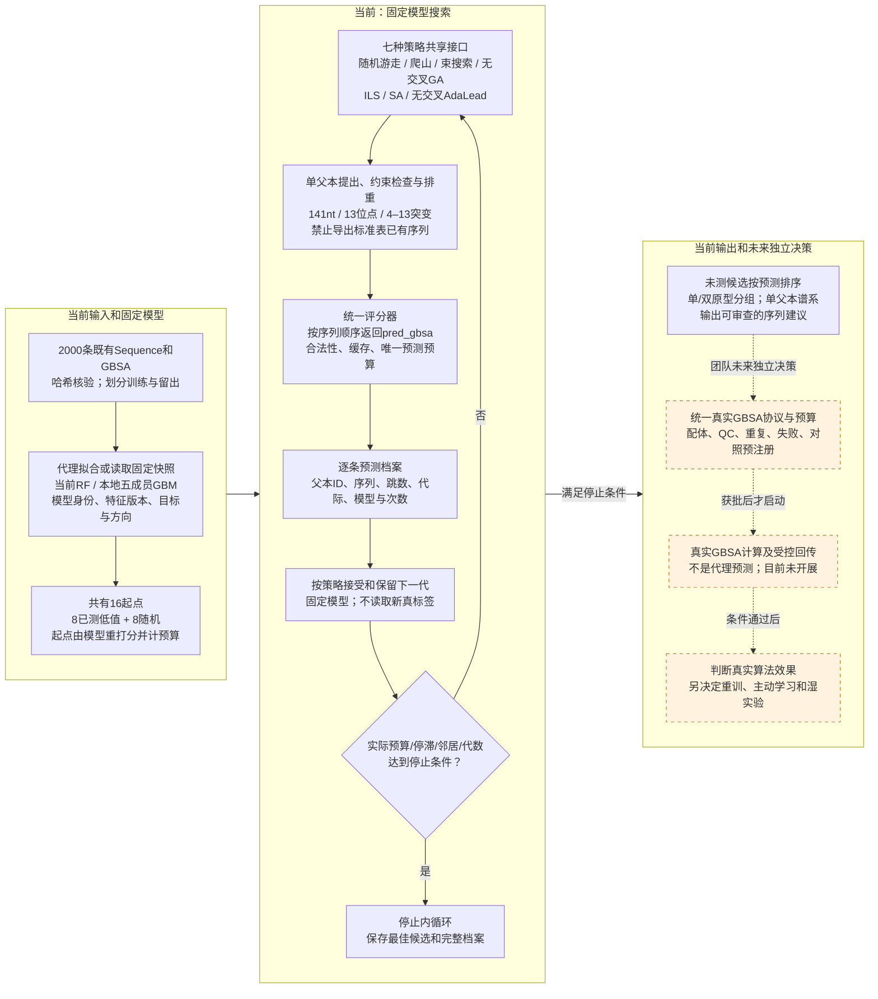
```mermaid
flowchart LR
    subgraph INPUT["当前输入和固定模型"]
    direction TB
    D["2000条既有Sequence和GBSA<br/>哈希核验；划分训练与留出"] --> M["代理拟合或读取固定快照<br/>当前RF / 本地五成员GBM<br/>模型身份、特征版本、目标与方向"]
    M --> I["共有16起点<br/>8已测低值 + 8随机<br/>起点由模型重打分并计预算"]
    end
    subgraph ENGINE["当前：固定模型搜索"]
    direction TB
    P["七种策略共享接口<br/>随机游走 / 爬山 / 束搜索 / 无交叉GA<br/>ILS / SA / 无交叉AdaLead"]
    P --> V["单父本提出、约束检查与排重<br/>141nt / 13位点 / 4–13突变<br/>禁止导出标准表已有序列"]
    V --> S["统一评分器<br/>按序列顺序返回pred_gbsa<br/>合法性、缓存、唯一预测预算"]
    S --> A["逐条预测档案<br/>父本ID、序列、跳数、代际、模型与次数"]
    A --> R["按策略接受和保留下一代<br/>固定模型；不读取新真标签"]
    R --> Q{"实际预算/停滞/邻居/代数<br/>达到停止条件？"}
    Q -- 否 --> P
    Q -- 是 --> X["停止内循环<br/>保存最佳候选和完整档案"]
    end
    subgraph OUTPUT["当前输出和未来独立决策"]
    direction TB
    G["未测候选按预测排序<br/>单/双原型分组；单父本谱系<br/>输出可审查的序列建议"]
    G -. 团队未来独立决策 .-> C["统一真实GBSA协议与预算<br/>配体、QC、重复、失败、对照预注册"]
    C -. 获批后才启动 .-> L["真实GBSA计算及受控回传<br/>不是代理预测；目前未开展"]
    L -. 条件通过后 .-> U["判断真实算法效果<br/>另决定重训、主动学习和湿实验"]
    end
    INPUT --> ENGINE
    ENGINE -- 满足停止条件 --> OUTPUT
    classDef future fill:#fff3df,stroke:#c77919,stroke-dasharray:5 5;
    class C,L,U future;
```

**图 A09（当前实现及条件流程）：**实线为当前可运行内循环；虚线为未来需团队决策和真实标签的外循环。模型研究位于接口上游，可继续暂停或替换。所有七法共享预测合同，当前没有在搜索各代间重训模型。

### 8.4 换代理时实际要做哪些事

1. 只在训练数据上拟合特征、缩放、裁剪和模型；验证候选时能获得全部输入。
2. 实现 `fit`/`predict`，预测返回原 GBSA 标度及顺序；如果只能输出排名，先明确标度适配并重新验收，不直接假称 kcal/mol。
3. 使用新模型身份和特征版本，新建运行编号。空 sigma 保持为空；提供 sigma 必须注明计算含义。
4. 做输入顺序、重复序列、非法位点、预算、保存恢复等合同检查。
5. 重跑同起点、实际次数对齐的搜索比较，旧模型下 AdaLead/爬山优劣不能自动继承。
6. 再检查候选名单随重训变化的稳定性；最终如果启动真实验证，以真实 GBSA 判定算法收益。

### 8.5 为什么暂不升级复杂不确定性采集

30 种子校准分别使用 400 和 1600 条训练、400 条测试，5 成员 XGB，训练内 screen-100 与 2.5% winsor（温莎化，按训练分位截断极端标签）。比较 σ 与绝对误差的相关，以及 LCB（lower confidence bound，下置信界）相对只按 μ 排序的召回。

| 指标 | 400训练：均值 [95% CI] | 1600训练：均值 [95% CI] |
| --- | --- | --- |
| spearman_mu | 0.2502 [0.2342, 0.2659] | 0.3526 [0.3409, 0.3647] |
| spearman_sigma_error | 0.0137 [-0.0135, 0.0397] | 0.0281 [0.0100, 0.0450] |
| spearman_sigma_error_shuffled | 0.0158 [0.0017, 0.0294] | -0.0073 [-0.0219, 0.0075] |
| mean_abs_error | 7.8365 [7.7320, 7.9452] | 7.4906 [7.3933, 7.5821] |
| delta_recall_lcb0.5_k0.05 | 0.0033 [-0.0100, 0.0167] | -0.0083 [-0.0250, 0.0067] |
| delta_recall_lcb1.0_k0.05 | 0.0083 [-0.0067, 0.0233] | -0.0167 [-0.0383, 0.0033] |
| delta_recall_lcb2.0_k0.05 | -0.0017 [-0.0167, 0.0150] | -0.0067 [-0.0267, 0.0133] |
| delta_recall_lcb0.5_k0.1 | -0.0017 [-0.0092, 0.0067] | -0.0025 [-0.0100, 0.0058] |
| delta_recall_lcb1.0_k0.1 | -0.0083 [-0.0183, 0.0017] | -0.0075 [-0.0192, 0.0042] |
| delta_recall_lcb2.0_k0.1 | -0.0150 [-0.0308, 0.0008] | -0.0458 [-0.0642, -0.0275] |

`k0.05/k0.1` 是前 5%/10% 召回终点，`lcb0.5/1.0/2.0` 是 β 值，β 为 sigma 的权重。[源结果](../../evidence/sigma_calibration_30seed/summary.json)

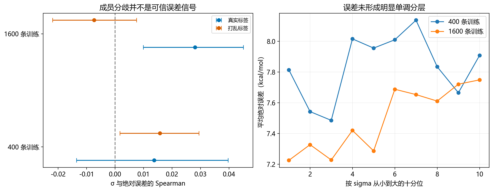

**图 A07（30 种子）：**左图显示 σ—误差相关与打乱标签对照；右图按 σ 十分位显示绝对误差，并非每条预测的置信区间。400 条训练下真标签关联与打乱对照同量级。[矢量版](figures/阶段总汇报_20261006/A07_不确定性校准门槛.svg)。

1600 档的 0.028 虽然区间为正，但效应很弱；400 档区间跨零。LCB 的 β=2 在 1600 档 top-10% 召回反而下降。因此 EI（expected improvement，期望改进）、Thompson sampling（汤普森采样）和批量 BO（Bayesian optimization，贝叶斯优化）尚未满足当前概率代理门槛。不是因为它们文献中无效，而是当前 sigma 不够支持这样的决策。

## 9. 七种算法：原理、当前实现、为什么试

### 9.1 共同前提与原四法

搜索目标是 `min f_model(sequence)`，其中 f_model 是固定评分器；这不是对真实未知 GBSA 的全局最优证明。已有低 GBSA 训练序列仅用于选合法初始父本；在搜索中仍重新由代理打分。共享 8 条互异的较低 GBSA 已测起点和 8 条分层随机起点，共 16 条，顺序相同。

| 策略 | 主要机制 | 用途与局限 | 参考依据 |
| --- | --- | --- | --- |
| 同起点随机游走 | 随机改变当前路径序列；不按分数优先繁殖；历史低分仍存档 | 基础预算对照，有探索覆盖；可能浪费预测次数 | 开放局部搜索教材 [R3](https://artint.info/3e/html/ArtInt3e.Ch4.S6.html)；本项目实现 |
| 多起点爬山/局部下降 | 多路径提出邻居，只有严格更低的邻居推进路径；记录局部最优与停止 | 简单、低分效率好；可能困在局部区域 | 同上，最小化适配；不是生物进化定理 |
| 多路径束搜索 | 保存有限宽度路径，扩展候选，按预测和距离保留下一束 | 兼顾多条路径；束宽和预算重要 | [束搜索原文](https://aclanthology.org/W17-3207/)与当前实现；非 RNA 实验验证 |
| 无交叉遗传算法 | 种群→选择单父本→突变→评分→精英保留/生存替换 | 集中优秀种群且保留多个路径；不做双亲拼接 | Holland 理论与 RNA GA 应用，见 §20；本实验禁用交叉 |

爬山通常按“更高适应度更好”命名，但本项目是能量最小化，因此实际是局部下降。束搜索与随机游走的历史版本还有不同起点的实现；本确认用 matched_seed_random_walk，而非早期 stratified_random，后者不能混入公平对照。

**机制图：**多路径生成、评分、严格改善与停止；没有真实 GBSA 查询。[矢量版](9月/figures/GBSA总汇报_20261005/04_多起点爬山.svg)。

**机制图：**有限束宽和距离筛选保留多路径，并非列举全部 6700 万组合。[矢量版](9月/figures/GBSA总汇报_20261005/05_多路径束搜索.svg)。

### 9.2 仅变异遗传算法：单父本选择、变异与种群替换

遗传算法 GA（genetic algorithm）已经实现，不只是未来建议。当前版本只由单父本变异产生子代，没有 crossover/recombination（交叉/重组）。使用“遗传算法”是因为保留了种群、选择、繁殖、代际生存与精英机制；本文明确标为无交叉版本，不声称复制原论文所有算子。

每代从当前种群中随机抽两个个体做 tournament selection（锦标赛选择），较低预测 GBSA 者成为父本，再做合法单/双位点变异；部分提出来自合法全局重启。评分后将父代与子代纳入生存候选，保留精英，并依据预测排序及距离保留下一代。所谓 fitness（适应度）在此是 GBSA 最小化的排序依据，不代表已测生物适应度。

| 当前参数 | 冻结值 | 用途 |
| --- | --- | --- |
| 共享已测/随机起点 | 8 / 8 | 初始化16条并计分 |
| 种群 / 每代子代 | 32 / 128 | GA群体及提出量，合法/重复过滤后实际可更少 |
| 锦标赛 / 精英 | 2 / 2 | 单父本选择和历史较优保留 |
| 单跳比例 / 重启比例 | 0.8 / 0.1 | 原四法相关提出设置；不能强加到新法 |
| 束宽 / 每父本提出量 | 32 / 32 | 束和相关局部候选参数 |
| 多样性距离 / 池扩展倍率 | 2 / 4 | 原种群/束筛选 |
| GA连续停滞代数 | 4 | GA生存群体停滞护栏 |
| 最新七法最大代数 | 256 | 原四法64；七法全部256 |
| ILS扰动位点数 | 2 | 2位点扰动 |
| SA温度初尺度 / 终比例 | 0.25 / 0.02 | 训练IQR尺度，按实际次数降温 |
| AdaLead容差 / 父本上限 / rollout | 0.05 / 32 / 16 | 加性容差，固定模型无交叉 |

[源结果](../../evidence/search_seven_20261005/confirmation/suite_config.json)

**机制图：**单父本变异与种群替换；没有双亲拼接。[矢量版](9月/figures/GBSA总汇报_20261005/06_无交叉遗传算法.svg)。

### 9.3 迭代局部搜索：停住后扰动，再局部下降

ILS（iterated local search，迭代局部搜索）在局部搜索之外加扰动环节。当前实现用 16 条并行路径，先搜索未访问的一跳邻居并严格下降；无改善时下一波做两位点随机扰动。**扰动可以无条件进入更差的当前状态**，然后继续下降；历史最佳候选独立保存，所以最终输出不会因为扰动丢掉此前低分。

本实验冻结 `ils_perturb_sites=2`，没有扫描所有扰动强度。它解决的是“允许离开当前局部区域”，不是“保证离开任意局部最优”。原始方法依据 [Lourenço、Martin、Stützle](https://arxiv.org/abs/math/0102188)，图书章节而非有 JCR 分区的期刊论文。

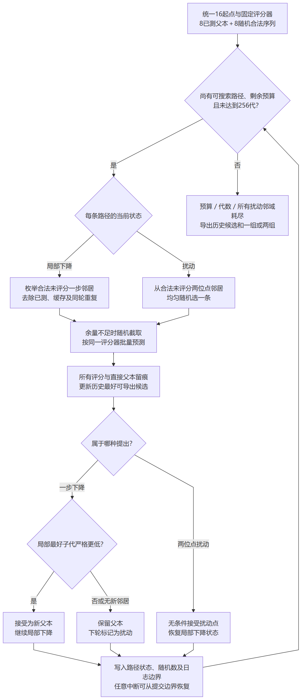

**机制图：**局部下降、两位点扰动和历史最佳分别记录。[矢量版](9月/figures/GBSA总汇报_20261005/18_迭代局部搜索.svg)。

### 9.4 模拟退火：有控制地接受暂时变差

SA（simulated annealing，模拟退火）使用 16 条链，每波每条链随机提出一个未访问的一跳邻居。令 Δ=新预测减当前预测：Δ≤0 接受；Δ>0 以 `exp(−Δ/T)` 概率接受。T 是控制概率的数学温度，不是 MD 温度，不代表真实热力学采样。

本实验初温 `T0=0.25×max(训练 GBSA 的 IQR, 10⁻⁹)`；IQR（interquartile range，四分位距）为第三四分位减第一四分位。随已消耗预测次数 n 降温：`T(n)=T0×0.02^((n−n0)/(B−n0))`，n0 为起点评分数，B 为预算上限。没有额外免费重启，历史最佳单独保留。

全局排重与预算限制使本实现成为优化适配版，不是经典平衡态采样器，也没有复现原论文的渐近收敛条件。其原理参考 [Kirkpatrick 等，Science 1983](https://doi.org/10.1126/science.220.4598.671)。

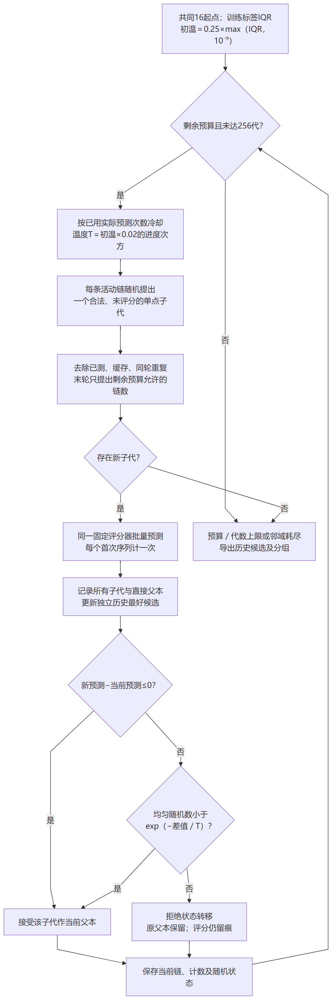

**机制图：**概率接受变差步骤和按实际预测次数降温；不读取新增真标签。[矢量版](9月/figures/GBSA总汇报_20261005/19_模拟退火.svg)。

### 9.5 无交叉 AdaLead：以领先父本为参照延伸

AdaLead 是 adapt-with-the-leader，随领先者调整的序列优化方法。本实验是 **无交叉、最小化 GBSA、固定模型**的改编版本。原文算法有重组和模型更新等设定，不能称完整复现。[Sinai 等原稿](https://arxiv.org/abs/2010.02141)。

每次选领先父本：预测值≤当前最优+δ，δ=0.05×训练 GBSA IQR，最多 32 个父本；这种加性容差适用于负分数，避免直接套最大化的乘法阈值。16 条 rollout（向前展开的搜索链）有放回均匀选择父本，再逐次一跳变异。**子代继续展开的条件是胜过本链根父本，而不是必须胜过直接父本**；因此可在始终优于根的区域内暂时回退。合法评分候选全记录，不做全局随机重启，不在代间重训代理。

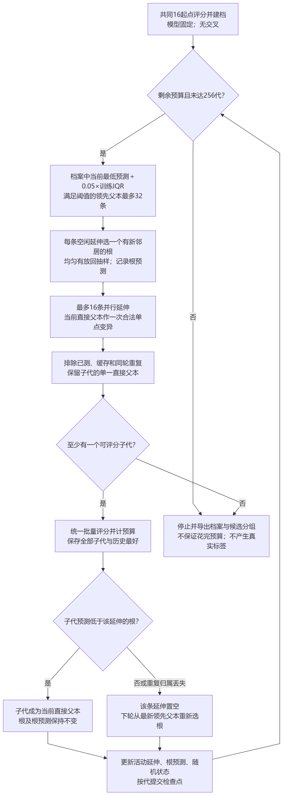

**机制图：**领先根筛选、root-relative rollout（相对根父本的展开规则）、预算与邻居耗尽。[矢量版](9月/figures/GBSA总汇报_20261005/20_无交叉AdaLead.svg)。

### 9.6 七法比较的实际问题

七法解决不同探索与利用权衡。低分优先可能快速集中到模型误判区；随机或扰动可能提高覆盖但用掉低分搜索预算。文献提供设计依据，当前实验证据决定在当前评分器下的表现；最终真标签另决定生物意义。复杂方法没有天然优先权，简单爬山也没有跨所有模型的胜利保证。

## 10. 搜索比较协议：同起点、同模型与实际评分预算

### 10.1 三法、四法与七法实验的条件关系

| 比较包 | 种子与条件 | 实际已完成 | 正确用途 |
| --- | --- | --- | --- |
| 早期阶段 B 三法 | 201–230；上限 8192；起点/实际次数不同 | 随机/爬山/束最低预测均值 10.85/6.02/6.07；实际均值 8192/4143/4769 | 仅历史代理诊断，不能宣称公平算法胜负 |
| 修复后的同起点三法 | 301–330；同 16 起点；本地 GBM；上限 1024 | 90 子运行；共同实际次数 1021–1024 | 30 种子开发，最低预测均值 8.4764/4.7696/7.1431 |
| 原四法套件 | 开发 401–430，确认 2001–2100；64 代护栏 | 开发含预算、重训与 GA 消融；100 种子确认 | 原四法冻结条件成绩，单独报告 |
| 最新七法套件 | 开发 6001–6030，确认 8001–8100；256 代护栏 | 原四法也重新运行；新增三法；30 开发/100 确认 | 当前主要计算证据 |

最新七法确认种子在启动前由原草案 7001–7100 改为 8001–8100，以避开开发重训种子 7001–7030；有[修订记录](../../evidence/search_seven_20261005/protocol_amendment.json)。不是看确认结果后换种子或改参数。

### 10.2 同起点、同模型、按实际次数对齐

对每个种子和代理：从标准表取 300 条训练、1700 条留出，拟合一次代理，然后让七法共用该模型对象与按顺序相同的 16 起点。候选档案核对数据、训练集、排除集、约束、模型身份和起点序列。每法独立缓存。

令每法实际唯一预测数为 n_a，七法主比较 `N=min(n_1,…,n_7)`。按每法档案实际评分顺序截断前 N 条，在其中可导出的未测候选求最低预测。起点计入预测预算，但来自训练表的已测起点不能冒充发现的未测最佳候选。标准表全部 2000 条都禁止作为新增导出候选，包括未用于拟合的留出条目。

**N 是每个种子分别计算，不是用全体种子的一个平均 N 截断。**某法早停时，其他法也截到共同次数后比较；不能把没用完的上限称为同样用掉的预算。

**机制图：**合法候选、缓存、实际预测预算和评分身份的边界；初始化成本计入。[矢量版](9月/figures/GBSA总汇报_20261005/03_评分验证与预算.svg)。

### 10.3 实际评分模型与后端身份

| 评分器 | 实际后端与训练 | 七法开发留出 Spearman 均值 | 用途 |
| --- | --- | ---: | --- |
| RF | 300 树随机森林；303 维序列候选特征、训练内筛至 100；300 条训练 | 0.2530 | 固定经典诊断模型 |
| 配置名 `xgb` | 本地实际为 scikit-learn GradientBoostingRegressor 五成员自助集成，日志标识 `xgb_boot5_sklearn_gbm` | 0.2427 | 固定本地梯度提升诊断模型，本文简称 GBM |

**本机这个 `xgb` 不是调用 XGBoost 的证据，也不是 v8 秩融合。**七法评分器只有 300 条训练，正式代理发布使用的训练条件不同，不能把其约 0.24/0.25 写成发布 0.375 降级的结论。不同代理的绝对预测尺度和偏差也不同，RF 的 17 与 GBM 的 5 不作模型优劣比较。

### 10.4 主表与两两补充表分开

七者共同 N 可能被较早停止的 AdaLead/GA 限制。为回答“单独两法有更大可共同用量时如何”，另冻结两两比较 `N_ab=min(n_a,n_b)`，保留原顺序截断。它是补充视角，不把某对的更大 N 用来替换七法主表。

例如 GBM 下 GA−爬山七法共同截面为 +0.9078，而两两截面为 +0.1306、区间跨零；这不矛盾，它们比较了不同实际前缀。报告完整口径能避免因早停给出夸大的整体算法排名。

## 11. 四法和七法：实际结果全部按条件分开

### 11.1 原四法 100 种子确认，64 代护栏

| 评分器 | 算法 | 共同次数内最低预测均值 | 共同实际N：最小/中位/最大 | 整次运行实际预测均值 |
| --- | --- | --- | --- | --- |
| RF | 同起点随机游走 | 17.7238 | 581/1023.0/1024 | 1024.00 |
| RF | 多起点爬山 | 16.9828 | 581/1023.0/1024 | 1024.00 |
| RF | 多路径束搜索 | 17.3689 | 581/1023.0/1024 | 1023.09 |
| RF | 无交叉 GA | 17.0196 | 581/1023.0/1024 | 975.54 |
| 本地 GBM（配置名 xgb） | 同起点随机游走 | 9.0265 | 590/1024.0/1024 | 1024.00 |
| 本地 GBM（配置名 xgb） | 多起点爬山 | 5.2212 | 590/1024.0/1024 | 1024.00 |
| 本地 GBM（配置名 xgb） | 多路径束搜索 | 7.5387 | 590/1024.0/1024 | 1023.68 |
| 本地 GBM（配置名 xgb） | 无交叉 GA | 5.5674 | 590/1024.0/1024 | 1004.34 |

| 评分器 | 算法−对照 | 平均差 | 中位差 | 95% CI | 胜/平/负 |
| --- | --- | --- | --- | --- | --- |
| RF | 多起点爬山−同起点随机游走 | -0.7410 | -0.6509 | [-0.8533, -0.6299] | 92/2/6 |
| RF | 多路径束搜索−同起点随机游走 | -0.3549 | -0.2857 | [-0.4404, -0.2712] | 84/9/7 |
| RF | 无交叉 GA−同起点随机游走 | -0.7041 | -0.5931 | [-0.7954, -0.6149] | 95/2/3 |
| RF | 无交叉 GA−多起点爬山 | +0.0369 | +0.0351 | [-0.0272, 0.0945] | 26/17/57 |
| RF | 无交叉 GA−多路径束搜索 | -0.3492 | -0.2922 | [-0.4217, -0.2815] | 82/12/6 |
| 本地 GBM（配置名 xgb） | 多起点爬山−同起点随机游走 | -3.8054 | -3.8010 | [-4.2358, -3.3705] | 98/0/2 |
| 本地 GBM（配置名 xgb） | 多路径束搜索−同起点随机游走 | -1.4878 | -1.3116 | [-1.7229, -1.2586] | 91/4/5 |
| 本地 GBM（配置名 xgb） | 无交叉 GA−同起点随机游走 | -3.4592 | -3.3770 | [-3.8097, -3.1194] | 98/2/0 |
| 本地 GBM（配置名 xgb） | 无交叉 GA−多起点爬山 | +0.3462 | +0.2556 | [0.0468, 0.6345] | 22/15/63 |
| 本地 GBM（配置名 xgb） | 无交叉 GA−多路径束搜索 | -1.9713 | -1.7258 | [-2.2478, -1.6995] | 94/6/0 |

[源结果](../../evidence/search_suite_20261005/confirmation/summary.json)

**原四法图（100 种子 2001–2100）：**各法相对随机游走的最低预测配对差。它不是七法的新确认控制组。[矢量版](9月/figures/GBSA总汇报_20261005/09_四算法确认配对结果.svg)。

### 11.2 最新七法 100 种子确认主表，256 代护栏

| 评分器 | 算法 | 共同次数内最低预测均值 | 共同实际N：最小/中位/最大 | 整次运行实际预测均值 |
| --- | --- | --- | --- | --- |
| RF | 同起点随机游走 | 17.9092 | 584/1024.0/1024 | 1024.00 |
| RF | 多起点爬山 | 17.0137 | 584/1024.0/1024 | 1024.00 |
| RF | 多路径束搜索 | 17.5140 | 584/1024.0/1024 | 1023.13 |
| RF | 无交叉 GA | 17.1023 | 584/1024.0/1024 | 975.89 |
| RF | ILS | 17.5477 | 584/1024.0/1024 | 1024.00 |
| RF | SA | 17.3760 | 584/1024.0/1024 | 1024.00 |
| RF | 无交叉 AdaLead | 17.0215 | 584/1024.0/1024 | 1024.00 |
| 本地 GBM（配置名 xgb） | 同起点随机游走 | 9.2760 | 118/332.5/1024 | 1024.00 |
| 本地 GBM（配置名 xgb） | 多起点爬山 | 6.6526 | 118/332.5/1024 | 1024.00 |
| 本地 GBM（配置名 xgb） | 多路径束搜索 | 8.2009 | 118/332.5/1024 | 1023.40 |
| 本地 GBM（配置名 xgb） | 无交叉 GA | 7.5604 | 118/332.5/1024 | 997.67 |
| 本地 GBM（配置名 xgb） | ILS | 8.5497 | 118/332.5/1024 | 1024.00 |
| 本地 GBM（配置名 xgb） | SA | 8.4717 | 118/332.5/1024 | 1024.00 |
| 本地 GBM（配置名 xgb） | 无交叉 AdaLead | 5.0564 | 118/332.5/1024 | 410.62 |

[源结果](../../evidence/search_seven_20261005/confirmation/summary.json)

| 评分器 | 算法−对照 | 平均差 | 中位差 | 95% CI | 胜/平/负 |
| --- | --- | --- | --- | --- | --- |
| RF | 多起点爬山−同起点随机游走 | -0.8955 | -0.8684 | [-1.0008, -0.7926] | 96/0/4 |
| RF | 多路径束搜索−同起点随机游走 | -0.3953 | -0.3382 | [-0.4663, -0.3257] | 86/7/7 |
| RF | 无交叉 GA−同起点随机游走 | -0.8069 | -0.6775 | [-0.9034, -0.7130] | 97/2/1 |
| RF | ILS−同起点随机游走 | -0.3616 | -0.2956 | [-0.4366, -0.2882] | 83/10/7 |
| RF | SA−同起点随机游走 | -0.5332 | -0.5627 | [-0.6605, -0.4097] | 79/2/19 |
| RF | 无交叉 AdaLead−同起点随机游走 | -0.8877 | -0.8484 | [-0.9916, -0.7866] | 99/0/1 |
| RF | 无交叉 GA−多起点爬山 | +0.0886 | +0.0621 | [0.0442, 0.1332] | 25/8/67 |
| RF | ILS−多起点爬山 | +0.5339 | +0.4448 | [0.4434, 0.6284] | 7/4/89 |
| RF | SA−多起点爬山 | +0.3623 | +0.3440 | [0.3030, 0.4209] | 7/4/89 |
| RF | 无交叉 AdaLead−多起点爬山 | +0.0078 | +0.0000 | [-0.0473, 0.0775] | 41/28/31 |
| RF | 无交叉 GA−多路径束搜索 | -0.4116 | -0.3343 | [-0.4874, -0.3407] | 85/6/9 |
| 本地 GBM（配置名 xgb） | 多起点爬山−同起点随机游走 | -2.6235 | -3.0731 | [-3.1614, -2.0824] | 82/0/18 |
| 本地 GBM（配置名 xgb） | 多路径束搜索−同起点随机游走 | -1.0751 | -0.5877 | [-1.3783, -0.7821] | 69/15/16 |
| 本地 GBM（配置名 xgb） | 无交叉 GA−同起点随机游走 | -1.7157 | -1.6959 | [-2.0752, -1.3573] | 82/5/13 |
| 本地 GBM（配置名 xgb） | ILS−同起点随机游走 | -0.7264 | -0.4451 | [-1.0211, -0.4350] | 61/17/22 |
| 本地 GBM（配置名 xgb） | SA−同起点随机游走 | -0.8044 | -0.8221 | [-1.2083, -0.4117] | 62/1/37 |
| 本地 GBM（配置名 xgb） | 无交叉 AdaLead−同起点随机游走 | -4.2196 | -4.5043 | [-4.6639, -3.7855] | 99/0/1 |
| 本地 GBM（配置名 xgb） | 无交叉 GA−多起点爬山 | +0.9078 | +0.8426 | [0.3882, 1.4283] | 32/3/65 |
| 本地 GBM（配置名 xgb） | ILS−多起点爬山 | +1.8971 | +1.9118 | [1.3642, 2.4286] | 19/3/78 |
| 本地 GBM（配置名 xgb） | SA−多起点爬山 | +1.8191 | +1.6246 | [1.3496, 2.2963] | 23/1/76 |
| 本地 GBM（配置名 xgb） | 无交叉 AdaLead−多起点爬山 | -1.5962 | -0.7783 | [-2.1575, -1.0582] | 60/16/24 |
| 本地 GBM（配置名 xgb） | 无交叉 GA−多路径束搜索 | -0.6406 | -0.4276 | [-0.9861, -0.3126] | 60/9/31 |

表内最低分是预测值；负差=试验法预测更低，平局按冻结容差处理。

**七法确认图 1：**100 种子 8001–8100；各代理分别按七法共同次数比较。均值与逐项 95% 自举区间；负值表示找到更低的**代理预测 GBSA**。[矢量版](9月/figures/GBSA总汇报_20261005/14_七算法确认对随机.svg)。

**七法确认图 2：**同一主截面比较 ILS、SA、AdaLead 相对爬山；RF 下 AdaLead 区间跨零，GBM 下 AdaLead 较低。不表示其真实 GBSA 优胜。[矢量版](9月/figures/GBSA总汇报_20261005/15_三新算法确认对爬山.svg)。

### 11.3 所有预设两两补充比较

| 评分器 | 算法−对照 | 两两N：最小/中位/最大 | 平均差 | 95% CI | 胜/平/负 |
| --- | --- | --- | --- | --- | --- |
| RF | ILS−同起点随机游走 | 1024/1024.0/1024 | -0.3579 | [-0.4315, -0.2850] | 85/9/6 |
| RF | ILS−多起点爬山 | 1024/1024.0/1024 | +0.5333 | [0.4427, 0.6281] | 7/4/89 |
| RF | 多路径束搜索−同起点随机游走 | 1017/1024.0/1024 | -0.3941 | [-0.4648, -0.3249] | 87/5/8 |
| RF | 多起点爬山−同起点随机游走 | 1024/1024.0/1024 | -0.8913 | [-0.9963, -0.7877] | 96/0/4 |
| RF | 无交叉 AdaLead−同起点随机游走 | 1024/1024.0/1024 | -0.8916 | [-0.9952, -0.7907] | 99/0/1 |
| RF | 无交叉 AdaLead−多起点爬山 | 1024/1024.0/1024 | -0.0003 | [-0.0554, 0.0700] | 41/28/31 |
| RF | 无交叉 GA−同起点随机游走 | 584/1024.0/1024 | -0.8069 | [-0.9034, -0.7130] | 97/2/1 |
| RF | 无交叉 GA−多路径束搜索 | 584/1024.0/1024 | -0.4116 | [-0.4874, -0.3407] | 85/6/9 |
| RF | 无交叉 GA−多起点爬山 | 584/1024.0/1024 | +0.0886 | [0.0442, 0.1332] | 25/8/67 |
| RF | SA−同起点随机游走 | 1024/1024.0/1024 | -0.5583 | [-0.6785, -0.4428] | 80/2/18 |
| RF | SA−多起点爬山 | 1024/1024.0/1024 | +0.3330 | [0.2796, 0.3872] | 7/4/89 |
| 本地 GBM（配置名 xgb） | ILS−同起点随机游走 | 1024/1024.0/1024 | -1.3204 | [-1.5669, -1.0808] | 82/11/7 |
| 本地 GBM（配置名 xgb） | ILS−多起点爬山 | 1024/1024.0/1024 | +2.4430 | [2.1318, 2.7603] | 4/1/95 |
| 本地 GBM（配置名 xgb） | 多路径束搜索−同起点随机游走 | 1019/1024.0/1024 | -1.4615 | [-1.7718, -1.1613] | 83/5/12 |
| 本地 GBM（配置名 xgb） | 多起点爬山−同起点随机游走 | 1024/1024.0/1024 | -3.7634 | [-4.1634, -3.3835] | 98/0/2 |
| 本地 GBM（配置名 xgb） | 无交叉 AdaLead−同起点随机游走 | 118/332.5/1024 | -4.2196 | [-4.6639, -3.7855] | 99/0/1 |
| 本地 GBM（配置名 xgb） | 无交叉 AdaLead−多起点爬山 | 118/332.5/1024 | -1.5770 | [-2.1428, -1.0374] | 59/17/24 |
| 本地 GBM（配置名 xgb） | 无交叉 GA−同起点随机游走 | 590/1024.0/1024 | -3.6119 | [-3.9952, -3.2453] | 97/1/2 |
| 本地 GBM（配置名 xgb） | 无交叉 GA−多路径束搜索 | 590/1023.0/1024 | -2.0949 | [-2.4055, -1.7948] | 92/1/7 |
| 本地 GBM（配置名 xgb） | 无交叉 GA−多起点爬山 | 590/1024.0/1024 | +0.1306 | [-0.1335, 0.3843] | 33/11/56 |
| 本地 GBM（配置名 xgb） | SA−同起点随机游走 | 1024/1024.0/1024 | -3.2369 | [-3.5973, -2.8809] | 95/0/5 |
| 本地 GBM（配置名 xgb） | SA−多起点爬山 | 1024/1024.0/1024 | +0.5265 | [0.2295, 0.8314] | 24/9/67 |

[源结果](../../evidence/search_seven_20261005/confirmation/pairwise.csv)

GBM 下 AdaLead−爬山的两两差为 −1.5770，CI [−2.1428, −1.0374]，59/17/24；结论在该补充口径仍为条件性低预测优势。RF 下其两两差约 −0.0003，区间跨零。ILS 和 SA 本实验冻结参数没有成为比爬山更优的确认默认；不能外推为所有温度或扰动参数都无效。

### 11.4 开发预算与 GA 消融

**原四法开发（401–430）：**

| 评分器 | 上限 | 共同N：最小/中位/最大 | 同起点随机游走 | 多起点爬山 | 多路径束搜索 | 无交叉 GA |
| --- | --- | --- | --- | --- | --- | --- |
| RF | 1024 | 591/1023.0/1024 | 17.7483 | 17.0118 | 17.3708 | 17.0829 |
| RF | 4096 | 591/1217.5/2277 | 17.7483 | 16.9912 | 17.2688 | 17.0225 |
| RF | 8192 | 591/1217.5/2277 | 17.7483 | 16.9912 | 17.2688 | 17.0225 |
| 本地 GBM（配置名 xgb） | 1024 | 603/1024.0/1024 | 8.7731 | 5.2902 | 7.4337 | 5.5823 |
| 本地 GBM（配置名 xgb） | 4096 | 603/1309.0/2684 | 8.7073 | 5.0282 | 6.6250 | 4.9254 |
| 本地 GBM（配置名 xgb） | 8192 | 603/1309.0/2684 | 8.7073 | 5.0282 | 6.6250 | 4.9254 |

**最新七法开发（6001–6030）：**

| 评分器 | 上限 | 共同N：最小/中位/最大 | 同起点随机游走 | 多起点爬山 | 多路径束搜索 | 无交叉 GA | ILS | SA | 无交叉 AdaLead |
| --- | --- | --- | --- | --- | --- | --- | --- | --- | --- |
| RF | 1024 | 581/1023.5/1024 | 17.6080 | 16.6625 | 17.2300 | 16.7904 | 17.1549 | 17.1119 | 16.6842 |
| RF | 4096 | 581/1443.5/2175 | 17.5337 | 16.6444 | 17.0723 | 16.6837 | 16.9809 | 17.4420 | 16.6653 |
| 本地 GBM（配置名 xgb） | 1024 | 91/328.0/1024 | 8.8470 | 6.3781 | 8.2788 | 7.3374 | 8.4346 | 7.7327 | 5.4041 |
| 本地 GBM（配置名 xgb） | 4096 | 91/328.0/1234 | 8.8470 | 6.3781 | 8.2458 | 7.2933 | 8.4235 | 8.4032 | 5.4041 |

[源结果](../../evidence/search_suite_20261005/development/summary.json)；[源结果](../../evidence/search_seven_20261005/development/summary.json)

**原四法开发图：**30 种子 401–430，三档上限、64 代条件；每个预算单独运行，并按各预算共同实际次数比较。[矢量版](9月/figures/GBSA总汇报_20261005/10_搜索预算敏感性.svg)。

**七法开发图：**30 种子 6001–6030，1024/4096 上限、256 代条件；大上限不是每法都耗尽，尤其 GBM 下 AdaLead 早停。因此不据此宣称“4096 次都没有增益”。[矢量版](9月/figures/GBSA总汇报_20261005/16_七算法预算诊断.svg)。

| 评分器 | 消融−默认GA | 平均差 | 95% CI | 胜/平/负 |
| --- | --- | --- | --- | --- |
| RF | ga_tournament1 | +0.1055 | [0.0386, 0.1769] | 8/1/21 |
| RF | ga_tournament4 | -0.0516 | [-0.1178, 0.0214] | 17/10/3 |
| RF | ga_single_hop | -0.0213 | [-0.0687, 0.0246] | 14/5/11 |
| 本地 GBM（配置名 xgb） | ga_tournament1 | +0.8783 | [0.4817, 1.3170] | 2/4/24 |
| 本地 GBM（配置名 xgb） | ga_tournament4 | -0.4879 | [-1.0519, 0.0529] | 16/7/7 |
| 本地 GBM（配置名 xgb） | ga_single_hop | +0.0186 | [-0.3863, 0.4343] | 14/4/12 |

30 种子 401–430，1024 上限，原四法64代条件。[源结果](../../evidence/search_suite_20261005/development/ablations.csv)

降低锦标赛选择为 1（随机父本）在两代理均退步，说明本配置里选择压力有作用；增至 4 或只做单跳，区间跨零或效应未确认。本实验没有据开发结果改动主参数再跑确认，消融是独立诊断。

### 11.5 最新七法的实际用量、耗时与早停

| 评分器 | 算法 | 实际次数：最小/中位/最大 | 平均搜索秒数 | 其中平均预测秒数 | 100个运行的停止原因 |
| --- | --- | --- | --- | --- | --- |
| RF | 同起点随机游走 | 1024/1024.0/1024 | 1.381 | 0.740 | budget_exhausted: 100 |
| RF | 多起点爬山 | 1024/1024.0/1024 | 1.814 | 1.282 | budget_exhausted: 100 |
| RF | 多路径束搜索 | 1017/1024.0/1024 | 1.135 | 0.607 | stagnation: 64；budget_exhausted: 35；neighbors_exhausted: 1 |
| RF | 无交叉 GA | 584/1024.0/1024 | 2.188 | 0.760 | budget_exhausted: 49；stagnation: 48；neighbors_exhausted: 3 |
| RF | ILS | 1024/1024.0/1024 | 0.826 | 0.558 | budget_exhausted: 100 |
| RF | SA | 1024/1024.0/1024 | 3.380 | 2.257 | budget_exhausted: 100 |
| RF | 无交叉 AdaLead | 1024/1024.0/1024 | 3.671 | 2.283 | budget_exhausted: 100 |
| 本地 GBM（配置名 xgb） | 同起点随机游走 | 1024/1024.0/1024 | 1.120 | 0.486 | budget_exhausted: 100 |
| 本地 GBM（配置名 xgb） | 多起点爬山 | 1024/1024.0/1024 | 1.028 | 0.500 | budget_exhausted: 100 |
| 本地 GBM（配置名 xgb） | 多路径束搜索 | 1019/1024.0/1024 | 0.995 | 0.465 | stagnation: 70；budget_exhausted: 30 |
| 本地 GBM（配置名 xgb） | 无交叉 GA | 590/1024.0/1024 | 1.937 | 0.468 | budget_exhausted: 49；stagnation: 47；neighbors_exhausted: 4 |
| 本地 GBM（配置名 xgb） | ILS | 1024/1024.0/1024 | 0.739 | 0.466 | budget_exhausted: 100 |
| 本地 GBM（配置名 xgb） | SA | 1024/1024.0/1024 | 1.683 | 0.569 | budget_exhausted: 100 |
| 本地 GBM（配置名 xgb） | 无交叉 AdaLead | 118/332.5/1024 | 0.644 | 0.231 | neighbors_exhausted: 93；budget_exhausted: 7 |

[源结果](../../evidence/search_seven_20261005/confirmation/runs.csv)

耗时来自本地保存的运行表，是当前机器与两工作进程下的测量，不代表服务器耗时或未来真实GBSA成本。早停包括停滞、邻居耗尽等；上限1024不能冒充每个运行都用满1024次。完整确认原始表保留每一个种子的实际数量和停止原因。

## 12. 为什么仍不能只按低预测值决定真实序列

### 12.1 重训和换代理会改变候选排序

七法开发在 1024 上限下，固定训练集重新拟合，模型随机种子加 1000；另用另一类代理为候选重评分。排序相关与前 50 集合重叠分别计算。

| 评分器 | 算法 | 同类重训排序ρ | 换另一代理排序ρ | 重训top-50 Jaccard |
| --- | --- | --- | --- | --- |
| RF | ILS | 0.5594 | 0.2566 | 0.3855 |
| RF | 同起点随机游走 | 0.6511 | 0.2884 | 0.6459 |
| RF | 多路径束搜索 | 0.4794 | 0.2188 | 0.1514 |
| RF | 多起点爬山 | 0.3378 | 0.2384 | 0.0660 |
| RF | 无交叉 AdaLead | 0.2917 | 0.1288 | 0.0505 |
| RF | 无交叉 GA | 0.3617 | 0.2576 | 0.0305 |
| RF | SA | 0.5262 | 0.2535 | 0.0064 |
| 本地 GBM（配置名 xgb） | ILS | 0.2173 | 0.1955 | 0.1235 |
| 本地 GBM（配置名 xgb） | 同起点随机游走 | 0.3042 | 0.2649 | 0.3084 |
| 本地 GBM（配置名 xgb） | 多路径束搜索 | 0.2601 | 0.1913 | 0.0551 |
| 本地 GBM（配置名 xgb） | 多起点爬山 | 0.1868 | 0.1362 | 0.0097 |
| 本地 GBM（配置名 xgb） | 无交叉 AdaLead | 0.1565 | 0.1541 | 0.0095 |
| 本地 GBM（配置名 xgb） | 无交叉 GA | 0.1926 | 0.1732 | 0.0058 |
| 本地 GBM（配置名 xgb） | SA | 0.2623 | 0.1074 | 0.0003 |

[源结果](../../evidence/search_seven_20261005/development/stability.csv)

**稳定性图：**使用每次搜索停止后的完整候选档案及前 50 名；不是七法共同 N 的主终点，也不是重训两次之间再次对齐次数。它包含模型改变后路径/早停改变的名单敏感性。[矢量版](9月/figures/GBSA总汇报_20261005/17_七算法模型敏感性.svg)。

GBM 下 AdaLead 的同类重训排序相关约 0.156、换代理相关约 0.154、重训 top-50 Jaccard 约 0.0095。这表示它能在原模型下找很低的预测，但领先名单不稳；绝不能据原预测分数直接认定真实最优。RF 下随机游走的名单较稳，部分原因是提出方式不依赖预测，更稳也不意味着候选更好。

### 12.2 低分之外的覆盖与距离也要记录

| 评分器 | 算法 | top-50平均两两距离 | top-50 OOD比例 | top-50最近训练距离 |
| --- | --- | --- | --- | --- |
| RF | ILS | 5.8797 | 0.24% | 1.6454 |
| RF | 同起点随机游走 | 7.0607 | 0.24% | 2.0270 |
| RF | 多路径束搜索 | 5.5288 | 0.12% | 2.0942 |
| RF | 多起点爬山 | 3.8771 | 0.14% | 4.0256 |
| RF | 无交叉 AdaLead | 3.3854 | 0.00% | 3.9186 |
| RF | 无交叉 GA | 4.5388 | 0.06% | 3.6330 |
| RF | SA | 6.2445 | 0.16% | 4.3716 |
| 本地 GBM（配置名 xgb） | ILS | 6.7913 | 0.56% | 1.1036 |
| 本地 GBM（配置名 xgb） | 同起点随机游走 | 7.9155 | 0.74% | 1.6670 |
| 本地 GBM（配置名 xgb） | 多路径束搜索 | 7.2074 | 0.72% | 1.3930 |
| 本地 GBM（配置名 xgb） | 多起点爬山 | 3.5189 | 0.30% | 3.7508 |
| 本地 GBM（配置名 xgb） | 无交叉 AdaLead | 2.9371 | 0.46% | 4.1102 |
| 本地 GBM（配置名 xgb） | 无交叉 GA | 6.5144 | 0.36% | 2.4552 |
| 本地 GBM（配置名 xgb） | SA | 7.6495 | 0.60% | 3.6824 |

top-50 多样性是前 50 序列的两两汉明距离均值；nearest_train_hamming 是到训练序列最近距离的平均。低 OOD 比例只是当前检测规则没有触发，不是全空间内可靠或生物可合成的证明。

`runs.csv` 中的 feasibility 是进入该法公共过滤的提出与最终评分数量之比；各新方法可能提前剔除已访问邻居，因此分母不完全相同。它不能作为跨算法生物学合法率、结构成功率或湿实验成功率；合法骨架由逐条档案另外验收。

### 12.3 当前证据层级

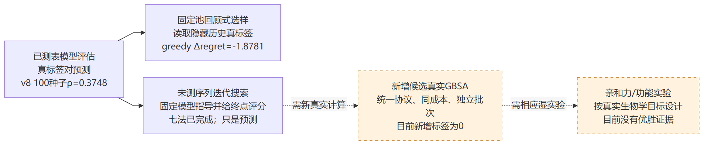

[矢量版](figures/阶段总汇报_20261006/A08_证据层级.svg) · [可编辑流程源](figures/阶段总汇报_20261006/A08_证据层级.mmd)

流程图可编辑源代码

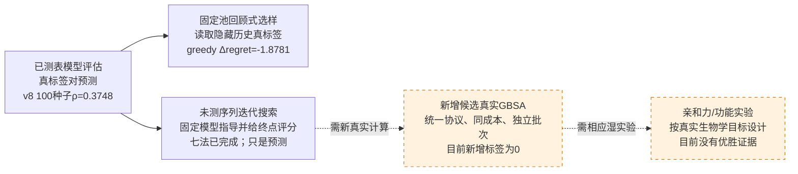
```mermaid
flowchart LR
    A["已测表模型评估<br/>真标签对预测<br/>v8 100种子ρ=0.3748"] --> B["固定池回顾式选样<br/>读取隐藏历史真标签<br/>greedy Δregret=-1.8781"]
    A --> C["未测序列迭代搜索<br/>固定模型指导并给终点评分<br/>七法已完成；只是预测"]
    C -. 需新真实计算 .-> D["新增候选真实GBSA<br/>统一协议、同成本、独立批次<br/>目前新增标签为0"]
    D -. 需相应湿实验 .-> E["亲和力/功能实验<br/>按真实生物学目标设计<br/>目前没有优胜证据"]
    classDef future fill:#fff3df,stroke:#c77919,stroke-dasharray:5 5;
    class D,E future;
```

**图 A08（证据层级示意）：**表内预测、表内真标签回顾、未测候选预测、新增真实 GBSA、湿实验是不同证据。只有已有数据/档案的节点为已完成；未来节点不画成实验结果。

## 13. 谱系、候选分组与交接的实际产物

### 13.1 单父本谱系如何追溯

每条子代记录 `parent_candidate_id`、真实 `parent_sequence`、代数、operator（提出操作符）、变异位点、与父本的距离 `n_from_parent`、与 WT 的距离 `n_from_wt`、父本证据类型和预测。用候选档案 ID 回查实际父本，不能把多代子代全部写为 WT 的零跳子代。全局重启确无父本时保持空父本，不伪造野生型来源。

### 13.2 “最好的一组或者两组”怎样定义

首先按预测排序，第一条为组 1 原型；在 top-50 内找到第一个与它至少相差 3 个可变位点的候选作组 2 原型。如果不存在则只生成一组。其余候选分到最近原型，等距归组 1。这里原型是序列距离参照，**不是实验发现的两个结合构象、两个适应度峰或两个生物学类群。**

两组时先给候选池容量近均分，再按组分配批次配额；不足时透明转给另一组。以组内预测排名选择，附组 ID、角色、距离与谱系，确保输出的每条候选只有一个明确归属。最终形成一个或两个可审查序列建议集合，并非只输出模型最优一条而丢失多样性信息。

### 13.3 已运行的交接/单算法示例

| 产物/示例 | 唯一预测 | 可导出预测候选 | 分组 | 最低预测/状态 | 证据性质 |
| --- | --- | --- | --- | --- | --- |
| 原GA独立示例 | 916 | 908 | 2 | 6.150741；8代 | 单次示例 |
| ILS独立示例 | 1024 | 1016 | 2 | 8.373855；预算耗尽 | 单次示例 |
| SA独立示例 | 1024 | 1016 | 2 | 6.150741；预算耗尽 | 单次示例 |
| AdaLead独立示例 | 367 | 359 | 2 | 6.150741；邻居耗尽 | 单次示例 |
| 两组交接冒烟 | 见搜索档案 | 池100/100；批次13/12 | 2 | 25条 PARKED，无真实回填 | 模拟工程，不是计算订单 |

[源结果](../../evidence/search_seven_20261005/demo_audit.json)；[源结果](../../evidence/search_suite_20261005/demo/metrics.csv)；[源结果](../../runs/loop_search_group_handoff_final_20261005/metrics.csv)

25 条分组交接运行的候选池两组 100/100，导出配额 13/12，状态为 PARKED；仅本地工程冒烟，协议占位、无新增标签。测试能检出把真实父序列改成 WT 的错误；钉协议同步检查点与 Oracle 的完整交接表。历史错误运行包保留作问题证据，不覆盖成新版。

三个新方法的单算法示例共享相同模型和起点，保存候选档案及权重；示例数字不是独立 100 种子优胜判断。已知标签起点排除后，因此预测候选数比唯一预测数少 8。AdaLead 367 次停止是邻居耗尽，不是跑满 1024。

## 14. 未来真实验证接口：仅预留能力，当前不安排计算

### 14.1 已预留且验证的工程能力

| 能力 | 已有实现 | 已覆盖的风险 |
| --- | --- | --- |
| 预测与真值分离 | `pred_gbsa` 与 `measured_gbsa` 分列，按输入顺序对应 | 未测标签不能用预测填充 |
| 状态机 | 选择→等待→部分回传→批次闭合→吸收→重训 | 存在待标签则 `PARKED`；完成闭环需重训后 `DONE` |
| 协议钉定 | `--pin-protocol` 审计，重写配置、指纹、两份清单及交接协议字段 | 仅无任何 pass/fail 回填的 PARKED 运行允许钉定；拒绝空白串 |
| 回传校验 | candidate_id 与序列一致、协议允许、有限值、pass/fail、冲突检测 | 错协议/错 ID 拒收；QC fail 持久保存 |
| 恢复运行 | 配置、数据、模型、训练集、候选池、留出集、代码指纹核对 | 不允许手改旧配置强行继续 |
| 终态验收 | 准备写 DONE 才要求 retrained；PARKED 正常等待不记 FAILED | 无评估选项仍执行末次重训；等待标签不污染验收 |
| 清单一致性 | 检查点清单、Oracle 副本、内嵌指纹和当前指纹对比 | 协议和批准列表任一处不一致即失败 |

Oracle 是代码的标签提供器接口，不是“已经知道未测真值”的实体。QC 是 quality control，质量控制。台账是行追加不删除，回填吸收或协议钉定可更新相关状态/协议字段并留审计；不把它称作所有字段不可修改的“不可变台账”。

这条工程链通过人工构造的测试标签验收，但新增真实 GBSA 为零。**主线当前只使用搜索内循环，不执行真实回传；是否主动学习留待以后决策。**

## 15. 实验规模、工程验收与完成清单

### 15.1 正式搜索套件的数量

| 正式套件 | 子运行组成 | 子运行数 | 已审计实际预测记录数 |
| --- | --- | --- | --- |
| 原四法开发 | 720 主 +240 重训 +180 GA消融 | 1140 | 2,438,283 |
| 原四法确认 | 100×2评分器×4法 | 800 | 812,265 |
| 最新七法开发 | 840 主 +420 重训 | 1260 | 2,190,086 |
| 最新七法确认 | 100×2评分器×7法 | 1400 | 1,364,671 |
| 最新七法开发+确认 | 独立保留本实验条件 | 2660 | 3,554,757 |
| 新增真GBSA/新增docking/新增MD | 当前全部为0 | 0 | 不产生新标签 |

2660 个是最新七法开发+确认子运行总数，不是 2660 个新生物实验。原四法和七法分别使用不同种子与代数护栏，结果不合并成一个确认集合；两组的预测记录也不等于所有唯一新序列的全项目并集，因为不同子运行可能重复计算同一序列。

### 15.2 已保存哪些内容

| 文件/产物 | 含义 | 汇报中怎样使用 |
| --- | --- | --- |
| config / suite_config | 模型、策略、种子、预算、源码版本和协议 | 判断两组实验是否可比 |
| run_manifest | 数据摘要、环境、启动源码信息 | 证明用什么数据和实际后端 |
| runs.csv | 全运行实际预测数、时间、停止原因 | 描述耗尽/早停与资源，不直接替代对齐主表 |
| aligned.csv | 共同实际预测前缀的最低预测与诊断 | 最新七法主比较数据 |
| pairwise.csv | 两法共同前缀及逐种子差 | 预设补充比较 |
| fits.csv / stability.csv | 留出技能、重训与跨模型稳定性 | 防止把模型变化混成算法收益 |
| search_evaluated.jsonl | 每条实际预测顺序、序列和父本 | 审计预算、低分、谱系和排重 |
| group 与候选文件 | 单/双组建议、组内排名、距离 | 未来可审查导出，不是实验已验证组 |
| completeness / artifact_audit | 计划子运行、失败数、逐条合法性等 | 运行完整性及独立结构审计 |
| files.sha256 | 证据文件内容摘要清单 | 防止文件版本混用 |

原始数百万行档案仍在本地 `runs/`；紧凑证据包保留摘要、配置、逐种子表、源码与验收。大型运行不复制入 Git。七法已存[开发审计](../../evidence/search_seven_20261005/development/artifact_audit.json)、[确认审计](../../evidence/search_seven_20261005/confirmation/artifact_audit.json)及[验证记录](../../evidence/search_seven_20261005/validation.json)。

### 15.3 工程验收与统计核验范围

七法实施时本地 139 项测试通过，包括单父本合法变异、固定顺序预算、恢复一致性、机制接受规则、负分阈值、参数变化拒绝续跑、人工标签的未来接口。正式审计核对实际评分档案数、缓存、预算、固定骨架、已测表排除、排序、完整分组、起点和共同前缀，主确认表没有新真标签。

测试数 65/69/70、113/128 对应不同代码版本和测试集合，不能相加解释为当前测试规模。七法实施记录的本地139项测试与服务器接口验收分别留痕，七法包没有服务器同步记录。已有数据上的模型训练与逐预测核验规模见§1.5；保存结果的统计复算、实际模型训练和未来真实标签验证具有不同证据含义。新增候选的 MD、docking、GBSA 真实计算均未开展。

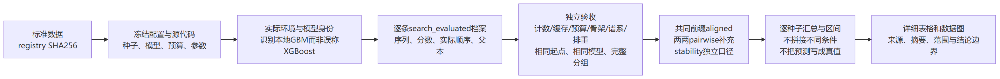

[矢量版](figures/阶段总汇报_20261006/A10_结果到汇报核验.svg) · [可编辑流程源](figures/阶段总汇报_20261006/A10_结果到汇报核验.mmd)

流程图可编辑源代码

```mermaid
flowchart LR
    D["标准数据<br/>registry SHA256"] --> C["冻结配置与源代码<br/>种子、模型、预算、参数"]
    C --> E["实际环境与模型身份<br/>识别本地GBM而非误称XGBoost"]
    E --> R["逐条search_evaluated档案<br/>序列、分数、实际顺序、父本"]
    R --> V["独立验收<br/>计数/缓存/预算/骨架/谱系/排重<br/>相同起点、相同模型、完整分组"]
    V --> S["共同前缀aligned<br/>两两pairwise补充<br/>stability独立口径"]
    S --> T["逐种子汇总与区间<br/>不拼接不同条件<br/>不把预测写成真值"]
    T --> F["详细表格和数据图<br/>来源、摘要、范围与结论边界"]
```

**图 A10（工程验收流程）：**数据、配置、实际后端、评分档案、预算和谱系必须一起核对；状态与汇报结论分别验证。

## 16. 最后怎样选择算法

### 16.1 当前可以确定的工程选择

**保留同起点随机游走作为预算对照，保留爬山作为简单默认；其他方法按目的和评分器有条件使用。**这不是最终生物学算法排名，而是当前冻结模型下的实现与预测选择。

| 条件/目的 | 当前建议 | 证据与限制 |
| --- | --- | --- |
| 用本实验固定 RF，优先较低预测 | 多起点爬山作为简单首选，AdaLead 作机制对照 | 七法 AdaLead−爬山 +0.0078，CI 跨零；两两也无确认优势 |
| 用本实验固定本地 GBM，优先较低预测 | 无交叉 AdaLead 作条件性候选，保留爬山/随机控制 | 主差 −1.5962、两两 −1.5770；名单重训稳定性弱 |
| 想留多路径/多样候选 | 可保留无交叉 GA、束搜索并报告多样性与实际成本 | 不能仅因“遗传算法”名称就认为优于爬山 |
| 想研究离开局部区的方法 | ILS/SA 可复用已有实现，另冻结新参数做开发 | 本实验冻结参数未成为更低预测默认；不重复跑旧确认直到挑出正结果 |
| 换成新代理或新增特征 | 重新进行同起点、实际预算对齐开发/确认 | 旧模型排序不自动继承 |
| 要宣称真实 GBSA/实验亲和力优胜 | 先启动独立真实验证协议 | 当前没有新标签，暂不能判定 |

算法有效性确实依赖评分器，但工程可运行、约束满足、预算一致和恢复正确可以现在完成。**不必等待代理成熟才能搭建搜索层；必须等待真实证据才能宣布科学优胜。**

### 16.2 不同层面的“最优”含义

“已测表最优”指当前表内最低标签；“代理搜索最优”指该模型、该次数内最低预测；“统一协议真 GBSA 最优”指未来验证过的候选里最低计算标签；“全空间全局最优”需要远强于当前证据的证明。本文只报告前两类已有结果，没有第三类新增验证，也不声称第四类。

### 16.3 还有哪些方法可试，什么条件才值得试

| 方法 | 学术方向 | 当前状态与开启条件 |
| --- | --- | --- |
| 固定算法组合 | 把不同提出策略作为 portfolio（算法组合），严格分配总预算 | 可研究；固定组合不等于复现 P3BO，不能给每法全预算再称同成本 |
| P3BO | population-based black-box optimization，基于种群的黑箱优化 | 文献已参考；未实现其自适应分配，需要冻结额外决策与预算 |
| BO / LaMBO | 贝叶斯优化/潜空间多目标优化 | 未部署；先取得可信概率代理和表示数据，再检验收益 |
| CbAS | conditioning by adaptive sampling，条件自适应采样 | 未实现；需要序列先验/生成模型与失真控制 |
| RL | reinforcement learning，强化学习 | 未实现；需要额外训练与评估预算，不因方法更复杂就优先 |
| ILS/SA 参数开发 | 扰动、接受、温度策略 | 已有最小实现；新研究先开发后冻结确认，避免反复挑确认集 |

本阶段收尾意味着授权范围内的接口、冻结算法和比较已经完成；并非研究空间数学上耗尽。继续工作应由新数据、可信评分器、明确参数假设或真实预算触发，避免在当前弱模型上无限追低分。

## 17. 分阶段实施计划：完成情况、触发条件与操作步骤

### 17.1 阶段进度

| 阶段 | 做什么 | 当前进度 | 下一步的触发条件 |
| --- | --- | --- | --- |
| A：代理与资料核查 | 数据口径、论文组件、基准、多种子、泄漏与负对照 | 发布参照、0.506重放/30开发/100确认、树集成选样30/100、正确结构特征30及强制保留诊断30、受控预训练30均完成；成熟模型未定 | 这批代理配方可收尾；暂缓无明确假设的扩展；真实资源问题单列 |
| D：docking 独立支线 | 预测/真实对接残差与预筛 | 30 开发+100 确认完成；真实可用性/成本未证明 | 团队能提供候选时真实 docking 协议、成本与失败记录 |
| B1：合同 | 独立 GBSA 预测合同、搜索上下文、缓存预算 | 已完成 v0.2.0 与搜索 v0.1.1 | 模型接口变更需要新版本与验收 |
| B2：搜索 | 原四法+ILS/SA/AdaLead，单父本、恢复与输出 | 已完成七法实现和示例 | 新约束或参数方案需独立配置 |
| B3：公平比较 | 同起点、同模型、实际预测次数对齐 | 四法及最新七法 30 开发/100 确认完成 | 换成熟评分器后复评，不能继承旧赢家 |
| B4：敏感性与交接 | 预算、GA 消融、重训、跨代理、谱系、分组 | 已完成；名单不稳风险已量化 | 选择可审查候选建议，当前不签真实计算 |
| C0：真实验证筹备 | 目标/配体/QC/预算/重复/失败规则/主终点 | 仅有草案与工程接口；未启动 | 新的明确团队决策与资源落实 |
| C1：真实 GBSA | 同起点、同成本、多独立批次的算法比较 | 未完成，新增 GBSA=0 | 批次获批并按冻结方案计算 |
| C2：模型更新/湿实验 | 是否重训、主动学习；亲和力或功能检验 | 未决定/未完成 | 依据 C1 数据和生物学目标另定 |

阶段代号 A/B/C/D 是项目内部编号，不是学术算法名称。

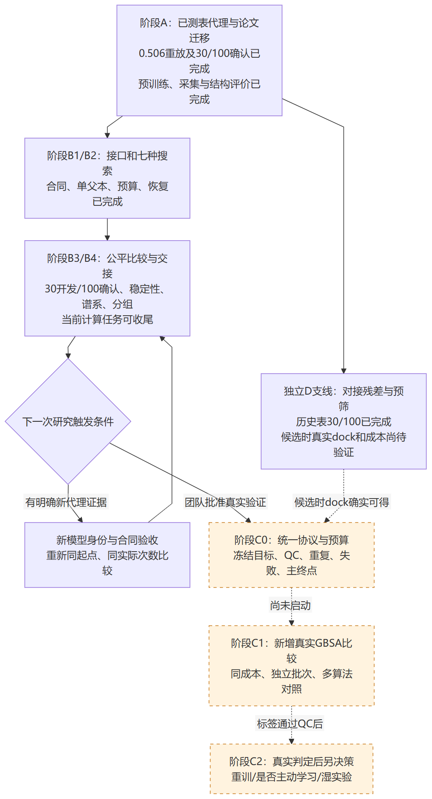

[矢量版](figures/阶段总汇报_20261006/A11_阶段进度与触发条件.svg) · [可编辑流程源](figures/阶段总汇报_20261006/A11_阶段进度与触发条件.mmd)

流程图可编辑源代码

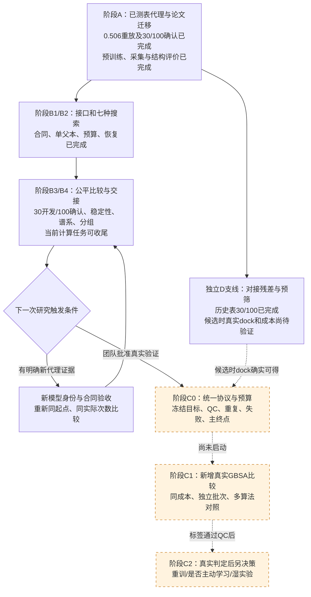
```mermaid
flowchart TB
    A["阶段A：已测表代理与论文迁移<br/>0.506重放及30/100确认已完成<br/>预训练、采集与结构评价已完成"] --> B1["阶段B1/B2：接口和七种搜索<br/>合同、单父本、预算、恢复已完成"]
    B1 --> B2["阶段B3/B4：公平比较与交接<br/>30开发/100确认、稳定性、谱系、分组<br/>当前计算任务可收尾"]
    A --> D["独立D支线：对接残差与预筛<br/>历史表30/100已完成<br/>候选时真实dock和成本尚待验证"]
    B2 --> G{"下一次研究触发条件"}
    G -- 有明确新代理证据 --> M["新模型身份与合同验收<br/>重新同起点、同实际次数比较"]
    M --> B2
    G -- 团队批准真实验证 --> C0["阶段C0：统一协议与预算<br/>冻结目标、QC、重复、失败、主终点"]
    D -. 候选时dock确实可得 .-> C0
    C0 -. 尚未启动 .-> C1["阶段C1：新增真实GBSA比较<br/>同成本、独立批次、多算法对照"]
    C1 -. 标签通过QC后 .-> C2["阶段C2：真实判定后另决策<br/>重训/是否主动学习/湿实验"]
    classDef future fill:#fff3df,stroke:#c77919,stroke-dasharray:5 5;
    class C0,C1,C2 future;
```

**图 A11（实际进度与条件计划）：**已完成模块和未启动模块分开，箭头表示依赖，未来事项按启动条件与所需资源表示。

### 17.2 现在可以实际怎么用

先阅读本报告与[七算法操作结果](9月/七算法同起点比较与实施结果_20261005.md)，确认使用哪个现有评分器以及序列约束。选择新运行编号，在 `configs/experiments/` 新建或复制配置，经 `scripts/run_experiment.py` 启动；不要覆盖确认包或编辑旧指纹强行续跑。

第一次实践可运行 ILS、SA、AdaLead 的已有独立示例配置，观察预测档案、父代与两组输出。它们用于熟悉接口；这些输出不自动变成 GBSA 请求。遗传算法示例已有 916 次预测的完整档案，亦可阅读，不必为展示重复跑一次已有大型确认。

随后若要接入新的成熟评分器，先通过 §8.4 合同验收，再冻住 30 种子开发和独立 100 种子确认协议。比较至少同时报告实际次数、最低预测、候选多样性、停止原因与模型稳定性；不同模型尺度不合并。

### 17.3 如果未来批准真实 GBSA，应该逐步怎么做

1. **固定标签定义：**配体、构象来源、力场/溶剂模型、采样/快照、GBSA 统计、QC、失败/重试和独立重复。先判断已有 GBSA 是否与新协议可混合。
2. **固定比较问题：**例如 AdaLead 与爬山及随机对照，是否只比较一轮，还是允许真实标签回来后重训。后者需要另定外循环，不自动称主动学习。
3. **固定公平预算：**相同初始父本、模型快照、候选约束、唯一预测上限与真实计算成本；去重后不同算法相同序列可共享计算结果，但归属和共享成本要在运行前定义。
4. **固定主终点：**真实最低 GBSA、前若干候选的真实中位数、达到门槛比例、失败率与实际资源；以独立批次为科学重复，不用模型随机种子替代独立标签实验。
5. **固定分组与测量量：**候选组用于覆盖，不把一/二组当生物学已知类别；根据预算定配额，保留同预算随机控制和参考序列。
6. **签发与回传：**只对新的已批准运行签发；确认模型/序列/协议版本，使用审计入口钉定协议，正式标签和预测分开，禁止以预测填真值。
7. **判定和更新：**按冻结主终点分析，不仅挑最好一条；先判定算法真实效果，再决定标签能否纳入代理训练、是否开展主动学习以及下一轮预算。
8. **湿实验另定：**真实 GBSA 仍是计算标签；亲和力、稳定性或核糖开关功能需要对应实验终点，不能用计算改进替代。

此流程已有[阶段 C 预注册模板](../项目记录/阶段C预注册模板_真实GBSA决策性比较_20261002.md)，但它是未来可用草案，不是执行命令或预算承诺。

## 18. 研究对象、目标层级与证据关系

### 18.1 三个层面的目标必须分开

1. **工程目标：**不依赖代理内部类型，七个搜索算法能合法生成序列、调用评分器、限制预算、保存谱系和候选分组；这一目标已经完成并有测试、运行档案。
2. **当前计算目标：**固定一个代理模型后，在规定实际预测次数内找到它认为 GBSA 较低的未标注序列；已有开发与确认比较。
3. **最终科学目标：**在统一真实 GBSA 协议下发现更低分的序列，之后依据项目需要验证亲和力或核糖开关功能；尚未完成新增候选的真实验证。

GBSA 是 generalized Born/surface area，广义玻恩/溶剂可及表面积方法；本项目标签来源记为 MM-GBSA，即 molecular mechanics/generalized Born surface area，分子力学结合广义玻恩/表面积的计算评分。这里“更低更好”是项目固定的优化方向。**计算值不是实验解离常数，也不是核糖开关功能值。**

### 18.2 研究对象怎样准确称呼

仓库名 `FAD_clean` 不能自动证明配体是 FAD。FAD 在生物化学中通常是 flavin adenine dinucleotide，黄素腺嘌呤二核苷酸；仓库当前 [README](../../README.md) 标识为 PreQ1 / RF00522 核糖开关。[Rfam 的 RF00522 家族条目](https://rfam.org/family/RF00522)标识 PreQ1 适配体域。本文按代码和数据讨论固定 RNA（ribonucleic acid，核糖核酸）序列，序列家族、配体和结构模板的独立鉴定不属于这些计算实验的已完成内容。

后续真实计算方案必须写明配体化学身份、模板、序列、构象准备、GBSA 方法和质量控制。当前仅凭目录名、历史模板或算法预测无法补足这些生物学事实。

### 18.3 阶段完成情况总表

| 工作 | 已完成的事实 | 还不能宣布的结论 |
| --- | --- | --- |
| 标准数据与评估口径 | 2000 行标准表、数据摘要、训练折内筛选、多种子结果和纠错记录 | 样本覆盖整个搜索空间；已有标签完全无误 |
| GBSA 代理 | v8 五模型秩融合 100 种子 0.3748；相对 mutation-only RF +0.0104 | 已选定成熟终版；未测序列能可靠精排 |
| docking 支线 | 历史对接目标 0.5523；100 种子预测对接残差无增益、真实对接残差有条件增益 | docking 可代替 GBSA；真实对接在新候选时已可用 |
| 静态池选样 | 100 种子回顾式 greedy 平均 regret 改善 | 已决定主动学习；多代搜索或湿实验优胜 |
| 搜索内循环 | 七个算法、同起点预算对齐、谱系、分组、恢复、档案 | 搜遍 6700 万种组合；得到全局真最优 |
| 未来验证接口 | 协议钉定、回传校验、失败持久化、批次闭合和末次重训的工程路径 | 新标签已经产生；真实预算已经批准 |
| 当前工作安排 | 阶段 B 计算与接口可以收尾，代理优化可暂缓 | 项目以后没有其他可研究路线 |

### 18.4 各项研究怎样支撑阶段决策

本项目的研究关系由问题和证据决定。代理评价回答“序列能否可靠打分”，docking 支线回答“额外信息是否值得取得”，搜索比较回答“给定评分器下怎样迭代提出候选”。最终真实验证用于判断候选和算法是否带来实际 GBSA 收益。

| 研究模块 | 已形成的证据 | 对后续决策的作用 |
| --- | --- | --- |
| 论文组件迁移与预训练评价 | 主要组件实现、明确的任务适配、三种语料受控比较 | 保留方法参考；当前受控配置未达到代理晋级条件 |
| 数据、泄漏与代理基准 | 标准表内容摘要、训练折内筛选、100种子基准与简单模型对照 | 建立可重复参照，避免目标泄漏和不同配方混比 |
| 固定划分与特征配方评价 | 0.506准确重现、冻结配方30开发/100确认、特征筛选及结构特征诊断 | 保留固定划分优化事实，同时限定跨划分泛化结论 |
| 有限池采集策略评价 | 静态池100种子确认、树集成30开发/100确认、模型与发现双终点 | 支持有条件的低分发现用途；不默认启动真实主动学习 |
| 对接残差与预筛 | 预测对接和真实对接可得两臂、30开发/100确认 | 仅在候选时真实 docking 可得且成本合理时考虑独立支线 |
| 搜索接口与公平比较 | 同起点、实际预测预算、单父本谱系、分组、四法及七法确认 | 固定 RF 下优先爬山；本地 GBM 下无交叉 AdaLead 有条件优势 |
| 真实验证准备 | 协议钉定、标签校验、失败持久化、批次闭合和重训的人工标签验收 | 工程能力可用；实际实施仍依赖真实协议、预算和团队决策 |

这些证据共同支持“代理优化可暂缓，模型无关搜索层先完成”的阶段选择。后续工作由新的评分器证据或真实验证资源触发；任何新模型、新序列约束或新标签协议均需对应的独立评价。

## 19. 术语和字母：供生工团队查阅

| 写法 | 学术全称与中文解释 | 在本项目中的具体含义 |
| --- | --- | --- |
| FAD | 生物化学通用全称为 flavin adenine dinucleotide，黄素腺嘌呤二核苷酸 | 本仓库名称；目录名不证明它就是当前配体，README 标注对象为 PreQ1/RF00522 |
| PreQ1、RF00522、Rfam | Pre-queuosine 1，Q 核苷（queuosine）合成通路的前体名称；RF00522 为 RNA 家族数据库 Rfam 的条目编号 | 仓库记载的核糖开关对象；家族域与完整 141 位构建体不应混同 |
| RNA | Ribonucleic acid，核糖核酸 | 被设计和突变的核酸序列 |
| DNA | Deoxyribonucleic acid，脱氧核糖核酸 | 所引适配体论文中的另一类核酸，论文结果不能直接照搬到本 RNA 任务 |
| GBSA | Generalized Born/surface area，广义玻恩/溶剂可及表面积 | 当前唯一主优化目标；指既定流程产生的计算能量指标 |
| MM/GBSA | Molecular mechanics/generalized Born surface area，分子力学结合广义玻恩/溶剂可及表面积方法 | 历史或拟定的 GBSA 计算路线，具体参数仍需协议确认 |
| docking、`dock` | Molecular docking，分子对接；`dock` 为数据表中历史对接分数的字段名 | 四模型历史实验预测的是这列分数；其 0.5523 结果是排序相关系数，不是该列分数值，也不是 GBSA 标签 |
| MD | Molecular dynamics，分子动力学 | 为计算构象采样可能使用的昂贵模拟步骤 |
| WT | Wild type，野生型 | 突变位点和突变数所依据的固定参考序列 |
| NUPACK | Nucleic Acid Package，核酸热力学与二级结构计算软件 | 历史结构指标的规定计算来源，不能用其他软件悄悄代替 |
| `Gap2` | 历史结构计算指标的字段名 | 曾用于复合标签；当前不作为 GBSA 模型输入或优化目标 |
| RF | Random forest，随机森林 | 由多棵决策树组成的经典机器学习基准 |
| ET、GBR、SVR | Extra Trees，极端随机树；gradient boosting regression，梯度提升回归；support vector regression，支持向量回归 | 分别为训练内特征筛选或历史/本实验回归模型；不表示优化目标改变 |
| GA | Genetic algorithm，遗传算法 | 本实验为仅变异、无交叉的精英种群进化策略；种群、父本选择与生存替换均已实现 |
| QC | Quality control，质量控制 | 判定真实 GBSA 计算是否可接收及如何记录失败 |
| OOD | Out of distribution，分布外 | 候选远离当前已标注序列分布时的风险提示 |
| CI | Confidence interval，置信区间 | 对跨数据划分或跨独立批次统计量的不确定范围 |
| Spearman | Spearman rank correlation，斯皮尔曼等级相关 | 比较预测排序与真实排序的一致程度 |
| JCR、Q1 | Journal Citation Reports，期刊引证报告；Q1 为相应学科类别的第一四分位 | 下文给出的期刊层面分区；不是论文质量或本项目证据强度的评分 |
| `PARKED`、`DONE` | 英文分别为“暂存等待”“完成”的运行状态标记 | 在进入未来标签闭环的运行中，前者表示等待标签，后者须满足批次闭合和重训；独立搜索有自己的完成状态 |
| `seed` | 随机数种子 | 固定计算机随机过程以便重复同一数据划分或搜索 |
| “代理” | Surrogate model，替代昂贵计算的预测模型 | 输入序列、输出预测 GBSA；与真实计算标签严格区分 |
| 主动学习 | Active learning，主动选择待标注样本并更新模型的方法；是获取标签与更新模型的流程，不是与随机森林并列的模型类别 | 可用于外循环决定哪些候选值得取得真实 GBSA；不等同于遗传算法或束搜索 |
| 阶段 B、阶段 C | 项目内部阶段代号 | B 是当前的代理接口与突变搜索算法计算验证；C 是以后若决定投入真实 GBSA 才开展的验证阶段 |
| OOF | Out-of-fold prediction，折外预测 | 训练区内部交叉验证，对一条样本用未训练过它的模型预测；供残差学习使用 |
| SHA256 | Secure Hash Algorithm, 256-bit，256 位安全散列算法 | 以文件内容指纹核对数据、配置、源码和输出版本 |
| Hamming、Jaccard | Hamming distance，汉明距离；Jaccard index，杰卡德集合相似系数 | 前者数可变位点差异；后者是两个候选集合交集与并集的比 |
| μ、σ | 希腊字母 mu、sigma；常用作均值和标准差符号 | μ 为代理点预测；当前 σ 为未经校准的成员分歧，不是实际误差或置信区间 |
| LCB、EI | Lower confidence bound，下置信界；expected improvement，期望改进 | 利用预测分布选候选的规则；当前未确定作为正式方法 |
| Thompson sampling | 汤普森采样，按预测/后验分布采样再决策 | 需要有可信的概率模型；当前不是已实现搜索策略 |
| L2、ridge regression | 参数平方惩罚；岭回归 | 现有残差修正使用的正则化机制；惩罚系数应仅在训练内选择 |
| XGBoost、GBM、boot5 | Extreme gradient boosting，极端梯度提升；gradient boosting machine，梯度提升机；五成员自助抽样代码标识 | 后端必须按运行记录识别；配置名不能证明实际调用了哪套实现 |
| MFE、Pre、Aft | Minimum free energy，最低自由能；Pre/Aft 为历史流程前/后结构量字段 | 不参与当前独立 GBSA 目标；若计算必须遵守项目 NUPACK 规范 |
| CPU、RNG、GB | Central processing unit，中央处理器；random number generator，随机数生成器；gigabyte，十亿字节容量单位 | 资源、随机状态与存储记录；不是生物学评价指标 |
| CSV、JSON、JSONL | Comma-separated values，逗号分隔值；JavaScript Object Notation，JavaScript 对象表示法；JSON Lines，每行一个 JSON 记录 | 表格与结构化档案格式；不是不同实验指标 |
| Oracle | 标签提供器，代码中的接口名称 | 从历史表或未来外部计算取得真实标签，不能用代理预测冒充 |
| 单任务/多任务、多保真 | Single-task/multi-task learning；multi-fidelity modelling | 分别学习一个/多个目标，或联合成本与近似程度不同的计算信息；支线目标仍为 GBSA |
| 适应度、精英保留、消融、上位性 | Fitness；elitism；ablation；epistasis | 算法选择标量；保留较优个体；单独改变组件的对照；突变之间的相互作用 |
| scorer、sequence scorer | 评分器、序列评分入口 | 本项目是拟合代理的统一调用封装，负责预测顺序、缓存、预算与身份记录；不是另一个搜索算法 |
| hill climbing、local descent、beam search、random walk | 爬山、局部下降、束搜索、随机游走 | 分别按邻居改善、有限多路径和随机步骤探索；当前实现细节见本报告 §9 |
| crossover、recombination、tournament selection | 交叉、重组、锦标赛选择 | 前两者结合双亲片段，当前禁用；后者抽取若干父本比较适应度后择优繁殖 |
| ILS、SA | Iterated local search，迭代局部搜索；simulated annealing，模拟退火 | 本实验已实现并完成七法比较；SA温度控制接受概率，不是MD温度 |
| AdaLead、FLEXS | Adapt-with-the-Leader，随领先者调整；Fitness Landscape EXploration Sandbox，适应度地形探索沙盒 | 前者为论文算法名称，后者为其测试环境；本实验无交叉版本明确标为改编版 |
| BO、LaMBO、GP | Bayesian optimization，贝叶斯优化；latent multi-objective BayesOpt，潜空间多目标贝叶斯优化；Gaussian process，高斯过程 | 概率预测与采集决策或潜空间优化；尚未部署到当前GBSA主线 |
| CbAS、VAE | Conditioning by adaptive sampling，条件自适应采样；variational autoencoder，变分自编码器 | 生成分布调整及表示学习方法；需要另行定义数据和训练过程 |
| RL、PPO | Reinforcement learning，强化学习；proximal policy optimization，近端策略优化 | 学习提出动作或序列的策略；不是当前七法的实现 |
| P3BO、algorithm portfolio | Population-based black-box optimization，基于种群的黑箱优化；算法组合 | 组合不同提出方法并分配资源；固定组合不等于已经复现P3BO |
| IQR、Δ、T、δ | Interquartile range，四分位距；差值符号；退火控制温度；阈值容差 | IQR为第三与第一四分位之差；后三者在本报告 §9 的机制中定义，不是新增标签字段 |
| ICML、ICLR、PMLR | International Conference on Machine Learning，国际机器学习大会；International Conference on Learning Representations，国际学习表征大会；Proceedings of Machine Learning Research，机器学习研究会议论文集 | 会议和论文集名称，不适用JCR期刊分区；PMLR页面关联JMLR不使每篇会议论文变成JMLR期刊论文 |

| 其他缩写与配置说明 | 完整含义 | 本报告用途 |
| --- | --- | --- |
| A / C / G / U | adenine，腺嘌呤 / cytosine，胞嘧啶 / guanine，鸟嘌呤 / uracil，尿嘧啶 | RNA四种碱基字母 |
| MLM / MLP | masked language modelling，掩码语言建模 / multilayer perceptron，多层感知机 | 历史预训练/预测头 |
| VAE / HMM / SELEX | variational autoencoder，变分自编码器 / hidden Markov model，隐马尔可夫模型 / systematic evolution of ligands by exponential enrichment，指数富集配体系统进化 | RaptGen 原任务组件 |
| MSE / NLS / Lasso | mean squared error，均方误差 / negative label smoothing，负标签平滑 / least absolute shrinkage and selection operator，最小绝对收缩与选择算子 | 损失、平滑和交互支线 |
| NAND / DBTL | not AND，与非逻辑 / design–build–test–learn，设计—构建—测试—学习 | 原论文功能与迭代流程，不是当前标签 |
| PCA / GELU / FFN / post-LN | principal component analysis，主成分分析 / Gaussian error linear unit，高斯误差线性单元 / feed-forward network，前馈网络 / post-layer normalization，后置层归一化 | 历史结构表示或编码器实现词语 |
| kcal/mol / nt / OOF | 千卡每摩尔 / nucleotide，核苷酸 / out-of-fold，折外 | 单位、长度与训练内残差 |
| rollout / root / token | 向前展开链 / 根父本 / 序列符号单元 | AdaLead 与历史编码器 |
| PNG / SVG / PPT | Portable Network Graphics，便携式网络图形 / Scalable Vector Graphics，可缩放矢量图形 / PowerPoint presentation，演示文稿 | 插图与幻灯片素材 |

| 结果文件中的原始方法/配置标识 | 学术解释与当前含义 |
| --- | --- |
| raw / LS_k5_a0.5 / NLS_a0.25 / NLS_a0.5 | 未平滑；5近邻、0.5混合权重的标签平滑；0.25/0.5权重的负平滑 |
| xgb_mse / xgb_quantile50 | XGBoost均方误差 / 50%分位（中位数）损失 |
| lgbm_lambdarank | LightGBM（light gradient boosting machine，轻量梯度提升框架）中的LambdaRank排序机制，本实验整折一组、31级相关度 |
| xgbranker_subsample | XGBoost Ranker成对排序回归器；本实验500条子样本配置 |
| high_out / mid_out / low_out / random_control | 测试域为12–13、10–11、≤9突变的留出 / 随机80/20对照；是划分协议代号 |
| rf_52d / xgb_495d / lasso_epistasis | 52维突变独热RF / 历史303+192维XGB / Lasso成对上位性表示，1300维 |
| mutual_info / spearman / tree_importance | 互信息筛选 / 单变量等级相关筛选 / 树重要度筛选；均只在训练折拟合 |
| gbsa_Sp / rank_fusion / equal_weight_rank / fusion_smooth | GBSA Spearman列 / 预测等级融合 / 等权等级融合 / 平滑标签后融合 |
| matched_seed_random_walk / multi_start_hill_climb / multi_start_beam | 同起点随机游走 / 多起点爬山 / 多路径束搜索策略注册名称 |
| mutation_only_ga / iterated_local_search / simulated_annealing / mutation_only_adalead | 无交叉GA / 迭代局部搜索 / 模拟退火 / 无交叉AdaLead策略注册名称 |
| ga_tournament1 / ga_tournament4 / ga_single_hop | 锦标赛抽1个（随机父本）/抽4个 / 单跳比例改为1的独立GA消融 |
| budget_exhausted / stagnation / neighbors_exhausted / local_optima / max_generations | 预算用尽 / 停滞 / 合法未访问邻居耗尽 / 当前局部路径停止 / 达到代数护栏 |
| μ / σ / α / β / k | 点预测 / 未校准成员分歧 / 平滑权重或岭惩罚（按上下文区分）/LCB分歧权重 / 近邻数量或比例标识（按上下文区分） |

数学式中 `x/s` 表示序列，`y` 表示真实 GBSA，`f/μ` 表示代理预测，`a` 表示算法，`n/N/B` 表示实际次数/共同次数/预算上限，`Δ` 表示试验减对照，`T` 表示退火概率温度，`δ` 表示 AdaLead 领先容差。它们都是文中局部符号，不能当作已测生物量。

## 20. 参考文献、原文链接与期刊等级

期刊等级按此前核查并存于项目总汇报的 **2024 JCR（Journal Citation Reports，期刊引证报告）JIF（journal impact factor，期刊影响因子）四分位、指定学科类别**记录，不写成中科院分区。Q1 是该类别第一四分位。年份是分区年份，不是论文发表年份；多类别期刊可能有不同分区。文献机制与本项目实测收益分开，会议/专著/预印本不填 Q1。

| 编号：原论文/资料 | 载体、2024 JCR 指定类别/等级 | 怎样支撑本方案 |
| --- | --- | --- |
| R1：[gkag145](https://doi.org/10.1093/nar/gkag145)，NAND 杂交核糖开关深度批量贝叶斯优化 | Nucleic Acids Research；Biochemistry & Molecular Biology（生物化学与分子生物学）/Q1 | 主要计算组件迁移；原生物任务与当前GBSA不同 |
| R2：Iwano 等（2022），[Generative aptamer discovery using RaptGen](https://doi.org/10.1038/s43588-022-00249-6) | Nature Computational Science；Computer Science, Interdisciplinary Applications（计算机科学跨学科应用）/Q1 | 生成表示与潜空间启发，当前未复现 |
| R3：Poole 与 Mackworth，[Artificial Intelligence: Foundations of Computational Agents, 3e §4.6](https://artint.info/3e/html/ArtInt3e.Ch4.S6.html) | 作者开放教材/专著，不适用JCR | 局部改进、随机步骤和重启原理 |
| R4：Holland，[Adaptation in Natural and Artificial Systems](https://mitpress.mit.edu/9780262581110/adaptation-in-natural-and-artificial-systems/)（原版1975，1992再版） | MIT Press专著，不适用JCR | 种群、选择、变异的理论来源 |
| R5：Espah Borujeni 等（2016），[RNA 适配体来源核糖开关自动化设计](https://doi.org/10.1093/nar/gkv1289) | Nucleic Acids Research；Biochemistry & Molecular Biology/Q1 | RNA功能设计中GA的应用；原文有重组，当前禁用 |
| R6：Freitag 与 Al-Onaizan（2017），[Beam Search Strategies for Neural Machine Translation](https://aclanthology.org/W17-3207/) | ACL神经机器翻译研讨会论文，不适用JCR | 束搜索宽度/路径概念，不是本RNA证据 |
| R7：Lourenço、Martin、Stützle，[Iterated Local Search](https://arxiv.org/abs/math/0102188)，[2003章节](https://doi.org/10.1007/0-306-48056-5_11) | 作者预印本/Handbook of Metaheuristics章节，不适用JCR | 局部下降、扰动、接受；指导ILS最小实现 |
| R8：Kirkpatrick、Gelatt、Vecchi（1983），[Optimization by Simulated Annealing](https://doi.org/10.1126/science.220.4598.671) | Science；Multidisciplinary Sciences（综合性科学）/Q1 | 概率接受与退火依据，不保证本项目真GBSA |
| R9：Sinai 等（2020），[AdaLead: A simple and robust adaptive greedy search algorithm for sequence design](https://arxiv.org/abs/2010.02141) | arXiv作者预印本，不适用JCR | 相对根的展开与领先者选择；本实验明确改编 |
| R10：Bashir 等（2021），[机器学习引导适配体改良](https://doi.org/10.1038/s41467-021-22555-9) | Nature Communications；Multidisciplinary Sciences/Q1 | 预测、突变、实验迭代；原DNA亲和力不是RNA GBSA |
| R11：Genheden 与 Ryde（2015），[MM/PBSA and MM/GBSA methods](https://doi.org/10.1517/17460441.2015.1032936) | Expert Opinion on Drug Discovery；Pharmacology & Pharmacy（药理学与药学）/Q1 | 计算标签受近似和协议影响 |
| R12：Sindt 等（2025），[原论文](https://doi.org/10.1021/acs.jcim.5c00730) | Journal of Chemical Information and Modeling；Computer Science, Interdisciplinary Applications/Q1 | 小分子追加打分风险类比，不是本RNA证明 |
| R13：Kennedy 与 O’Hagan（2000），[Predicting the output of a complex computer code when fast approximations are available](https://doi.org/10.1093/biomet/87.1.1) | Biometrika；Statistics & Probability（统计学与概率论）/Q1；Biology类别Q2 | 多保真差异建模依据，不直接证明dock→GBSA映射 |
| R14：Angermueller 等（2020），[Population-Based Black-Box Optimization for Biological Sequence Design](https://proceedings.mlr.press/v119/angermueller20a.html) | ICML会议论文/PMLR，不适用JCR | 算法接口与组合资源分配，未复现P3BO |
| R15：Stanton 等（2022），[LaMBO](https://proceedings.mlr.press/v162/stanton22a.html) | ICML会议论文/PMLR，不适用JCR | 表示、概率代理和采集需求 |
| R16：Brookes、Park、Listgarten（2019），[Conditioning by adaptive sampling for robust design](https://proceedings.mlr.press/v97/brookes19a.html) | ICML会议论文/PMLR，不适用JCR | 生成先验与预测失真控制，未实现 |
| R17：Angermueller 等（2020），[Model-Based Reinforcement Learning for Biological Sequence Design](https://research.google/pubs/model-based-reinforcement-learning-for-biological-sequence-design/) | ICLR会议论文，不适用JCR | 后期RL路线；此前正文访问受限，不声称完整复现 |

期刊分区按JCR（Journal Citation Reports，期刊引证报告）的类别与版本分别列出；同一期刊在不同类别中可能具有不同分区。分区来源为[项目文献分区核查记录](9月/GBSA优化项目总汇报_生工团队版_20261005.md#十论文分区与项目内参考资料)及其中引用的[2024 JCR导出表](https://cdn.umfcluj.ro/uploads/2024/08/JCR_2024_iunie2025.pdf)，正式对外使用时应以相同版本和类别的官方记录复核。会议论文、教材、图书章节和预印本不适用期刊JCR分区。

gkag145的组件说明依据[项目保存的论文全文](../论文/gkag145(2).pdf)与代码审计记录；RaptGen和Sindt的用途依据项目已有阅读与文献记录。文献为方法原理和研究方向提供依据，本项目的数值收益以实际实验为准。Sindt研究对象为小分子，本文仅将其用作风险类比，不作为RNA数据上的直接验证。

## 21. 证据索引、图表来源与独立核验

### 21.1 各阶段核心源文件

| 阶段 | 入口 | 用途 |
| --- | --- | --- |
| 起点汇报 | [论文复现与改进_dock_gbsa进展.md](../../docs/汇报/9月/论文复现与改进_dock_gbsa进展.md) | 全部主题保留，按后续审计勘误 |
| 全项目审计 | [全项目审计](../../docs/项目记录/全项目审计_20260924.md) | 泄漏、错维度、评估口径和修复记录 |
| v8基准 | [all_results.csv](../../evidence/server_sync_20260902/v8_fusion_100seed/all_results.csv) | 100种子逐方法值 |
| RF基线 | [metrics.csv](../../evidence/audit_20260924/audit_baseline_rf_100seed/metrics.csv) | 100种子源行 |
| 安全特征筛选 | [metrics_paired.csv](../../evidence/server_sync_20260903/feature_selection_all_safe_30seed/metrics_paired.csv) | 9组折内配对 |
| 平滑/排序/负对照 | [代理方法实验汇总](../../docs/论文改进/A组实验汇总_20260926.md) | 正文区分保存结果、受控评价与未来真实验证 |
| docking目标 | [metrics.csv](../../evidence/audit_20260924/formal_dock_fusion_100seed/metrics.csv) | 100种子，不是GBSA |
| 对接残差/预筛 | [summary.json](../../evidence/search_suite_20261005/dock_confirmation/summary.json) | 100种子信息可得条件 |
| 固定池选择 | [runs.csv](../../evidence/loop_20260930/strategy_compare_100seed/runs.csv) | 400子运行、2000轮次行 |
| 方法复算与历史配方记录 | [method_verification.json](../../evidence/report_review_20261006/method_verification.json) | 269项保存统计核验；seed42迁移文档、结构缺陷公式审查 |
| σ校准 | [summary.json](../../evidence/sigma_calibration_30seed/summary.json) | 30种子×2训练量 |
| 同起点三法 | [summary.json](../../evidence/search_compare_matched_30seed/summary.json) | 30种子、90子运行 |
| 原四法 | [README.md](../../evidence/search_suite_20261005/README.md) | 64代历史条件和消融 |
| 最新七法 | [README.md](../../evidence/search_seven_20261005/README.md) | 冻结参数、30开发/100确认、来源审计 |
| 七法详细结果/运行步骤 | [七算法同起点比较与实施结果](../../docs/汇报/9月/七算法同起点比较与实施结果_20261005.md) | 实践原文 |
| GBSA接口总体方案 | [GBSA代理接口与候选闭环实施方案](../../docs/项目记录/GBSA代理接口与候选闭环实施方案_20260930.md) | 未来接口与独立GBSA约束 |
| 突变搜索总体方案 | [突变序列迭代搜索算法与代理接口实施方案](../../docs/项目记录/突变序列迭代搜索算法与代理接口实施方案_20261002.md) | 当前阶段B合同 |
| 七法冻结方案 | [七算法同起点比较冻结方案](../../docs/项目记录/七算法同起点比较冻结方案_20261005.md) | 确认前固定种子/参数/对照 |

### 21.2 各方法的验证方式与证据限制

| 实验/声明 | 实际核验 | 仍需区分的限制 |
| --- | --- | --- |
| 论文单次0.1228 | 读取历史结果与组件代码；原包参数可追溯 | 只有汇总，无逐候选预测供独立重算；未重训 |
| 论文融合5种子0.2610 | 从5个保存种子数值复算均值与SD一致 | 不同协议，非成对语料消融；转导/全数据筛选限制未消除 |
| 历史0.506优化路径 | 追回历史文档；新固定划分重放0.50602865，30开发+100确认；655份预测逐项复算 | 完整历史每一步仍无原预测档案；新配方跨划分增量见§4.3，不继承固定测试集独立性 |
| v8及三种参照 | 700行来源、100种子配对均值/胜率；审计10种子与原表一致 | 100种子保存指标复算，另有10种子独立重训对照；随机划分泛化不等于新候选真值 |
| 三种特征筛选 | 360行；9组均值/差/胜率/自举CI；120套特征清单与52维强制保留核对 | 30种子开发；只证明相对各自全1495维对照有改进 |
| 平滑30/100与融合30 | 保存逐种子数组及100行CSV；均值/配对/区间复算一致 | 495维历史useful来源限制；未证明物理真标签去噪 |
| 负对照10/稀疏交互30 | 逐种子数组的均值、SD复算；核查实际置换/Lasso方案 | 10种子负对照是诊断；系数不等于生物学因果 |
| 外推三域 | 标准表重算三域样本量，与保存结果匹配；随机30均值重算 | 三域仅单次域留出；没有逐候选预测独立重算该ρ；不是等样本配对消融 |
| 旧对接混合/替换 | 核查实现变换、折内训练/测试边界和保存均值 | 保存文件只含汇总，不能独立重算逐seed区间/胜率；不作正收益声明 |
| 对接新100种子支线 | 依据冻结配置与逐seed包；沿用完整性验收并核对报告表 | 真实dock仅历史表可用；新候选成本/失败率仍未实测 |
| 结构缺陷旧30种子 | 保存数组的均值/差/胜率/CI重算一致；2000唯一行、0缺失 | 公式错误，1996行WT结构概率为0且异常被置0；旧负结果不能否定正确方法 |
| 锁定val/test单次包 | 从每份200条真实值/预测重新计算ρ，舍入0.316/0.451 | 不同于0.506历史模型；不能证明新方案达到多种子0.451 |
| 静态池100种子 | 2000行键完整；regret/CI/胜平负/两尾部由原CSV重算 | 仅历史有限池的标签揭示，不是新GBSA或多代变异搜索 |
| 七法搜索100种子 | 44组主/两两均值、胜平负验证；完整性沿用原验收 | 目标为固定模型预测；无新增GBSA，不证明真实算法优胜 |

[269项统计断言与来源](../../evidence/report_review_20261006/method_verification.json)

### 21.3 图表复核材料

本报告图 A01–A07、A12 从保存的数据生成；A08–A11、A13 是依据当前接口和状态的流程图。B系列来自受控模型训练与逐预测验证，按开发/确认与具体条件分别展示。沿用的旧图注明对应实验范围。数据图的表格在[对应绘图数据](figures/阶段总汇报_20261006/图表数据/)及[受控实验逐种子与预测源文件](../../evidence/supplement_20261006/)；详细来源与文件摘要见[来源清单](figures/阶段总汇报_20261006/report_sources.json)。图不使用没有依据的误差线，也不把未来流程画成已经得到的实验结果。

统计核验包括269项保存结果断言、七法44组配对统计及图表来源检查；受控模型实验从测试预测重新计算Spearman和MAE，逐项核对保存指标。结构矩阵公式通过针对性测试，2000条结构计算与44个NUPACK官方对照具有完整运行包。统计一致性、物理公式正确性和新候选真实有效性分别评价；新增候选docking、MD和GBSA真实计算数仍为0。

模型训练证据按三种语料预训练、冻结特征配方、树集成主动学习、结构缺陷筛选与强制保留诊断分别归档。七个包的运行与逐预测核验规模详见§1.5，总计4135份预测文件与2600个发现轮次核验。相关入口为[冻结实验协议](../项目记录/补实验冻结协议_20261006.md)、[完整结果索引与文件哈希](../../evidence/supplement_20261006/index.json)和[服务器输入与终态审计](../../evidence/supplement_20261006/supplement_remote_validation_20261006.json)。这些记录支持已有数据上的计算结论，新候选真实验证仍需独立协议、QC与预算。

### 21.4 阶段结论

1. 当前始终优化独立 GBSA，不使用未经验证的 Gap2/GBSA 加权标签，不转为 docking 目标。
2. 代理优化已有可追溯基准和多种正/负结果，但未成熟；v8 100 种子约 0.375 不能等同新候选可靠精排。
3. 当前应先完成的模型无关搜索层已搭建：七法、单父本变异、实际预算、谱系、分组、恢复与对照均已运行验证。
4. 固定 RF 下爬山可作简单默认；固定本地 GBM 下无交叉 AdaLead 有条件低预测优势。名单对重训敏感，真实算法优胜尚无新增 GBSA 证据。
5. 当前阶段 B 可以收尾；下一次科学决策由成熟评分器或已批准的统一真实 GBSA 验证触发，主动学习和湿实验方案以后单独决定。
