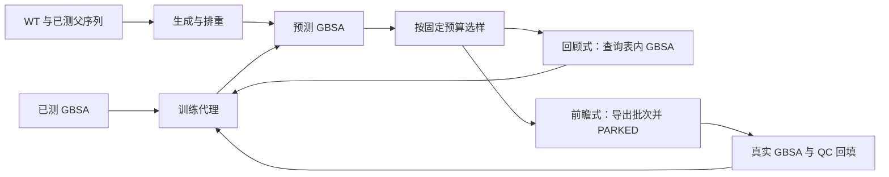

# GBSA 代理接口与候选闭环实施方案

_2026-09-30 复核版；本文件是当前方案的总入口。状态与数字以本次仓库代码、运行包和证据文件为准。_

**2026-10-05 当前阶段更新**：先完成可替换代理的多代突变搜索层；代理优化可在当前瓶颈暂缓。已实现仅变异、无交叉遗传算法，并与随机游走、爬山和束搜索进行冻结计算比较。历史 96 条仅为静态池探索性存档，不是当前计算申请；当前不安排真实 GBSA 回填，也未决定采用主动学习。当前执行与结果以[生工团队总汇报](../汇报/9月/GBSA优化项目总汇报_生工团队版_20261005.md)、[冻结比较方案](无交叉遗传算法与搜索比较冻结方案_20261005.md)和[运行指南](无交叉遗传算法运行与阶段B收尾操作指南_20261005.md)为准；本文件保留静态池与未来文件接口的历史设计。

## 1. 目标、范围与结论等级

**优化目标固定为独立 `gbsa`**，按项目约定以数值越低越好排序。代理直接输出 GBSA 尺度的 `pred_gbsa`。现阶段不增加 MD/MM-GBSA 计算；静态池回顾式选样比较已经完成。当前独立搜索先输出预测候选、谱系与分组；批次导出及 `PARKED` 是历史演练与未来条件接口，不构成当前真实计算安排。未来只有另行启动真实 GBSA、按协议回填后，才能称为前瞻式闭环完成一轮。

`label = 0.961 × Gap2 + 0.039 × gbsa` 是历史可复算字段，权重没有有效验证。本方案不把它用于训练、选样、排序或成功判据。`dock` 不作为主线输入或优化目标；其辅助作用保留为有条件的独立实验。MFE、Pre、Aft、Gap2 若另行计算必须用 NUPACK，不用 RNAfold 替代。

本文区分四个证据层级：**工程可跑**（接口和状态测试）、**表内回顾式开发**（30 seeds）、**表内确认**（冻结后至少 100 seeds）、**真实新候选验证**（需要新测 GBSA）。前一层通过不自动证明后一层有效。静态池回顾式确认已经完成；多代搜索的独立比较另见当前总汇报，真实新候选验证仍未启动。历史 v8 静态 GBSA 秩融合 Spearman 0.375（100 seeds）是模型参考值，不能贴到当前 XGB 自助集成或选样曲线上。



## 2. 本次复核的仓库现状

| 项目 | 已核实事实 | 解释 |
|---|---|---|
| 数据 | `data/proxy2000_v2/fad_proxy2000_v2_full.csv` 有 2000 条互异、141 nt 序列；本地 SHA256 为 `0876C2B25A5571B834EBAC2C0C0F7671E023F6028688E90CCBA884A75FD4322A`，与 `data/registry.csv` 相符 | 历史 seed=42 拆分只供复现；正式评价继续使用多种子 |
| 接口 | `scripts/loop/interface.py` 为 `0.2.0`；`Prediction.mu` 必填且有限，`sigma` 可缺、可为零，但给出时须非负有限并声明类型；固定骨架校验已实现 | `sigma=0` 不能解释为“模型确定无误差”；集成标准差尚未校准 |
| 工程 | 本次全套测试 **65 项通过**（闭环契约 54 项，覆盖 §7 三个 P0、相关 P1 及复核新增的全批回填重训/混合 pass-fail/协议钉定/尾部统计方向用例）；服务器两轮回顾式 `DONE`，前瞻式待测运行 `PARKED`/rc 3；96 条真实待测批次已导出并 `PARKED`（`runs/srv_handoff_20260930_182400`）；本地文档链接检查 41 文件、0 断链 | 冒烟和测试证明流程与部分契约，不证明发现效果 |
| 选样证据 | 30 seeds（开发，v2 复核逐位一致）→ **100 seeds（发布候选确认，seeds 1001–1100，`srv_strategy_compare_100seed_20260930_201309` = `DONE`，400 子运行/2000 行完整性验收通过）**：greedy 相对 random 的第 5 轮配对平均 Δregret = −1.878，CI [−2.519, −1.261]（判据达成）；分布 **50 胜/37 平/13 负**、中位差 −0.017；**最差 10% seed（相对 random 最差）均值 +1.76**，改善最大 10 个 −8.41（占均值差 ≈44.8%）；Δtop-10% 召回 +0.215（99/100）、Δtop5 中位数 −0.94（70/100）；Δholdout Spearman −0.004（30-seed 的 +0.031 未复现） | 开发 + 确认尺度均完成；结论限代理表回顾式发现效率；真实前瞻式（F 包）仍待真实 GBSA |
| 候选分布 | 标准表相对 WT 的突变数主要在 8–11；非 WT 样本落在 4–13。报告中生成 2000 条、与标准表排重后 1998 条；按当前二元 OOD 规则标记比例 0 | 该 OOD=0 仅是规则输出，不能证明新序列的 GBSA 预测可靠 |
| docking | 30-seed 折内残差筛查中，**预测 dock** 修正 GBSA 的配对 ΔSpearman 为 −0.00015、CI [−0.00061, +0.00030]；使用**实际 dock** 为 +0.05847、CI [+0.04864, +0.06826] | 后者需要每个候选的实际 docking，不能视作序列直接预测成绩 |

对应证据：`evidence/loop_20260930/README.md`、`evidence/loop_20260930/strategy_compare_30seed/{runs.csv,summary.json}`、`evidence/loop_20260930/server_strategy_compare/run_manifest.json`、`evidence/loop_20260930/candidate_pool_report.json`、`evidence/loop_20260930/handoff_96/`（96 条待测批次：批次 CSV、`batch_manifest.json`、`fingerprint.json`、OOD 分层）、`runs/dock_residual_screen_30seed_20260930`。30-seed 服务器运行时的 `strategy_compare.py` 哈希与当前工作树文件**不一致**，其余核查的 `loop.py/selection.py/oracle.py/surrogates.py` 哈希一致；保存原运行包的源文件快照或在冻结代码后重跑（v2 重跑已投递），不能仅凭当前文件声称逐字节复现服务器运行。已有用户改动和未跟踪文件应保留，不因整理方案而覆盖。

## 3. 冻结的代理、候选与标签接口

| 边界 | 当前契约 | 交接时必须检查 |
|---|---|---|
| 序列 | 大写 RNA A/C/G/U，141 nt；WT 之外只允许 30–33、89–92、127–131 位变化 | 长度、碱基、固定骨架、重复序列；任何训练/holdout/已测/待测交叉 |
| 代理 | `fit(sequences, y_gbsa)`；`predict(sequences) → Prediction(mu, sigma, uncertainty_kind, model_id, feature_version)` | 输出与输入等长、顺序一一对应，`mu` 为有限 GBSA 数值；训练时只读当轮已揭示标签 |
| 不确定度 | `sigma=None` 表示没有；当前 XGB 成员标准差标为 `ensemble_spread_uncalibrated` | 允许无 σ 的 random/greedy/diverse/coverage；把 σ 用于采集前须先证明与误差或命中有关 |
| Oracle | `eligible_to_query`、`already_labeled`、`query(batch_id, sequences)`；TableOracle 限制池与 holdout | 未查询真值不传入选择器；同一序列和批次只增一次训练标签 |
| 批次标识 | `candidate_id` 是规范化序列 SHA256 的**前 16 位十六进制**；`batch_id` 是轮次、策略及候选 ID 列表的 12 位哈希 | 两者是内容标识，不等于 run_id；持久账本需查碰撞并保存完整序列 |
| 运行包 | 配置、标准数据哈希、环境、源码哈希清单、指标、日志及状态标记 | `DONE` 只代表满足该运行配置；`PARKED` 代表等待标签；正式运行必须存在注册哈希且匹配 |

禁止进入主线代理输入的列：`label`、`total_energy_change`、`r_psp_MMGBSA_dG_Bind`、`dock`、`gbsa`、`Gap1`、`Gap2`、`Gap3`。`r_i_docking_score` 不具备已证实的可扩展候选可用性。特征筛选只在训练折内完成，全数据预计算的 ED 目标统计不能用于正式评价。当前 `fusion` 适配器是五模型**原始预测均值**，不是 v8 秩融合；其模型名已单列，不承接 0.375 结果。XGB 后端在本地可能退到 sklearn GBM，比较必须核对 `model_id`、环境和源文件哈希。

目标状态语义为 `init → selected → awaiting_labels → labels_ingested → retrained`；当前检查点主要持久化 `init/awaiting_labels/labels_ingested/retrained`，选中信息另在批次台账。回顾式查询表内标签后可以立即重训；前瞻式导出批次后停在 `PARKED`。现有回填路径已经能处理部分 `pass` 值并在重启时吸收，但 `fail` 的持久化和批次闭合仍有缺口，详见 §7。不要把 `CommandOracle` 的外部命令入口视为已接入真实 MD 协议。

## 4. 候选生成与适用域

理论离散空间为 `4^13 = 67,108,864`（含 WT）。标准库突变数直方图是 `{0:1, 4:2, 5:9, 6:34, 7:80, 8:247, 9:410, 10:481, 11:444, 12:226, 13:66}`；距 WT ≤5 的只有 12 条。因此以 1–5 位突变生成新池，仅适合软件冒烟，不能直接当作可靠的优选区域。

**当前可用的全局生成**：`mutate.py` 按 `n_from_wt` 分层水填充或显式配额采样；`--candidate-quotas "8:200,10:200,12:100"` 可固定配额。闭环 prospective/mutate 的默认上下界从初始已标注集观测范围取得。报告应逐轮保存生成数、排重数、各层保留数、与训练集及全部已知序列最近的 13 位点 Hamming 距离、预测分布、模型版本和候选来源。`candidate_pool_report.py` 的 1998/2000 是**工具在生成后与完整标准表排重**的结果；当前 `loop.py` 生成新池时只显式排除了初始集和 holdout，**没有把完整 2000 条标准表传给生成器排重**。实际前瞻式导出前必须补全这一排重。

**当前可用但尚未接入主循环的局部生成**：`mutate_from_parent(parent, n, n_mutations=1 或 2)` 会记录 `n_from_parent`、`n_from_wt` 和变异位置。首个实现可从已测低 GBSA 父序列取邻域，但选择父序列的资格须来自真实已揭示 GBSA；不能把未测且仅预测较优的候选当作已证实父本。每轮保留一定全局候选，避免局部搜索独占预算；局部/全局比例先作为开发参数，不写成已验证常数。

**OOD 警示规则**：若候选 `n_from_wt` 超出当轮训练集范围，或它到训练集的最近 Hamming 距离超过训练集留一最近邻距离的 95 分位，则标记 OOD。阈值只用训练序列求得，不涉及 GBSA 标签；但主循环目前在加入本轮标签**之后**计算 `ood_flag`，会让同轮已测候选更接近训练集，回顾式 OOD 记录偏乐观。需把计算移到选择前并保存当轮阈值。即使 0% 被标记，仍要给出按突变数、近邻距离、GC/结构约束（若启用）分层的误差和召回，不把二元标记当成适用域证明。

## 5. 选样算法：现有结果与选择方式

### 5.1 已实现策略

| 策略 | 具体动作 | 现在如何用 |
|---|---|---|
| `random` | 可选池无放回随机取 B 条 | 必须保留独立、同预算对照 |
| `greedy` | 按最低 `pred_gbsa` 取 B 条 | 当前优先进入确认阶段的简单候选 |
| `greedy_diverse` | 从预测最好的前 `B × diverse_multiplier` 条中，按对已测集与本批的 Hamming 距离逐条选择 | 检验多样化是否抵消预测利用 |
| `maxmin_coverage` | 选离已测/本批最远的候选，同距用预测值打破平局 | 探索对照；30-seed 未见稳定优势 |
| `mixed_control` | 按 uncertainty/coverage/promising/random 四桶比例选取 | 当前默认比例 `45,25,20,10` 有非零 uncertainty 桶；若模型不提供 σ 会报错，需改成首桶为零的配置或禁用 |
| `uncertainty_mixed` | 使用模型给出的 σ 排序配额 | 代码只检查 σ 是否存在，**没有校准放行**；现阶段不作正式推荐 |

`greedy_diverse` 当前先选 top-M 中预测最低的一条，其后按距离优先；最终索引排序并不代表预测排名。选择器自身处理零预算、负配额、池不足和最小化方向；这些边界已有测试。随机桶按剩余池抽样，因此混合策略中的 random 桶不能代替完整独立的 random 基线。

### 5.2 30-seed 开发比较的准确解释

实际协议：每 seed 初始 300 条、holdout 200 条、候选池 600 条；每轮 50 条 × 5 轮；XGB 自助集成 5 成员；同 seed 四策略共用划分、候选池与预算。主分析 `best_selected` 是该策略**新增查询**过的序列中最低的真实 GBSA，`regret = best_selected − pool_best`，越低越好。初始已测序列不计入发现指标；全池最优只用于事后算 regret，不传给选择器。30 个随机拆分共享同一 2000 条数据，配对 bootstrap 区间表示对这些拆分的稳定性，不表示独立实验重复。

| 策略 | 末轮平均 regret | 相对 random 的配对 Δregret，95% CI | Δregret<0 的 seeds | 相对 random 的 holdout Spearman 差 |
|---|---:|---:|---:|---:|
| random | 2.130 | — | — | — |
| greedy | **0.451** | **−1.679 [−2.637, −0.785]** | 15/30 | +0.031 [+0.016, +0.046] |
| greedy_diverse | 1.043 | −1.087 [−1.965, −0.302] | 13/30 | +0.024 [+0.005, +0.044] |
| maxmin_coverage | 1.880 | −0.251 [−1.402, +0.868] | 11/30 | +0.016 [−0.003, +0.034] |

这些数值已从 `runs.csv` 独立核对：600 行完整、regret 最小为 0、配对均值与 `summary.json` 相符。`greedy` 相对 random 的差值**中位数为 −0.083**，Q25/Q75 为 −3.510/0；平均优势明显但不是多数种子都严格胜出。30 seeds 有多个策略和两个主要指标，区间按探索性结果解释。`greedy_diverse` 相对 greedy 的末轮平均 regret 更高约 0.592；本次比较支持把 greedy 作为下一阶段的**预注册候选默认**，并保留 random 对照，不足以宣布其对所有新生成候选或真实实验最优。现有 XGB 代理的该轮 holdout 指标也不能与 v8 静态 0.375 混作同一模型成绩。

### 5.3 100-seed 确认前先冻结什么

1. 保持 D 包同一 GBSA 目标、初始/holdout/池规模、每轮预算、XGB 后端、训练特征、轮数和主指标；使用与开发不重叠的 100 个 seed（例如 1001–1100）。不在看完结果后更换主统计量。若另试局部变异或混合比例，另建实验配置。
2. **主指标**建议继续用第 5 轮配对平均 regret（与 30-seed 直接可比）；同步报告差值中位数、胜率、Q25/Q75、最差 10% seed 和逐轮曲线。附加稳健指标：新增查询 GBSA 最好 5 条的中位数、top-10% 池内召回、每预算发现数。任何新指标在运行前确定算法与缺值处理。
3. 预先规定确认判据：greedy 对 random 的主指标配对差值 95% CI 上界 <0；同时报告胜率与尾部，不因单一均值 CI 省略“15/30”式分歧。对 greedy_diverse、coverage 的检验列为次要探索；若比较多个模型或超参数，另记录选择过程。
4. 只用训练折拟合特征选择、winsor 界限和代理；holdout 不参与选样、调参或停机。增加突变距离/近邻距离分层及按序列簇隔离的压力检验；随机拆分结果不能证明生成候选外推。100 seeds 仍复用同一张表，不能外推到新测量分布。
5. 运行器需检查 **100 × 策略数 × 5** 行、每个 seed/策略都有完整 5 轮，所有 `n_new_unique`、预算、配对键和有限指标均满足断言；仅写 `DONE` 不够。当前比较驱动对子运行失败会 `continue`，而配置未规定 `expected_rows`，存在缺失子运行仍以成功退出的风险。将大体量 checkpoints 放在忽略的 `runs/`，仅把小型汇总和必要来源证明放进 `evidence/`；源文件变动后保存快照或重新运行。

只有当代理 σ 在**独立开发折**上表现出稳定的误差/命中率分层关系，再评估 LCB `μ−βσ`、Thompson、EI 或复杂批量 BO。β 网格、校准方式和成本在确认 seeds 前冻结。批量多样性与概率采集可参考 [1–5,8]，论文中的增益不能直接转移到本项目。

## 6. docking 作为 GBSA 辅助的条件实验

历史折内 dock 平均/收缩修正使 GBSA Spearman 下降，已有探索结论与证据见 `evidence/audit_20260924/`。新残差筛查中，**仅序列预测的 dock 没有带来可辨认增益**；把真实 dock 给测试候选则有正增量，但这是额外计算可用时的条件实验。两种分支的差值不能加到 v8 0.375 上；已知标签拆分也不能估计生成序列上的外推表现。Sindt 等对小分子 docking 重打分的研究 [6] 是风险参照，不能代替本 RNA 项目证据；MMGBSA 引导搜索的文献 [7] 也只提供方法思路。

只有先证明新序列 dock 计算可扩展、协议与原始数据一致、失败/QC 可追踪，才在**固定 GBSA 为唯一目标**下比较三种等预算路线：序列-only GBSA、dock 前筛后 GBSA 排序、折内 dock 残差修正。报告每 1000/10000 候选耗时、失败率、实际可保留候选数、真实 GBSA top-K 召回与最终发现指标，并按突变距离分层。若候选实际 dock 不可得或总成本不划算，停止该分支；不把 dock 变成代理输入或 GBSA 的固定修正项。

## 7. 本次代码与文档核查发现的剩余关卡

| 优先级 | 具体问题（可定位文件） | 必须完成的修正及验收 |
|---|---|---|
| P0 | `loop.py` 台账把 `mu_all.mu[k]`/`sigma[k]` 写到第 `k` 个被选候选，但 `selection["indices"]` 是原可选池索引。合成例子选索引 [1,2]，应记 [10,20]，现记 [30,10] | 用选中索引取预测并检查批次 CSV 与序列逐行对应；补“非前缀选中”测试。**现有批次的 `pred_gbsa`/`best_pred_in_batch` 与模型 ID 关联分析不可信**；真实 GBSA 的 `best_selected/regret` 由状态标签算出，未依赖这个错误字段 |
| P0 | `oracle.py` 回填只验证序列在批次里；不核 `candidate_id` 是否对应序列、不核非空/已批准 `protocol_id`，重复同批 ID 也无内容一致性校验。`fail` 只进内存，重启后消失，`loop.state.failed` 没有接收它 | 先完整验证 CSV 与批次，再原子写入；持久化 pass/fail/pending；冲突、错误 ID/协议拒收且不污染已确认值；全批 pass/fail 关闭后才进入下一轮。用断进程/重启和部分失败测试验证 |
| P0 | `loop.py` 恢复时重建池，但未比较原配置、数据哈希、候选池/批次哈希；`run_experiment.py` 也无统一的 `--resume-run` 入口。完成回填后旧 `PARKED` 文件仍可留在 checkpoint | 为 checkpoint 保存指纹并在恢复前强制匹配；复用原 run_id 的安全恢复入口；批次关闭后更新/移除等待标记，并要求重训状态与 DONE 语义一致 |
| P1 | `loop.py` 前瞻式 `generate_candidates(exclude=init+holdout)` 未排除完整标准表与已有外部测量台账；工具报告的“完整标准表排重”没有自动进入主循环 | 在导出前与标准表、历史已测、历史待测全量排重；锁定碰撞/重复用例，并保存排重前后计数 |
| P1 | `loop.py` 在本轮新增标签后算 `ood_flag`；`strategy_compare.py` 子运行失败可继续汇总；30-seed 配置没有完整行数验收 | OOD 使用采集前训练集；比较驱动缺任一 seed/策略/轮次即非零退出；运行器检查行数、唯一键和状态 |
| P1 | 运行器仅在 registry 中找到目标条目时比对哈希；缺 registry/条目时当前 `registry_match` 也会显示 true。源码哈希是清单，没有随运行保存内容快照 | 正式实验缺注册项应失败；把源码快照或可重建的提交/归档与运行包关联。30-seed 比较脚本当前哈希与服务器清单不一致，确认运行前处理 |
| P2 | `surrogates.py` 文件头仍写接口 `v0.1.0`；配套框架和策略文档原有部分接口/结论表述过度 | 本次已校正配套文档的 σ=0、无 σ 时 mixed、1–5 OOD、30-seed 结论和回填限制；下次代码修订时同步更新 `surrogates.py` 文件头 |

这些是**本次发现的未完成事项**，不能把 A/B/C 已过的测试扩大解释为所有回填和发布语义都已验收。特别是 §7 的 P0 问题会影响待测批次审阅，应在下一次真实候选交接前修完；30-seed 的真实 GBSA 发现比较可作为开发证据保留，但凡引用预测台账或 OOD 分层须修复后重算。

### 7.1 修复状态（2026-09-30 同日完成）

| 行 | 状态 | 修正与证据 |
|---|---|---|
| P0 台账索引 | ✅ 已修 | `loop.py` 全部按 `sel_pos`（可选池内位置）对齐：`pred_gbsa/sigma_gbsa/ood_flag/selection_role` 与序列逐行对应，台账新增 `selection_position`。测试 `LedgerAlignmentTest.test_ledger_predictions_match_model_for_selected_sequences`：用第 1 轮训练集（`state.labeled_sequences[:n_init]`）重拟合同一代理并逐行比对预测（1e-9 容差），且断言选中确实非前缀。**旧批次（30-seed v1 与更早）的 `pred_gbsa`/`best_pred_in_batch` 字段仍作废**，已启动 v2 重跑（见 §8.2） |
| P0 回填校验 | ✅ 已修 | `oracle.py::_validate_ingest_row` 在写入前完成全部校验：`candidate_id` 与序列重算比对、`protocol_id` 非空且过允许列表、状态仅 `pass/fail`、同批同 ID 内容一致、冲突值拒收不污染已确认值；`_atomic_append`（临时文件 + `os.replace`）原子写入 `labels.csv`/`failures.csv`；`loop._absorb_returned_labels` 把 QC fail 吸收进 `state.failed`，全批 pass/fail 闭合后清 `open_batch` 并删除陈旧 `PARKED`。测试：`test_fail_is_persisted_across_restart_and_closes_batch`、`test_ingest_checks_candidate_id_and_protocol`、`test_ingest_duplicate_ids_with_conflicting_values`、`test_qc_failure_closes_batch_and_excludes_candidate`、`test_closing_the_batch_clears_parked` |
| P0 恢复指纹 | ✅ 已修 | `loop.check_fingerprint()`：checkpoint 写入 `fingerprint.json`（接口版本、配置、数据 SHA256、候选池/留出/初始标注集哈希、池统计、`scripts/loop/*.py` 源码哈希），`--resume` 时对 config/data/pool/holdout **强制匹配**（不符即报错退出），源码哈希变动只告警并保留原始指纹可审计；`run_experiment.py` 新增 `--resume-run <run_id> [--ingest csv]` 安全恢复入口（复用原 `config.json`、写 `resume_history.json`、重跑前清除旧标记），`finish_run` 每次只写一个标记并先删旧标记。测试：`FingerprintResumeTest`（变配置拒绝、无指纹拒绝、闭批清 PARKED）、`RunnerSemanticsTest.test_resume_run_reuses_the_run_and_updates_the_marker`（入口端到端：PARKED→回填→DONE） |
| P1 全量排重 | ✅ 已修 | 生成期排除**完整 2000 条标准表** + init + holdout（`pool_stats.excluded_canonical_table=2000` 入指纹）；出口期 `_available()` 再排除历史批次全部序列（已测/待测/失败），保证跨轮跨批次永不重提。测试 `FullLibraryDedupeTest`；服务器交接批次实测排除 2000 条标准表后保留 600 条新候选 |
| P1 选择前 OOD + 比较完整性 | ✅ 已修 | `ood_threshold()` 在**采集前**用当轮训练集计算并记入 metrics（`ood_threshold_hamming`、`ood_train_n_from_wt`、池与批次的 `ood_fraction`），每轮另写 `round_NNN_ood_strata.csv`（按突变数分层：池/选中/OOD 计数、回顾式逐层 MAE、层内最优是否被选中）。`strategy_compare.check_completeness()`：缺任一 seed/策略/轮次、行数不符、键重复、regret 为负 → 写 `completeness.json` 并非零退出；配置增加 `expected_rows`。测试 `OodTimePointTest`、`CompletenessTest` |
| P1 registry 严格化 | ✅ 已修 | `run_experiment.require_registry_hash()`：缺注册项对正式运行抛错（`allow_missing_registry=true` 才可豁免），`registry_match` 不再在缺项时为 true。测试 `test_unregistered_dataset_fails_for_formal_runs`。源码快照：运行包保留 `source_manifest`，30-seed v2 重跑使服务器清单与当前树一致 |
| P2 文件头 | ✅ 已修 | `surrogates.py` 文件头升到 v0.2.0，注明 `model_id`（含 `sklearn_gbm`/`xgboost` 后端区分）与 `feature_version` 随台账记录、`ReleaseFusionSurrogate` 是五模型均值而非 v8 秩融合 |

**测试规模**：`python -m unittest discover -s tests -p "test_*.py"` → **59 项通过**（闭环契约 48 项，含上述全部新用例）。

## 8. 具体执行顺序与交付物

| 次序 | 动作 | 可审核产物与放行标准 | 状态（2026-09-30） |
|---|---|---|---|
| 1 | 修 §7 三项 P0，并补错 ID、错协议、失败重启、变配置恢复和预测索引用例 | 45 项现有测试继续通过；新增针对性测试；前瞻式批次逐行预测与 ID 正确，非法回填不改变已确认账本 | ✅ 完成：59 项测试全过；见 §7.1 各行证据 |
| 2 | 修候选全量排重、选择前 OOD、运行器注册哈希与比较完整性检查 | 候选报告与主循环采用相同排重口径；完整 30-seed 或 100-seed 行数/配对键验收；源文件指纹可重建 | ✅ 完成：**30-seed v2 重跑已完成**（`srv_strategy_compare_30seed_v2_20260930_182900`，`DONE`；`completeness.json` ok=true，120 子运行/600 行无缺失；发现指标与 v1 逐位一致，v2 台账预测列可信）。见 `docs/论文改进/策略对比_20260930.md` §3 |
| 3 | 冻结候选版本、代理后端、数据 SHA256、D 包规模与主指标 | 写发布候选配置和模型卡，明确 `greedy` 对 `random` 的确认标准；不得沿用旧 v8 的 0.375 给当前 XGB | ✅ 完成：`configs/experiments/loop_strategy_compare_100seed.json`、[发布候选预注册_100seed_20260930.md](发布候选预注册_100seed_20260930.md)（主指标/判据/附加指标先于运行写死）、[模型卡_XGB自举集成_20260930.md](模型卡_XGB自举集成_20260930.md)；附加指标（top-5 中位数、top-10% 池召回、最差 10% seed、分层误差）已实现并测试（61 项测试全过） |
| 4 | 跑不重叠 100 seeds 和 OOD/距离分层压力检验 | 保存逐轮原始记录、配对 CI/中位数/胜率/尾部与负结果；仅对表内回顾式发现效率作结论 | ✅ 完成：`srv_strategy_compare_100seed_20260930_201309`（seeds 1001–1100，400 子运行/2000 行，`DONE`，`completeness.json` ok=true）。**主判据达成**：greedy 相对 random 的第 5 轮配对平均 Δregret = −1.878，CI [−2.519, −1.261] 上界 <0；分布 **50 胜/37 平/13 负**、中位差 −0.017，平均优势由改善最大的 10 个 seed（−8.41，占均值差 ≈44.8%）驱动，最差 10 个 seed 平均 **+1.76**；Δtop-10% 召回 +0.215（99/100）、Δtop5 中位数 −0.94（70/100）；Δholdout Spearman −0.004（30-seed 的 +0.031 未复现）。分层口径收窄：MAE 仅覆盖被选中且揭示标签的候选；“层内最优”为预测值最优，非真实命中证据。完整判读见 [发布候选预注册_100seed_20260930.md](发布候选预注册_100seed_20260930.md) §5（2026-10-01 复核勘误已并入） |
| 5 | 用 `prospective/mutate` 生成小批真实待测清单，在无 MD 预算时停在 `PARKED` | 导出 `batch_id,candidate_id,sequence,pred_gbsa,ood_flag` 和模型/协议/数据指纹；核对唯一性、可行性与完整标准表排重 | ✅ 完成：服务器 `runs/srv_handoff_20260930_182400`（96 条=1 板，seed 101，`PARKED`/rc 3），`verify_loop_run.py` 复核 `[ok]`；证据已回收 `evidence/loop_20260930/handoff_96/`。**协议串为占位符 `gbsa_pending_protocol`，回填前须与团队确认并经 `--resume-run … --pin-protocol <协议串>` 审计流程钉定（仅限仍 PARKED 且无任何回填的运行，勿手改旧运行配置）** |
| 6 | 团队另行具备真实 GBSA 预算与统一 QC 协议后回填、重训和选下一轮 | 只接收该批合格测量；失败/缺失有持久状态；真实标签新增数、模型训练数与批次状态一致，才报告前瞻式效果 | ⏳ 等待真实 GBSA 预算（预期阻塞，非缺陷）；回填入口与幂等性已由测试与探针覆盖 |

统一入口示例（从仓库根目录执行）：

```powershell
python -m unittest discover -s tests -p "test_*.py"
python tools/check_doc_links.py
python scripts/run_experiment.py configs/experiments/loop_smoke.json --run-id loop_smoke_review
python scripts/run_experiment.py configs/experiments/loop_prospective_park.json --run-id loop_park_review
python scripts/run_experiment.py configs/experiments/loop_strategy_compare_30seed.json --run-id loop_strategy_review
```

前两项核查本次已通过；最后三项会创建新运行，正式执行前先修 §7、确认服务器负载并给运行包独立 ID。共享服务器长作业先检查负载，使用 `nohup`、检查点和 4–8 个以内的并行 worker。完整 `runs/`、原始/外部数据、生成特征矩阵、checkpoints 与大日志不提交仓库。回填文件至少有 `batch_id,candidate_id,sequence,gbsa,measurement_status,protocol_id`；当前脚本只对部分字段严格校验，真实回填必须等 §7 P0 修复后使用。

## 9. 参考文献及适用边界

1. Kelvin et al. (2026). *Iterative design of a NAND hybrid riboswitch by deep batch Bayesian optimization*. Nucleic Acids Research, gkag145. <https://doi.org/10.1093/nar/gkag145>。核糖开关批量设计流程参考，目标不是本项目 GBSA。
2. Yang et al. (2025). *Active learning-assisted directed evolution*. Nature Communications. <https://doi.org/10.1038/s41467-025-55987-8>。采集策略和批量实验设计参考，体系不同。
3. Greenman et al. (2025). *Benchmarking uncertainty quantification for protein engineering*. PLOS Computational Biology. <https://doi.org/10.1371/journal.pcbi.1012639>。不确定性验证的动机，不能替代本数据的校准检验。
4. González et al. (2016). *Batch Bayesian Optimization via Local Penalization*. AISTATS, PMLR 51. <https://proceedings.mlr.press/v51/gonzalez16a.html>。批内多样化方法参考。
5. Fromer et al. (2025). *Batched Bayesian optimization by maximizing the probability of including the optimum*. Journal of Chemical Information and Modeling. <https://doi.org/10.1021/acs.jcim.5c00214>。qPO 属于后期复杂方法候选。
6. Sindt, Bret & Rognan (2025). *On the Difficulty to Rescore Hits from Ultralarge Docking Screens*. Journal of Chemical Information and Modeling. <https://doi.org/10.1021/acs.jcim.5c00730>。小分子 docking 风险参照，不能直接证明本 RNA 项目失败。
7. Andersen et al. (2026). *Accelerating ligand discovery by combining Bayesian optimization with MMGBSA-based binding affinity calculations*. Digital Discovery. <https://doi.org/10.1039/D5DD00522A>。小分子 MMGBSA 搜索案例，不能作为本项目收益预测。
8. Stanton et al. (2022). *Accelerating Bayesian Optimization for Biological Sequence Design with Denoising Autoencoders* (LaMBO). ICML, PMLR 162. <https://proceedings.mlr.press/v162/stanton22a.html>。高复杂度序列 BO 的远期参考；当前先确认简单、可审计的选样策略。
