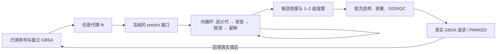

# 突变序列迭代搜索算法与 GBSA 代理接口实施方案

**2026-10-05 实施更新**：本文件保留 10 月 2 日第一版设计；当前已实现无交叉、单父本变异遗传算法，连同同起点随机游走、爬山、束搜索共四种可比较策略。参数冻结、两代理与预算比较、稳定性、有限消融和独立确认详见[当前总汇报](../汇报/9月/GBSA优化项目总汇报_生工团队版_20261005.md)及[冻结方案](无交叉遗传算法与搜索比较冻结方案_20261005.md)。下文“束搜索第一版默认”“GA 延后”是历史实施顺序，不表示当前未实现 GA。代理优化可暂缓，真实 GBSA 阶段未启动，旧 96 条不形成当前计算安排。

> 版本：设计稿 v0.1，2026-10-02。本文是[《GBSA 代理接口与候选闭环实施方案》](GBSA代理接口与候选闭环实施方案_20260930.md)的**搜索层补充**，不替换现有的测量、回填和批次选样方案。文中参数是待测的工程起点，不是已验证最优值。

## 0. 先明确要解决的问题

目标是在固定 141 nt RNA 骨架的 13 个可变位点上，经过**多代突变序列搜索**，由任意符合接口的代理给新序列预测独立 `gbsa`，最终提出一组或两组值得做真实 GBSA 的候选。项目约定 `gbsa` 越低越好。理论空间 `4^13 = 67,108,864`，不能把 2000 条已测表的最优当成全空间最优。

> **2026-10-05 实施修订**：原阶段 B 只共享 8192 次预测上限，实际调用数及随机组初始种子不同，故原“爬山/束优于随机”“默认爬山”不作为算法定案。现已补 `matched_seed_random_walk`、逐种子按实际调用次数截断的比较，以及搜索谱系/分组到待测批次的逐条交接。分组规则现覆盖全部排序候选，双组时先为候选池及批次预留近均等配额，容量不足再透明补位。新比较仍是代理预测诊断；真实 GBSA 多独立批次到位后才判断搜索策略的发现效率。详见 [九月完整汇报](../汇报/9月/九月工作完整汇报_20261005.md) 的十月补验证。

现有 `scripts/loop/selection.py` 的 `greedy` / `random` / `greedy_diverse` 解决的是**给定候选池后的批次选样**。100-seed 的 greedy 相对 random 优势也是固定池的表内回顾证据，**不等于**多代生成搜索已经有效。`scripts/loop/mutate.py::mutate_from_parent` 已有局部突变能力，但 `scripts/loop/loop.py` 在 10 月 2 日第一版设计时只于 setup 生成静态池；随后已接入独立多代搜索及 `--candidate-source search`。10 月 5 日无交叉 GA 也已接入搜索与外循环，并用人工回传验证。固定池的 greedy（贪心选样）仍不是遗传算法。



**内循环**只消耗计算预算，不调用 `Oracle.query`，不把预测值写成真实标签；可以连续迭代多代，代理在此期间固定。**外循环**才消耗真实 GBSA 预算：导出、`PARKED`、QC 回填、重训、再开启下一轮搜索。96 条既有 `srv_handoff_20260930_182400` 是历史静态池探索性存档，当前不安排计算或回填；新算法不得覆盖或改写该批次。

## 1. 算法选择结论

**第一版默认：多起点、带多样性约束的束搜索（multi-start beam / evolutionary walk）。**每代从若干父代产生一跳或两跳突变，批量调用代理 `predict`，按较低 `pred_gbsa` 保留若干父代，同时保留不同序列簇；可用多起点重启避免单一路径被预测误差牵走。它只依赖预测均值 `mu`，不要求可导代理或可信 `sigma`。适配体模型引导随机突变与逐轮留种有直接实验先例 [R1]；但该论文的实验目标、序列和模型都不同，**不能把其收益率当作本项目预期效果**。

同时实现三种**同预算**对照：

| 方法 | 机制和作用 | 第一版地位 | 主要风险 |
| --- | --- | --- | --- |
| 分层随机搜索 | 在指定距 WT 层随机生成，预测后保留最低分；无代际反馈 | **必备基线**，检验多代搜索是否有增益 | 高维空间覆盖浅；但能暴露搜索算法自我欺骗 |
| 多起点局部爬山 | 从同一批种子出发，逐步比较可行的一跳邻居，遇局部最优重启 | **必备基线**，检验简单邻域搜索是否已经足够 | 容易陷在局部低谷；单点易受预测噪声影响 |
| 多起点束搜索 | 多父代并行扩展、筛选、保留多簇，形成数代搜索轨迹 | **推荐默认**；参数少，适合替换代理 | 长时间反复最小化代理会放大外推误差 |
| 遗传算法（GA） | 种群选择、突变、可选 13 位点交叉与精英保留 | **第二候选**，在束搜索对照成立后实现 | 操作和超参数更多；交叉可能破坏位点组合/结构 [R2, R3] |
| 离散/批量贝叶斯优化 | 根据预测均值与不确定度选择新序列或真实测量批次 | **后期**：先校准不确定度，并有真实 GBSA 迭代 [R4, R5] | 当前 `sigma` 可缺失或未校准，不能直接当置信区间 |
| 生成模型潜空间搜索 / RL | 学习序列表征或策略，再搜索潜空间 | **本阶段不选** [R4, R6] | 额外数据、训练和约束；与“代理可随时替换”的目标耦合过重 |

这是一项**先比较、后定案**的选择，不预先宣布束搜索会找到更低的真实 GBSA。NAR 的 RNA riboswitch 工作展示 GA 的突变、预测、选择、重组；Nature Communications 的 ribozyme 工作展示 RNA 进化算法可探索复杂序列空间 [R2, R3]。两者都不是本项目 RNA 适配体的 GBSA 排序验证。

### 1.1 为什么目前不用“主动学习”来定义内循环

主动学习描述**何时、测哪些真实 GBSA 来更新代理**，属于外循环的测量选择。它不是从父序列生成下一代的唯一算法。无真实 GBSA 预算时，可以完整搭建内循环、做契约和吞吐测试，但不能通过自我预测“证明发现效果”。未来若测量预算到位，外循环可继续用现有 greedy/random 对照，或在不确定度校准后引入批量 BO；内循环的 `SearchPolicy` 不因代理采用预训练、经典或集成模型而变化。

## 2. 序列域、目标与约束

1. 输入按 `scripts/loop/interface.py` 规范化为 RNA `ACGU`、长度 141，仅允许 1-based 位点 `30–33, 89–92, 127–131` 改变。所有搜索算法共享同一个可行域检查器；不允许插入、删除、改骨架。候选 ID 仍由规范化序列 SHA256 前 16 位生成，保存全序列以便碰撞检查。
2. 排序核心是 `Prediction.mu`，即独立 GBSA 尺度的 `pred_gbsa`，**越低越好**。`label = 0.961*Gap2 + 0.039*gbsa` 的权重未验证，不能当目标、约束或采集函数。`dock`、`Gap2` 和真实 `gbsa` 不得进入主线代理输入；dock 修正仅沿原方案独立验证。
3. 硬约束只放能判定的事实：序列合法、突变位点合法、当前已知全表/已测/待测/失败/本搜索已评价序列排重、实验方明确的合成/QC 限制。GC 或结构限制若启用，阈值、算法与版本需先签定；涉及 MFE/Pre/Aft/Gap2 时只用 NUPACK，且不能偷偷转化成复合优化目标。
4. 数据支持域以**真实已测训练序列**在本轮搜索开始前计算。既有 2000 条中，非 WT 距离覆盖 4–13，密集区域约 8–11；可先把 8–11 作为优先搜索层，4–13 作为可配置合法层。不能仅凭 `n_from_wt` 一项推断可靠性。另记录到训练集最近 13 位点 Hamming 距离、训练集留一最近邻 95 分位阈值、GC/结构分层。不要让内循环生成的未测序列进入“训练集”以重算 OOD 阈值。
5. 允许**预测优选序列继续做计算父代**，但其 `parent_evidence=predicted_only`；只有真正回填的 GBSA 才能称为 `measured` 父代。搜索种子也可来自已测低 GBSA 序列，但要在同一训练折内选；不能查看 holdout 标签挑种子。

### 2.1 近邻数量与现有函数边界

一个 13 位点序列最多只有 `13×3=39` 个不同的一步替换邻居；恰好两步有 `C(13,2)×3²=702` 个。`mutate_from_parent(parent, n, n_mutations=1)` 要求**该父代**返回 `n` 条唯一邻居，所以 `n>39` 必然失败，排重或约束后实际可返回更少。实现搜索时应先枚举可行的一跳邻居，或按可行容量采样；不足时显式记录并切换两跳/全局重启，不能无限重试或默默缩小计数。若父代距离 WT 靠近搜索边界，部分一步邻居还会因突变层限制而无效。

## 3. 与代理彻底解耦的接口

保留已冻结的 `Surrogate.fit(sequences, y)` 和 `Surrogate.predict(sequences) -> Prediction(mu, sigma?, uncertainty_kind, feature_version, model_id)`，不要求改变 v0.2.0。新层可定义独立版本 `SEARCH_INTERFACE_VERSION=0.1.0`，调用它的唯一模型能力是**有序批量预测**。其余信息由 `SearchContext` 提供，不从代理私有属性偷取。

```python
@dataclass(frozen=True)
class SearchContext:
    search_id: str
    outer_round: int
    measured_sequences: tuple[str, ...]
    measured_gbsa: tuple[float, ...]
    forbidden_sequences: frozenset[str]  # 完整标准表、历史批次、QC fail 等
    wt_sequence: str
    mutable_positions_1based: tuple[int, ...]
    allowed_n_from_wt: tuple[int, int]
    seed: int
    max_unique_predictions: int
    max_generations: int
    constraints_version: str

@dataclass(frozen=True)
class SearchResult:
    ranked_candidates: tuple["ScoredCandidate", ...]
    groups: tuple["CandidateGroup", ...]  # 可为 1 或 2 组
    n_unique_predicted: int
    stop_reason: str
    search_state_path: str

class SearchPolicy(Protocol):
    name: str
    def search(self, context: SearchContext, scorer: "SequenceScorer") -> SearchResult: ...

class SequenceScorer(Protocol):
    def score(self, sequences: Sequence[str]) -> Prediction: ...
```

`SequenceScorer` 是薄适配器：批量调用 `Surrogate.predict`，确认返回长度、顺序、有限 `mu`、`model_id`、`feature_version`；按序列与模型快照缓存，重复序列不重复占预测预算。若 `sigma=None`，所有第一版算法仍可运行；若有 σ，只作为记录字段，不进入第一版搜索排序。模型替换后缓存键必须改变，不能沿用旧预测。评分批次大小须做吞吐基准测试后设置。

`ScoredCandidate` 至少记录 `candidate_id,sequence,search_id,outer_round,generation,parent_candidate_id,parent_evidence,operator,n_from_parent,n_from_wt,changed_positions_from_parent,pred_gbsa,sigma_gbsa,uncertainty_kind,model_id,feature_version,ood_flag,nearest_train_hamming,constraints_version,rng_seed,score_time`。`CandidateGroup` 记录 `group_id,group_role,prototype_id,member_ids,within_group_distance_summary,group_selection_rule`。**所有中间分数与被淘汰子代也写搜索日志**，不能只留下赢家；否则不能审计预测极值是否随搜索次数不合理地漂移。

推荐文件：`scripts/loop/search.py`（接口/调度）、`scripts/loop/search_policies.py`（算法）、`scripts/loop/search_archive.py`（缓存和存档）、`tests/test_search_contract.py`。这些是**拟新增**，不是当前已存在的代码。搜索输入/输出序列化后，外层 `loop.py` 以搜索快照构造当轮可用池，再调用既有 `select_batch` 和 Oracle；不要直接在搜索策略中进行实验回填。若修改 v0.2.0 的数据类或签名，按 `interface.py` 约定另行提升接口版本并更新契约测试。

### 3.1 恢复与运行指纹

目前 loop 的恢复指纹绑定静态候选池。动态搜索要在**每个外循环轮次开始**先创建只读 `search_snapshot.json`（模型/数据 SHA256、训练序列及标签摘要、约束、算法配置、排除集摘要、随机种子、预测预算），运行中增量保存 `search_state.json`（代数、父代、已评估 ID、缓存/档案摘要、RNG 状态）。完成后保存 `search_candidates.csv`、`search_generations.csv`、`search_groups.json`、`search_summary.json` 与文件哈希；原先静态 `pool_hash` 改为该轮搜索结果快照哈希，或为动态池新增字段。恢复必须复用同一模型快照与 RNG 状态，不得重抽新池；旧 `PARKED` 批次仍由旧指纹和原运行配置恢复，不能升级成新搜索运行。

## 4. 第一版算法的逐步做法

### 4.1 公平起点与预算

- **同一外轮、同一代理、同一已测训练集、同一种子集、同一硬约束**比较搜索算法。首轮种子从训练折已测序列中按真实 GBSA 选若干互不相同的低值序列，再补分层随机序列。**所有种子都用同一个代理重新评分并计入预测预算**；真实 GBSA 只决定哪些已测序列有资格做初始种子，不与子代预测值混合排序。已测种子可作父代，但不能作为新候选再次导出。
- 先用 `max_unique_predictions=256` 做工程冒烟；吞吐测过后，以 `8192` 个**去重后的代理预测序列**作为四方法统一的开发预算起点。模型调用次数、批次数和计算墙钟时长另报，不能只匹配代数。若 8192 成本过高，统一缩小所有方法预算；不为某方法单独放宽。
- 束搜索起点可试 `beam_width=32, max_generations=8, ~32 个子代/父代/代`，达到预算或候选枯竭即停。建议一跳/两跳算子比例先试 `80%/20%`，另以 `100%` 一跳作消融。比例、宽度、层界限都作为**开发超参数**预先列清单；不能看确认集后回填成“预先设定”。全局重启占每代名额可先试 `10%`，并做零重启消融。
- 遗传算法若进入比较，也必须用相同 8192 个唯一预测预算；建议人口 64、精英 8、其余由突变产生，交叉先单独作为消融开关。不能拿 GA 的代数和束搜索的代数直接对比。

### 4.2 推荐束搜索伪流程

```text
输入：SearchContext、SequenceScorer、同一组初始种子；目标 min pred_gbsa
初始化：forbidden = 已测/待测/失败/全标准表序列的排除集合
         parent_set = 从训练折的已测低 GBSA 且相互有距离的序列 + 随机新种子
         用同一代理给全部初始种子打分；已测种子只保留父代资格
对 generation = 1..max_generations:
    对每个 parent 提出受约束的一跳子代，按配额补两跳与全局重启
    统一 normalize、验证骨架、按序列去重、检查完整排除集合
    批量 predict 新子代；记录所有预测、父本、操作、OOD、耗时
    合并旧父代与新子代，在较低 mu 的前段中保留多簇代表
    若预算耗尽、可行邻居耗尽，或连续若干代无新低值则停止
输出：完整预测档案（不含已测种子的待测资格）+ 1–2 组候选提案；不在此调用真实 GBSA
```

**多样性规则应是显式、可关闭的**：例如先按 `mu` 排名取前 `4×beam_width`，再逐个选与已留父代至少 2 个可变位点不同者；不足再按 `mu` 补齐。这里的 `4` 与 `2` 是初始对照参数，不是生物学阈值。输出前可对最优候选按 13 位点 Hamming 距离聚类，最多输出两个不同“盆地”的候选组；`group_role=predicted_best` / `diverse_backup`，组内成员及原型都标为**预测优选**。若所有优选落在同一簇，就输出一组，不能为满足“两组”硬拼不合格序列。

### 4.3 最终候选与批次选样的边界

搜索层交付**可排序的候选档案**和可审阅的 1–2 组，不自动宣布“最优序列”。批次层按当时确认的 GBSA 测量预算 `B`，在这些候选中做全量排重、协议/QC 检查、OOD 分层与导出。可以保留当前 `greedy` 作批次默认及 `random` 对照，但现有 100-seed 结果不能证明它适用于动态搜索输出。若需要两组并行真实验证，先由团队确定每组配额和组间对照；例如在 **B=96 且协议已定** 时才考虑每组 48 条，这仅是模板，不改已有 96 条 PARKED 批次。`B` 未知时只输出“待测提案”，不要在文档里虚构 GBSA 预算。

## 5. 怎样选定算法：验收与停止规则

### 阶段 A：接口和搜索器工程验收（现在可做）

1. 使用可替换的确定性 mock scorer（有/无 σ 各一）跑完整内循环；测试最小化方向、批量顺序、只改 13 位点、去重、39 邻居上限、预算上限、同 seed 可复现、不同模型 ID 缓存隔离。
2. 人工构造有多峰及位点互作的小型离散目标，四方法用同预算；此结果只说明算法机制按预期工作，**不是 GBSA 发现证据**。
3. 固定同一搜索快照做中断恢复，逐行比较恢复与不中断的候选档案、预测计数、分组和哈希。模拟代理抛错、NaN、候选不足、排重耗尽，要求清晰失败或可解释停机。
4. 用真实现有代理但不做新 GBSA，记录吞吐、生成/拒绝/重复率、预测值随代数变化、OOD 分层、预测极值是否集中在训练稀疏区。`pred_gbsa` 下降**仅为计算过程观察**，不称为发现。

### 阶段 B：无新增 GBSA 的开发比较（结论有限）

固定代理快照和训练折，至少 30 个随机种子，在四算法之间配对比较：同一 8192 唯一预测预算下的候选多样性、可行率、邻近训练集比例、最优预测值、不同代理快照对同一候选的排序稳定性、重复训练所得模型的候选一致性、耗时。另保留完全独立的固定池选样回顾实验；这两类指标不可合并为一个“regret”。

可用一张**完全已知真值的合成景观**作算法开发，但它不能代表本数据的适配体 GBSA 地形。2000 条历史表可用于固定池选样 replay；任意多代生成的新序列多半不在表中，故不能从这张表求其真实 regret。若使用另一个不参与搜索的代理审计，也只算交叉模型诊断，不算真实 GBSA 验证。

### 阶段 C：真实 GBSA 到位后的决策性比较

测量协议与 GBSA 预算钉定后，预注册**主终点**：相同真实测量预算下，搜索策略所选新序列的最低**实测** `gbsa`；同时报告按种子/批次配对差、分位数、胜平负、失败率、OOD 层、组内/组间最优和预测—实测排序。随机候选与束搜索共享同一训练数据、可行域和 QC 协议，实验人员对算法来源可盲则盲；批次效应、失败样本、重复计算误差都保留。若重复 GBSA 计算不现实，至少固定相同协议并在报告中指出不确定性。真实 GBSA 是该计算优化任务的验证量；不把 GBSA 进一步说成已验证的亲和力或湿实验成功率。

模型开发声明仍用至少 30 seeds；算法发布/确认比较冻结配置后至少 100 seeds，且把这 100 seeds 理解为**同一有限数据和/或模拟环境的重采样稳定性**。真正证明搜索更好需要独立新序列实测。若真实预算只够一批，采用预先冻结的随机对照份额，避免测完后改比较方案。没有实测证据时，文档状态为“工程闭环可跑、发现效果未证实”。

**推进/回退门槛**：束搜索若对随机与局部爬山在合成/工程测试中未见稳定机制收益，或真实样本没有达到预注册的 GBSA 终点，就退回最简单可审计的随机/局部策略；若低预测值集中在 OOD、外部模型排序不稳定，缩小搜索域或降低代数，优先改善代理和标注。GA 只有在束搜索已可复现、交叉/种群多样性有明确增益时继续。批量 BO 必须先证明 `sigma` 与误差/命中风险的校准关系，并与不使用 σ 的同预算策略配对比较 [R4, R5]。

## 6. 实践顺序与交付清单

| 步 | 要写/要跑 | 完成判据 |
| --- | --- | --- |
| 1 | 冻结搜索规格：数据 SHA256 对 `data/registry.csv`、代理快照、13 位点、目标方向、排重全集、预算、种子；新增 `search_*.json` 配置 | 一份输入快照可哈希并重建，历史 96 条批次未变化 |
| 2 | 实现 `SequenceScorer`、`SearchContext`、档案与恢复 | mock 与现有 GBSA 代理都能替换使用；无 σ 可跑；错序/NaN/重复严格报错或跳过并留痕 |
| 3 | 实现随机、局部爬山、束搜索；GA 留到第二轮 | 同预算、同种子可复现；恢复与不中断结果逐位相同 |
| 4 | 做 256 和 8192 级吞吐测试、30-seed 工程开发 | 保存每代档案、候选分布、OOD 与耗时；结论仅为计算可行性/稳定性 |
| 5 | 将搜索结果**作为新轮候选快照**接入 `loop.py`，沿用现有选样、`PARKED`、协议钉定和回填流程 | 搜索只预测；Oracle 只在批次层调用；无标签时正常 PARKED；回填后才重训 |
| 6 | 冻结算法与基线，准备真实 GBSA 比较 | 明确测量预算、协议、批次对照和实测终点后再签发新批次；不替换原 96 条 |

建议给每次运行的配置显式写入 `search_policy`, `search_interface_version`, `outer_round`, `model_snapshot_id`, `candidate_universe_version`, `allowed_n_from_wt`, `seed`, `max_unique_predictions`, `max_generations`, `beam_width`, `offspring_mix`, `restart_fraction`, `diversity_distance`, `group_rule`, `constraints_version`。每项默认值必须写进**落盘配置**；不能依赖脚本运行时隐式默认。长 Linux 运行仍按仓库要求用 `nohup`、检查负载并限制共享服务器并发 4–8 workers；搜索吞吐测完再定具体并行数。

## 7. 文献与 JCR 等级

**分区口径**：表中列出 **2024 JCR 数据（2025 年发布）的 JIF Quartile 与学科类别**，不是中科院分区，也不是论文质量评分。分区按期刊/学科类别而不是单篇文章；同刊可能有多个 JCR 类别。分区依据 [JCR 2024 期刊类别与分区表](https://uefiscdi.gov.ro/resource-865584-JCR_2024.iunie2025.pdf)（罗马尼亚研究资助机构发布的 JCR 导出表）；NAR 的类别和 2025 排名另可对照[期刊官网指标](https://academic.oup.com/nar/pages/about)。若单位考核要求指定年份或数据库，应在提交时用机构 JCR 账号复核，不把这里的 Q1 误写成中科院“一区”。

| 编号 | 原始论文与链接 | 期刊、2024 JCR 学科类别 / JIF 分区 | 对本方案的可用结论与局限 |
| --- | --- | --- | --- |
| R1 | Bashir et al. (2021), [*Machine learning guided aptamer refinement and discovery*](https://doi.org/10.1038/s41467-021-22555-9) | *Nature Communications*；Multidisciplinary Sciences / **Q1** | 直接适配体先例：模型评估随机突变、多轮保留父代并实验测试；其 DNA/亲和力任务不同于本项目 RNA/GBSA。论文方法中每轮评估 10,000 突变、保留 200 父代、5 轮，是思路而非本项目默认参数。 |
| R2 | Espah Borujeni et al. (2016), [*Automated physics-based design of synthetic riboswitches from diverse RNA aptamers*](https://doi.org/10.1093/nar/gkv1289) | *Nucleic Acids Research*；Biochemistry & Molecular Biology / **Q1** | RNA 核酸器件使用 GA 的突变—预测—选择—重组；目标是 riboswitch 调控表现，不是适配体 GBSA。 |
| R3 | Rotrattanadumrong & Yokobayashi (2022), [*Experimental exploration of a ribozyme neutral network using evolutionary algorithm and deep learning*](https://doi.org/10.1038/s41467-022-32538-z) | *Nature Communications*；Multidisciplinary Sciences / **Q1** | RNA 核酶的模型引导进化/重组与大规模实验验证，提示保留多样路径；酶活不是 GBSA。 |
| R4 | Iwano et al. (2022), [*Generative aptamer discovery using RaptGen*](https://doi.org/10.1038/s43588-022-00249-6) | *Nature Computational Science*；Computer Science, Theory & Methods / **Q1** | 适配体 VAE 潜空间与贝叶斯优化先例，依赖训练好的生成表示及活性数据，不适合现阶段模型无关默认搜索。 |
| R5 | Kelvin et al. (2026), [*Iterative design of a NAND hybrid riboswitch by deep batch Bayesian optimization*](https://doi.org/10.1093/nar/gkag145) | *Nucleic Acids Research*；Biochemistry & Molecular Biology / **Q1** | RNA 器件的真实测量—模型更新—批量 BO 闭环先例；用于规划未来外循环，不能在本项目 σ 未校准、GBSA 未回填时照搬效果。 |
| R6 | Zhang et al. (2026), [*De novo design of functional nucleic acids of aptamers*](https://doi.org/10.1038/s43588-026-00965-3) | *Nature Computational Science*；Computer Science, Theory & Methods / **Q1** | 连续潜空间的 hill climbing + evolutionary BO 与核酸大模型结合；是后期可选路线，不是轻量替代当前代理接口。 |
| R7 | Takizawa et al. (2025), [*Safe model based optimization balancing exploration and reliability for protein sequence design*](https://doi.org/10.1038/s41598-025-12568-5) | *Scientific Reports*；Multidisciplinary Sciences / **Q1** | 蛋白序列优化中代理被优化到数据域外可产生虚假极值的实证警示；仅作 OOD 风险类比，不是本 RNA 数据直接证明。 |

**阅读优先级**：先读 R1 的“ML derived aptamer sequences”方法、R2 的 GA 工作流、R3 的 RNA 序列空间实验；再读 R7 的代理极值风险。R4–R6 主要帮助决定何时升级到生成模型/BO。上述文献提供**算法存在性与适用条件**，本项目究竟用束搜索、GA 还是 BO，必须由同预算比较及最终真实 GBSA 来决定。
