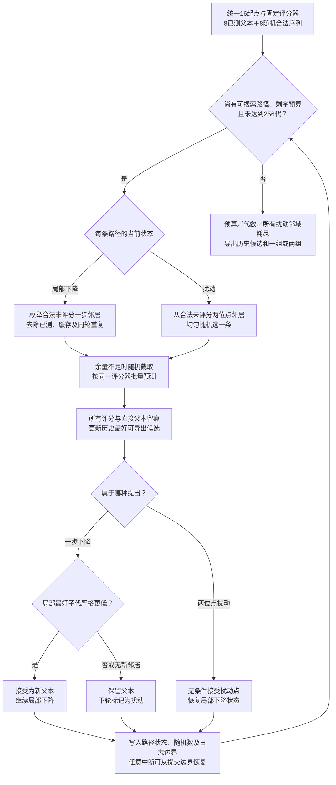
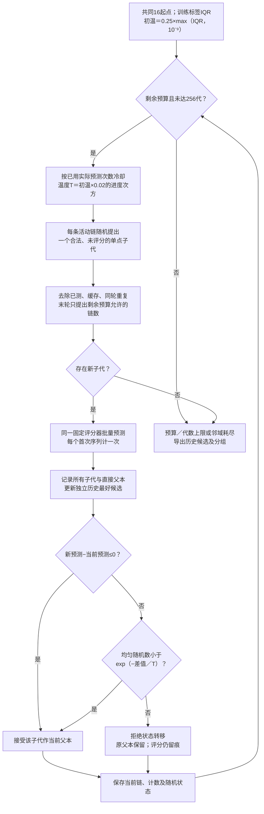
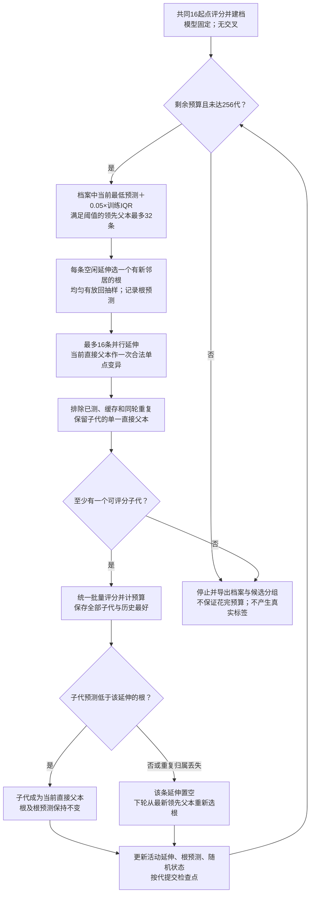

# 七算法同起点比较与实施结果（生物工程团队版）

更新：2026-10-05。本报告为既有[项目总汇报](GBSA优化项目总汇报_生工团队版_20261005.md)的算法实施补充，可单独用于实践。三个文献建议现已实现，并与原四种算法重新开展统一比较。所有表格均由完成且经过独立审计的运行档案生成。

## 1. 本轮完成了什么

已实现**迭代局部搜索、模拟退火、无交叉 AdaLead 改编版**，与同起点随机游走、多起点爬山、多路径束搜索、无交叉遗传算法合计七种。七种都通过同一序列评分接口运行，输出有评分、直接父本、突变位点和分组的候选档案。

本地开发 30 个随机种子，检查两档预算及更换模型种子后的敏感性；另用 100 个新随机种子确认固定参数，共 **2660 个正式子运行**。开发包 {{DEV_RECORDS}} 条、确认包 {{CONF_RECORDS}} 条逐次评分档案通过独立核验。另有 2 个工程小试种子、56 个子运行、7168 条档案。**随机种子是计算程序的随机数起始设置，不是新的实验测量。**每个种子同时规定数据划分与搜索随机过程；同一单元内所有算法共享划分、起点和评分器。

本轮并未选定成熟的最终代理，也没有产生新序列的真实 GBSA 标签。GBSA 为广义玻恩与溶剂可及表面积方法（Generalized Born / Surface Area），本项目按独立 `gbsa` 列最小化。这里的“预测 GBSA”是模型对序列输出的估计；“真实 GBSA”指统一计算协议生成的监督标签，仍不是湿实验亲和力。FAD在生化中可指黄素腺嘌呤二核苷酸（flavin adenine dinucleotide），但此处是仓库名；研究配体及家族名称边界沿用总汇报，不能据此推断配体。

先看确认数据的摘要；这不是按均值挑出的真实算法冠军：

{{OVERVIEW}}

实际选择时，爬山继续作简单参照，随机游走作必要对照；新增方法只有在当前评分器条件下有合适的预测收益、耗时和稳定性，才作为研究配置。完整三新法对爬山差值、胜/平/负及全部七法数据见§5。

## 2. 三个新方法是什么，具体怎样实现

### 2.1 共同接口与限制

算法接收固定的父本、合法突变约束和评分器。评分器接收有序序列列表，返回对齐的预测均值 `mu`、可选分歧字段及模型身份。算法决定提出哪些子代、接受哪条路径；评分器只负责打分。

- 序列长度为 141，只允许第 30–33、89–92、127–131 位改变，共 13 位；其余骨架严格固定。RNA 指核糖核酸（ribonucleic acid）。
- 相对野生型参考序列（WT，wild type）的突变数限制为 4–13；所有算法允许回变，但最终必须符合约束。
- 所有方法只有单一父本，没有交叉。两位点扰动也是改变一个父本上的两个位置，不是拼接两条序列。
- 2000 条已测序列整体禁止作为新候选导出，包含本轮留出集。训练集中已测父本可以作起点，评分计费，但不会被包装成新发现。
- 缓存按序列及模型身份隔离。每条序列首次评分计一次，重复命中不再计费；所有实际评分都留痕，包含没被接受的子代。
- 最终一组或两组是按预测排名及序列差异整理的提案集合，不是两组已经证实的功能类别或结合构象。

搜索接口版本保持 0.1.1；新增的是策略及其配置，未修改目标和输出合同。换最终代理时建立新的模型编号和搜索档案，不复用旧模型缓存。

### 2.2 迭代局部搜索：局部下降停住以后，扰动再下降

迭代局部搜索（ILS，iterated local search）保留爬山的简洁性，并用扰动帮助跨越局部区域。[Lourenço、Martin 与 Stützle，作者全文](https://arxiv.org/html/math/0102188)、[2003 年书章](https://doi.org/10.1007/0-306-48056-5_11)提供局部搜索、扰动和接受准则的框架；书章和预印本没有 JCR 期刊分区。本轮实现是固定的一种变体，不是通用最优解保证。

具体执行：

1. 从统一的 16 条起始序列建立 16 条活动路径。
2. 对每条路径枚举尚未评分的合法一步邻居，过滤已测序列和缓存；同一轮重复子代只归属于第一个提出它的路径。
3. 一轮批量评分，路径只接受其中严格低于当前父本的最好子代。
4. 没有严格改善，或没有可评分的一步邻居时，该路径切到“扰动”状态。
5. 下一轮随机选一个合法、未评分的**两位点突变**子代。即使预测变高，也无条件接受它作新活动父本；随后恢复一步局部下降。
6. 历史上最低的可导出预测另存，因此接受较差扰动不会丢掉已经找到的好候选。
7. 剩余预算不足时，随机截取可评分子代；预算或代数上限到达就停止。若每条路径都无法再产生合法未评分扰动，则按邻域耗尽停止。

重要区别：它无需比爬山更好的代理才能先实现，但如果评分器排序错误，它也会被错误引导。扰动后的路径并不保证更好；两位点是本次冻结参数，没有事后改成三位点来追求更漂亮的结果。


[可编辑矢量图](figures/GBSA总汇报_20261005/18_迭代局部搜索.svg)



### 2.3 模拟退火：允许有控制地暂时变差

模拟退火（SA，simulated annealing）对较差步骤设置非零接受概率，再逐渐降低该概率。原论文是 [Kirkpatrick、Gelatt 与 Vecchi，1983，Science](https://doi.org/10.1126/science.220.4598.671)。期刊等级沿用总汇报已核查的 **2024 JCR，Multidisciplinary Sciences（综合性科学），Q1**；JCR 指 Journal Citation Reports，期刊引证报告，Q1 为所在类别按该口径的前四分之一。分区对应期刊与年份，不代表本 RNA 实验效果。

设新旧预测差 `Δ = 新预测 − 当前预测`：

- `Δ ≤ 0`：接受，包括持平；
- `Δ > 0`：以 `exp(−Δ/T)` 的概率接受；`exp` 为指数函数，`T` 为正的算法控制温度。

训练 GBSA 标签的四分位距（IQR，interquartile range）是第三四分位数减第一四分位数。本轮冻结初温 `T0 = 0.25 × max(IQR, 10⁻⁹)`。若总预算为 `B`、共同起点评分数为 `n0`、目前已花费唯一预测数为 `n`，则一轮开始的温度为：

`T(n) = T0 × 0.02^((n − n0)/(B − n0))`。

这是按实际预测数的几何冷却；最后一轮开始时尚未花完预算，温度不一定已经等于终温。IQR 只来自训练标签，没有用留出标签估计温度，也没有额外读取未测 GBSA。16 条链每轮各随机提出一个未评分的合法一步邻居，统一批量评分，接受决定逐链执行。

历史最好候选另存，未被接受的子代仍在评分档案和最终候选列表中。若链停在没有新邻居的父本，不强制给它免费重启；所有链无新子代时提前停止。**全局排重改变了经典马尔可夫链的转移核**，本实现是预算约束下的优化变体，不用于热平衡采样，也不援引无限慢冷却下的经典收敛结论。

`T` 不是分子动力学的物理温度，不需要运行分子动力学（MD，molecular dynamics）。例如预测从 8 变到 9，差为 1；控制温度 2 时接受概率约 0.607，0.2 时约 0.0067。它只是数学说明。


[可编辑矢量图](figures/GBSA总汇报_20261005/19_模拟退火.svg)



### 2.4 无交叉 AdaLead：围绕领先父本延伸，但不要求每一步都胜过直接父本

AdaLead 是 Adapt-with-the-Leader，意为随领先者调整。依据 [Sinai 等，2020，作者完整文本](https://arxiv.org/html/2010.02141)。本次引用 **arXiv 预印本，无 JCR 期刊分区**。原论文包括重组、最大化适应度的阈值和后续模型更新；本项目不照搬这些部分，采用**无交叉、GBSA 最小化、固定代理**的改编版。

本轮规则：

1. 已评分档案含初始父本及所有评分子代；按预测从低到高排序。
2. 将满足 `预测 ≤ 已见最低预测 + δ` 的序列作为领先父本，`δ = 0.05 × 训练标签 IQR`。最多保留 32 条，按预测和候选编号确定顺序。阈值适用于负数 GBSA，不用原最大化乘法条件。
3. 建立 16 条并行延伸。空闲延伸从有合法未评分邻居的领先父本中均匀、有放回抽取根，记住该根的预测值。
4. 每条延伸随机提出一个合法未评分的一步子代，去重后批量评分。
5. 子代若优于这条延伸的**根**就继续；否则该条延伸下轮重新选根。比较对象不是当前直接父本，因此中途可暂时回升，但必须仍优于根。
6. 所有实际评分都进入历史档案，次轮重新按最新最好值更新父本阈值；历史最好独立保留。失去同轮重复子代归属的延伸也重新选根。
7. 没有可展开的领先根且在行延伸也没有新邻居时停止。这个版本没有额外全局重启；阈值过窄可能提前耗尽领先者邻域，实际次数和停止原因必须报告。

数值示例：根预测 10，延伸到 8 后又出现 9；9 虽比直接父本 8 差，但仍比根 10 好，所以本规则继续。直接父子谱系仍为“8 的序列 → 9 的序列”，不会把根伪写成直接父本。

这只是一个冻结参数的候选策略。没有根据确认结果调整容差、根数或延伸数，也不把本次结果归为原版 AdaLead 的完整复现。


[可编辑矢量图](figures/GBSA总汇报_20261005/20_无交叉AdaLead.svg)



## 3. 原四种为什么也重新运行

|既有方法|保留的作用|本轮机制|
|---|---|---|
|同起点随机游走|无评分引导的必要对照|共享父本出发，随机局部探索，最后按评分整理|
|多起点爬山|简单、较强的局部下降参照|只接受严格更低预测，原重启与停止逻辑保留|
|多路径束搜索|多路径和覆盖备选|保留 32 条父本路径，兼顾预测和序列差异|
|无交叉遗传算法（GA，genetic algorithm）|种群与选择压力参照|种群32、每代提出128、二元锦标赛、精英2，单/双位点突变与全局重启|

四法出处及当前实现差异见[总汇报 §4.13、§10](GBSA优化项目总汇报_生工团队版_20261005.md#four-algorithms-explained)。此前四算法采用 64 的代数上限；本轮七策略统一安全上限 **256**，给每轮最多16次评分的 SA 和 AdaLead 更多推进空间。同时使用新开发与确认种子。因此本轮重新跑四个对照，**没有将旧四法结果直接拼接成七算法表**。

算法代数的计数语义仍不同，主公平标准是实际唯一预测次数，而不是同一代数。256只是共同停止护栏，不能当作相同工作量。旧包完整保留，不改写历史结果。

## 4. 比较条件：如何保证同一起跑线

标准数据为 `data/proxy2000_v2/fad_proxy2000_v2_full.csv`，SHA256 与 `data/registry.csv` 一致。SHA256 为安全散列算法生成的文件内容摘要，用于确认文件身份。

每种子按相同划分得到300训练序列与1700留出序列。特征选择及标签处理只看训练集。每个代理只拟合一次，七法共享这个模型和同一顺序的8个已测父本、8个随机合法起点。留出 GBSA 不提供给算法。

两个代理是固定诊断工具：随机森林（RF，random forest）及五成员梯度提升集成；配置名 `xgb` 在本机实际调用 scikit-learn（Python机器学习库）的梯度提升后端。它不是 XGBoost（extreme gradient boosting，极端梯度提升）论文实现，也不是 v8 发布融合模型。代理种类不能和搜索策略混为一谈。

{{FITS}}

留出排序相关仅用于描述这些固定评分器的能力，不是新候选发现的真实效果。不同代理的绝对预测最小值不直接比较。

|包|种子|预算上限|主搜索数|另拟合重跑|合计|
|---|---|---|---:|---:|---:|
|工程小试|9901–9902，2个|128|28|28|56|
|开发|6001–6030，30个|1024、4096|840|420（1024档）|1260|
|独立确认|8001–8100，100个|1024|1400|0|1400|

参数及比较对在[冻结方案](../../项目记录/七算法同起点比较冻结方案_20261005.md)中先写定。本轮不做参数网格，不根据开发结果筛选进入确认的方法。所有七法原参数进入独立确认。

确认开始前发现原草案种子7001–7100与开发“模型种子加1000”的稳定性诊断有编号重叠，故在未启动确认时改为8001–8100，并保留审计勘误。该改动不看算法收益，不改变算法、参数、预算或比较对；详见冻结方案的修订记录。

### 4.1 七者共同次数是主表

一个单元中实际首次预测数可能不同。主表截取七种档案的共同长度，也就是七者实际数的最小值；起点评分计入该长度。测过的初始父本从候选最优值计算中排除。最低预测、前50条多样性和分布外诊断都在这个共同截面上计算。

确认共同次数：

{{CONF_N}}

开发共同次数：

{{DEV_N}}

### 4.2 两两共同次数只作补充

若一个策略很早停止，七者主表会把其余六者后面的评分截掉。预设的两两表分别取该对算法实际数的最小值，可以解释比较对本身充分推进后的差别。它不是给前者额外免费预算，也不能替换主表后再沿用“七者同一截面”的说法。

### 4.3 统计怎么读

差值为“前者最低预测减后者最低预测”，**负值意味着前者在该模型上更低**。按同一种子配对，自举10000次估计逐项95%置信区间（CI，confidence interval）。同步报告配对中位数及胜/平/负；差值绝对值不超过 `10⁻¹⁰` 计为平。

区间反映重复划分和搜索随机性的统计波动，既不是每条 GBSA 计算的误差，也不是代理的校准预测区间。共11个对比的区间是逐项区间，未进行多重比较校正，不能将单项区间的符号写成同时验证所有比较。实际意义还须看改善幅度、两个代理是否一致、候选稳定性及未来真实标签。

## 5. 100 个新种子的确认结果

### 5.1 七算法共同次数内的结果

“前50距离”为前50候选的平均两两汉明距离；汉明距离是在13可变位置上不同的碱基数。“最近训练距离”为这些候选各自到最近训练序列的距离再取均值。分布外（OOD，out of distribution）由训练集内部距离阈值判定；不是生物学不合格或预测正确概率。

{{CONF_MEANS}}

最后一列是各算法**完整停止档案**的实际预测次数均值，其余指标采用七者共同截面；两列不可混淆。跨种子的共同次数分布见§4.1。


[矢量图](figures/GBSA总汇报_20261005/14_七算法确认对随机.svg)

### 5.2 全部预设配对对比

{{CONF_CONTRASTS}}


[矢量图](figures/GBSA总汇报_20261005/15_三新算法确认对爬山.svg)

三种新机制与爬山的具体读数：

{{VERDICT}}

这组结论限定于本次冻结参数、序列约束、固定代理、共同预算口径。不能据此说某算法永久无效或永久最好；也不能把寻找更低预测值直接写成发现更低真实 GBSA。

### 5.3 预设的两两共同次数补充表

{{PAIR_TABLE}}

七者共同次数与两两共同次数如给出不同方向，应同时保留，并核对早停及预算分布。两者回答的资源范围不同，不删除不利的一套口径。

一个具体例子是本机梯度提升代理下GA对爬山：七者共同截面均值差为 **+0.9078**，区间 **[+0.3882, +1.4283]**；该二者自己的共同截面为 **+0.1306**，区间 **[−0.1335, +0.3843]**。前者描述全部七法被最早停止策略截短的资源范围，后者允许这两法推进到各自共有的更长档案。不能把前者写成“GA在足量同预算下已确定不如爬山”。无交叉AdaLead对爬山在该代理下两套均值差均为负：主表−1.5962，补充表−1.5770；优势也只是预测层，并有24/100种子在主比较中更差。

## 6. 30 个开发种子的预算与模型敏感性

### 6.1 两档预算，七法均重跑

{{DEV_MEANS}}


[矢量图](figures/GBSA总汇报_20261005/16_七算法预算诊断.svg)

每档独立运行，温度冷却随该档预算缩放，七者共同次数也可能不同。所以图中两点不能视为同一轨迹的学习曲线，不能简单声称预算变大一定让所有方法更低。

完整开发配对表：

{{DEV_CONTRASTS}}

### 6.2 重训及跨代理：候选是否跟着评分器变化

同一训练集重新拟合同类代理，仅把模型随机种子加1000；以原前50条重评分，检查排名相关。同时用另一类代理重评分；这些诊断不会参与搜索决定。随后同类新模型按相同起点重新运行，比较前50候选集合。

斯皮尔曼相关（Spearman rank correlation）用于比较排序一致性，范围−1到1；集合交并比（Jaccard index）为交集大小除并集大小，范围0到1。二者含义不同：重评分排序接近，不代表独立重跑仍得到同一批序列。

{{STABILITY}}


[矢量图](figures/GBSA总汇报_20261005/17_七算法模型敏感性.svg)

本诊断按各法完整停止档案的前50条计算，不是七者共同次数的主指标。未被一个代理认为分布外，也可能在重训或换代理后失去低分；候选序列是否相同及分数是否稳定须分开报告。

### 6.3 早停与耗时

开发主运行的停止原因：`budget_exhausted` 为预测预算耗尽；`neighbors_exhausted` 为当前策略可用邻域耗尽；`stagnation` 为该策略定义的停滞；`max_generations` 为代数护栏；`local_optima` 为爬山在当前可搜索路径中已无严格下降的可评分邻居。最后一项不证明完整真实GBSA空间的局部最优。

{{STOPS}}

确认包完整停止档案的耗时：

{{TIMING}}

耗时包括候选生成、评分、检查点和导出，另列其中模型预测时间。不包含模型拟合，也不是同等真实 GBSA 或同等墙钟预算的算法竞争；本轮主预算是预测次数。每轮小批量评分和更多检查点会增加 SA/AdaLead 的工程耗时，这不等同于计算目标变昂贵。

`runs.csv` 中历史字段 `feasibility` 实际为“最终评分子代数／进入统一过滤器的提出数”。新策略在进入该过滤器前已经筛过未访问邻居，各策略记录提出数的阶段不同；该比率不能跨策略解释为所有原始突变的合法率，更不是结构、计算或湿实验成功率。本报告没有用它给算法排名；所有已评分序列的合法性另由逐条审计确认。

## 7. 验收结果及证据如何核查

{{TEST_COUNT}} 项本地测试通过，包括三个新方法的：共同有序起点；预测预算；单父本谱系；分组覆盖；人工中断后与不中断运行逐记录一致；活动参数变化拒绝续跑；SA 接受较差步骤与冷却；ILS 两位点扰动；AdaLead 对负分的加法阈值；未来批次接口的人工暂停、分组交接及幂等恢复。

开发1260、确认1400、小试56个子运行独立审计通过。逐项核对文件哈希、缓存和评分计数、有限数值、固定骨架与4–13突变壳、父本先出现且代数递增、单父本改变位点、所有已测序列排除、候选排序、分组完整唯一、同起点/同模型，以及七者和两两共同次数的最低预测值。编译与文档链接检查另有记录。

紧凑证据：[七算法证据索引](../../../evidence/search_seven_20261005/README.md)。完整本地档案位于 `runs/search_seven_development_20261005/` 与 `runs/search_seven_confirmation_20261005/`；运行器包为 `runs/local_search_seven_*_20261005/`。这些是计算证据，不是测量批次。

重新核验已有结果无需拟合模型：

```powershell
python tools/verify_search_suite.py runs/search_seven_development_20261005
python tools/verify_search_suite.py runs/search_seven_confirmation_20261005
python -m unittest discover -s tests -p test_search_extensions.py
```

旧四法证据见[原证据索引](../../../evidence/search_suite_20261005/README.md)，仍按其旧种子与64代护栏解读。没有混改旧包，也不声明本轮服务器复验或同步。

## 8. 你接下来怎样实践

### 8.1 先跑一个新方法，理解产物

从项目根目录选择一条运行；每次统一运行器创建新编号，以下三份单次配置可以直接重复实践：

```powershell
python scripts/run_experiment.py configs/experiments/search_ils_demo_20261005.json
python scripts/run_experiment.py configs/experiments/search_sa_demo_20261005.json
python scripts/run_experiment.py configs/experiments/search_adalead_demo_20261005.json
```

三个配置已经各实际运行一次，数据种子与模型种子均为5001，拟合模型身份和有序起点一致；它们用于演示操作，**不是另一个正式种子比较结论**。保存的模型权重、候选谱系和分组已通过独立核验：

{{DEMOS}}

这些命令只有代理预测，不要求新 GBSA，不启动旧96条回填。先看 `metrics.csv` 的实际次数和停止原因，再看 `checkpoints/search_candidates.csv`（CSV 为逗号分隔表）、`search_groups.json`（JSON 为对象表示文本）、`search_generations.csv` 和 `search_evaluated.jsonl`（JSONL 为每行一个对象）。候选里的 `parent_candidate_id` 是直接父本；算法保留的 AdaLead 根另在状态中，不能混同。`fitted_surrogate.pkl` 保存当前模型参数和身份；本轮已重新加载三份演示参数并逐条复现档案预测，误差不超过10⁻¹²。

### 8.2 理解可以改哪些参数

|方法|参数|当前值与作用|改动后怎么办|
|---|---|---|---|
|ILS|`ils-perturb-sites`|2；当前实现仅允许2位点扰动|若研究3位点，先新增明确实现与机制测试，不能只改配置|
|SA|`sa-temperature-scale`|0.25乘训练标签IQR|必须为正；新配置和新档案，不能续写确认包|
|SA|`sa-final-temperature-ratio`|0.02，合法范围大于0且不超过1|改冷却强度；独立编号比较|
|AdaLead|`adalead-tolerance-scale`|0.05乘训练标签IQR，允许0|改变领先者范围；单独报告早停与多样性|
|AdaLead|`adalead-parent-cap`|32，正整数|改变可抽根数量|
|AdaLead|`adalead-rollouts`|16，正整数|改变并行延伸数及评分批次|
|共同|`max-unique-predictions`|1024单次实践上限|包括起点，不包括另记的诊断重评分|
|共同|`max-generations`|256护栏|不是跨算法相同工作量；不能代替预测预算|

正式七法套件固定参数在 `search_suite.py` 的 `FROZEN_CONFIG`，本轮比较不可事后改写。研究另一个参数值应另立配置、明确修改源码身份、另建输出目录，并重新做同起点比较。

### 8.3 如果需要重新计算整套，先换输出目录

原套件固定输出目录已有档案。即使运行器包装编号不同，也不能把新运行写入旧套件：其输出路径、参数、数据及源码指纹必须匹配才允许恢复。实践重算应复制配置，改套件名和 `out-dir`，保存 UTF-8 无字节顺序标记：

```powershell
$practiceConfig = Get-Content configs/experiments/search_seven_confirmation_100seed_20261005.json -Raw -Encoding UTF8 | ConvertFrom-Json
$practiceConfig.name = "search_seven_confirmation_practice"
$practiceConfig.arguments.'out-dir' = "runs/search_seven_confirmation_practice"
$practicePath = Join-Path (Get-Location).Path "configs/experiments/search_seven_confirmation_practice.json"
[System.IO.File]::WriteAllText($practicePath, ($practiceConfig | ConvertTo-Json -Depth 12), [System.Text.UTF8Encoding]::new($false))
python scripts/run_experiment.py configs/experiments/search_seven_confirmation_practice.json
python tools/verify_search_suite.py runs/search_seven_confirmation_practice
```

若示例目录已存在，再换一个新名称。开发套件方法相同，使用开发配置。`--policies` 可以选子集，但必须保留随机游走对照；套件默认为原四法，七法配置已经明确给出全部名称，不依赖默认值。

## 9. 如何选择，怎样分阶段继续

|阶段|当前状态|下一步及过关依据|
|---|---|---|
|A：数据与目标|已复核；独立GBSA目标固定|团队核对真正研究配体及合法突变约束；不导入对接或加权标签|
|B1：可替换评分接口|完成，代理优化本阶段暂停|未来成熟代理先通过合同、折内处理和独立排序评估；另建模型与缓存|
|B2：变异、谱系、分组与恢复|七策略全部接通并验收|根据应用需要增补明确生物学硬约束，所有策略共用|
|B3：算法比较|本轮30开发、100确认完成|用当前预测、耗时、稳定性和多样性决定保留的研究策略；不能定真实赢家|
|B4：未来文件接口|人工暂停/回传等工程路径已具备|只预留接口，不构成当前真实计算安排|
|C：真实GBSA验证|未启动|统一协议与预算到位，预先固定同标签成本、随机对照、质量控制和重复误差，再比较真实候选表现|
|D：湿实验亲和力/功能|未启动|另行定义目标、对照与分析；不把湿实验结果直接写入GBSA列|
|E：可选代理更新|未启动、未决定主动学习|只有新增数据匹配GBSA目标、协议且团队决定迭代时，才重训并生成新模型身份|

当前算法选择顺序：先确认工程合同通过；再看相对随机游走的预测改善；再看相对简单爬山的新机制是否带来一致收益；随后比较耗时、模型敏感性和候选覆盖。如两个代理给出不同排名，应保留分歧作为研究证据，按具体评分器选择研究配置，避免宣布统一算法冠军。

**依据本次结果的实际建议：**

|当前评分器或任务|研究用选择|理由与限制|
|---|---|---|
|本轮固定随机森林代理|先用爬山作简洁研究配置；AdaLead保留作另一机制备选|AdaLead对爬山差+0.0078、区间跨零；两两截面也未确认差别，不需仅为换名字增加复杂度|
|本轮固定本机梯度提升代理|AdaLead改编版作为预测搜索优先候选，同时保留爬山与随机对照|相对爬山主表−1.5962、补充−1.5770，均支持更低平均预测；主表60胜/16平/24负，且模型重训后前50名单交并比约0.0095，不能宣布真实优胜或名单稳定|
|需要种群或多路径覆盖|无交叉GA或束搜索继续作备选|这些机制有独立用途；GA对爬山结论受截面影响，不能只看主表丢弃|
|当前ILS/SA固定参数|保留实现与负结果，暂不作为默认低分搜索替代|两代理上均未改善爬山；不是证明其他温度、扰动规则或成熟评分器下无效|
|换到成熟的新评分器|重新比较七法|不能将本轮300训练、弱诊断代理上的算法排序直接转移到新模型|

以上是研究配置建议，不改变当前模型发布配置，也不自动选择主动学习。所有策略仍可从统一接口独立运行。

正式真实赢家需要未来按同一真实计算协议和同 GBSA 标签预算比较。新候选分布不能只靠历史留出排序相关认证；湿实验又是另一个终点。代理优化可暂缓，已搭好的七策略在成熟评分器到位后能直接重跑。

BO（Bayesian optimization，贝叶斯优化）、CbAS（conditioning by adaptive sampling，条件自适应采样）、RL（reinforcement learning，强化学习）及动态算法组合仍未实现。它们需要新增概率校准、生成器/策略训练或资源分配假设；这次七策略完成不代表这些后期方法也已完成。相关文献与条件见总汇报§6.6、§10，不自动扩大当前计算任务。

## 10. 文件与参考索引

|产物|入口|
|---|---|
|三新方法与原四法注册|[search_policies.py](../../../scripts/loop/search_policies.py)|
|单次算法运行及参数|[search_run.py](../../../scripts/loop/search_run.py)|
|共享模型七算法套件|[search_suite.py](../../../scripts/loop/search_suite.py)|
|未来接口路由|[loop.py](../../../scripts/loop/loop.py)|
|独立逐档案验收|[verify_search_suite.py](../../../tools/verify_search_suite.py)|
|新增机制测试|[test_search_extensions.py](../../../tests/test_search_extensions.py)|
|正式冻结计划|[七算法冻结方案](../../项目记录/七算法同起点比较冻结方案_20261005.md)|
|全部紧凑证据|[evidence/search_seven_20261005](../../../evidence/search_seven_20261005/README.md)|
|总汇报、全部算法与期刊等级|[生工团队总汇报](GBSA优化项目总汇报_生工团队版_20261005.md)|

论文支持算法机制，不替本项目真实 GBSA 结果。ILS 引用作者书章/预印本；SA 引用 Science 原论文及明确年份/类别的 JCR 口径；AdaLead 引用已核查预印本，始终保留无交叉改编标识。当前最完整的工程与计算交付是七算法在可替换评分器下的同起点比较；发现效益仍待新标签验证。
